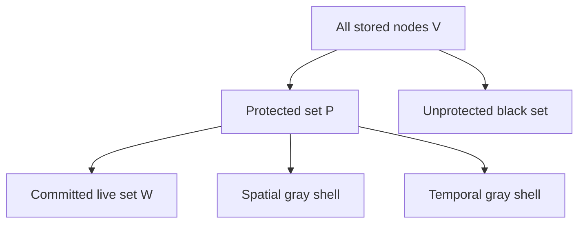
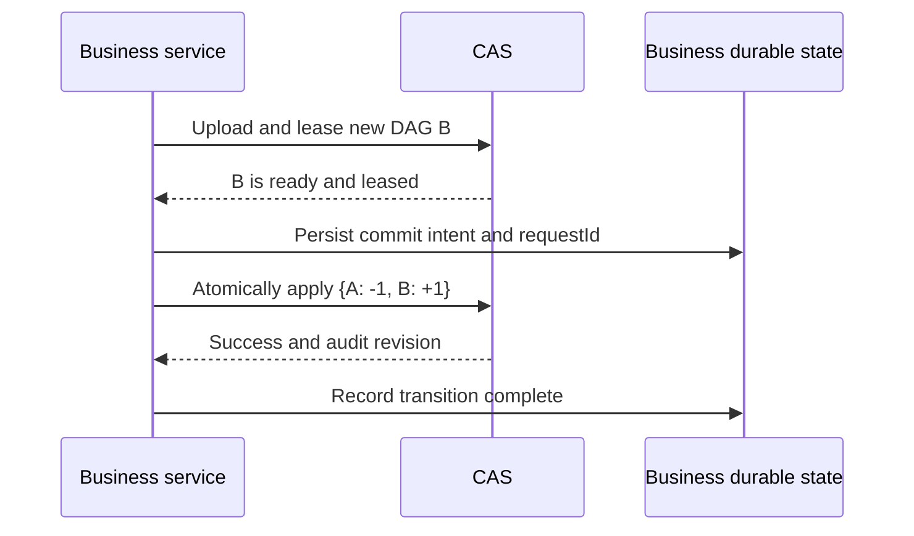

# CAS State, Protection Shells, and Garbage Collection

Status: architecture model

Date: 2026-08-26

This document explains the state and lifecycle model behind the UniDocs
content-addressed store (CAS). It complements
[CAS Architecture](./cas-architecture.md), which specifies the concrete node,
storage, lease, and garbage-collection behavior, and the
[CAS Root Reference Domain Audit Ledger plan](./superpowers/plans/2026-08-26-cas-root-ref-domain-audit-ledger.md),
which specifies the Root Refs audit API and its implementation.

The purpose of this document is to establish one conceptual model and a set of
invariants for reasoning about:

- which CAS data is committed state;
- why reference counts and leases exist;
- what garbage collection may safely delete;
- which lifecycle changes belong in the state audit ledger;
- how failures between node upload and root migration are contained.

## 1. Core thesis

The CAS lifecycle can be summarized as follows:

```text
Root refs define committed state.
Child refs protect its spatial closure.
Leases protect its transition window.
GC removes data outside those protections.
```

Root references are the authoritative logical state of CAS retention. The
immutable Merkle DAG materializes the data named by that state. Child reference
counts and leases are conservative safety mechanisms around the state; they do
not independently define business state.

This separation is important:

- a successful upload does not by itself commit a new business state;
- a lease does not mean that a node must be retained permanently;
- a child reference count does not prove that a node is reachable from a
  committed root;
- a GC deletion does not change committed business state;
- an atomic Root Refs update is the CAS commit boundary.

## 2. Authoritative CAS state

For one tenant, the authoritative root state at time $t$ is the signed-count
map:

$$
RootState_t : hash \mapsto rootRefCount_t(hash)
$$

with the invariant:

$$
\forall v,\quad rootRefCount_t(v) \ge 0
$$

A positive count means that one or more logical references currently require
the node to remain as a durable state root. CAS records only the aggregate
count. It does not model the identities of those logical references.

Two logical references to the same hash are represented by a count of two. A
business operation that moves a reference from root $A$ to root $B$ submits
one atomic change set:

```text
{ A: -1, B: +1 }
```

The old release and new acquisition must not be split into independent
requests. The atomic batch is the state transition.

### 2.1 Relation to a world state

The root state is analogous to the root commitment of a Merkle-based world
state: root hashes identify immutable state graphs, and changing the roots
changes which graphs the system is obligated to retain.

The analogy has limits. UniDocs CAS has a counted set of roots rather than one
canonical root selected by consensus. Root updates may also be emitted by
independent business domains. Unless CAS adds a tenant-global commit sequence,
per-domain audit revisions do not define a consensus-like total order across
all domains.

It is therefore most precise to call Root Refs the authoritative CAS
**retention state**. The application state described by the content remains
owned by the business system.

## 3. The semantic live set

Let:

- $V_t$ be the set of nodes stored for a tenant at time $t$;
- $E_t$ be the immutable parent-to-child edges stored for those nodes;
- $R_t$ be the set of nodes with positive root reference counts.

$$
R_t = \{v \in V_t \mid rootRefCount_t(v) > 0\}
$$

The committed live set, or white set, is the transitive closure of those
roots:

$$
W_t = Reach_{E_t}(R_t)
$$

$W_t$ is the semantic state that CAS must not lose. Root hashes are its entry
points; the Merkle DAG beneath them is its data closure.

This definition is semantic rather than operational. CAS does not traverse the
whole DAG on every update or GC pass to materialize $W_t$. Instead, it maintains
local protection facts that conservatively cover it.

### 3.1 Readiness closes the integrity gap

A positive Root Ref is accepted only for a ready node. A newly inserted parent
may refer only to ready children. Together with immutable edges, these rules
ensure that accepting a root never creates a committed live set with missing
content.

The intended integrity property is:

$$
v \in W_t \implies Ready_t(v)
$$

Root updates define which state is retained. Readiness validation ensures that
the retained state is complete when it becomes committed.

## 4. The spatial protection shell

A node stores a `childRefCount` equal to the number of incoming edge
occurrences from currently stored parent nodes. Duplicate edges are counted
independently.

Define the reference-count-protected set:

$$
S_t = \{v \in V_t \mid
rootRefCount_t(v) > 0 \lor childRefCount_t(v) > 0\}
$$

The fundamental spatial safety property is:

$$
W_t \subseteq S_t
$$

The reason is local. A node in $W_t$ is either itself a root, in which case its
`rootRefCount` is positive, or it is reached through an edge from a stored
parent, in which case its `childRefCount` is positive.

The spatial gray shell is the conservative excess:

$$
G_{space,t} = S_t \setminus W_t
$$

Nodes enter this shell when they are no longer reachable from committed roots
but still have incoming edges from parent nodes that have not yet been
collected. Reference counting therefore provides a local proof that a node
cannot yet be deleted, not a global proof that it is still committed state.

### 4.1 Why the shell exists

A mark-and-sweep collector could recompute $W_t$ by traversing every root and
every reachable edge. That gives an exact live set for one collection cycle,
but its cost grows with the complete live graph.

Child reference counts trade exact global marking for incremental local work:

- parent creation increments each child's count;
- parent deletion decrements each child's count;
- GC checks local fields instead of traversing from every root;
- unreachable data may remain temporarily, but committed data is not reclaimed
  early.

This is a conservative approximation optimized for incremental collection.

### 4.2 Why the DAG property matters

When an unreachable parent is deleted, its children may lose their final
incoming references and become eligible in a later pass. In a finite DAG,
garbage can be exposed progressively from topological sources toward leaves.

An unreachable cycle would be different: its nodes could keep one another's
`childRefCount` positive forever. The immutable child-before-parent creation
rule prevents such cycles in the normal construction model. Any future change
that permits cycles would require tracing, cycle detection, or another
collection strategy.

## 5. The temporal protection shell

Uploading a new immutable DAG and committing it as a Root Ref cannot be one
atomic transaction across the business service, D1, and R2. CAS therefore
needs a bounded interval in which uploaded nodes are protected even though
they are not yet committed roots.

Define the directly leased set:

$$
L_t = \{v \in V_t \mid leaseExpiresAt(v) > t\}
$$

A lease means:

> This node may become committed state before the deadline, so GC must not
> delete it during that interval.

It does not mean that the node is business state, and it does not promise
retention after the deadline.

The operationally protected closure of leased nodes is:

$$
T_t = Reach_{E_t}(L_t)
$$

Only the leased entry node needs a direct time pin. Its descendants are
protected by incoming child references. The temporal gray shell relative to
committed state is:

$$
G_{time,t} = T_t \setminus W_t
$$

The spatial and temporal mechanisms are therefore coupled:

```text
lease protects an uncommitted entry node
                 |
                 v
stored edges contribute childRefCount
                 |
                 v
the uncommitted DAG remains intact
```

### 5.1 What uncertainty each shell absorbs

The two gray shells are conservative for different reasons:

- the spatial shell absorbs structural delay: unreachable parents have not yet
  been collected and detached from their children;
- the temporal shell absorbs transactional uncertainty: CAS does not yet know
  whether the caller will commit or abandon the uploaded graph.

Lease expiry converts an open-ended uncertainty into a bounded promise. Lease
duration must cover the expected commit, failure-detection, and retry window.
An operation that may exceed that window must renew the lease before expiry.

## 6. The combined protection model

Define the locally protected set:

$$
P_t = S_t \cup L_t
$$

The core committed-state safety condition is:

$$
W_t \subseteq P_t
$$

The stronger operational condition includes work in progress:

$$
Reach_{E_t}(R_t \cup L_t) \subseteq P_t
$$

The sets can be visualized as nested protection regions:



This terminology is not the scanning state of a traditional tri-color GC.
The colors describe semantic and protection sets:

- **white**: committed state reachable from positive Root Refs, $W_t$;
- **gray shell**: protected nodes outside committed state, $P_t \setminus W_t$;
- **black**: nodes outside all current protection, $V_t \setminus P_t$.

The spatial and temporal gray shells can overlap. A node may be both leased and
referenced by an uncollected parent.

## 7. State transition protocol

A transition from old root $A$ to new root $B$ follows this shape:



This resembles a small prepare/commit protocol without introducing a
distributed transaction object inside CAS:

- **Prepare:** upload and lease the new DAG.
- **Commit:** atomically apply the complete Root Refs delta.
- **Abort:** do not update Root Refs; allow the lease to expire.
- **Recover:** retry the same Root Refs request using its stable `requestId`.

The lease protects $B$ before commit. The positive Root Ref protects $B$ after
commit. The atomic batch preserves $A$ if the migration fails.

### 7.1 Commit boundary

The successful Root Refs batch, not upload completion, is the authoritative
state boundary:

```text
uploaded + leased       = possible future state
positive Root Ref       = committed retained state
released Root Ref       = no longer retained by that logical responsibility
physically deleted      = eventual storage cleanup
```

These phases must remain distinct in protocols, metrics, and incident
analysis.

## 8. Garbage collection as shell contraction

A node is locally eligible for GC when:

```text
rootRefCount == 0
AND childRefCount == 0
AND leaseExpiresAt <= now
```

Equivalently, an eligible node is in the current unprotected black set:

$$
B_t = V_t \setminus P_t
$$

Collection proceeds incrementally:

1. Select a currently eligible node.
2. Recheck eligibility within the tenant serialization boundary.
3. Delete its content.
4. Delete its outgoing edges and node metadata atomically.
5. Decrement each child's `childRefCount` by edge occurrence count.
6. Allow newly unprotected children to be collected in a later pass.

GC does not discover business state and does not decide which roots are
important. It contracts conservative protection shells after Root Refs,
leases, and stored edges no longer protect data.

### 8.1 Safety and eventual reclamation

Two properties matter:

**Safety:** GC never deletes committed state.

This follows from $W_t \subseteq P_t$ and the rule that GC deletes only outside
$P_t$, provided reference counts, lease checks, readiness rules, and tenant
serialization remain correct.

**Eventual reclamation:** abandoned data is eventually deleted.

For a finite DAG with no positive Root Ref, no lease that is renewed forever,
correct edge counts, and recurring GC passes, unreachable nodes become
eligible progressively and are eventually collected.

The design intentionally prefers delayed reclamation over premature deletion.
A stale protection fact can leak storage; a missing protection fact can lose
state. Tests and repair procedures should treat the latter as the more severe
failure.

## 9. Failure semantics

The protection model makes failures analyzable by identifying which commit
boundary was crossed.

| Failure point | Authoritative state | Protection and recovery |
|---|---|---|
| Before upload completes | Old roots remain authoritative | No new state was committed; incomplete data must not appear ready |
| After upload, before Root Refs commit | Old roots remain authoritative | The lease protects the candidate DAG; retry or let it expire |
| Root Refs batch rejects | Old roots remain authoritative | The complete batch is unchanged; the new DAG remains leased for retry |
| Root Refs commits, response is lost | New root state is authoritative | Retry the same `requestId`; idempotency returns the original result |
| Root Refs commits, business process crashes | New root state is authoritative | Recover from durable business intent without applying the delta twice |
| Lease expires before commit recovery | Old roots remain authoritative | The candidate graph may become collectible; recovery must re-establish readiness before commit |
| Content deletion succeeds but metadata transaction fails | Root state is unchanged | The row becomes not ready; a later upload or GC pass repairs physical state |

The dangerous implementation errors are those that break the ordering:

- accepting a positive Root Ref for a node that is not ready;
- releasing the old root before atomically acquiring the new one;
- allowing GC to race a lease or Root Refs update;
- retrying a committed update with a new request identity;
- permitting an expired lease to be mistaken for committed retention.

## 10. Audit boundary

The Root Refs ledger records changes to authoritative retention state. It
answers questions such as:

- which trusted domain changed a root balance;
- which signed deltas were accepted;
- whether a retry was applied more than once;
- how a domain's CAS-recorded balance was formed;
- whether aggregate and domain projections reconcile.

Leases, child reference updates, and GC actions do not belong in that ledger:

- a lease records temporary intent, not committed state;
- a child count is a derived storage-maintenance fact;
- GC realizes an already-authorized physical deletion after protection ends.

They may still require operational telemetry. For example, lease expiry,
upload failure, GC throughput, reference-count mismatch, and R2/D1 repair are
valuable diagnostic events. They are not Root Refs state transitions and must
not become authoritative inputs to root validation or GC.

### 10.1 Audit is not content history

A Root Refs event log can reconstruct accepted root-count changes, but it does
not promise that content for a released historical root remains stored. Once a
root is released and all other protections disappear, GC may delete its DAG.

Long-term historical content retention requires an explicit positive Root Ref
or a separate archival policy. The audit ledger alone is not an archive.

### 10.2 Domain revisions and total order

Per-domain revisions are sufficient for domain balance reads, event replay,
and reconciliation. Signed deltas from different domains commute when deriving
the final aggregate balance.

They do not establish the exact cross-domain order of all tenant root
transitions. If a future requirement needs to correlate the precise aggregate
state after every accepted update with GC or another global event stream, CAS
would need a tenant-global commit sequence in addition to domain revisions.
That is not required for the current reconciliation model.

## 11. Design consequences

This model implies the following architectural constraints:

1. Only atomic signed Root Refs deltas change authoritative retention state.
2. Root updates validate aggregate `rootRefCount`, never an audit projection.
3. GC consumes only aggregate root counts, child counts, lease state, and node
   readiness or storage state.
4. Domain audit balances may expose negative values, while aggregate Root Refs
   must never become negative.
5. Root ownership entities are unnecessary inside CAS; business systems own
   logical reference identity and lifecycle.
6. A mark-and-sweep replacement for child counting would still need to treat
   valid leases as temporary roots, pause writers, or provide equivalent
   isolation.
7. Lease duration and renewal policy are correctness parameters for in-flight
   transitions, not merely storage tuning controls.
8. Reference counting is an incremental collection strategy. Root Refs remain
   the semantic state boundary regardless of the GC strategy.

## 12. Required invariants and tests

Implementations should directly test the following properties.

### 12.1 State and readiness

- Every node with a positive `rootRefCount` is ready.
- Every child of a newly inserted parent is ready before the parent is
  committed.
- Root Ref results never fall below zero or exceed safe integer bounds.
- A Root Refs batch either applies completely or leaves all counts unchanged.
- Retrying the same request and payload does not apply another state change.

### 12.2 Spatial protection

- `childRefCount` equals the number of stored incoming edge occurrences.
- Duplicate edges contribute duplicate counts.
- Deleting a parent decrements each child by the correct occurrence count.
- No node reachable from a positive Root Ref is GC-eligible.
- An unreachable finite DAG becomes collectible from its topological sources
  toward its leaves.

### 12.3 Temporal protection

- A node with an unexpired lease is not GC-eligible.
- GC cannot race between an eligibility check and a lease extension.
- A prepared DAG remains intact for the promised lease interval.
- After lease expiry, an unreferenced candidate can be reclaimed.
- Recovery re-establishes readiness and protection before committing a Root
  Ref if the original lease window was lost.

### 12.4 Audit isolation

- Every newly accepted Root Refs update writes exactly one audit event in the
  same commit.
- Audit write failure rolls back aggregate Root Refs and idempotency state.
- Idempotent retries append no event.
- Root validation and GC do not read domain event or balance tables.
- Audit data remains diagnostic if its read path is unavailable.

## 13. Summary

Root Refs are the compact, authoritative description of which immutable state
graphs CAS must retain. The reachable Merkle DAG is the semantic white set.
Child reference counts surround that set with a spatial gray shell that avoids
global graph traversal. Leases add a temporal gray shell that protects graphs
while non-atomic business and storage operations move them across the commit
boundary.

GC is downstream of all three. It does not define state; it incrementally
removes nodes after authoritative, spatial, and temporal protection have all
ended. For the same reason, the state audit ledger records Root Refs changes,
while lease and GC activity remains operational telemetry.