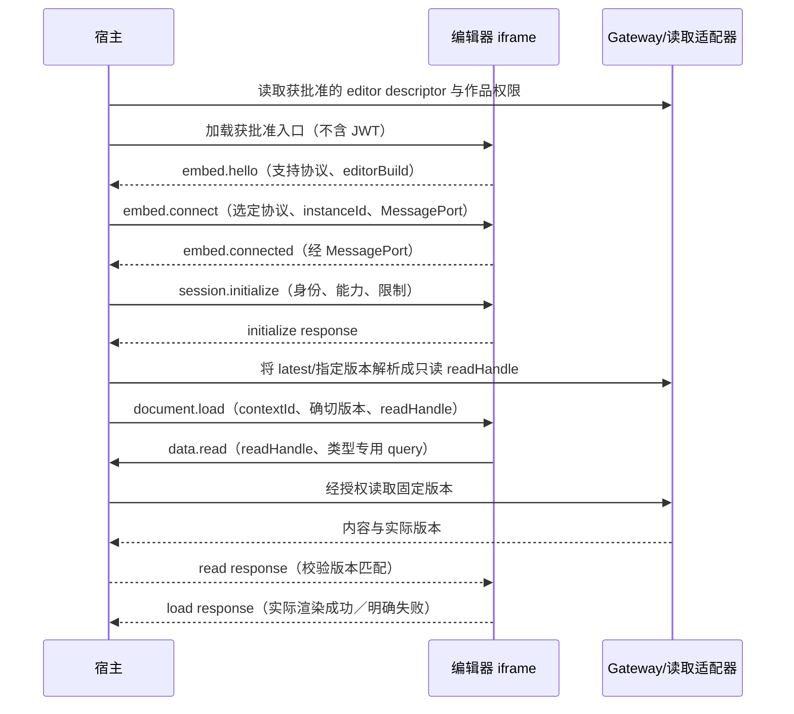
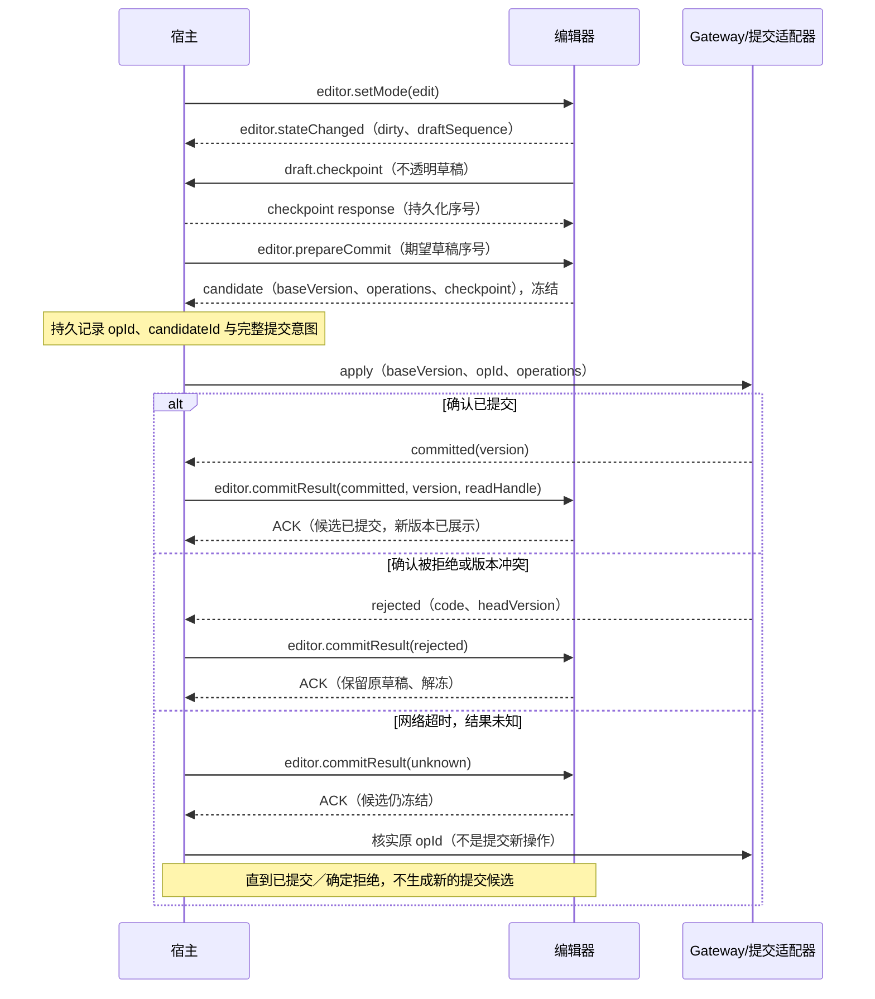
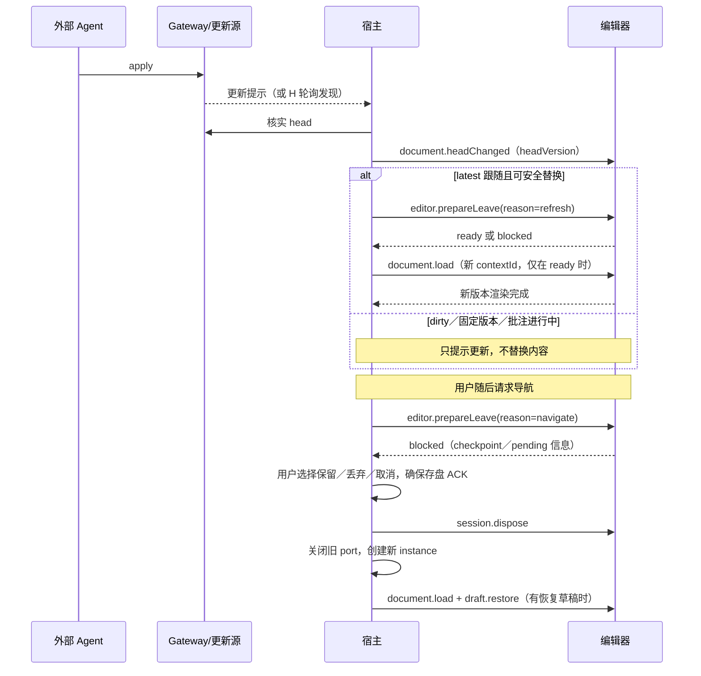
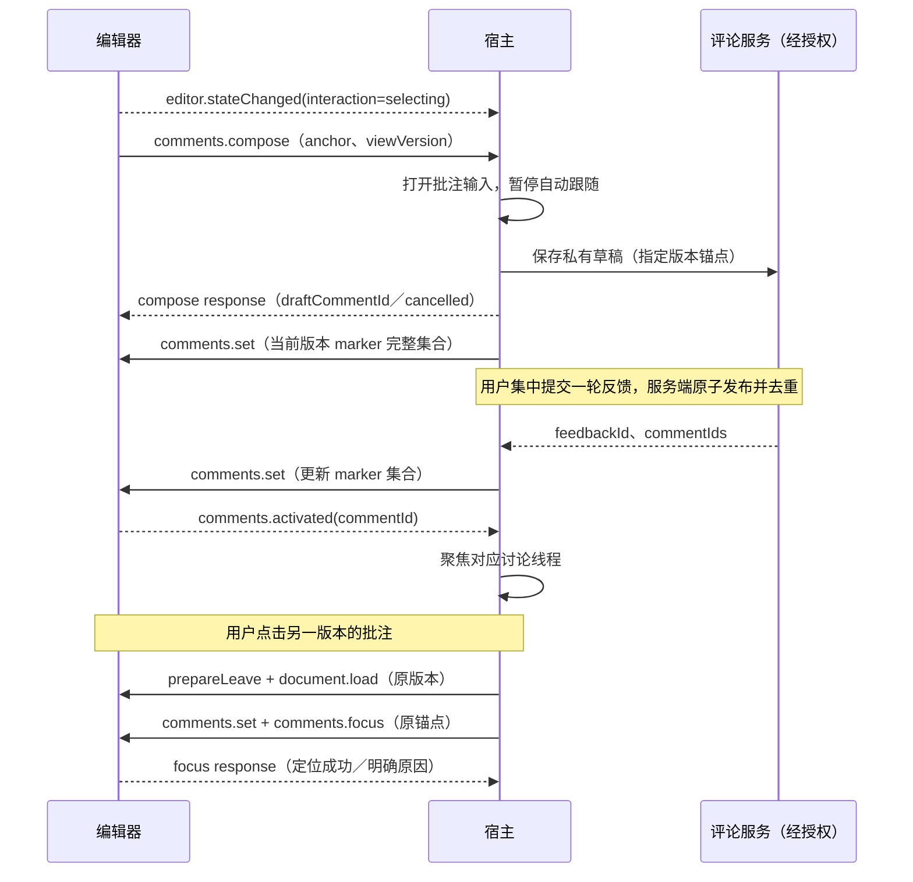
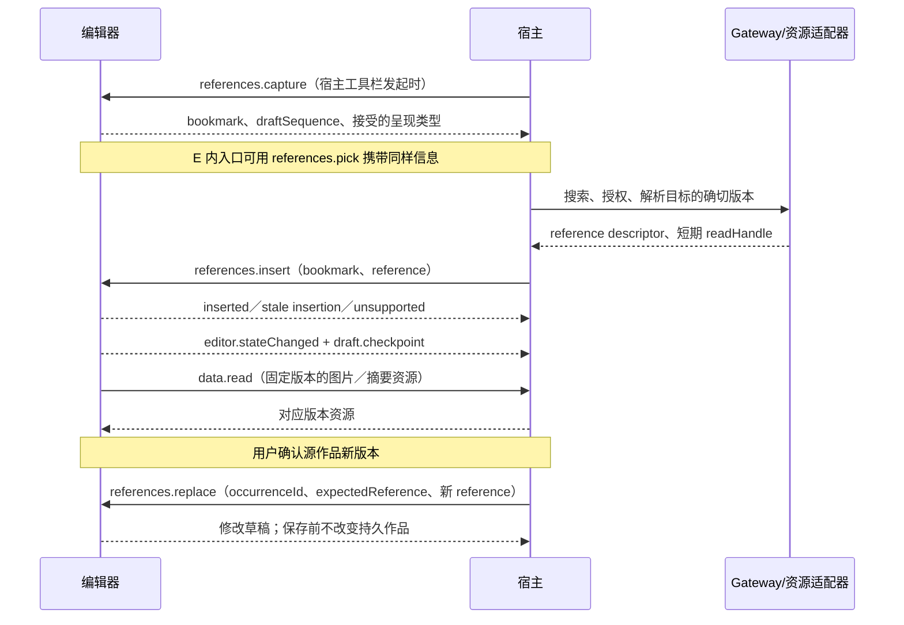
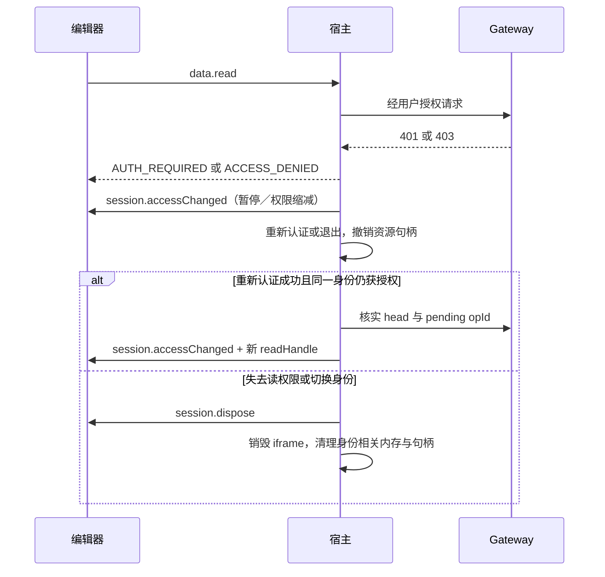

# UniDocs Editor Host Protocol v0

状态：讨论草案，2026-09-07。尚未实现，不是现有 API 的兼容性承诺。

本文按「用例分析 → 消息时序 → 协议」展开。协议服务于已确认的创作流程，不以通用插件系统为目标。本文中的“必须”是对未来 v0 实现的要求。

## 1. 目标与已有边界

UniDocs 的统一 WebUI 作为宿主，嵌入各 doctype 的预览／编辑器。第一组验证对象是 Markdown 和 PSD：共享作品生命周期、版本和反馈流程，但内容区布局与操作完全不同。

- 「我的作品」是导航入口，不是文件夹或作品集。作品独立存在，以检索和固定版本引用建立联系。
- iframe 只承载内容区域及类型专用工具。Markdown 双栏、PSD 画布／图层面板属于编辑器；导航、版本栏、保存、引用选择器和批注线程属于宿主。
- 人与外部 Agent 访问同一服务端作品。v0 同步已提交版本，不同步逐键输入，不引入 CRDT／OT。
- 服务端是持久内容、版本与权限的权威；宿主是连接、提交调度与页面导航的权威；编辑器是草稿和类型专用定位的权威。
- 只面向获批准的第一方编辑器。iframe 隔离不是允许不可信第三方读取私有内容的依据。
- 手机提示页不加载编辑器。电脑和平板是本轮验证范围。

### 1.1 与当前实现的关系

依据：[Doc Service HTTP Protocol](../doc-service-http-protocol.md)、[Doc HTTP 类型](../../packages/protocol-doc/src/http.ts)、[Gateway 类型](../../packages/protocol-gateway/src/index.ts)。后两者是机器契约。

| 当前已确认的契约 | 本文如何使用 |
| --- | --- |
| Gateway 公开标识为 `tenantId + docType + docId` | iframe 绑定公开文档身份，不接收底层 `sessionId` |
| Gateway 负责鉴权与 `docId → sessionId` 路由 | iframe 不直连 doctype 内部 API |
| `query` 响应携带版本；`ir` 提供当前 IR | 可作为读取适配器的基础，但不等于任意历史版本可直接读取 |
| `apply` 包含 `operations, description, baseVersion, opId?` | 提交继续使用这一语义；bridge 不另造版本号 |
| `history` 返回版本操作，snapshot 返回版本与 hash | 不把 history 等同于可加载快照；不把 hash 当作访问凭据 |
| `opId` 是可选请求字段 | 不能据此假定已具备持久幂等、去重期限或操作状态查询 |

历史版本读取、注册信息中的编辑器描述、提交结果核实、更新订阅、评论服务、草稿存储和固定版本资源授权仍需确认或新增。下面描述的是目标契约，不暗示这些能力已经落地。

## 2. 用例分析

参与者：用户 U、宿主 H、doctype 编辑器 E、Gateway／后端适配器 G、外部 Agent A。G 在时序图中代表经 Gateway 访问的能力集合，不要求所有存储都放进 Gateway 进程。

### UC-01 打开作品或固定版本链接

- 前提：用户已登录；H 获得该作品访问权限及获批准的编辑器描述。
- 正常流程：H 选择兼容编辑器并握手；解析 latest 或指定版本；E 读取该版本内容与资源；实际渲染后确认；H 才显示“已加载”。默认预览。
- 新建分支：H 先创建作品，`creating` 状态下显示等待，不让 E 编辑不存在的版本；ready 后走同一加载流程，再进入编辑模式。
- 异常：不支持的类型、协议不兼容、历史版本不可用、资源失败、iframe 加载失败均有明确状态。历史版本不可用时不得偷偷显示最新版。
- 后置条件：H 知道 E 正在显示哪个确切版本；注册描述中的 URL 不是访问授权。

### UC-02 进入编辑与保留草稿

- 用户在 H 点击编辑；E 基于已渲染版本生成草稿。Markdown 使用源码／预览双栏，PSD 使用画布／属性面板。
- E 变更后报告 `dirty` 和本地草稿序号，并将可恢复 checkpoint 交给 H 保存。内容变化与“已持久化”分开报告。
- PSD 预览中的图层显隐、solo、缩放不算内容编辑，不置 dirty、不写入版本；编辑模式的图层显隐才属于草稿。
- 从编辑返回预览时，v0 保留草稿但展示保存版本。H 必须显式显示“有未提交草稿”，不可把保存版本和草稿预览混称为同一版本。
- 页面重载后，H 用原基础版本和兼容的 checkpoint 恢复；不能恢复时保留原数据并提供下载，不静默丢弃。
- 非目标：多个编辑器实例自动合并同一草稿。每个实例拥有独立 draftId；其他标签页的草稿不得覆盖本实例。

### UC-03 保存、冲突与结果不确定

- H 发起保存；E 完成输入法 composition 等在途输入，再冻结内容编辑，生成基于原 `baseVersion` 的完整提交候选。
- H 检查权限、候选序号与大小，持久保存 checkpoint 和提交意图，生成 `opId`，经 G 提交。E 不直接调用 apply。
- 成功：H 得到提交版本，E 将对应草稿标为已提交并渲染该版本；H 收到确认后清理该候选草稿。
- 冲突：G 拒绝原 baseVersion。H 通知 E 解冻、保留草稿，展示服务器 head；不改 baseVersion 冒充已合并。
- 超时／断线：结果为 unknown，而不是 failed。冻结该候选、不生成新 opId。H 核实原 opId 的结果；只有确认未提交或收到确定拒绝才允许新提交。
- 核实能力不存在时：保留 pending 意图与草稿，允许查看保存内容和导出，不自动重试写入。即使 head 增长，也不能认定该 opId 成功。
- 用户可将基础版本、草稿、当前版本及冲突说明交给外部 Agent；自动合并不是 v0 范围。

### UC-04 Agent 提交与外部版本更新

- A 通过正常 API 修改；H 经订阅或轮询获知 head 更新，E 不与 A 直接通信。
- latest 跟随模式、预览、无草稿、无待提交结果、无正在圈选／撰写批注时，H 可加载新版本。
- 历史固定版本、编辑模式、dirty 草稿或正在审阅时，只提示新版本，不替换当前上下文。
- 事件只作失效提示。乱序、重复、掉线重连都通过 G 查询确认 head；缺失事件不能靠猜补齐。
- 内容版本必须单调增加，包括 rollback 产生的后续提交；若后端不保证，必须先定义 revision epoch，不能直接使用 `max(version)`。

### UC-05 切版本、切作品、关闭或重载 iframe

- 用户请求切换；H 查询 E 是否可离开。dirty、批注草稿、提交 pending 和资源操作都可能阻止立即切换。
- H 提供保留草稿后离开、确认丢弃、取消。未确定提交结果不能通过“丢弃草稿”撤销服务端提交。
- 保留草稿必须等 checkpoint 持久化 ACK；确认丢弃只删除指定 draftId，不删除其他实例草稿。
- 切作品重建 iframe。切版本创建新 contextId，旧内容响应、旧定位消息不得污染新上下文。
- iframe 崩溃只能恢复最后已 ACK 的 checkpoint；尚未确认的输入可能丢失，UI 必须如实显示。beforeunload 和异步销毁都不是可靠存盘机制。

### UC-06 创建批注草稿与集中提交

- E 在已加载的保存版本上捕获选区：Markdown 文本范围；PSD 画布区域、图层身份和临时可见图层集合。
- E 发出创建批注意图，H 立即锁定上下文并打开输入框；从捕获锚点开始就暂停自动跟随最新。
- H 保存批注草稿，回复 E 是否已保存／取消。锚点中的版本取捕获时的 viewVersion，不取输入完成时的 headVersion。
- 多条草稿可分别锚定不同版本。H 集中提交一轮反馈，生成 feedbackId 和定位链接；提交失败保留全部草稿，重复提交需幂等。
- 人和 A 都可回复。服务端必须执行草稿可见性与已发布评论权限；不能仅靠 iframe 不展示来保护私有草稿。
- MVP Agent 代表用户身份，若要隔离“同一用户的人类私有草稿”与 Agent API，还需要端点／scope 规则；共享 sub/JWT 本身无法区分二者。

### UC-07 展示、筛选、回复与定位批注

- H 管理线程、解决状态和过滤；只把当前版本且有权限的 marker 集合发给 E。
- E 显示 marker，点击后请求 H 聚焦对应线程；H 的线程点击请求 E 定位锚点。
- 非当前版本的线程仍可在 H 阅读；定位时先走 UC-05 切到原版本，然后加载 markers，再执行 focus。
- E 必须返回定位结果，不能默默滚到近似位置。区分成功、版本不匹配、锚点无法解析和不支持该锚点 schema。
- PSD focus 可恢复批注捕获时的图层可见性，不修改作品；原始显示可随时恢复。
- 已解决／隐藏的线程移出 marker 集合，但不从服务端删除。回复内容留在 H，E 默认不需要完整讨论文本。

### UC-08 插入、预览和更新跨作品引用

- H 点击“引用作品”，或 E 的类型专用入口请求引用；E 保留插入书签和 draftSequence，H 打开跨作品选择器。
- H 搜索有权限的作品，选择明确版本与呈现方式；latest 在此时解析为确切版本，绝不把 latest 写进内容。
- H 返回 reference descriptor 和短期资源读取句柄；E 负责把引用编译成本类型草稿修改。
- 用户选择期间如果草稿已变化，E 校验书签，无法定位则报告 stale insertion，不插入到猜测位置。取消不修改草稿。
- Markdown 引用 Markdown 可呈现标题／摘要；引用 PSD 可呈现固定版本渲染图。E 声明支持的呈现类型，不假定所有类型都能互相嵌入。
- 悬停预览、嵌入资源必须来自被引用版本。发现新版本后由 H 做选择／授权，E 更新指定引用 occurrence，保存后才生效。
- 导航到源作品由 H 决策并处理离开保护。撤权、版本被清理或资源过期时显示不可用，不切到最新或其他来源；资源句柄过期可重新授权获取。

### UC-09 权限变化、故障与宿主协作

- G 返回 401／403，H 暂停读写代理并尝试由宿主完成重新认证；权限改变后重新协商有效能力。
- 失去写权限：阻止 prepareCommit，保留草稿；失去读权限：撤销句柄、清空内容／销毁 iframe。草稿是否允许导出遵循宿主数据策略，不自动泄露。
- H 显示连接状态、加载错误、重试入口。iframe 崩溃不影响统一导航，但仍按 UC-03 核实在途写入。
- 保存快捷键由 E 转发给 H，不同时自行提交；Esc 等局部快捷键由 E 处理，不跨边界劫持键盘。
- 模态框、引用选择器、下载与顶层导航由 H 管理。菜单和属性工具留在 E；焦点返回与可访问性需要集成测试。

## 3. 从用例提炼消息时序

图中方法名为后文协议名。H→G 的语义调用不是新增 HTTP 路由定义。

### S-01 启动、发现与确切版本加载（UC-01）



### S-02 草稿与保存（UC-02、UC-03）



成功提交但 iframe ACK 丢失不代表失败。H 按持久意图恢复结果，E 对同一 candidateId 重复结果必须幂等。`commitResult` 的渲染失败也不得重发 apply。

### S-03 外部更新、版本切换与恢复（UC-04、UC-05、UC-09）



`prepareLeave` 返回 ready 后 E 冻结新内容输入直至 load／dispose／取消；否则检测和切换之间仍存在丢失输入的竞争。H 通过 `editor.resume` 取消这一冻结。

### S-04 批注草稿、发布和定位（UC-06、UC-07）



回复、解决、发布与过滤发生在 H／G；无需把所有评论 CRUD 映射成 iframe 方法。

### S-05 跨作品引用（UC-08）



### S-06 授权失效与重连（UC-09）



## 4. 协议定义

### 4.1 注册描述与能力协商

这是扩展 doctype 注册的目标模型，不规定注册写入 API。写入需管理权限，前端不能覆盖 entryUrl／allowedOrigin。当前版本的 descriptor 按 editorBuild 固定，禁止随意重定向到新 origin。

```ts
type EditorDescriptor = {
  docType: string;
  editorId: string;
  editorBuild: string;
  entryUrl: string;                 // Production HTTPS, embedded entry only
  allowedOrigin: string;            // Exact scheme + host + port
  protocols: string[];              // v0 implementation: ["0.1"]
  contentSchemas: string[];
  anchorSchemas: string[];
  checkpointSchemas: string[];
  capabilities: {
    preview: boolean;
    edit: boolean;
    historicalRead: boolean;
    comments: boolean;
    referencePresentations: Array<"link" | "summary" | "image">;
  };
};
```

最终能力是 descriptor、运行时握手、后端支持和当前用户权限的交集。无 historicalRead 的 doctype 不得接受历史版本链接或假称支持固定版本批注回看。没有能力的控件隐藏或解释性禁用，不发送必然失败的命令。

### 4.2 Transport 与信任边界

1. H 创建 iframe 前生成一次性 bootstrapNonce，放在入口 fragment。它不含 JWT，也不是授权凭据。E 根据自身批准配置限制 parent origin。
2. E 向准确的 parent origin 发 `embed.hello`，包含 nonce、支持协议、editorBuild 和能力。H 校验 `event.origin`、`event.source === iframe.contentWindow`、nonce 与注册描述。
3. H 用准确 targetOrigin 发送 `embed.connect`，传递 MessageChannel 的一个 port、选定协议与 instanceId。E 同样校验 parent source/origin 和 nonce，经 port 返回 `embed.connected`。
4. 后续业务消息只走该 port，不再监听任意 window message。MessagePort 消息本身没有可信 origin 字段，可信性来自握手绑定；持有 port 仍不等于获得额外权限。
5. 每次 iframe reload 重建 instanceId／port；旧 pending request 以 INSTANCE_REPLACED 结束，旧提交的结果核实仍由 H 独立继续。

生产建议编辑器使用与宿主不同的专用 origin，sandbox 最小允许 `allow-scripts allow-same-origin` 以保留可校验 origin；不开放顶层导航、弹窗或下载。不要把同源且有脚本权限的 iframe 当作安全隔离。不使用 opaque `null` origin 或 `targetOrigin="*"` 来传内容。

H 用 CSP `frame-src` 限定入口，E 用 `frame-ancestors` 限定宿主，资源策略用 `connect-src/img-src` 等约束。字体、渲染库与资源 origin 均需批准。Doctype 的服务端代码与浏览器编辑器不共享内部服务凭据。

现有 `file://` mock 具有特殊／opaque origin，不作为该信任模型的测试依据。iframe 协议验证需使用 localhost 的真实不同端口 origin；生产使用 HTTPS。

### 4.3 身份、版本与上下文

```ts
type DocumentRef = { tenantId: string; docType: string; docId: string };
type VersionRef = DocumentRef & { version: number };
type Context = { contextId: string; document: DocumentRef };
type EditorState = {
  stateSequence: number;
  viewVersion: number | null;        // null before render completes
  baseVersion: number | null;        // draft basis, never silently rebased
  draftId: string | null;
  draftSequence: number;
  persistedSequence: number;
  dirty: boolean;
  mode: "preview" | "edit";
  phase: "loading" | "ready" | "preparing" | "submitting" | "pending" | "error";
  interaction: "idle" | "selecting" | "composing";
};
```

- `headVersion` 与 `follow: latest | pinned` 由 H 管理；E 的 state 不得凭空提升 head。
- viewVersion 表示最后完成加载的持久基线。edit 模式下实际画面是该基线加草稿，不宣称草稿拥有服务端版本。
- H 为每次加载签发新 contextId，E 从收到 load 起拒绝旧上下文命令。失败时进入 error，不把旧画面冒充新版本；旧草稿已先 checkpoint。
- H 先完成 leave gate，再发 load；E 若仍 dirty 且未完成保护，返回 DIRTY_DRAFT，不执行强制覆盖。协议不提供 `force=true` 后门。
- 同一 context 内 stateSequence 单调增加，H 丢弃倒序状态；所有异步请求返回后再次检查 instanceId 和 contextId。

### 4.4 消息外壳

```ts
type Json = null | boolean | number | string | Json[] | { [key: string]: Json };
type Envelope = {
  protocol: "unidocs.editor-host";
  version: "0.1";
  instanceId: string;
  contextId: string | null;
  document: DocumentRef | null;
} & (
  | { kind: "request"; id: string; method: string; payload: unknown }
  | { kind: "response"; replyTo: string; ok: true; result: unknown }
  | { kind: "response"; replyTo: string; ok: false; error: ProtocolError }
  | { kind: "event"; event: string; payload: unknown }
);
type ProtocolError = {
  code: string;
  message: string;
  retryable: boolean;
  details?: Json;
};
```

`unknown` 只表达传输外壳；每个方法必须有运行时 schema 校验，不能直接信任收到的对象。响应携带原请求的上下文。除 session 方法外，document/contextId 必填且必须与 H 绑定一致；`document.load` 是唯一建立新 context 的方法，其请求外壳使用新 context。

请求 ID 在 instance 内唯一；response 的 replyTo 关联请求，无论成功或失败都只完成一次。事件不应答，不作为提交的唯一成功凭证。控制请求默认 10 秒，load／prepareCommit 默认 60 秒；用户选择／批注输入请求不设自动取消期限，由显式取消或会话销毁结束。

v0 限制：普通消息 256 KiB；单次数据块／checkpoint 8 MiB；每实例同时最多 8 个读取请求和 1 个提交候选。协商可降低上限，不得运行时无界增大。超限明确返回 PAYLOAD_TOO_LARGE；更大数据需要资源分块或 checkpoint 资源引用，不静默截断。

### 4.5 通用载荷

```ts
type EncodedValue =
  | { encoding: "json"; value: Json }
  | { encoding: "svalue-cbor"; bytes: ArrayBuffer };
type ReadHandle = string;            // Opaque, host registry scoped
type Checkpoint = {
  draftId: string;
  draftSequence: number;
  base: VersionRef;
  editorId: string;
  editorBuild: string;
  schema: string;
  content: EncodedValue;
};
type Candidate = {
  candidateId: string;
  draftId: string;
  draftSequence: number;
  baseVersion: number;
  operations: EncodedValue;          // Decodes to doctype operation array
  description: string;
  checkpoint: Checkpoint;
};
type Anchor = {
  target: VersionRef;
  schema: string;
  selector: Json;
  quote?: string;
  viewState?: Json;
};
type Reference = {
  target: VersionRef;
  presentation: "link" | "summary" | "image";
  title: string;                    // Title at target.version
  summary?: string;
  resourceHandle?: ReadHandle;
};
```

SValue 的 SBlob／二进制不降格成随意 JSON；沿用仓库编码约定。ArrayBuffer 可通过 transfer list 传输，但发送方必须先保存可恢复内容，不能把唯一草稿缓冲区转移后丢失。readHandle 只存在宿主注册表，不是 URL、JWT 或 CAS capability；绑定 instance、允许资源、版本、到期时间及用户身份，每次读取重新校验授权。

### 4.6 方法目录

H→E 为宿主命令；E→H 为编辑器意图／受限数据请求。表中参数与结果加上 4.3–4.5 的类型构成 v0 的方法级契约；可选项用 `?` 标注。

| 方法／方向 | 请求载荷 | 成功结果与约束 | 来源 |
| --- | --- | --- | --- |
| `session.initialize` H→E | descriptor、effectiveCapabilities、access、limits | accepted capabilities；尚未加载内容 | UC-01 |
| `document.load` H→E | target: VersionRef、readHandle、mode=preview | renderedVersion、contentSchema；版本必须精确匹配 | UC-01/05 |
| `data.read` E→H | readHandle、query: EncodedValue 或 resourceKey + offset/length | target: VersionRef、data: EncodedValue 或 bytes、mediaType、totalBytes/nextOffset | UC-01/08 |
| `editor.setMode` H→E | mode | EditorState；无 edit 能力则拒绝，preview 不删除草稿 | UC-02 |
| `draft.checkpoint` E→H | Checkpoint | draftId、persistedSequence；完成持久化后才 ACK | UC-02 |
| `draft.restore` H→E | Checkpoint | EditorState；基线和 schema 不兼容则拒绝 | UC-02/05 |
| `editor.prepareCommit` H→E | expectedDraftId、expectedDraftSequence | Candidate；无修改返回 NO_CHANGES；候选冻结 | UC-03 |
| `editor.commitResult` H→E | candidateId、opId、outcome | accepted；详见下方 outcome 联合类型 | UC-03 |
| `editor.prepareLeave` H→E | reason: refresh/version/navigate/dispose | ready 或 blocked + dirty/checkpointNeeded/pendingOp/interaction 原因 | UC-05 |
| `editor.resume` H→E | reason: cancelledNavigation | EditorState；不能解冻 pending 提交候选 | UC-05 |
| `draft.discard` H→E | draftId、expectedDraftSequence | discarded；H 必须先确认，pending 时拒绝 | UC-05 |
| `comments.compose` E→H | Anchor | saved + draftCommentId，或 cancelled；保存内容由 H 输入 | UC-06 |
| `comments.set` H→E | viewVersion、markerRevision、markers: {commentId, anchor, state: draft/open/resolved}[] | appliedRevision；全量替换、旧 revision 忽略 | UC-07 |
| `comments.focus` H→E | commentId、Anchor | located、或定位错误；仅在目标版本加载后发送 | UC-07 |
| `references.capture` H→E | intent: insert | bookmark: Json、draftSequence、presentations[] | UC-08 |
| `references.pick` E→H | bookmark、draftSequence、presentations[] | inserted + occurrenceId，或 cancelled；H 内部复用 references.insert | UC-08 |
| `references.insert` H→E | bookmark、expectedDraftSequence、Reference | occurrenceId、EditorState；变成草稿 | UC-08 |
| `references.replace` H→E | occurrenceId、expectedDraftSequence、expectedReference: Reference、replacement: Reference | EditorState；只替换指定 occurrence，失败不部分更新 | UC-08 |
| `references.inspect` E→H | occurrenceId、Reference | 经授权的同版本 Reference + latestKnownVersion?；不更新正文 | UC-08 |
| `navigation.open` E→H | target: VersionRef | opened/cancelled；H 先处理离开保护 | UC-08 |
| `commands.invoke` E→H | command: save/download、source: shortcut/editor | accepted 或 unavailable；不代表保存完成 | UC-09 |
| `session.dispose` H→E | reason | disposed；尽力清理，不作为 checkpoint 保证 | UC-05/09 |

`access = { read: boolean, write: boolean, comment: boolean }`。这些值是 UI 提示，不替代每次请求的服务端鉴权。

```ts
type CommitOutcome =
  | { status: "committed"; version: number; readHandle: ReadHandle }
  | { status: "rejected"; error: ProtocolError; headVersion?: number }
  | { status: "unknown"; reason: "timeout" | "disconnected" | "reconciling" };
```

E 的 `committed` ACK 包含 renderedVersion 与 clearedDraftSequence；H 只能清理匹配序号的 checkpoint。若服务端已提交但加载失败，E 返回 LOAD_FAILED，H 保留 committed 事实和恢复记录，重试读取而非提交。冻结期间可滚动、查看讨论，不允许继续修改内容。

`data.read` 不接受任意 URL、Authorization header 或任意 docId。H 把当前文档或用户明确选择的引用映射为 readHandle；未知 handle、版本不符或越界字节范围直接拒绝。H 不能因 E 的请求而绕过跨文档授权。v0 无 `data.apply` 方法，所有写入经 prepareCommit。

### 4.7 事件目录

| 事件／方向 | 载荷 | 行为 |
| --- | --- | --- |
| `editor.stateChanged` E→H | EditorState | H 更新 dirty、模式、加载和交互状态；丢弃旧 stateSequence |
| `document.headChanged` H→E | headVersion | 仅告知最新版本；不命令 E 替换草稿 |
| `comments.activated` E→H | commentId、viewVersion | H 聚焦有权限的线程；未知 commentId 不触发任意查询 |
| `session.accessChanged` H→E | access、connection: online/offline/authRequired、replacementReadHandle? | E 禁用对应操作；失去读权限时 H 同时撤销资源并销毁 iframe |
| `editor.fault` E→H | code、recoverable、lastPersistedSequence | H 展示恢复入口；日志不包含全文、JWT 或资源凭据 |

更新 head 不发送完整 doctype operations。后续若需要增量渲染，可增加可协商能力，必须有版本连续性校验与全量重载退路；v0 不预留一个语义不明的 `sync` 消息。

### 4.8 锚点示例

```json
{
  "target": { "tenantId": "tenant-a", "docType": "markdown", "docId": "doc-a", "version": 12 },
  "schema": "unidocs.markdown.text-range/1",
  "selector": { "blockId": "paragraph-7", "startUtf16": 4, "endUtf16": 18 },
  "quote": "被选中的原文"
}
```

文本偏移为对应 block 的 UTF-16 code unit，半开区间。是否已有稳定 blockId 要由 Markdown adapter 验证；若没有，应采用明确的路径／源码范围 schema，不伪造跨版本稳定身份。quote 用于展示与校验，不是无限制模糊搜索的授权。

```json
{
  "target": { "tenantId": "tenant-a", "docType": "psd", "docId": "doc-b", "version": 3 },
  "schema": "unidocs.psd.canvas-region/1",
  "selector": {
    "space": "document-pixels",
    "canvasWidth": 1200,
    "canvasHeight": 800,
    "rect": { "x": 96, "y": 160, "width": 444, "height": 360 },
    "layerIds": ["headline"]
  },
  "viewState": { "visibleLayerIds": ["headline"] }
}
```

PSD 坐标以文档左上为原点，不是 CSS pixel；缩放不改变锚点。layerIds 表示批注对象，visibleLayerIds 表示当时看见的集合，不可互相替代。后端至少校验大小、target 权限和版本存在性，doctype adapter 校验具体 selector。H 不解释 selector，也不把字符串当 HTML 执行。

### 4.9 超时、幂等与错误

- requestId 只去重实例内的 bridge 请求，opId 才关联服务端写入；candidateId 关联被冻结的草稿候选。三者不可混用。
- H 生成 opId，并持久绑定文档、baseVersion、candidateId、操作载荷摘要和完整候选；同 opId 不得携带不同载荷。若后端验证了幂等重试能力，才能在期限内重发原载荷。
- 同一个 prepareCommit 重试返回同一候选；同一个 commitResult 重试不重复清空草稿。不同候选的迟到结果只更新其持久记录，不能清理当前草稿。
- checkpoint 按用户、DocumentRef、draftId 分区，sequence 单调写入。倒序 checkpoint 不覆盖较新数据；H 返回实际持久化的序号。
- `comments.set` 是带 markerRevision 的完整快照；导航／context 更换后 revision 从新上下文计，不把旧 marker 混入。
- bridge 超时只表示没有收到确认。可取消读取或 UI 选择，但不能宣称已取消一个已发出的 apply。

| 错误码 | 处理 |
| --- | --- |
| PROTOCOL_MISMATCH / CAPABILITY_UNAVAILABLE | 不进入对应流程，显示兼容性原因 |
| INVALID_MESSAGE / PAYLOAD_TOO_LARGE | 拒绝并记录不含敏感载荷的诊断 |
| STALE_CONTEXT / INSTANCE_REPLACED | 不应用迟到结果；新实例重新读取或恢复 |
| AUTH_REQUIRED / ACCESS_DENIED | 宿主处理身份或权限，iframe 不索取用户 JWT |
| VERSION_UNAVAILABLE / VERSION_MISMATCH | 不以最新版替代指定版本 |
| DIRTY_DRAFT / BUSY / NO_CHANGES | 调整 UI 流程，不重发 apply |
| VERSION_CONFLICT | 保留草稿与原 baseVersion，展示 head |
| ANCHOR_UNRESOLVABLE / ANCHOR_SCHEMA_UNSUPPORTED | 保留线程与原文摘要，明确无法定位 |
| STALE_INSERTION / REFERENCE_UNAVAILABLE | 不插入猜测位置或未经授权的替代内容 |
| CHECKPOINT_FAILED / CHECKPOINT_INCOMPATIBLE | 不显示“草稿已保存”，保留可恢复数据 |
| LOAD_FAILED / TIMEOUT / INTERNAL | 按阶段恢复；TIMEOUT 本身不能判定写入失败 |

## 5. 需要先补齐的服务端能力

| 能力 | 最小验收条件 | 缺失时的降级 |
| --- | --- | --- |
| 编辑器注册与发现 | 管理授权、origin 白名单、不可变 build、协议与 schema 兼容选择 | 仅配置固定批准入口，不开放动态注册 |
| 固定版本读取与渲染资源 | 查询／资源返回的版本可核实；历史版本不可用有明确错误 | 禁用该类型历史能力，不能宣称支持完整固定版本流程 |
| opId 结果核实与去重 | 作用域、载荷冲突、保留期、重试行为和 committed/rejected/unknown 均定义 | unknown 提交冻结，不自动重复写入 |
| 外部更新发现 | 权限约束、重连后 head 核实；重复与乱序安全 | 轮询 status，不要求先建设 SSE |
| 评论／反馈服务 | 版本锚点、私有草稿、批量幂等发布、线程回复与状态 | 仅本地 mock，不宣称跨 Agent 评论已可用 |
| 草稿与提交意图持久化 | ACK 后可跨 iframe 重载恢复；用户隔离、容量和保留策略 | 标记未持久化，阻止承诺无损离开 |
| 引用解析与资源授权 | 每个目标版本独立鉴权、短期资源句柄、撤权与版本清理行为 | 显示不可用，不保留长期广域凭据 |

精确 HTTP 路由、后端注释 schema、历史快照保留／引用保护策略应在对应服务设计中确定，不由浏览器 bridge 越权规定。

## 6. 验收与下一步

本轮交付是协议文档，不改变现有 mock。开始实现前先确认三个取舍：宿主代理数据访问、v0 保存期间冻结内容编辑、批注线程由宿主统一管理。

### 6.1 协议一致性测试

- Markdown 和 PSD 使用相同 initialize/load/save/comment/reference 流程，不通过宿主访问 iframe DOM。
- 新建 ready 前不得编辑；加载失败、版本不可用不得伪装成功。
- 模拟恶意 origin/source、错误 nonce、重放旧 port、跨文档 handle、超限 payload，全部被拒绝。
- 新 context 加载期间返回旧 read／state／focus 消息，不能覆盖新内容。
- Agent 更新遇到 dirty、固定版本、选区批注时不得自动重载；安全刷新必须经过 prepareLeave 的原子冻结。
- 保存成功、冲突、超时后实际成功、超时后确定拒绝、iframe 崩溃后恢复均覆盖；确保同一候选没有重复提交。
- 连续两份 checkpoint 倒序抵达，持久草稿仍是新的；未 ACK 草稿不能显示已存盘。
- 批注跨版本定位不迁移；PSD 图层预览不会置 dirty，但批注可恢复当时的可见图层。
- 选择引用期间编辑导致书签失效，必须报错；更新只影响选中的 occurrence。
- 源作品更新后固定版本内容不变；撤销源权限后资源不能继续通过新读取获得。
- logout、401、403、网络断开、恢复、编辑器 schema 升级分别验证恢复策略。
- 不同 origin 下验证键盘保存、中文输入法、焦点恢复、读屏标签、平板尺寸与 iframe 错误占位。

### 6.2 建议实现顺序

1. 将消息 schema 与协议测试独立成共享模块；不先绑定某个前端框架。
2. 用两个 localhost origin 建最小宿主与 Markdown iframe，跑通加载、checkpoint、保存、unknown 恢复。
3. 接入批注定位与固定版本引用，再用 PSD 验证 typedAnchor 和资源读取，不扩展绘图工具范围。
4. 最后接入 Gateway 的真实注册、鉴权和历史／提交结果适配器。测试替身与真实服务的能力差异必须显式显示。

v0 的成功标准不是消息数量齐全，而是：宿主不理解文档内部结构，也能可靠地管理版本、提交、反馈和跨作品关系；编辑器不持有用户广域凭据，也能完成类型专用创作。