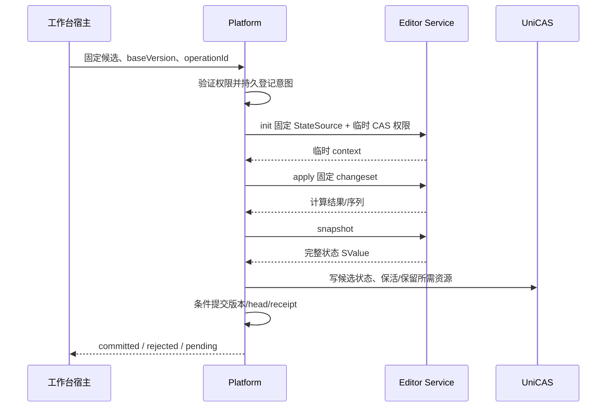

# Platform 与 Markdown 新协议接入计划

日期：2026-09-08。状态：待实施的目标计划；本次仅编写文档，不表示以下功能已实现或部署。

## 1. 交付目标

本轮最小闭环是：**基于新的 platform 服务实现 Markdown editor service 和前端包，完成运营注册，主站实际消费该注册，线上能够创建、编辑、保存、重新打开和导出 Markdown 文档。**

此外，Markdown 计算服务不可用时，用户仍能通过 platform 托管的前端读取已提交内容；权限、版本和存储事实不能依赖该计算服务存活。

“后台配置保存成功”“本地模拟保存成功”或“部署了一个服务 URL”都不是本轮完成标准。必须证明真实注册、平台持久提交、浏览器体验及故障只读链路连通。

建议首个上线适配采用现有 Cloudflare 环境，云无关协议和平台存储端口保留清晰边界；Azure 的新持久化适配另行验收，不作为本轮已完成项。此交付范围为本计划建议，在首轮启动时确认。

## 2. 已确定的架构原则

| 组件 | 拥有的职责 | 明确不拥有的职责 |
| --- | --- | --- |
| Platform service | 用户与作品权限、文档身份、head、版本、快照、changeset、提交意图与结果、CAS 引用保留、历史/恢复/fork、前端包保管及授权分发 | 类型专属计算、替 doctype 管理代码发布 |
| Editor service | init/import、query、apply、snapshot、export、summary；临时状态和计算缓存 | 持久文档权威、history/rollback、推进正式版本、UniCAS update refs、Operator run/reset |
| Editor 前端 | 类型专属交互、草稿、渲染、生成操作候选、服务停机时的只读渲染 | 用户登录凭据、直接访问计算服务、决定正式提交是否成功 |
| Operator service | Agent 任务、模型调用、工具编排、执行状态与取消；通过 platform API 操作文档 | editor 服务内嵌 run 生命周期、绕过平台提交/权限 |
| 运营后台（unidocs web-admin） | 一方类型注册、editor 服务 URL、editor 前端资源包、可选 operator 服务 URL、配置验证、可用性开关、管理员与审计 | 微服务实现版本管理、部署流水线或数据迁移 |

- Platform 与 editor service 的结构化请求和响应只用规范 SValue 编码。SBlob 包含 hash 且本身属于 SValue，不再添加 JSON 兼容通道。
- 每个场景只有一种明确输入/输出形态；不接受某字段既是完整状态又是 hash 字符串或 SBlob 的多义输入。MVP 不做按大小自动切换传参模式。
- Platform 先检查用户/Agent 的作品权限，再对 editor/operator 请求做 HMAC 签名；两个服务验证平台调用身份，不接收或接受用户访问平台的 JWT 作为调用凭据。
- 签名与临时 token 放请求鉴权头，不进入状态、changeset、前端包、审计载荷或长期缓存。CAS token 临时、受限，按实际资源访问需要区分 RO/RW；它与平台调用签名是不同授权层。
- 微服务实现与发布不受现有 doctype Worker/DO 结构约束。旧代码可复用，但不能反向决定新职责。
- 前端包上传后由 platform 保管和分发；平台托管不等于与工作台同源执行。一方代码仍需 CSP、sandbox、消息校验及依赖审查。
- export/summary 接受基础状态与 changeset，可计算历史或未提交草稿，不修改其他计算上下文、不产生正式版本。

## 3. MVP 范围与明确排除

### 必须交付

- Markdown 空文档、UTF-8 文件导入、完整只读渲染、源码编辑、安全预览、显式保存、刷新恢复已提交状态、文件导出。
- Platform 内至少两个版本的 history、指定版本只读和恢复为新版本；版本冲突与结果未知保留原草稿。
- summary 独立标准入口：标题建议、纯文本摘要、基本属性、可空缩略图。Markdown 首版允许 thumbnail=null，不建设截图渲染服务。
- 管理注册后主站发现并加载 Markdown，平台 bundle 不包含按 docType 硬编码的新渲染分支。
- 平台托管前端包，计算服务停机后新打开页面也能读取已提交 Markdown，而非只依赖旧页面缓存。
- 真实平台授权贯穿文档、历史状态、资源、导出和提交核实，停用/越权/账号切换均有明确结果。

### 不在本轮

完整 Operator 实现、内置聊天、多 Agent 编排、PSD/DOCX 新协议迁移、外部分享、批注系统、跨类型版本引用 UI、多人字符级协作、完整 Azure 上线、任意第三方插件、并行双编码或自动大小优化。

Operator 的可选 URL 配置、平台调用 HMAC 契约及共用验签测试属于本轮；真实 Agent 执行系统不属于本轮。未配置 URL 表示不提供 Operator 能力，不影响 Markdown 编辑闭环。新 editor 协议不提供 run/reset。外部 Agent 若参与测试，使用相同 platform 文档 API，不依赖新 Operator 才能完成保存。

## 4. 按迭代收敛的协议约束

以下是用于计划估算和测试设计的推荐形状，**不是已发布 API**。每个 MVP iteration 只明确该轮所需的 schema、路由、错误码与时序，立即用端到端实现验证；不先冻结全部接口再开始开发。跨迭代保留明确的协议兼容边界，变更不能静默破坏已提交作品。

### 4.1 StateSource 与计算上下文

```ts
type StateSource<TOp> = {
  schemaVersion: string;
  base: SBlob | null;
  changes: readonly ChangeSet<TOp>[];
};

type ChangeSet<TOp> = {
  operations: readonly TOp[];
};
```

这是逻辑类型示意，实际 TOp 必须满足 SValueType，wire 使用 SValue codec。

- base 固定指向内部文档快照 SValue 节点，不是导入文件。null 固定表示该类型的空状态，changes 固定数组，禁止用缺字段猜测语义。
- 顺序为加载基础状态，再按 changeset/operation 顺序计算。中途失败不得发布半完成 context 或污染输入缓存。
- 快照和 changeset 的 schema/计算语义兼容信息必须随状态来源或请求的必填契约携带。首轮定义 Markdown 所需的最小版本标识，禁止依赖“最新实现大概兼容”。
- init 推荐始终返回新的临时 contextId，不原地重置共享上下文；替换成功后由 platform 放弃旧 context。无需独立文档 reset。
- context 不是 docId/sessionId，不分配正式版本。绑定调用主体、tenant、状态身份和有效期；不能仅凭 contextId 访问他人缓存。
- MVP 同一 context 串行请求。写调用可带计算序列号防止迟到 apply 应用到错误工作副本；序列号不是正式文档版本。
- context 丢失需明确返回 context_lost；platform 可从固定 StateSource 重新 init，但不能把一次不确定的可变 context apply 原样再发并假定没有执行。

### 4.2 Editor service 计算 API

| 接口 | 固定输入 | 固定输出 | 副作用边界 |
| --- | --- | --- | --- |
| init | StateSource | 新 contextId 与计算状态标识 | 只建立临时工作副本 |
| import | 文件 SBlob + 格式 | 新 contextId 与计算状态标识 | 可暂存解析生成的资源；不创建平台作品 |
| query | contextId + 类型查询 | SValue 查询结果 | 不改变计算状态 |
| apply | contextId + 预期计算序列 + changeset | 新计算序列与确认 | 工作副本内原子计算，不推进平台 head |
| snapshot | contextId + 预期计算序列 | 完整文档状态 SValue | 不写正式版本，不 retain；取代 ir |
| export | StateSource + 格式 | 外部文件 SBlob + MIME/文件名元数据 | 独立临时重建，可暂存结果文件，不改 context |
| summary | StateSource + 标准选项 | 标准 summary SValue | 独立临时重建，不改文档/版本 |

export 不直接返回 multipart/raw file 替代 SValue 响应；文件上传下载由 platform 的资源通道处理。snapshot 返回完整 SValue，其中资源仍可为 SBlob；不再并行提供“返回状态根”的同场景接口。

summary 至少规定 suggestedTitle、excerpt、properties、thumbnail；纯文本和类型化标量属性，不接受 HTML 模板或任意跟踪 URL。缩略图若存在用 SBlob 和明确格式/尺寸。Platform 附加正式 docId/version/作者/提交时间，editor 不自报持久事实。

查询结果不得污染正式状态。按历史状态 source 做 export/summary 的结果，不得混入 head 后续操作；草稿结果不得冒充已提交版本或进入正式 summary 缓存。

### 4.3 临时 CAS 权限与资源交接

按 CAS 行为分类，而不是只看 HTTP 方法或是否修改文档：

- query、snapshot 和不生成资源的 summary 使用 RO。Markdown StateSource 重建首版只使用纯文本操作及已存在的 SBlob，不产生新资源，summary 因此保持 RO。
- import、apply、允许生成资源的 init、产出文件 SBlob 的 export 使用计算 RW。RO 请求携带 RW 不应被默默当必要授权；每个接口的权限需求固定写进契约。
- 如果后续某类型的 summary 需要即时生成缩略图，必须显式演进它的权限契约或增加独立生成接口，不能偷偷在 RO query 中写 CAS。
- Editor 不管理永久引用。Platform 在提交成功前完成必要资源保留；计算暂存产物由短期 lease 保活，失败/取消后按临时产物策略回收。
- 计算响应要让 platform 确认所有 SBlob 已可读且 lease 仍有效；lease 过期先恢复或重新计算，不得先返回 committed 再尝试补资源。
- **TODO：UniCAS 拆分内容读写、临时 lease 与 update refs 权限。** 当前尚无相应精度时，先通过 editor 依赖的 CAS facade 和测试禁止 refs 操作，不授予凭据给前端；记录底层 RW 仍可能过宽的残余风险，不能宣称强制最小权限已完成。上线前明确该风险由谁接受，或先完成权限拆分。

### 4.4 平台调用认证：HMAC

已确定采用平台调用方认证，不转发用户登录 JWT。Platform 验证用户/Agent 身份、作品权限、类型状态与操作范围；editor/operator 验证请求由获信任的平台发出，并检查请求上下文和计算范围，不维护第二份作品 ACL。actor、tenant、docId、contextId/taskId 和获准操作按需作为受签名保护的信息传递，裸 userId 不构成授权。

- 首轮固定 HMAC-SHA-256 和确定的签名字节格式，提供跨实现测试向量。签名涵盖协议版本、keyId、平台身份、环境、目标服务身份与角色、HTTP method、规范化路径/query、Content-Type、原始 body 摘要、时间戳、到期时间及随机 nonce。具有授权意义的头（包括临时 CAS 凭据）也须绑定，可签入其摘要。
- 明确字段边界、路径转义、重复 query 参数和重复头处理，拒绝歧义；不使用解析后重新编码的 body 替代原始字节摘要。全程 HTTPS，常量时间验签，先限制请求大小、验证身份再执行计算或使用 CAS token。缺签名、未知/撤销 keyId、错误目标/环境、过期或未来超出时钟容差均拒绝。
- 验签成功后、执行前原子登记 nonce，去重范围绑定平台身份与目标服务，保留至有效窗口和时钟容差结束。多实例共享一致的去重记录，重启不能清空有效记录；存储不可用时拒绝执行。这是认证元数据，不是 editor 对文档持久化的所有权。
- 重试使用新 nonce/时间戳/签名，但沿用固定业务 operationId 和候选内容。HMAC 防重放不替代平台幂等，也不自动修复不确定的可变 context apply。
- 按环境和服务分别配置高熵密钥；editor/operator 不共用平台万能密钥。keyId 绑定允许的平台、服务和角色，不由请求选择任意 secret。共享密钥服务本身可以生成签名，因此跨服务隔离是必要边界；未来可改非对称签名，不引入用户登录凭据转发。
- Platform 与服务通过受控 secret 配置持有密钥，不从发现接口获取。注册记录只保留 keyId/secret 引用与验证状态，管理查询不返回明文；公共目录和前端包不含密钥引用或凭据。日志/审计不记录密钥、完整签名或 token。
- 轮换顺序：服务先接受新 keyId → 平台切换签名 keyId → 旧请求有效窗口结束后撤销旧 keyId，双 key 窗口有明确上限。泄漏时立即撤销，原提交通过重新授权后核实/恢复，不因密钥撤销把 unknown 报成 rejected。

### 4.5 Operator 回调与委托授权

平台签名调用 Operator，不等于授予 Operator 任意调用 platform 的权限。任务若需读取作品或提交候选，由 platform 另发短期、限定 audience、taskId、tenant、作品和操作范围的委托凭据；平台在回调时核验任务有效性与当前授权，仍通过统一提交内核执行。任务结束/取消后应撤销相关访问，已接纳提交按原意图核实。

这类服务专用委托凭据可以使用 JWT，但不是用户登录 JWT，不继承用户全量权限，也不能在 editor/operator 间互换。具体格式与回调 API 随后续 Operator 实现收敛，本轮仅固定边界；临时 CAS token 同样不等于 platform 回调权。

当前协议包提供 Operator `run/reset` 的最小同步草案：platform 分配独立 operatorSessionId，generation 从 0 开始；run 绑定固定 taskId/instruction，返回完成结果；reset 只清 Operator 会话并推进 generation，有运行中任务时拒绝，不回滚作品或重置 editor。轮询、流式传输、取消和持久任务恢复尚未定义，不因类型存在就视为 Operator 运行时可用。详见 [协议包说明](../../packages/protocol-doctype/README.md)。

## 5. Platform 持久化和保存时序

建议 MVP 每个正式版本记录可直接读取的状态根，CAS 保存完整规范 SValue 状态并利用其引用共享资源；changeset 保留用于解释/重放，不作为历史只读的唯一依据。首版 Markdown 文本规模下先验证成本，不建设复杂增量快照调度。首轮以此策略打通持久读取并记录验证结果。



必须在实现前设计 CAS 与平台事务之间的可恢复阶段，不能把跨存储网络调用当单个数据库事务：

- operationId 在作品范围唯一，绑定固定 baseVersion、changeset 和请求摘要；先保存候选意图，再执行可能产生外部效果的计算与保留。
- 同作品提交使用单一持久协调者或等价事务并发约束。最终 head CAS/check 保证只接受合法基础版本，不靠前端禁用按钮。
- CAS 请求身份绑定提交意图，不只绑定可重用版本号。资源保留已确认而本地事务未完成时，由 platform 恢复原意图，不重发另一笔写入。
- head、版本记录、正式状态根和 committed receipt 在平台存储的同一事务中更新；缓存刷新失败不倒置提交事实。
- 只读提交核实不触发计算或推进 pending；受控恢复才继续原意图。网络错误/记录不存在统一视为未知，不解释为确定拒绝。
- rollback 是创建引用旧状态的新版本，不回拨历史。history、fork、版本路由和回收策略都在 platform，不调用 editor 的旧 history/rollback API。
- 协议确定提交成功前不向用户显示已保存。即使成功响应丢失，刷新后也能核实原结果，不能把相同候选重复提交成新版本。

## 6. 前端包交付与独立只读

### 包与发布责任

doctype 发布流水线或获授权管理员把不可变前端包上传到 platform，得到内容寻址 packageId；包 manifest 与服务描述声明内容/操作 schema 和宿主协议的兼容范围。后台在类型配置中上传并绑定包，或绑定已上传且验证通过的 packageId；这是接入配置，不增加独立 build/release 管理模块。微服务代码构建和部署仍归开发者流水线。包上传权限不自动授予用户文档读取或其他平台管理权。

editorServiceUrl 是 editor 计算/发现的 Base URL；可选 operatorServiceUrl 是独立入口，各自 API 路径相对其 URL 解析。editor 前端资源包是第三项配置，不从任一服务 URL 推导或在线回源。工作台只加载 platform 保管的包。首轮定义最小安全 manifest/上传接口/宿主通道，下一轮接后台上传与绑定，不先实现多个分发模式。

Platform 校验包清单与资源摘要，拒绝路径穿越、符号链接、外部脚本引用、压缩炸弹/超限文件、错误 MIME 或缺入口；上传失败不更新可用包绑定。CSS、字体、脚本等只读渲染依赖随包交付。

### 浏览器信任边界

- 包由平台存储，但在独立于主站/admin 的 editor 资源 origin 运行；建议按包或类型隔离 origin，避免不同 editor 共用浏览器存储。
- 工作台 iframe sandbox、平台生成的 CSP frame-src、包响应的 frame-ancestors/connect-src/script-src/img-src 一起限制来源；不让包自带策略放宽平台策略。
- editor 通过精确 origin/source/nonce 建立 MessageChannel，绑定实例、作品与上下文；旧实例消息不能访问新作品。
- 文档与资源请求经宿主进入 platform 鉴权，不把 Google、用户 JWT 或 CAS token 交给 editor。资源字节可经受控通道/blob URL 显示，不能任意跨站加载图片。
- 后台验证并更新类型的包绑定后，新会话使用新绑定；当前打开会话固定包身份，迟到更新不强制替换草稿。平台必须保留仍被已提交版本依赖的兼容包，不能仅因类型配置绑定新包就 GC 旧包。

### 停机只读保证

Markdown 前端包必须能直接渲染 platform 下发的规范状态和资源，不依赖 editor service 的 query/summary 完成基本阅读。

验收时使用新的浏览器页面、禁用 editor service 网络、清除运行时计算缓存：仍能登录 platform、打开已有文档、读取指定已提交版本和资源。测试不是断开整个网络；platform/CAS/包托管需可用。服务端 import/export/编辑计算不可用时明确降级，不假装仍能保存。

列表 summary 可以使用平台按版本持久化/缓存的投影，缺少时显示类型占位信息，不阻塞正文只读。MVP 不将即时 thumbnail 生成作为只读可用性的前置条件。

## 7. 注册与主站消费

保留已上线 admin 的一方 Google 管理员名单、审计和 URL 验证，仍只有文档类型、管理员、审计三个导航模块。此前“每类型只填一个 Base URL、editor 随 URL 解析”的目标在此被替换，不表示线上目录已升级。新描述必须区分新计算协议与旧持久 session 协议，不能把两者的 apply 当同一语义。

### 类型接入配置

| 配置项 | 必填 | 含义与验证 |
| --- | --- | --- |
| editorServiceUrl | 是 | editor 服务 HTTPS Base URL；验证一方来源、服务身份/角色、协议及 HMAC 认证可用性 |
| editorPackageId | 是 | editor 前端资源包上传成功后产生的不可变引用；验证完整性、类型/schema、宿主协议及独立只读能力，不接受外部页面 URL 替代 |
| operatorServiceUrl | 否 | 独立 operator 服务 HTTPS Base URL；未配置为 null，配置后验证角色、协议和专属 HMAC 认证 |
| enabled | 是 | 平台新建/修改的目标开关，实际生效仍受协议、资源与用户权限约束 |

类型详情展示两类 URL、包身份/验证状态、Operator 未配置状态及受限的 keyId/密钥配置状态。密钥经受控 secret 通道配置，表单不回显明文；公共目录只暴露工作台所需类型/能力/包信息。未配置 Operator 时隐藏执行入口，不回退到 editor URL。

首个注册流程：配置 platform/editor 对应 HMAC 密钥 → 部署 Markdown editor → 上传前端包 → admin 填 editor URL、绑定包、operator URL 留空 → 验证并启用 → 主站读取目录 → 通用宿主加载 Markdown。之后接 Operator 时单独准备其密钥并验证，不复用 editor 凭据。

URL、包或鉴权配置变更使相关验证失效；验证记录绑定整份候选配置、管理员、修订号和有效期，条件写入原子保存，不能拼接不兼容的已验证组件。移除 Operator 不删除文档，已有任务按后续任务契约处理，不静默转发到新 URL。

两个 URL 都受一方出站策略约束：签名或凭据发出前校验精确目标/允许路径，不跟随重定向，不探测任意公网或内网地址。使用无用户数据的受保护探测接口验证 HMAC，公开 health/discovery 成功不能证明认证可用。新目标不自动继承旧目标密钥。首发可保留固定一方 binding，新增出站目标需受控部署配置，不承诺任意 URL 登记即调用。

主站从新目录生成创建入口，进入作品后由 platform 解析其模型/schema/包绑定。不再读取构建期 VITE_DOC_TYPES 或按 markdown 分支选渲染器。验证标准是登记前后 platform/工作台 bundle 不变；部署新的计算服务和上传其包本来就是允许的交付动作。

原生新模型中用户文档由 platform 保存，注册 URL 切换不再是“切换文档存储”。需验证新计算服务身份、协议、schema、包兼容、HMAC 配置和运维可信性；旧 storageIdentity 校验仅用于 legacy 存储仍存在的路径，不延续为新协议的错误职责。

启用后可创建/编辑仍需实际权限及能力交集；停用阻止新建和新的修改请求，已有版本只读不删除。已接纳提交可核实并恢复原意图，明确接纳时序；不能通过开关让已提交写入变成未提交。主站开始消费前仍显示“目标配置”，真正生效后才移除这个提示。

## 8. MVP Iteration Checklist

按用户可完成的任务切片，不按协议/后端/前端/上线分层排队。每轮包含最小协议、真实计算与持久化、可操作界面、行为测试、隔离线上部署和反馈；不得用 mock 演示替代本轮出口，也不等待“通用平台全部建好”。以下 P-MVP 编号独立于旧 iteration-01 至 iteration-14。

所有复选框初始未完成。每轮开始只细化当轮任务，结束后记录证据并调整下一轮范围；不提前实现后续轮次全部接口。发现本轮过大时按用户动作继续拆分，每个子轮仍须独立可演示，不退回“先做完所有 API”。

### 每轮 Definition of Done

- [ ] 当轮用户流程在真实浏览器、platform、Markdown service、CAS 和隔离包 origin 上贯通，有明确演示入口。
- [ ] 新增协议含请求/响应及失败实例，执行聚焦测试与该轮负向验收，记录命令和结果；已有主流程不回归。
- [ ] 当轮所需用户授权、HMAC、防重放、凭据隔离、内容安全和提交一致性已覆盖，不以“后面加固”跳过底线。
- [ ] 隔离线上部署可试用，记录部署/包身份、已验证操作和降级办法；生产发布和生产写入仍遵守授权边界。
- [ ] 更新本轮 checklist、协议/开发者指南与迭代记录，收集反馈后决定下一轮；未完成项注明阻塞，不虚勾。Git 提交/推送仍需明确要求。

这份通用清单在每轮记录中复制执行，不是所有轮次结束后才检查一次。

### P-MVP-01：写一篇 Markdown，保存后重新打开

用户结果：测试用户登录后能在隔离线上入口新建、输入中文、保存并刷新读取同一篇作品。

- [ ] 只定义 Markdown v1 文本状态、最小 changeset、init/apply/snapshot，以及 platform create/read/commit/status；直接接真实 Markdown 引擎，不先实现完整 query/export/operator。
- [ ] 打通 platform 的最小持久作品/版本/意图/receipt、状态根保留和 head 条件提交，计算服务只管理临时 context；提交中断能核实或受控恢复，不能假报成功。
- [ ] 接通 HMAC 签名/验签、分环境服务密钥、nonce 原子去重、临时 CAS 访问及用户作品授权；正式写入前明确 refs 权限 TODO 的处置。
- [ ] 发布一个最小但完整的托管 Markdown 包，包含源码编辑和安全只读渲染；实现隔离 iframe、受控内容通道及显式保存状态。首轮包上传可用受控发布接口，类型配置经内部授权入口登记到真实目录，不硬编码渲染分支。
- [ ] 验收两次保存与刷新内容一致；成功响应丢失后 status 核实不重复版本；无签名/错误 tenant 被拒绝；editor context 清空后仍可重开已提交内容。
- [ ] 部署隔离线上切片并演示，记录当前仅内部登记、未完成运营注册的限制。

本轮不等待：后台上传表单、历史 UI、文件导入/导出、summary、完整 Operator。内部登记是明确的临时入口，下轮移交运营界面，不算注册闭环完成。

当前进展（2026-09-08）：已在 `@unidocs/doctype-markdown` 接入第一段真实计算内核，固定 `markdown/1` 状态和仅整篇替换的 `setContent` operation，实现从 platform 提供的 snapshot 读取端口加载 base、按顺序重放 changeset、创建身份绑定的临时 context，以及带计算序列检查的原子 apply/snapshot。聚焦测试已覆盖中文内容、重建顺序、失败 apply 不污染工作副本、迟到序列和跨 actor/tenant/doc/type 访问。此进展尚不包含 HTTP/SValue wire、HMAC/nonce、真实 CAS adapter、platform 持久提交或浏览器链路，因此本轮复选框保持未完成。

后续计算层验证（2026-09-08）：并发回归测试实际复现了两个同序列 apply 都成功的缺陷，现已将 apply/snapshot 连同序列检查放入每 context 串行队列；snapshot 改为异步返回。补齐固定输入捕获、默认五分钟有效期、包含正在 init 请求的实例容量限制、ID 冲突拒绝、严格输入校验，以及不泄漏异常信息的 resource_unavailable 分类。测试覆盖过期、排队读取、失败后继续执行、实例重建和快照副本隔离；新增计算测试纳入 TypeScript 检查。接口与限制见 [Markdown 计算包说明](../../packages/doctype-markdown/README.md)。这些仍是进程内与注入读取端口验证，不作为真实 CAS、鉴权或隔离线上验收证据。

验证记录：`pnpm --filter @unidocs/doctype-markdown exec vitest run tests/editor-service.test.ts` 先复现同序列两次并发 apply 均成功（1 failed / 5 passed），串行化后通过；补齐生命周期用例后为 21 passed。`pnpm --filter @unidocs/doctype-markdown test` 为 3 files / 29 passed；`pnpm --filter @unidocs/doctype-markdown typecheck`（含新增计算测试）及 `git diff --check` 均通过。未执行部署或生产写入。

HTTP/认证进展（2026-09-08）：`service-auth` 新增 HMAC-SHA-256 signer/verifier、固定跨实现向量、目标白名单、授权头摘要、流式 body 限额、时间窗和强制原子 nonce 端口；Markdown 新增 SValue-only `probe/init/apply/snapshot` HTTP adapter，先验签再验证 CAS 模式，读取端口按请求隔离凭据。首版不接受 query/path 转义别名或重定向。Markdown v1 init 明确 RO，apply 为计算 RW，snapshot 为 RO；真实 CAS adapter 必须验证精确模式及 tenant/有效期，不能把返回 true 的测试替身作为权限证明。聚焦验证为 HMAC 38 tests、HTTP 13 tests（含中文往返、重放、跨 tenant、并发凭据隔离、nonce 故障与超时拒绝）；契约见 [HMAC 说明](../../packages/service-auth/README.md) 和 [Markdown HTTP 说明](../../packages/doctype-markdown/README.md)。

Cloudflare 适配进展（2026-09-08）：已增加 SQLite Durable Object nonce store，按平台/目标 scope 和 nonce 分片路由，claim 使用唯一键原子写入并以 alarm 清理过期记录；本地 workerd 持久目录验证并发同 nonce 只有一次成功、scope 隔离及运行时重启后仍拒绝重放。compute Worker 已接真实 UniCAS tenant client 和 capability verifier，固定 Markdown subject、tenant、无 session、精确 RO/RW permissions；状态根读取限制为同源 GET，校验 metadata、大小、零 refs、SValue Content-Type、完整字节数和节点摘要。Workers 不支持 `redirect: "error"`，现使用 `manual` 并显式拒绝全部 3xx；负向测试确认不会跟随 CAS 重定向。snapshot 读取失败只返回收敛错误，并记录不含凭据的结构化事件。

当前部署门槛：持久 nonce 与真实只读 CAS adapter 已完成本地集成验证，但尚未隔离线上部署。下一步打通 platform create/read/commit/status、真实版本/receipt/refs 保留和用户权限，再串联隔离托管前端“新建 → 输入 → 保存 → 刷新”；无需等待后续历史/导入导出/运营表单。当前没有执行部署或生产写入，不给出未经验证的可用日期，不将单独计算服务 URL 当成 P-MVP-01 完成。

HTTP/认证完整回归：`pnpm --filter @unidocs/service-auth test` 为 5 files / 105 passed；`pnpm --filter @unidocs/doctype-markdown test` 为 4 files / 42 passed；`pnpm --filter @unidocs/doctype-markdown typecheck`（含 HTTP/计算测试及引用项目）通过。验签与 SValue wire 已验证，持久 nonce 和真实 CAS 权限不在这些测试证据内。

Cloudflare 适配验证：`pnpm exec vitest run tests/integration/cloudflare/platform-nonces.test.mjs tests/integration/cloudflare/markdown-compute.test.mjs --fileParallelism=false` 覆盖真实 SQLite DO、重启持久性、真实本地 UniCAS 状态根读取、中文 SValue、RO/RW 与跨 tenant 拒绝、只读不更新 refs、context 重启丢失后从固定 source 重建及 CAS 重定向拒绝。首次运行暴露 workerd 不支持 `redirect: "error"` 导致 init 返回 503，改用 `manual` 并显式拒绝 3xx 后通过。该证据仍是本地隔离集成测试，不是线上部署或生产权限验收。

### P-MVP-02：管理员登记，用户即可使用

用户结果：管理员登记 Markdown 后，用户从主站目录新建并继续上一轮的编辑/保存流程，无需重新构建主站。

- [ ] 在现有 admin 类型表单/API 加入 editorServiceUrl、editorPackageId（上传/绑定）、可空 operatorServiceUrl 和 enabled，继续使用现有管理员/审计体系。
- [ ] 实现包上传校验、服务身份/协议/包兼容验证、无用户数据的 HMAC 探测及密钥状态展示；URL/包/鉴权配置变化使验证失效，候选配置按修订号原子保存。
- [ ] 主站消费真实目录及已托管包；移除首轮内部登记依赖。未配置 Operator 时不显示执行入口，不阻塞 Markdown。
- [ ] 用共用认证契约及 Operator 探测替身验证可选 URL、角色与独立密钥，明确未实现任务运行时；出站白名单和禁止重定向从注册开始生效。
- [ ] 验收空目录登记 → 主站出现 Markdown → 创建/保存/重开；停用后拒绝新建/修改但允许既有内容只读和提交核实；错误包/过期验证/越权注册拒绝。
- [ ] 发布隔离线上注册流程，复核生产发布前置门槛后进行授权的小范围生产验证；记录正式试用入口，不把登记成功当最终 MVP 完成。

本轮出口是第一个“注册后在线可用”的薄闭环；后续轮次在此基础上逐步补足最终验收，不推迟所有上线到最后。

### P-MVP-03：导入文件，预览草稿并导出

用户结果：用户导入已有 .md，在预览中编辑，导出指定状态，不把导出动作变成保存。

- [ ] 按流程增量定义 import/export/summary 和所需 query；import 文件固定 SBlob，export/summary 固定 StateSource，权限需求明确。
- [ ] 接真实文件上传/资源 lease/导入计算/平台新建，界面支持失败重试和错误反馈；export 生成文件 SBlob，由 platform 授权下载。
- [ ] 增加按版本的 summary 投影供“我的作品”显示；草稿 summary/export 使用隔离计算源，不改 head 或污染正式缓存。
- [ ] 验收 UTF-8 中文文件往返、base 加有序 changeset 的草稿导出、纯文本摘要及受控图片；导出/summary 不产生正式版本，RO 请求不写 CAS，过期资源授权拒绝。
- [ ] 发布并演示导入 → 编辑预览 → 草稿导出 → 保存 → 列表摘要的完整流程，记录真实字节校验结果。

### P-MVP-04：查看历史，恢复内容，应对保存故障

用户结果：用户能打开旧版本、恢复为新版本；遇到冲突或网络故障不会丢草稿或误判保存结果。

- [ ] 增量实现 history/read-version/restore 的平台 API 与界面；恢复创建新版本，保留稳定 docId。fork 契约明确创建新作品，不扩建分支管理 UI。
- [ ] 补齐跨页面固定候选恢复、两个客户端冲突 UI、context 丢失重建；所有恢复动作沿用原意图，拒绝盲重试不确定 apply。
- [ ] 对持久意图、CAS 保留、head/receipt 事务、响应丢失、lease 过期和平台重启逐点注入故障；平台独占 refs 更新，无孤立版本或重复提交。
- [ ] 关闭隔离 editor service，从新浏览器页面读取至少两个已提交版本及资源；历史只读不依赖 query/summary，计算不可用时编辑/导出明确降级。
- [ ] 发布并演示旧版本导出 → 恢复新版本 → 双客户端冲突 → unknown 核实；所有用例复用已上线真实目录和前端包。

本轮扩展首轮已有的一致性/故障保护，不把前几轮不可靠保存合理化；发现已上线数据风险时先停止新写入并修复，再扩大功能。

### P-MVP-05：可持续运营的 Markdown MVP

用户结果：正常使用不因兼容包更新或密钥轮换受损，运营可以验证配置和安全降级。

- [ ] 在真实注册流程演练兼容包替换、错误 schema/角色拒绝、URL 切换及旧包保留；当前草稿会话固定包身份，不因新绑定被替换。
- [ ] 演练 HMAC 新旧 key 有界轮换/撤销、多实例重放、时钟偏差、去重存储故障和错误目标；确认 Operator 回调无隐式授权、凭据不进入浏览器/日志/审计。
- [ ] 在现有主流程上完成桌面/平板截图、跨 origin/XSS/外链资源及跨账号检查，验证资源包限额/路径安全，不新建另一套演示页面。
- [ ] 逐项完成第 9 节最终验收，解决所有上线阻塞项；记录 refs 细粒度权限风险处置、legacy 数据保全、降级和备份恢复演练结果。
- [ ] 按授权扩大生产可用范围，使用明确授权测试作品验收；同步开发者接入与运维文档，给出线上入口和证据，不自动迁移旧作品。

完成定义：五轮的用户增量都在同一条真实链路累计可用，并通过最终验收；不是最后一轮才把各模块首次拼装。Operator 实现和旧作品全量迁移仍另立计划。

## 9. 最小闭环最终验收

| 用例 | 可观测结果 |
| --- | --- |
| 注册 | admin 配置 editor URL 和已托管包、operator URL 留空，主站出现 Markdown；没有重新构建主站，未配置 Operator 不阻塞编辑 |
| 配置验证 | URL/包/鉴权变更使相关验证失效；修订冲突或角色/schema 不符不落库，无任意 URL 出站或签名重定向泄漏 |
| 创建与保存 | 新建空文档、输入中文 Markdown、显式保存，平台产生 v1/v2 等正式版本，刷新与新页面读取一致 |
| 导入/导出 | 导入 UTF-8 .md，经 platform 持久化；指定 StateSource 导出文件 SBlob，授权下载字节正确 |
| 历史与恢复 | v2 基础状态加 changeset 导出目标内容；读旧版本不改变 head；恢复旧状态产生新版本 |
| 草稿计算 | 未提交 changeset 可生成 summary/export，正式文档版本不增加，summary 不含后续 head 内容 |
| 冲突与未知 | 两个客户端同基础版本仅一笔成功；冲突保留草稿；成功响应丢失可核实原 receipt，不重复版本 |
| 计算服务停机 | 全新浏览器页面仍从 platform 托管包打开已提交内容及至少两个已提交版本；不能保存时明确提示 |
| 状态丢失 | editor context 全部丢失，不损害平台版本；重建后计算一致 |
| 权限 | 无权用户、跨 tenant、过期 RO/RW、错误消息 origin/source、旧实例读取都拒绝；只读计算不请求写权限 |
| HMAC | 有效签名通过；篡改 method/path/query/body/授权头、错误服务/环境/keyId、过期或跨实例重放均拒绝；去重记录重启后仍有效 |
| 密钥与委托 | 用户 JWT 不替代服务签名；服务 key 不跨角色或直接授予回调平台权；轮换/撤销可验证，前端/日志/目录无凭据泄漏 |
| 引用权威 | 测试记录证明 refs 更新只由 platform 发起；粗粒度 token 的残余风险被显式记录或已由 UniCAS 修复 |
| 注册停用 | 新建/新编辑入口和 platform 请求受控；已有内容不消失，旧 pending 可按既定策略完成核实 |
| 运维 | 一方流水线交付实现和包，后台验证并更新 URL/包绑定；兼容性不符失败关闭，不回退或清空已提交版本 |

正文正确性使用中文、标题/列表/链接和一个受控图片资源验收；不只验证空文档或 HTTP 200。前端实际渲染与服务端计算分开断言，故障测试不得靠 mock 成功响应代替真实存储证据。

## 10. 迁移与发布安全

本计划是新契约重建，不是把现有 editor service 改个名字。现有生产 docId/sessionId/历史 DO 数据、OAuth、管理员名单、CAS roots 和配置均保留。

建议新存储表/namespace 与旧模型并存，平台用显式 storageModel/protocol 路由区分；新注册从新模型创建作品，旧 Markdown/PSD/DOCX 继续 legacy 路径。绝不把所有旧 session 自动解释为新 context，或让相同公开路径静默改变请求语义。

最小闭环先覆盖新作品。旧作品全量迁移不作为首发前置；若选择迁移，另开独立计划，校验每个版本的内容根、权限、资源和 docId 连续性并获得操作授权。不使用 rollback/restore 整个应用代替选择性迁移。

降级新功能时停止新建/新编辑，platform 保持已提交内容、前端包和查询可用，不把新作品路由回不理解新模型的旧服务。数据库变更只做向前兼容加法，发布前备份与恢复演练；切换配置不撤销已完成提交。

每轮只发布已验证切片。Google 登录或后台 URL 校验通过不代表 CAS 权限、内容协议或 iframe 已通过。真实生产写入使用单独测试作品和明确授权，service 停机测试优先在隔离部署，不中断他人线上服务。

## 11. 已有资产的使用方式

- [protocol-doctype](../../packages/protocol-doctype/README.md)：已建立 editor 七个计算接口、独立 operator run/reset、HMAC 请求元数据及纯 helper 的类型草案；含运行时形状测试和编译断言。未实现加签/验签、HTTP 路由、计算或存储，不代表 P-MVP-01 或任何后续迭代已经通过验收。
- [现有核心类型](../../packages/protocol/src/types.ts)：复用 SValue、SBlob、DocumentType 与纯计算逻辑；按新职责评审接口，不直接复用持久 session 模型。
- [现有 HTTP 协议](../doc-service-http-protocol.md)：保留为 legacy 对照，不能作为新 editor API 规范。
- [第 09 轮提交故障证据](iteration-09.md)：迁移思路和测试到 platform，不保留 editor 对 refs/head 的权威。
- [Editor Host Protocol v0](editor-host-protocol-v0.md)：复用可信握手、候选/ACK/unknown 的安全约束；入口改为平台托管包及类型包绑定，不恢复独立 release 管理。
- [Admin 闭环](iteration-14.md)：复用管理员/审计/配置事务，扩展三项接入配置与 HMAC 验证；[Admin API v0](unidocs-admin-api-v0.md) 和 [Admin WebUI v0](unidocs-admin-webui-v0.md) 中的旧单 URL 模型不作为新目标。
- [开发者指南初稿](../doctype-developer-guide.md)：每轮同步已验证的 service 责任、前端包和新接口，保留未实现标识，不把初稿当目标架构。

下一项实际工作是继续 P-MVP-01：为已验证的 HMAC/SValue HTTP 计算入口接入 Cloudflare 持久 nonce 与真实受限 CAS adapter，再打通 platform 提交与浏览器“新建 → 输入 → 保存 → 刷新读取”。完成隔离线上演示后更新本 checklist，再进入运营注册迭代。
