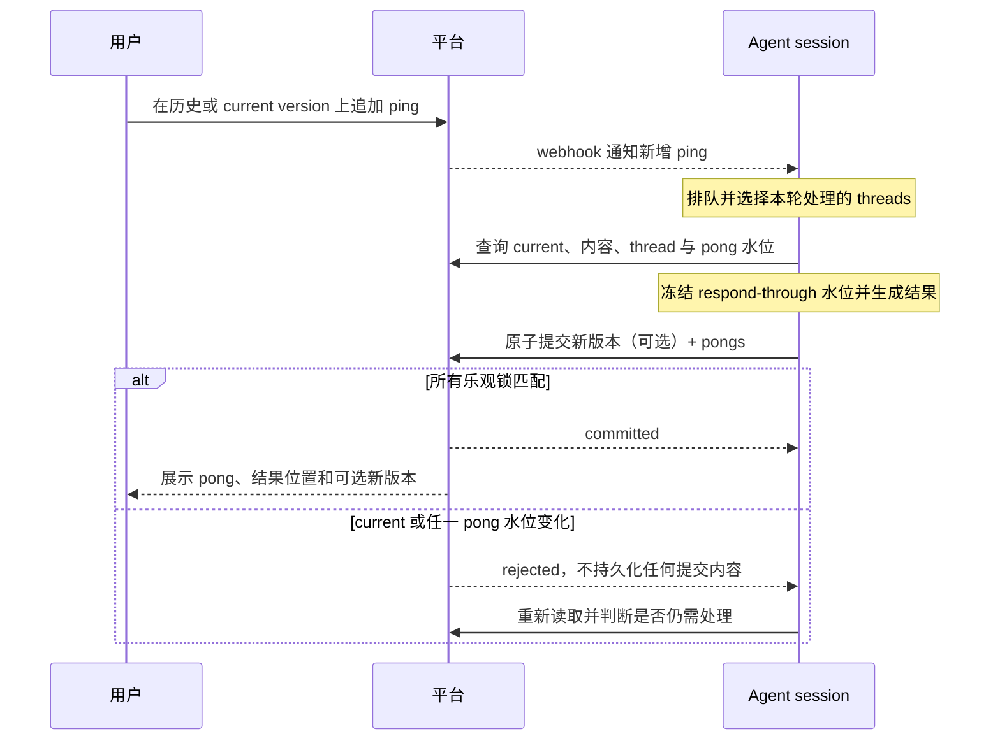

# 人与 Agent 协同编辑文档的新范式

状态：目标设计，2026-09-09。本文只定义设计本身，不讨论与现有系统的兼容、迁移或实施关系。

## 1. 背景

传统多人编辑把参与者建模为持续产生 operation 的对等编辑者，并通过 OT 或 CRDT 合并实时操作。Agent 不适合直接套用这一模型：Agent 通常按任务工作，而不是持续观察逐键输入；人类审阅文档也天然具有“形成一版、集中评审、再形成下一版”的节奏。

本文采用评论驱动的协作协议：

- 人负责判断和表达意见，主要产出是 ping；
- Agent 负责理解意见、协调冲突和编辑文档，主要产出是 pong 和可选的新版本；
- 平台维护不可变内容、版本关系、评论线程、当前版本指针和提交并发控制，不理解具体文档的编辑语义；
- 轻量所见即所得编辑在协议层仍被表达为一种编辑型 ping，不恢复逐操作协同。

这里的目标不是让 Agent 模拟另一位实时编辑者，而是为人和 Agent 建立有节奏、可追溯、允许异步并发的协作协议。

## 2. 设计原则

1. **评论驱动**：人的意见是输入，Agent 的处理结果是回复和可选的新版本。
2. **版本是交付单元**：系统只持久化完整 snapshot，不把 Agent 的中间编辑过程写入版本历史。
3. **异步且可分批**：平台可随时通知新 ping，Agent 可按能力分批处理，不要求一次清空所有 open threads。
4. **乐观并发**：任何 Agent 都可尝试提交，平台通过版本指针和 thread pong 水位的乐观锁阻止陈旧结果覆盖新状态。
5. **格式语义下沉**：平台不理解 Markdown 选区、PSD 图层或白板区域；View 与 Agent hook 共同拥有文档类型语义。
6. **内容与关系分离**：不可变内容进入 CAS；可移动指针、版本关系、thread 顺序和水位进入可变存储。
7. **反馈闭环优先于单次完美**：冲突检测可以误报或漏报，依靠每批 ping 必须有明确 pong、结果可定位、用户可继续 ping 的闭环纠正。

## 3. 核心对象

### 3.1 Document

Document 是可独立迭代的实体。富文本、图片、PSD、幻灯片、白板以及其他可版本化资源都可以是 Document。

每个 Document 至少具有：

- 稳定的文档身份；
- 一个可移动的 current version pointer；
- 一组不可变版本；
- 一组 comment threads；
- 文档类型；
- 一个用于消息路由的 operator hook 注册。

### 3.2 Version

Version 是一次完整内容交付，指向一个不可变 snapshot。每个版本在创建时记录：

- 文档内单调递增的整数版本号，同时作为版本 record 身份和创建顺序；
- 唯一 base parent，即提交时的 current version；
- 该 snapshot 与其 locations 共用的文档类型 Document Contract revision；
- snapshot 逻辑值 `SValue`，大型二进制内容通过 `SBlob` 引用；
- 本次提交所携带的 pong 及其来源 ping，用于追溯修改依据。

`VersionIdx` 由平台从 0 开始在提交成功时分配，表示出生顺序，不表示祖先顺序。`DocumentContractIdx`、`PingIdx` 和 `PongIdx` 也分别在各自作用域从 0 开始；`null` 才表示尚无记录或水位，0 是合法首项。snapshot 是 `SValue` 而不是 CAS hash；相同内容仍可因 parent、provenance、作者或创建时间不同而形成不同版本。跨文档引用版本时必须同时携带文档身份。

每个文档类型的 Document Contract revision 单调递增且只追加。每个不可变 contract JSON 原子包含 snapshot schema 与 location schema；任一已提交且受当前 View/Operator 支持的 revision 都可用于创建新数据，最大 idx 只表示最后提交。snapshot schema 使用扩展 JSON Schema 描述 `SValue`，location schema 约束 `{ locationType, payload }`。

### 3.3 Current 与 latest

`current version` 与 `latest version` 是不同概念：

- current 是文档所有者可移动的权威指针；
- latest 是按生成时间最后创建的版本；
- 创建新版本成功后，默认将 current 推进到该版本；
- 回溯只是将 current 移到历史版本，不删除后来版本。

current pointer 的每次移动都必须写入文档级审计记录，因为它会改变后续版本的 base、间接引用的解析结果以及 Agent 提交的乐观锁基线。

## 4. 双图版本模型

版本历史由两类关系组成，不能压缩成一条线，也不应混成一种边。

### 4.1 Base forest

每个新版本有且只有一个 base parent，等于提交时的 current version。base 边在完整历史中构成树；历史归档或删除后，热存储中可能缺少祖先，因此呈现为森林。

current 可以回到任意历史节点，后续提交以该节点为 parent 形成新的树枝。系统不需要人为维护分支名。

### 4.2 Comment provenance DAG

一个新版本可以 address 多个 thread 中的 ping，而这些 ping 可以分别基于多个历史版本。由“新版本处理了哪些基于历史版本的意见”形成 provenance 关系。

因此，“版本 7 基于版本 1、2、3 生成”的准确含义是：

- base parent 只有一个，例如版本 3；
- 本次提交的 pong 累计确认了分别引用版本 1、2、3 的 ping；
- 这些 comment provenance 关系构成另一张 DAG。

base parent 决定并发提交基线；comment provenance 解释内容为什么这样变化。两者不可互相替代。

## 5. Comment thread 模型

### 5.1 两个异步序列

每个 thread 由两个各自有序、异步追加的消息序列构成：

- **ping sequence**：只能由用户追加；
- **pong sequence**：只能由 Agent 追加。

用户不接受某个 pong 时，不存在 `reject` 或 `reopen` 操作，只需追加新的 ping。Agent 遇到矛盾意见时也提交 pong，说明冲突并请求相关用户协商；用户通过后续 ping 表达协商结果。

`pong` 表示 Agent 已处理，不表示用户接受，也不表示共识已经成立。

### 5.2 累计确认水位

每个 pong 指向该 thread 中一个确定的 ping 水位：

```text
ping sequence:  p1, p2, p3
pong sequence:  q1(through = p2), q2(through = p3)
```

`q1` 不是只回应 `p2`，而是累计确认从上一个 pong 水位之后到 `p2` 为止的全部 ping。在示例中，`q1` 同时回应 `p1` 和 `p2`，`q2` 回应 `p3`。

由此得到以下约束：

- 一个 pong 可以累计回应同一 thread 内连续的多条 ping；
- 一个 ping 最终只属于一个 pong 覆盖的确认区间；
- Agent 不允许跳过较早的未响应 ping，只响应更晚的 ping；
- pong 水位只能单调前进；
- 新 ping 可以在 Agent 工作期间继续到达，并自然落在已冻结水位之后。

### 5.3 Open 是派生状态

平台不需要维护可被任意切换的 resolved 标志。thread 是否 open 由两个水位派生：

```text
open := latestPingSequence > acknowledgedPingSequence
```

没有新 ping 时，pong 将 thread 推进到 addressed 状态；用户追加 ping 后，thread 自动再次成为 open。

### 5.4 Ping 的 base version

每个 ping 记录用户提出意见时正在查看的确切版本。评论不要求基于 current 或 latest version；基于历史版本的 ping 仍然有效。

ping 必须绑定一个已经存在的版本；文档首版本产生前不能创建 thread 或追加 ping。

Agent 处理时判断该意见是否仍适用于 current 内容。平台不替用户或 Agent 做语义迁移，也不因为 current 已推进而自动作废旧版本上的 ping。

## 6. 通知、operator 与处理节奏

### 6.1 Operator 是文档级可延续 session

每个文档可注册一个默认 operator hook。hook 编码文档路由信息，例如：

```text
https://webhook.host.name/some/prefix/tenants/{tenantId}/documents/{documentId}
```

operator 收到通知后，根据 tenant 和 document 路由到对应的长期 Agent session。session 可以查询内容、版本、历史 thread 和 open ping，以理解文档长期演进的上下文。

### 6.2 注册只控制通知路由

operator 注册不构成写入租约或排他权限：

- 平台默认把新增 ping 通知给已注册 hook；
- override 只改变平台通知谁；
- 任何获得授权的 Agent 都可以随时尝试提交 pong 或新版本；
- 写入安全只由提交时的乐观锁保证。

这允许用户切换默认 Agent，也允许多个 Agent 并发尝试处理同一文档，而不需要平台维护 operator ownership epoch。

### 6.3 Webhook 是增量通知，不是封闭任务 RPC

平台与 Agent 共同维护 open comments 的协同状态：

- 平台是持久 ping、pong 和派生 open 状态的权威；
- 平台可以随时向 webhook 推送新增 ping 或当前任务信息；
- Agent 自己负责消息排队、批处理、重试和 sub-agent 调度；
- Agent 可以收到 100 条 open comments，只处理其中 10 条并提交；
- 剩余 comments 保持 open，后续继续处理。

通知载荷是工作提示，不是要求一次完成的事务边界。Agent 在准备一次具体提交时，冻结本次选择处理的 thread 及其 ping 水位；执行期间追加的 ping 只能进入后续处理轮次。

## 7. 原子提交与乐观锁

### 7.1 提交形态

Agent 可以提交：

1. 纯 pong，不创建内容版本；
2. 新版本和一组 pong；
3. 只处理部分 open threads，不要求清空平台当前所有 open comments。

如果本轮只需解释、拒绝修改或拉起冲突协商，Agent 应提交纯 pong，不能为了记录对话而创建内容完全相同的新版本。

一次提交可概念化为：

```ts
interface AgentSubmission {
  observedCurrentVersionIdx?: VersionIdx;
  newDocumentContractIdx?: DocumentContractIdx;
  newSnapshot?: SValue;
  threadUpdates: Array<{
    threadId: ThreadId;
    observedAcknowledgedPingIdx: PingIdx | null;
    respondThroughPingIdx: PingIdx;
    pong: PongContent;
    resultLocations: DocumentLocation[];
  }>;
}
```

result location 一律相对于同一 submission 创建的新版本，因此非空时必须同时包含 `newSnapshot`；纯 pong 的 result locations 为空。若包含 `newSnapshot`，则 `observedCurrentVersionIdx` 必填。纯 pong 不依赖 current version，但仍受每个 thread 的已确认 `PingIdx` 水位锁保护。

### 7.2 两类乐观锁

平台在同一原子事务中检查：

1. **版本锁**：若提交新版本，`observedCurrentVersionIdx == currentVersionIdx`；
2. **thread 锁**：每个 thread 的 `observedAcknowledgedPingIdx == acknowledgedPingIdx`。

这里比较的是相等，而不是版本新旧。current 被所有者回溯到旧版本时，基于较新版本的提交同样失败，因为指针移动本身表达了所有者意图。

thread 锁防止两个 Agent 对同一批 ping 重复作答或意外跨过未读 ping。后到的 Agent 在失败后重新读取 thread，判断是否仍有必要补充回复。

### 7.3 全部成功或全部拒绝

一次提交中的新版本和所有 pong 是一个原子单元：

- 任一版本锁或 thread 锁失败，整个提交被拒绝；
- 被拒绝的版本、pong 和中间内容不留持久化痕迹；
- Agent 必须重新读取当前内容和 comments，再决定如何处理；
- 成功后，平台创建可选的新版本、写入全部 pong、推进相关 thread 水位，并在有新版本时推进 current pointer。

执行期间新到达但位于 `respondThroughPing` 之后的 ping 不阻止提交，它们留给下一轮。

## 8. Comment location

### 8.1 顶层只定义不透明封套

位置表达高度依赖文档类型。平台不应尝试统一抽象文本 range、画布矩形、图层、时间轴片段或三维对象，但也不应只存无类型任意字符串。

统一封套为：

```ts
interface DocumentLocation {
  documentContractIdx: DocumentContractIdx;
  locationType: string;
  payload: JsonValue;
}
```

`locationType` 是包含版本的不可变解释器标识，例如：

```text
unidocs.markdown.text-range/v1
unidocs.psd.layer-region/v2
```

location schema 与 snapshot schema 位于同一个 Document Contract JSON。Platform 使用 `documentContractIdx` 选择 schema，并校验 `{ locationType, payload }` 投影；`locationType` 仍作为该 schema 内的语义 discriminator。

### 8.2 基数与解释职责

- 一个 ping 可以携带零到多个 locations，用一条意见关联同一版本中的多个位置；
- 一个 pong 可以关联零到多个 result locations；
- ping locations 共同表示该意见的上下文；
- pong locations 表示该批意见在结果中的零个、一个或多个落点；
- location 自身不携带版本；同一 ping 的所有 locations 均相对于该 ping 的同一个 base version，pong result locations 相对于同一 submission 创建的新版本；
- 非空 pong result locations 必须随新版本提交，纯 pong 的 result locations 为空。

平台保存封套，校验它引用的 contract 与所属版本一致，并按该 revision 的 location schema 和大小限制验证。对应文档类型的 View 与 Agent hook 负责：

- 创建、序列化和验证 payload；
- 在指定版本中解析、定位和高亮；
- 向 Agent 解释位置语义；
- 对未知类型或无法解析的位置降级显示“位置不可用”。

## 9. 引用与多媒体文档

### 9.1 一切可独立迭代的实体都是文档

图片、视频、富文本片段或其他媒体只要需要独立迭代，就可以成为子文档。主文档与子文档分别拥有版本、comments、current pointer 和 operator，因此天然属于不同冲突域，可以并行演进。

评论默认归属于用户当前所在的 View。主文档 Agent 可根据评论语义将工作转发给子文档：

- 已有子文档时，向其 session 追加工作；
- 直接嵌入且尚无独立文档时，按需创建编辑 session；
- 资源被多篇文档复用时，先评估影响范围，不确定则询问用户是全局修改还是仅修改当前使用处。

跨文档修改不引入分布式事务。每个文档独立提交并接受最终一致性，由 Agent 通过 ping/pong 和补偿动作协调中间状态。

### 9.2 跟随与锁定

引用始终保留被引用文档的稳定指针信息：

- **跟随引用**：解析被引用文档的 current pointer；
- **锁定引用**：同时记录被引用文档指针和锁定的具体版本；
- 锁定不丢失升级路径，View 可以提示资源已有不同 current version，并允许用户切换。

间接引用跟随的是 current，而不是按创建时间计算的 latest。

### 9.3 可复现性边界

一个文档版本只保证其自身 snapshot 和直接保存的引用值可复现。若 snapshot 中保存的是跟随引用，那么该引用值本身不变，但解引用内容可以随目标文档的 current pointer 改变。

需要递归渲染结果固定的场景必须使用锁定版本。平台不把“间接引用当前状态发生变化”定义为源文档版本发生变化。

### 9.4 反向引用

共享资源的影响面只需要围绕文档指针建立反向索引：

- 跟随引用会受目标 current pointer 变化影响，应计入影响面；
- 锁定到具体版本的引用不会随目标 current 变化，不计入该变化的影响面。

## 10. 存储与归档

### 10.1 不可变内容进入 CAS

完整 snapshot、富媒体、附件以及 ping/pong 的富内容可以使用内容寻址节点保存。相同资源通过 Merkle DAG 共享，避免跨版本重复存储。

CAS 层不理解节点是正文、图片、comment 还是附件，只提供：

- 不可变内容节点及其 Merkle 引用；
- 业务根引用与生命周期保护；
- 内容读取与垃圾回收基础能力。

### 10.2 可变关系独立存储

以下状态不能直接作为不可变 Merkle DAG 关系处理：

- 版本 base forest 与 comment provenance；
- current pointer；
- pointer 审计日志；
- thread 的 ping/pong 顺序和累计确认水位；
- operator hook 注册；
- 文档指针反向引用；
- 归档与恢复状态。

这些关系需要独立的可变存储。CAS 节点是否可回收，由可变存储中的业务根和保留策略决定。

### 10.3 Thread 归档条件

版本被归档时，引用该版本的 comment 不应被立即连带归档。热区允许 comment 引用已归档版本，View 将无法直接读取的引用置灰，并可在恢复归档后重新解析。

一个 thread 只有在自身不再从热历史可达时才具备归档条件。具体判定为：thread 中所有消息所引用的版本均已归档。这样不会因为早期 ping 的 base 被归档而丢失仍与较新版本相关的完整决策上下文。

归档是热存储边界，不必等同于永久删除。恢复归档后，原有版本身份和 comment 引用必须重新可解析。

## 11. Undo 与轻编辑

### 11.1 Undo 的边界

- 大版本之间不是 operation undo，而是移动 current pointer；
- 版本内的人类 undo/redo 只作用于自己的 comment 草稿、编辑型 ping 草稿或其他本地 draft；
- Agent 修改错误时，用户可以回溯 current，也可以追加 ping 要求改回；
- 系统不存在跨用户、跨大版本的操作级协同 undo。

### 11.2 编辑型 ping

轻量修改仍可保留所见即所得体验。用户在基于特定版本的 View 中直接替换文字、移动对象或调整属性，但发布时由文档类型组件将结果编码为一条编辑型 ping。

用户感知的是即时编辑；平台与 Agent 接收的仍是：

- 确切 base version；
- 零到多个文档类型专用 locations；
- 修改意图或候选结果；
- 可选附件。

因此轻编辑不要求平台持久化键鼠 operation，也不改变统一的评论驱动协议。

## 12. 平台与文档类型边界

### 12.1 平台能力

平台向人类 View 和 Agent 暴露通用能力：

- 查询文档身份、文档类型和 current version；
- 查询任一配对 Document Contract revision；
- 查询版本关系、审计和确切版本内容；
- 查询 thread、ping/pong 序列和 open 状态；
- 追加 ping；
- 原子提交 pong 和可选的新版本；
- 管理跟随或锁定引用；
- 注册 operator hook 并发送增量通知；
- 归档、恢复和保留策略所需的关系管理。

平台不提供语义编辑操作，也不维护某种文档类型的“当前 JSON 状态服务”。

### 12.2 新增文档类型

新增文档类型只需要两端能力：

1. **面向人的 View**：渲染版本、采集类型专用 locations、提交 ping，并显示 pong 和结果位置；
2. **面向 Agent 的 hook 能力**：理解 snapshot、locations 和编辑意图，生成完整新 snapshot。

存储、版本、thread、水位、通知和并发提交协议保持不变。

## 13. 典型流程



冲突协商走同一流程：Agent 提交说明冲突的纯 pong；相关用户讨论后追加新 ping；Agent 在后续水位再次处理。

## 14. 核心不变量

1. 每个持久版本都有且只有一个 base parent，根版本除外。
2. 版本创建只能基于提交时完全相等的 current pointer。
3. 被拒绝的提交不产生版本、pong 或部分关系。
4. 每个 thread 的 pong 水位单调前进，且不能跨过未响应 ping。
5. 一个 pong 只属于一个 thread，但可累计回应该 thread 内连续的多条 ping。
6. 一个 ping 可有零到多个 locations，且均相对于该 ping 的同一个 base version；一个 pong 可有零到多个 result locations。
7. Agent 可以只提交 pong，也可以只处理 open comments 的任意子集。
8. operator 注册只影响通知路由，不授予排他写入权。
9. current pointer 移动必须审计，且不会隐式删除任何版本。
10. 文档版本只保证自身 snapshot 与引用值不变，不保证跟随引用的递归内容不变。
11. location payload 的语义由对应文档类型解释，结构合法性由 paired Document Contract 校验。
12. 版本归档不会立即归档仍可从热历史关联到的 thread。
13. Document Contract revision 只能追加且原子配对 snapshot/location schema；所有兼容 revision 都可写，版本与 location 永久记录同一 revision。

## 15. 协议细化项

本文已经确定状态模型和一致性边界。实现协议仍需机械化定义以下内容，但不改变上述设计：

- VersionIdx、PingIdx、PongIdx、ThreadId 和水位的线格式；
- 原子提交的幂等键、重复请求保留期限和结果查询；
- 乐观锁失败时的稳定错误码及返回的当前水位；
- webhook 鉴权、签名、重复投递和乱序处理；
- locationType 命名注册、payload 大小限制和未知类型降级格式；
- 归档恢复、审计保留和 CAS 垃圾回收的操作协议。
