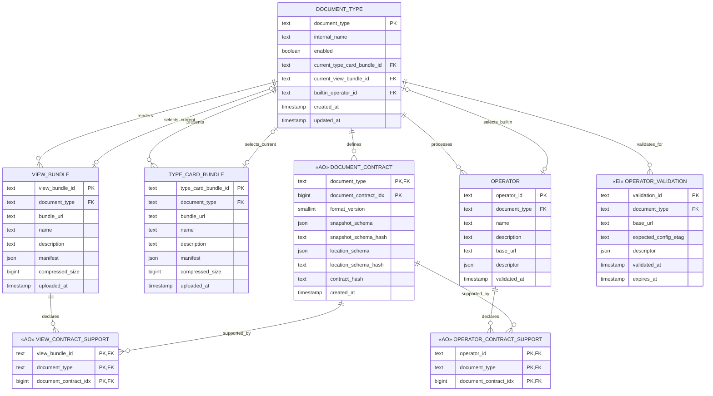
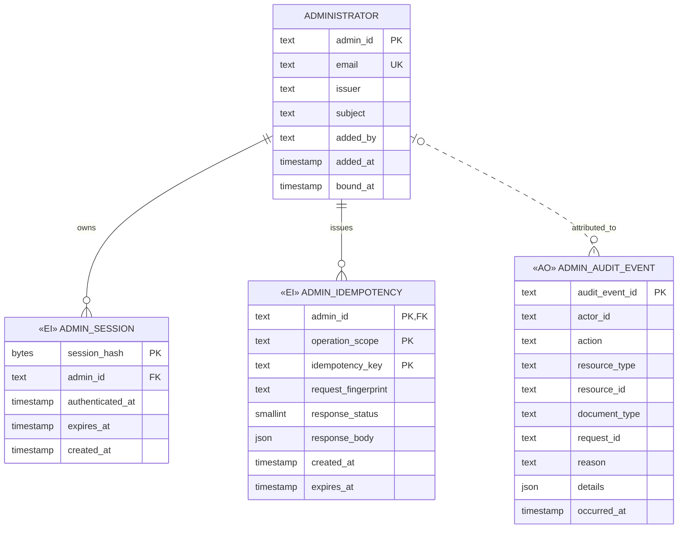
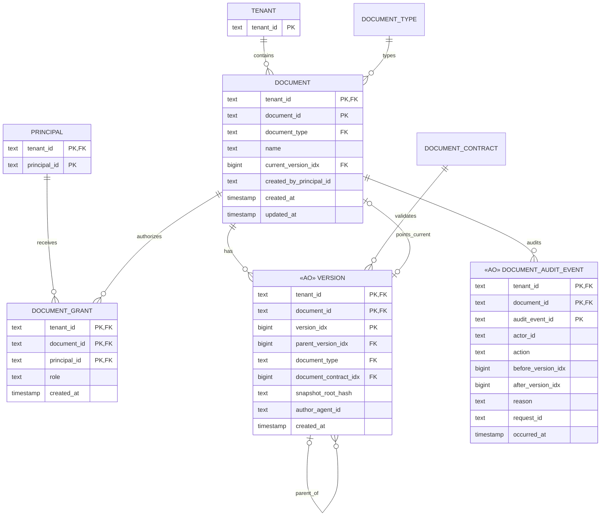
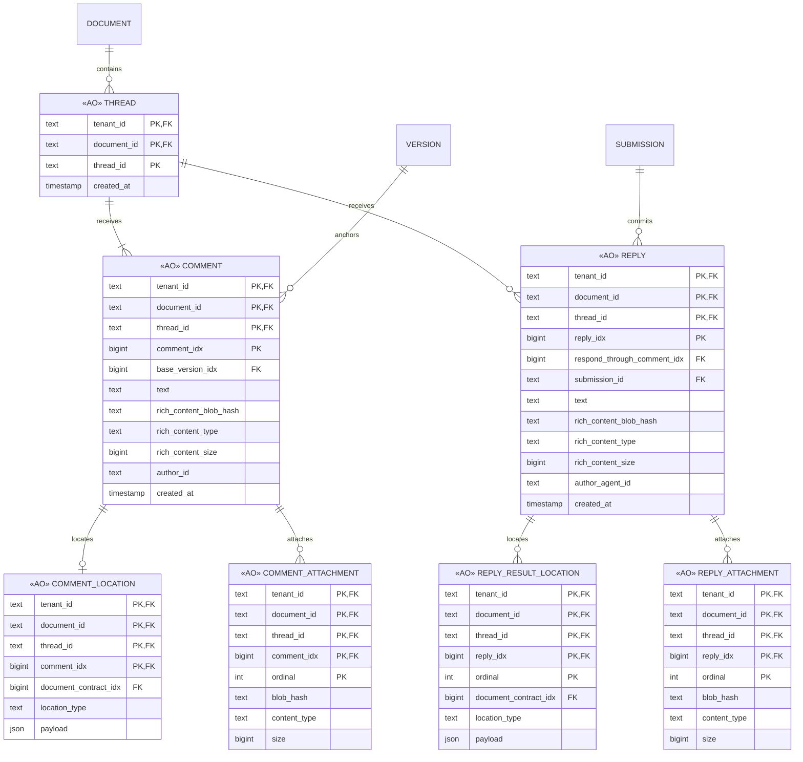
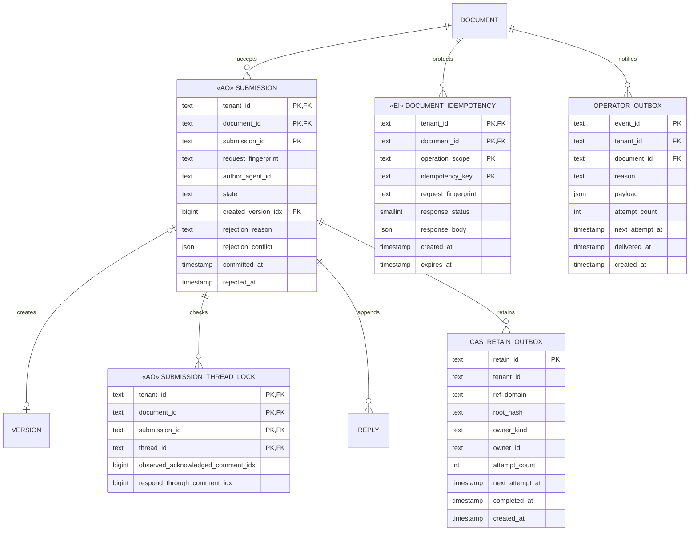

# UniDocs Platform v0 ER Model

状态：目标逻辑模型，2026-09-10。本文把已确定的 Admin、Platform、View 与 Agent wire contract 映射为持久化实体、关系和事务约束。它不是 PostgreSQL、SQLite/Durable Object 或 D1 的物理 DDL；云适配器可以采用不同物理布局，但必须保持相同键、唯一性和原子性。

## 1. 存储边界

- **Platform database**：文档类型配置、contract revisions、候选 metadata、管理员、文档、版本、thread、comment/reply、submission receipt、审计、幂等记录与可靠投递 outbox 的唯一权威。
- **R2-compatible bundle store**：Type Card/View bundle 的不可变 ZIP 解包内容。数据库保存内容身份、canonical public `bundle_url`、manifest、大小和 Admin metadata；对象存储不是关系权威。
- **UniCAS**：snapshot 编码及 comment/reply 富内容、附件的 blob graph。数据库只保存 `CasBlobRef` 或内部 snapshot root；业务事务提交后由 Platform retain，失败时让 lease 到期。
- **Identity provider / tenant authority**：登录凭据和 tenant 成员事实不复制为业务正文。数据库只保存稳定 principal reference 和必要的授权投影。

所有 `*Idx` 从 0 开始并在其作用域内单调递增。`null` 表示尚无记录，0 不是 sentinel。时间统一保存 UTC instant。ETag 从 canonical GET representation 计算，不作为独立可修改事实；实现可以缓存，但必须可重算。

### 1.1 写入模式图例

- `«AO»` **Append-only**：只能插入，不修改、不删除；旧数据可以按保留策略归档到冷库。
- `«EI»` **Ephemeral immutable**：只能插入，不修改；生命周期短，过期或失效后定期物理删除。
- **Normal**：普通可读写表，不加 stereotype。具体允许更新或删除的列仍由约束说明限定。

stereotype 只是图上标记，不是逻辑表名的一部分。未标 stereotype 即表示 Normal，不代表每一列都可任意更新；精确列级约束仍以 1.2 的矩阵为准。

### 1.2 实体写入模式

| 实体 | 写入模式 | 可变范围 / 约束 |
| --- | --- | --- |
| `DOCUMENT_TYPE` | Normal | `internal_name`、三个 current binding、`enabled`、`updated_at`；受完整 registration ETag 保护 |
| `DOCUMENT_CONTRACT` | AO | 整行不可变；每个 document type 只追加下一个 idx |
| `TYPE_CARD_BUNDLE` | Normal | 只允许更新 `name`、`description`；其他列不变 |
| `VIEW_BUNDLE` | Normal | 只允许更新 `name`、`description`；其他列不变 |
| `VIEW_CONTRACT_SUPPORT` | AO | 与 View manifest 原子插入；不更新、不删除，归档随所属 View |
| `OPERATOR_VALIDATION` | EI | 只记录成功 validation；失败只进 audit；过期后定期删除 |
| `OPERATOR` | Normal | 只允许更新 `name`、`description`；base URL、descriptor、validated time 不变 |
| `OPERATOR_CONTRACT_SUPPORT` | AO | 与 Operator descriptor 原子插入；不更新、不删除，归档随所属 Operator |
| `ADMINISTRATOR` | Normal | 未绑定到已绑定是单向更新；成员可删除，但不能删除自身或最后一名管理员 |
| `ADMIN_SESSION` | EI | 创建后不更新；登出、撤销、身份失效或过期后删除 |
| `ADMIN_IDEMPOTENCY` | EI | 操作结果提交时原子创建；到期后删除 |
| `ADMIN_AUDIT_EVENT` | AO | 永不更新、删除；可按保留策略归档冷库 |
| `TENANT` | Normal | 外部 tenant authority 的本地投影；具体同步规则待定 |
| `PRINCIPAL` | Normal | 外部身份/tenant membership 投影；可禁用或重建 |
| `DOCUMENT_GRANT` | Normal | 可添加、改变 role 或撤销；具体 role vocabulary 待定 |
| `DOCUMENT` | Normal | 只更新 `name`、`current_version_idx`、`updated_at` |
| `VERSION` | AO | 整行不可变；每个 document 只追加下一个 idx |
| `DOCUMENT_AUDIT_EVENT` | AO | 永不更新、删除；可按保留策略归档冷库 |
| `THREAD` | AO | 与 comment 0 原子插入，此后不更新、删除 |
| `COMMENT` | AO | 整行不可变；每个 thread 只追加下一个 comment idx |
| `COMMENT_LOCATION` | AO | 与 comment 原子插入，不单独更新或删除 |
| `COMMENT_ATTACHMENT` | AO | 与 comment 原子插入，ordinal 与 blob ref 不变 |
| `REPLY` | AO | 整行不可变；每个 thread 只追加下一个 reply idx |
| `REPLY_RESULT_LOCATION` | AO | 与 reply/submission 原子插入，不单独更新或删除 |
| `REPLY_ATTACHMENT` | AO | 与 reply 原子插入，ordinal 与 blob ref 不变 |
| `SUBMISSION` | AO | committed/rejected receipt 一次写入后不可变；相同 submission ID 只重放 |
| `SUBMISSION_THREAD_LOCK` | AO | 与 submission receipt 原子写入，不单独更新或删除 |
| `DOCUMENT_IDEMPOTENCY` | EI | completed receipt 创建后只读，到期后删除 |
| `OPERATOR_OUTBOX` | Normal | 只更新 attempts、next attempt、delivered time；event payload 不变 |
| `CAS_RETAIN_OUTBOX` | Normal | 只更新 attempts、next attempt、completed time；root/owner 不变 |

## 2. 文档类型控制面

### 2.1 Control-plane constraints

- `DOCUMENT_CONTRACT(document_type, document_contract_idx)` is append-only. The first idx is 0; allocation and insert occur in one transaction.
- `document_type` matches `[a-z][a-z0-9-]{0,63}` and combines with `format_version` to derive the snapshot/location media types; neither media type needs a stored column.
- `contract_hash` is unique within a document type. `snapshot_schema_hash` and `location_schema_hash` use canonical schema JSON; `contract_hash` covers `document_type`, `format_version`, and both schemas.
- A current bundle/Operator FK must point to a row with the same `document_type`.
- A type may be enabled only when all three current bindings exist and the intersection of uploaded contracts, `VIEW_CONTRACT_SUPPORT`, and `OPERATOR_CONTRACT_SUPPORT` is non-empty.
- Bundle IDs are content-derived and globally unique. Re-upload under the same idempotency key replays the original result; an existing content ID under a different key is a conflict and never overwrites metadata.
- `bundle_url` is the canonical absolute root URL confirmed at upload time, for example `https://bundles.example/view-bundles/{viewBundleId}/`. It is immutable and must match the configured stable bundle origin, resource kind and content-derived bundle ID. An origin migration must preserve old URLs through permanent routing or an explicit data migration; readers must not silently recompute a different URL. Bundle `manifest` remains in the database so item GET and validation do not depend on reading R2. Large extracted files remain only in R2.
- A successful validation creates an immutable `OPERATOR_VALIDATION` record because GET validation and subsequent Operator creation cross request boundaries. Failed validation creates no row and is recorded only in audit. The successful record may expire and be physically deleted; Operator creation copies its validated base URL, descriptor and `validated_at`, and does not retain a live FK dependency.
- Support join rows are projections of immutable manifests/descriptors. They are stored for indexed compatibility checks and must exactly match their source JSON.

## 3. Administrators and control audit

- `(issuer, subject)` is unique when bound. Email is normalized before uniqueness checks.
- Session storage contains only a hash of the opaque cookie handle. The row is immutable after creation; logout, administrative revocation, identity invalidation, and expiry delete it. CSRF material may be session-bound but must not appear in audit or idempotency response bodies.
- `operation_scope` prevents accidental key collision across unrelated routes. The immutable receipt is inserted atomically with the completed business mutation; reusing a key with another fingerprint is `idempotency_conflict`, while a matching replay returns the stored status/body. If an adapter later needs an in-progress lease/reservation for work outside the database transaction, it uses a separate ephemeral reservation entity rather than mutating this receipt.
- Audit rows are append-only. Secrets, cookies, Bearer tokens, CSRF tokens, raw bundle bytes and complete document content are forbidden in `details`.
- `document_type` on audit is a nullable denormalized filter key, not necessarily an FK: administrator-wide events have no type, and retained audit must survive later lifecycle changes.

## 4. Tenant documents and versions

`TENANT`, `PRINCIPAL`, and `DOCUMENT_GRANT` are provisional because the current wire contract says “visible to the current user” without fixing owner/share roles. They reserve the authorization boundary; implementation must settle the role vocabulary before migrations are frozen.

### 4.1 Version constraints

- `VERSION(tenant_id, document_id, version_idx)` is immutable. Allocation is document-scoped, zero-based and atomic with submission commit.
- `parent_version_idx` is null only for the first version; otherwise it references another version of the same document. It records the current pointer observed at commit, not necessarily `version_idx - 1`.
- `(document_type, document_contract_idx)` references the paired contract used to validate both snapshot and submission result locations.
- `DOCUMENT.current_version_idx` is nullable before initialization and otherwise references a version of the same document. Moving it writes `DOCUMENT_AUDIT_EVENT` in the same transaction.
- `snapshot_root_hash` is an internal Platform-to-UniCAS root identity for canonical SValue CBOR. The public `VersionRecord` resolves it to `SValue`; the hash is not a public version identity.

## 5. Threads, messages and locations

- Thread creation inserts `THREAD` and comment 0 atomically. A thread cannot exist without at least one comment.
- Comment/reply indexes are allocated independently per thread. Thread open state and acknowledged watermark are derived from the two sequences and are not stored as mutable columns.
- `COMMENT.base_version_idx` references a version of the same document. Its optional location uses that version's `document_contract_idx`.
- A reply's `respond_through_comment_idx` must advance beyond the previous reply watermark without exceeding the latest comment.
- Result locations exist only when the same submission creates a version; every result location uses that new version's contract idx.
- Attachment tables preserve order with `ordinal`. `text` and rich content obey the wire invariant that at least one body form is present.

## 6. Submission, idempotency and reliable effects

### 6.1 Atomic submission transaction

One database transaction must:

1. reserve or replay `(tenant_id, document_id, submission_id)`;
2. compare `observedCurrentVersionIdx` when a new version is present;
3. compare every observed thread watermark;
4. validate the selected contract and all result locations;
5. allocate and insert the optional version;
6. allocate and insert every reply, attachment and result location;
7. advance `DOCUMENT.current_version_idx` when a version is created;
8. persist the committed or rejected `SUBMISSION` receipt;
9. enqueue CAS retain and Operator notification effects.

No R2 or UniCAS network call participates in the database transaction. Outbox consumers retry external effects idempotently. A committed receipt is the durable client fact even while an outbox effect is pending.

### 6.2 Thread/comment idempotency

Create-thread and append-comment requests use `DOCUMENT_IDEMPOTENCY`. Their operation scope includes the route family and thread identity where applicable. Request fingerprint, created identities, status and compact response are stored together so network retries cannot append duplicate comments.

## 7. Keys and indexes

Minimum logical indexes:

- `DOCUMENT_TYPE(enabled, updated_at, document_type)` for Admin/public catalogs.
- `DOCUMENT_CONTRACT(document_type, document_contract_idx DESC)`.
- `TYPE_CARD_BUNDLE(document_type, uploaded_at DESC, type_card_bundle_id)`.
- `VIEW_BUNDLE(document_type, uploaded_at DESC, view_bundle_id)`.
- `OPERATOR(document_type, validated_at DESC, operator_id)`.
- `ADMIN_AUDIT_EVENT(occurred_at DESC, audit_event_id)` plus actor/action/resource/document-type filter indexes.
- `DOCUMENT(tenant_id, updated_at DESC, document_id)` and `(tenant_id, document_type, updated_at DESC, document_id)`.
- `VERSION(tenant_id, document_id, version_idx DESC)`.
- `COMMENT(tenant_id, document_id, thread_id, comment_idx)` and `REPLY(..., reply_idx)`.
- `OPERATOR_OUTBOX(delivered_at, next_attempt_at)` and `CAS_RETAIN_OUTBOX(completed_at, next_attempt_at)`.

Cursor pagination uses the complete stable sort key, never an offset.

## 8. Deliberately derived or unstored values

Do not add authoritative columns for:

- resource ETags;
- latest Document Contract idx;
- thread latest comment, acknowledged watermark, or open state;
- latest document version;
- available contract idx intersection;
- public Type Card projection;
- View interactive/thumbnail entrypoint URLs;
- credentials, access tokens, raw CSRF tokens, or raw Admin session handles.

These values are derived from authoritative rows or external configuration. A materialized projection is allowed only as a rebuildable cache and cannot become a second authority.

## 9. Decisions required before physical schema

1. Finalize tenant principal and document sharing roles represented provisionally by `PRINCIPAL` and `DOCUMENT_GRANT`.
2. Choose canonical JSON storage and RFC 8785 hashing implementation shared by Node.js and Cloudflare adapters.
3. Decide whether canonical snapshot CBOR bytes are stored directly in the relational database or always through an internal UniCAS root; the public model is unchanged.
4. Set retention for expired Operator validations, idempotency records, rejected submission receipts, sessions and delivered outbox rows.
5. Define archive/delete and corresponding UniCAS release workflows; v0 currently has neither.
6. Choose physical concurrency strategy per adapter while preserving composite uniqueness and transaction boundaries above.
