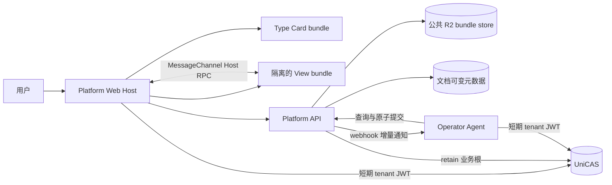

# UniDocs Platform、View 与 Operator API v0

状态：目标设计草案，2026-09-09。本文基于[人与 Agent 协同编辑文档的新范式](agent-mediated-document-collaboration.md)，只定义新的系统边界与 API，不讨论现有系统兼容、迁移或代码复用。可由 TypeScript language server 检查的公共、Agent 与 Operator 契约位于 [`@unidocs/protocol-platform`](../../../packages/protocol-platform/src/index.ts)，管理员控制面契约位于 [`@unidocs/protocol-admin-portal`](../../../packages/protocol-admin-portal/src/index.ts)。

## 1. 决策摘要

系统只保留两类可独立部署的服务：

1. **UniDocs Platform**：面向用户、View、管理员和 Agent 的唯一数据权威；
2. **Operator Agent**：理解具体文档类型并生成 pong 和完整新 snapshot。

View 不是第三类服务。每种文档类型可以绑定两个独立的静态资源包：面向创建入口的 **Type Card bundle**，以及运行文档界面的 **View resource bundle**。两者由 Admin 上传并由 Platform 托管在公共 R2 bucket；浏览器只在隔离 iframe 中运行 View bundle，通过 Host RPC 使用 Platform 能力。



### 1.1 明确删除的边界

- 不存在独立 editor service；
- 不存在由文档类型服务维护的可变 document session；
- Platform 不向类型服务发送 query/apply/snapshot；
- View 不直接访问 CAS、R2、Operator 或 Platform HTTP API；它通过 MessageChannel 请求 Platform Web Host 代理 `CasBlobClient.openBlob/storeBlob`；
- Operator 注册不授予排他写入权，只决定 Platform 默认向哪里发送通知；
- 不再提供同步 `run/reset` 作为文档协作主协议。

### 1.2 Platform 的职责

- 用户、管理员、Agent 身份和文档权限；
- 文档身份、类型目录、版本 base forest、comment provenance、current pointer 和审计；
- snapshot 与附件的内容存储和引用保留；
- 向已认证的 Web Host 和 Agent 颁发短期 tenant CAS capability；
- ping/pong 双序列、累计确认水位和 open 状态；
- 不透明的类型化 location；
- Agent submission 的幂等记录、双重乐观锁和原子提交；
- operator webhook 的至少一次投递；
- Type Card bundle 与 View bundle 的上传、验证、R2 托管和当前绑定。

### 1.3 Operator Agent 的职责

- 按文档类型解释 snapshot 和 location；
- 维护文档级长期 Agent session 及自己的任务队列；
- 查询 current 内容、历史版本和 thread 上下文；
- 判断历史版本上的 ping 是否仍适用于 current；
- 协调冲突，生成 pong；
- 生成完整新 snapshot；
- 通过 Platform API 原子提交可选版本和一组 pong；
- 以最终一致方式编排跨文档修改。

### 1.4 View bundle 的职责

- 在浏览器中渲染 Platform 下发的 snapshot；
- 通过 interactive 入口提供完整文档视图，接受滚动位置、缩放和可见区域等类型专用 viewport state；
- 创建、解释和高亮本类型的 `DocumentLocation`；
- 展示 thread marker 和 pong result locations；
- 提供类型专用视图工具，例如 PSD 图层与通道控制；
- 将圈选评论和轻编辑编译成 ping；
- 在本地提供类型专用查看工具和草稿体验。
- 通过独立 thumbnail 入口在指定尺寸内快速、确定性地渲染 snapshot，供无头浏览器或 `html2canvas` 生成缩略图。

View bundle 不创建正式版本。需要改变正式内容的用户操作最终都成为 ping，由 Agent 生成新 snapshot。

## 2. 通用线类型

以下 TypeScript 表示 JSON API 的线格式。二进制上传和读取接口在对应章节单独标注。

```ts
type TenantId = string;
type DocumentId = string;
type DocumentType = string;
/** 从 0 开始、文档类型内单调递增的 snapshot/location 配对 contract revision。 */
type DocumentContractIdx = number;
type DocumentContentFormatVersion = 1;
type DocumentSnapshotContentType<T extends DocumentType = DocumentType> =
  `application/vnd.unidocs.${T}.snapshot+cbor;version=1`;
type DocumentLocationContentType<T extends DocumentType = DocumentType> =
  `application/vnd.unidocs.${T}.location+json;version=1`;
/** 从 0 开始、文档内单调递增的版本 record ID。 */
type VersionIdx = number;
type ThreadId = string;
/** 从 0 开始、thread 内单调递增的 ping record ID。 */
type PingIdx = number;
/** 从 0 开始、thread 内单调递增的 pong record ID。 */
type PongIdx = number;
type SubmissionId = string;
type ViewBundleId = string;
type TypeCardBundleId = string;
type OperatorId = string;
type ValidationId = string;
type Cursor = string;
type IsoDateTime = string;

type JsonPrimitive = string | number | boolean | null;
type JsonValue = JsonPrimitive | JsonValue[] | { [key: string]: JsonValue };

interface Page<T> {
  readonly items: readonly T[];
  readonly nextCursor: Cursor | null;
}

interface ApiError {
  readonly error: {
    readonly code: string;
    readonly message: string;
    readonly requestId: string;
    readonly details?: JsonValue;
  };
}

/** 与 @unicas/tenant-blob-client 的 CasBlobRef 线格式相同。 */
interface CasBlobRef {
  readonly blobHash: string;
  readonly size: number;
  readonly contentType: string;
}

interface DocumentLocation {
  readonly documentContractIdx: DocumentContractIdx;
  /** 例如 unidocs.markdown.text-range/v1。 */
  readonly locationType: string;
  readonly payload: JsonValue;
}

interface MessageContent {
  readonly text: string | null;
  readonly richContent: CasBlobRef | null;
  readonly attachments: readonly CasBlobRef[];
}

type SValueSchema = Readonly<Record<string, JsonValue>> & {
  readonly $schema: "https://schemas.unidocs.dev/svalue/v1";
  readonly "x-unidocs-sblob"?: true;
  readonly "x-unidocs-blob-content-types"?: readonly string[];
};
```

`SValueSchema` 是 JSON Schema 2020-12 的扩展 dialect。普通节点沿用 JSON Schema 关键字；`x-unidocs-sblob: true` 表示该节点匹配一个原子的 `SBlob`，`x-unidocs-blob-content-types` 可约束其逻辑 content type。SBlob 大小上限完全由 UniCAS 规定和执行，dialect 不提供 `x-unidocs-blob-max-size`，提交包含该关键字的 contract 必须拒绝，不能静默忽略。Schema 本身是 JSON，不把内存中的 symbol-branded `SBlob` 伪装成 JSON 对象。

所有文档版本 snapshot、ping/pong 富内容和附件都以 `CasBlobRef` 持久化。其语义与现行 `@unicas/tenant-blob-client` 完全相同：`hash` 是 blob root，`size` 是逻辑总字节数，`contentType` 描述完整逻辑 blob，而不是某个内部 chunk。调用方不能假定 root 是单个 CAS node；大 blob 可以是 blob-index tree。`text` 与 `richContent` 至少一个非空；附件不能替代正文。

## 3. 文档与协作资源

```ts
interface DocumentContractRecord<T extends DocumentType = DocumentType> {
  readonly documentType: T;
  readonly documentContractIdx: DocumentContractIdx;
  readonly formatVersion: DocumentContentFormatVersion;
  readonly snapshot: {
    readonly contentType: DocumentSnapshotContentType<T>;
    readonly schema: SValueSchema;
    readonly schemaHash: string;
  };
  readonly location: {
    readonly contentType: DocumentLocationContentType<T>;
    readonly schema: SValueSchema;
    readonly schemaHash: string;
  };
  readonly contractHash: string;
  readonly createdAt: IsoDateTime;
}

interface DocumentRecord {
  readonly documentId: DocumentId;
  readonly name: string;
  readonly documentType: DocumentType;
  readonly currentVersionIdx: VersionIdx | null;
  readonly createdAt: IsoDateTime;
}

interface VersionRecord {
  readonly versionIdx: VersionIdx;
  readonly parentVersionIdx: VersionIdx | null;
  readonly documentContractIdx: DocumentContractIdx;
  readonly snapshot: SValue;
  readonly authorAgentId: string;
  readonly createdAt: IsoDateTime;
}

interface PingRecord {
  readonly pingIdx: PingIdx;
  readonly baseVersionIdx: VersionIdx;
  readonly content: MessageContent;
  readonly location: DocumentLocation | null;
  readonly authorId: string;
  readonly createdAt: IsoDateTime;
}

interface PongRecord {
  readonly pongIdx: PongIdx;
  readonly respondThroughPingIdx: PingIdx;
  readonly content: MessageContent;
  readonly resultLocations: readonly DocumentLocation[];
  readonly authorAgentId: string;
  readonly submissionId: SubmissionId;
  readonly createdAt: IsoDateTime;
}

interface ThreadRef {
  readonly threadId: ThreadId;
}

interface ThreadDetail {
  readonly threadId: ThreadId;
  readonly pings: readonly PingRecord[];
  readonly pongs: readonly PongRecord[];
}
```

`DocumentContractIdx`、`VersionIdx`、`PingIdx` 和 `PongIdx` 都是从 0 开始的单调递增安全整数，首条 record 分配 0，之后分配当前最大值加 1。`VersionIdx` 同时表达版本 record 身份和出生顺序；`PingIdx` 和 `PongIdx` 分别在各 thread 的序列内分配。`null` 表示尚无 record 或尚未确认，不能用 0 充当 sentinel。所有整数 record 身份使用 `Idx`，字符串身份使用 `Id`，内容哈希使用 `Hash`。

每个文档类型的 `DocumentContractIdx` 从 0 开始单调递增。一个 revision 是同时包含 snapshot schema 与 location schema 的不可变 JSON，不能只更新其中一项。revision 只能追加，不能修改或删除；最大 idx 只表示最后提交，不是 current，也不是唯一可写 revision。Platform 对两个 schema 分别做 canonical JSON digest；完整 contract digest 覆盖 `documentType`、`formatVersion` 与两个 schema。

`documentType` 必须匹配 MIME-safe slug `[a-z][a-z0-9-]{0,63}`。`formatVersion` 描述 snapshot/location 的线编码，不是 schema revision。v1 从 `(documentType, formatVersion)` 派生两条媒体类型；例如 PSD 使用 `application/vnd.unidocs.psd.snapshot+cbor;version=1` 与 `application/vnd.unidocs.psd.location+json;version=1`。客户端不提交自由 content type。以后只有线编码本身发生不兼容变化时才增加 format version，普通 schema 演进只增加 `DocumentContractIdx`。

location content type 描述 location 对象的规范 JSON 表示；当前它通常嵌在 ping/pong JSON body 中，因此不会成为该 HTTP 请求的顶层 `Content-Type` header，但仍作为 contract record 的明确格式标识。

snapshot 是逻辑文档值 `SValue`，其中的大型二进制内容以 `SBlob` 引用 UniCAS；它不是 snapshot CAS hash。相同 snapshot 仍可因 parent、provenance、作者和创建时间不同而形成不同版本。HTTP 使用 canonical SValue CBOR 编码，Platform 可将编码结果作为内部 CAS 业务根持久化，但该存储引用不进入 `VersionRecord` 公共模型。

`DocumentLocation` 只描述一个指定版本内部的位置，自身不重复携带 `versionIdx`。它携带与该版本相同的 `documentContractIdx`；Location Contract schema 校验 `{ locationType, payload }` 投影。`PingRecord.location` 相对于该 ping 的 `baseVersionIdx`，其 contract idx 必须等于 base version；`PongRecord.resultLocations` 相对于同次 submission 创建的新版本，并使用与新 snapshot 相同的 contract idx。

`latestPing`、`pongWatermark` 和 `open` 都从两个消息序列计算，不作为独立 API 结构或持久状态。`GET /threads?open=true` 可以在服务端按相同规则过滤，但只返回 `ThreadRef`。每个 ping 都绑定一个已存在的确切版本；首版本产生前不能创建 thread 或追加 ping。

## 4. Admin WebUI 调整

Admin 继续只有“文档类型、管理员、审计”三个业务模块，不增加 editor service、bundle release 或 Operator runtime 管理模块。

### 4.1 文档类型列表

列表列调整为：

| 列 | 内容 |
| --- | --- |
| 文档类型 | 当前 Type Card bundle 中匹配 Admin UI locale 的名称、图标和稳定 `documentType`；未绑定时显示内部名称与占位图标 |
| View bundle | 当前 bundle 短 ID 和入口文件 |
| Builtin operator | 已验证的 operator 名称；未配置时明确显示 |
| 主站状态 | enabled / 配置未完成 / disabled |
| 最近更新 | 类型配置最后更新时间 |

删除 Base URL、存储身份、editor endpoint 和 editor service 健康状态。搜索匹配类型、显示名称、bundle digest 和 operator host。

### 4.2 登记文档类型

登记时只填写 Admin 使用的内部名称。Platform 据此生成稳定且唯一的 `documentType`，并创建 `enabled = false`、三个当前绑定均为空的草稿。内部名称可以后续修改，不进入用户侧类型目录，也不改变 `documentType`。

Type Card bundle、View bundle 和 builtin operator 都在类型详情中后续配置。信息不完整的类型可以长期存在并接受管理操作，但不能启用，也不出现在主站类型目录中。

### 4.3 类型详情

详情包含六个 tab：

- **基本信息**：内部名称和稳定 `documentType`；
- **文档契约**：上传并查看同时包含 snapshot 与 location schema 的不可变 revision 包；
- **类型卡片包**：上传候选包、编辑 Admin 名称与描述、按 locale 预览创建卡片、选择当前包；
- **界面包**：上传 View bundle 候选包、编辑 Admin 名称与描述并选择当前包；
- **处理服务**：验证 Operator、创建可命名的候选项、编辑 Admin 描述并选择当前服务；
- **变更记录**：资源上传与绑定、operator 变更、启停和验证结果。

上传任一种 bundle 都不自动绑定。绑定 Type Card bundle、绑定 View bundle、更换 operator 和启停都通过同一个带 `If-Match` 的配置 PATCH 原子完成，防止管理员互相覆盖。

三类候选项都有仅供 Admin 识别的可变 `name` 和 `description`。bundle 的这两个字段位于 Platform 管理记录上，不进入内容寻址 manifest，修改时不产生新 bundle ID。Operator 的 Admin 文案位于持久候选记录上，不修改 discovery descriptor。候选 metadata 使用各自 `etag` 和 `If-Match` 独立更新；它不出现在用户侧类型目录。

Document Contract 没有删除、弃用或“设为当前”操作。无论类型是否启用都可以追加新 revision；append 本身不改变已有可写集合。当前 View bundle 与 Operator 候选共同支持、且已经存在的 revision 构成可用于新数据的集合，最大 idx 不享有特殊写入地位。

只有至少一个 Document Contract revision、当前 Type Card bundle、当前 View bundle 和当前 builtin operator 全部存在，且 View/Operator 至少共同支持一个已有 revision 时，才能设置 `enabled = true`。类型卡片的名称、描述、图标和 sample thumbnail 都来自当前 Type Card bundle；Admin 的预览工具初始跟随 Admin UI locale，也可以显式切换 locale，但语言切换控件不属于卡片本身。

当前已打开的 View session 固定启动时的 `viewBundleId`。Admin 切换 bundle 只影响新 session，不热替换正在编辑 ping 草稿的 iframe。

### 4.4 Bundle 上传状态

UI 在一次上传请求中展示进度，完成后显示验证结果。失败上传不产生可绑定 bundle，也不改变类型配置。Type Card 与 View bundle 使用相同的 zip 安全边界，但按各自 manifest 做资源校验。

Platform 对所有 bundle 至少校验：

- zip 路径穿越、符号链接、文件数量、单文件/总大小和压缩比；
- manifest schema、声明文件、资源摘要和 MIME；
- manifest 的 `documentType` 与目标类型完全相同；
- Type Card bundle 的 locale 覆盖、每个 locale 的文案与 alt、SVG/PNG 图标和 sample thumbnail；
- View bundle 的入口文件和支持的配对 Document Contract revisions；
- 禁止远程脚本和可绕过 Platform 内容通道的默认网络权限；
- HTML、JS、CSS 和资源均可从 Platform 的 bundle origin 独立加载。

### 4.5 Operator 状态

Admin 只配置 base URL，不录入或回显密钥。Operator 服务身份和鉴权密钥由部署 secret 配置建立，验证结果显示：

- operator identity；
- 协议版本；
- 支持的 document types；
- webhook 验签是否通过；
- Operator 调用 Platform 的服务身份是否可用。

健康检查不是持续监控。最后验证成功不等于当前服务一定在线。

## 5. Type Card、View bundle manifest 与托管

### 5.1 Type Card manifest

zip 根目录必须包含 `unidocs-type-card.json`：

```ts
interface TypeCardLocaleV1 {
  readonly name: string;
  readonly description: string;
  readonly sampleThumbnailAlt: string;
}

type TypeCardIconRasterSize = 16 | 32 | 64 | 128 | 256;

interface TypeCardIconSvgV1 {
  readonly kind: "svg";
  readonly path: string;
}

interface TypeCardIconPngV1 {
  readonly kind: "png";
  /** key 是正方形 PNG 的预定义宽高像素。 */
  readonly images: Readonly<Record<TypeCardIconRasterSize, string>>;
}

type TypeCardIconV1 = TypeCardIconSvgV1 | TypeCardIconPngV1;

interface TypeCardBundleManifestV1 {
  readonly protocol: "unidocs-type-card/v1";
  readonly documentType: DocumentType;
  readonly locales: Readonly<Record<string, TypeCardLocaleV1>>;
  readonly icon: TypeCardIconV1;
  readonly sampleThumbnail: string;
}
```

locale key 使用规范 BCP 47 language tag，且 `locales` 必须包含 `en`。`name`、`description` 和 `sampleThumbnailAlt` 都是该 locale 下的创建卡片文案。bundle 不声明默认 locale；Host 按当前 UI 的用户 locale 执行 RFC 4647 lookup，逐级匹配失败后回退到 `en`。`icon` 是二选一资源：SVG 不携带尺寸；PNG 必须在 `images` 中提供 16、32、64、128、256 五个预定义正方形尺寸，不接受任意数字或缺失尺寸。图标和 sample thumbnail 是卡片资源；thumbnail 只展示样例，不是创建文档时使用的初始 snapshot。

`typeCardBundleId` 是 Platform 根据规范 manifest 和解包后文件路径、摘要计算出的内容身份。相同内容重复上传得到相同 ID。上传新包不影响当前绑定；Admin 必须通过类型配置 PATCH 显式选择。

### 5.2 View manifest

zip 根目录必须包含 `unidocs-view.json`：

```ts
interface ViewBundleManifestV1 {
  readonly protocol: "unidocs-view-bundle/v1";
  readonly documentType: DocumentType;
  readonly entrypoints: {
    readonly interactive: string;
    readonly thumbnail: string;
  };
  readonly supportedDocumentContractIdxs: readonly DocumentContractIdx[];
}
```

两个入口都是规范化的 bundle-relative HTML 路径，必须指向不同文件。`interactive` 是 Tenant Portal 使用的完整视图：负责 snapshot 渲染、viewport state、comment marker 与选区高亮，并可包含文档类型专用工具。`thumbnail` 是无交互 chrome 的轻量渲染入口：只把 snapshot 布局到 Host 指定的 viewport 中，不显示评论、选区、工具栏或编辑状态，也不依赖 interactive 入口当前的滚动与缩放状态。

thumbnail 尺寸不固化在 manifest。thumbnail 服务通过 View Host RPC 传入 CSS pixel 宽高、device pixel ratio 和背景策略，因此同一 bundle 可以生成当前及后续新增的缩略图尺寸。`view.loadSnapshot` 只有在 snapshot、字体、图片和其他渲染资源达到可捕获状态后才能返回；无头浏览器随后截图，或在页面上下文中调用 `html2canvas`。thumbnail 页面不得运行持续动画或产生依赖时钟、随机数的布局变化。

`viewBundleId` 是 Platform 根据规范 manifest 和解包后文件路径、摘要计算出的内容身份。相同内容重复上传得到相同 ID；已有对象可直接复用。

### 5.3 Document Contract

Document Contract 本身是 JSON，不使用 ZIP 或 manifest：

```ts
interface AppendDocumentContractRequest {
  readonly formatVersion: 1;
  readonly snapshot: {
    readonly schema: SValueSchema;
  };
  readonly location: {
    readonly schema: SValueSchema;
  };
  readonly reason: string;
}
```

snapshot schema 校验 `SValue`；location schema 校验 `DocumentLocation` 的 `{ locationType, payload }` 投影。`documentType` 来自 URL path，不在 body 中重复。`formatVersion` 同时选择两种标准 content type；当前只接受 1。任一 schema、dialect 或 format version 校验失败，整个 append 失败且不分配 revision。

### 5.4 R2 布局与分发

```text
type-card-bundles/{typeCardBundleId}/manifest.json
type-card-bundles/{typeCardBundleId}/assets/{normalizedPath}
view-bundles/{viewBundleId}/manifest.json
view-bundles/{viewBundleId}/assets/{normalizedPath}
```

ready bundle 的对象不可原地覆盖。资源通过独立 bundle origin 分发：

```text
GET https://bundles.example/type-card-bundles/{typeCardBundleId}/{path}
GET https://bundles.example/view-bundles/{viewBundleId}/{path}
```

响应使用不可变缓存、`nosniff`、严格 CSP 和明确 MIME。R2 bucket 不公开，只有 Platform bundle ingress 可读取。MVP 不实现 bundle GC；旧的不可变 bundle 暂时保留。

bundle 存 R2 是当前实现边界；未来 UniCAS 支持 stack 公共内容后，可以只替换 bundle repository，不改变 manifest、Admin API 或 Host RPC。

## 6. Admin API

根路径：`/admin/api/v1`。所有 operation 支持两套相互独立的鉴权：请求带有 `Authorization: Bearer` 时只验证 Bearer token，面向非浏览器客户端；没有 Bearer token 时验证 Admin session cookie，面向 Web UI。Bearer token 存在但验证失败时直接返回 `401`，即使请求同时带有有效 cookie 也不得 fallback。cookie 鉴权的 mutation 必须验证 `X-CSRF-Token`，Bearer 鉴权不要求 CSRF。两条路径在认证成功后使用相同的 Admin 授权与审计语义。

继续使用近期重新认证、`Idempotency-Key`、`If-Match` 和审计。普通 JSON mutation 的大小限制不应用于 bundle 二进制流。

响应遵循[顶层 API conventions](../../api-conventions.md)：GET 返回完整 representation；持久资源 mutation 只返回继续操作所需的资源身份、ETag 或 hash，不回显 manifest、schema、descriptor 或完整 registration。同步 Operator validation 的完整验证结果是该 operation 的直接产物，因此保留完整响应。

### 6.1 Admin 类型

```ts
interface ViewBundleRecord {
  readonly viewBundleId: ViewBundleId;
  readonly bundleUrl: string;
  readonly name: string;
  readonly description: string;
  readonly manifest: ViewBundleManifestV1;
  readonly size: number;
  readonly uploadedAt: IsoDateTime;
  readonly etag: string;
}

interface TypeCardBundleRecord {
  readonly typeCardBundleId: TypeCardBundleId;
  readonly bundleUrl: string;
  readonly name: string;
  readonly description: string;
  readonly manifest: TypeCardBundleManifestV1;
  readonly size: number;
  readonly uploadedAt: IsoDateTime;
  readonly etag: string;
}

interface OperatorDescriptor {
  readonly protocol: "unidocs-operator/v1";
  readonly declaredOperatorId: string;
  readonly displayName: string;
  readonly supportedDocumentTypes: readonly DocumentType[];
  readonly supportedDocumentContracts: Readonly<
    Record<DocumentType, readonly DocumentContractIdx[]>
  >;
}

interface OperatorRecord {
  readonly operatorId: OperatorId;
  readonly documentType: DocumentType;
  /** 仅供 Admin 识别，可修改。 */
  readonly name: string;
  readonly description: string;
  readonly baseUrl: string;
  readonly descriptor: OperatorDescriptor;
  readonly validatedAt: IsoDateTime;
  readonly etag: string;
}

interface DocumentTypeRegistration {
  readonly documentType: DocumentType;
  readonly internalName: string;
  readonly enabled: boolean;
  readonly latestDocumentContract: DocumentContractRecord | null;
  readonly typeCardBundle: TypeCardBundleRecord | null;
  readonly viewBundle: ViewBundleRecord | null;
  readonly builtinOperator: OperatorRecord | null;
  readonly etag: string;
  readonly updatedAt: IsoDateTime;
}

interface CandidateListItemBase {
  readonly name: string;
  readonly description: string;
  readonly size: number;
  readonly uploadedAt: IsoDateTime;
  readonly etag: string;
}

interface TypeCardBundleListItem extends CandidateListItemBase {
  readonly typeCardBundleId: TypeCardBundleId;
  readonly bundleUrl: string;
  readonly documentType: DocumentType;
}

interface ViewBundleListItem extends CandidateListItemBase {
  readonly viewBundleId: ViewBundleId;
  readonly bundleUrl: string;
  readonly documentType: DocumentType;
  readonly supportedDocumentContractIdxs: readonly DocumentContractIdx[];
}

interface OperatorListItem {
  readonly operatorId: OperatorId;
  readonly documentType: DocumentType;
  readonly name: string;
  readonly description: string;
  readonly baseUrl: string;
  readonly supportedDocumentContractIdxs: readonly DocumentContractIdx[];
  readonly validatedAt: IsoDateTime;
  readonly etag: string;
}

interface DocumentContractListItem {
  readonly documentContractIdx: DocumentContractIdx;
  readonly formatVersion: DocumentContentFormatVersion;
  readonly snapshotSchemaHash: string;
  readonly locationSchemaHash: string;
  readonly contractHash: string;
  readonly createdAt: IsoDateTime;
}

interface DocumentTypeListItem {
  readonly documentType: DocumentType;
  readonly internalName: string;
  readonly enabled: boolean;
  readonly latestDocumentContractIdx: DocumentContractIdx | null;
  readonly typeCardBundle: { readonly typeCardBundleId: TypeCardBundleId; readonly name: string } | null;
  readonly viewBundle: { readonly viewBundleId: ViewBundleId; readonly name: string } | null;
  readonly builtinOperator: { readonly operatorId: OperatorId; readonly name: string } | null;
  readonly etag: string;
  readonly updatedAt: IsoDateTime;
}
```

### 6.2 Document Contract

```text
GET  /document-types/{documentType}/document-contracts?cursor=&limit=
GET  /document-types/{documentType}/document-contracts/{documentContractIdx}
POST /document-types/{documentType}/document-contracts
```

```ts
interface AppendDocumentContractRequest {
  readonly formatVersion: 1;
  readonly snapshot: {
    readonly schema: SValueSchema;
  };
  readonly location: { readonly schema: SValueSchema };
  readonly reason: string;
}

type ListDocumentContractsResponse = Page<DocumentContractListItem>;
type AppendDocumentContractResponse = {
  readonly documentContractIdx: DocumentContractIdx;
  readonly contractHash: string;
};
```

POST 接收 `application/json`，根据 `formatVersion` 派生 snapshot/location content type，原子验证两个 schema 后分配下一个 idx，并计算两个 `schemaHash` 与整体 `contractHash`。类型处于 enabled 时也允许 append；append 不切换 current，也不会使旧 revision 失去写入资格。没有 PATCH 或 DELETE。网络重试使用 Admin `Idempotency-Key`，审计原因直接位于 JSON body。

### 6.3 Bundle 上传

```text
POST /type-card-bundles?name=&description=
GET  /type-card-bundles?documentType=&cursor=&limit=
GET  /type-card-bundles/{typeCardBundleId}
PATCH /type-card-bundles/{typeCardBundleId}
POST /view-bundles?name=&description=
GET  /view-bundles?documentType=&cursor=&limit=
GET  /view-bundles/{viewBundleId}
PATCH /view-bundles/{viewBundleId}
```

```ts
interface UploadTypeCardBundleRequest {
  readonly query: {
    readonly name: string;
    readonly description: string;
  };
  readonly headers: {
    /** 使用 Admin session cookie 鉴权时必需；Bearer 鉴权时省略。 */
    readonly "x-csrf-token"?: string;
    readonly "idempotency-key": string;
  };
  readonly body: ReadableStream<Uint8Array>;
}

interface UploadViewBundleRequest {
  readonly query: {
    readonly name: string;
    readonly description: string;
  };
  readonly headers: {
    /** 使用 Admin session cookie 鉴权时必需；Bearer 鉴权时省略。 */
    readonly "x-csrf-token"?: string;
    readonly "idempotency-key": string;
  };
  readonly body: ReadableStream<Uint8Array>;
}

interface UpdateCandidateMetadataRequest {
  readonly name: string;
  readonly description: string;
}

type UploadTypeCardBundleResponse = {
  readonly typeCardBundleId: TypeCardBundleId;
  readonly etag: string;
};
type UpdateTypeCardBundleMetadataResponse = UploadTypeCardBundleResponse;
type ListTypeCardBundlesResponse = Page<TypeCardBundleRecord>;
type GetTypeCardBundleResponse = TypeCardBundleRecord;
type UploadViewBundleResponse = {
  readonly viewBundleId: ViewBundleId;
  readonly etag: string;
};
type UpdateViewBundleMetadataResponse = UploadViewBundleResponse;
type ListViewBundlesResponse = Page<ViewBundleRecord>;
type GetViewBundleResponse = ViewBundleRecord;
```

Platform 从 UTF-8 query 参数读取有界的初始 Admin `name`/`description`，并有界地流式读取 `application/zip` body、验证并写入对应的内容寻址 R2 路径。这样 metadata 不占用二进制 body，也不要求把非 ASCII 文案编码进 HTTP header。新内容成功返回 `201`；同一 `Idempotency-Key` 重放原始 `201` 结果。不同 key 上传已存在内容返回 `409 bundle_already_exists`，错误 details 携带已有 bundle ID；upload 不得隐式覆盖 metadata，管理员必须通过带 `If-Match` 的 PATCH 显式修改。失败时不产生可绑定 bundle。请求不暴露 R2 bucket 凭据。bundle ID 是唯一的不可变内容身份，manifest 不另设版本字段。两个列表接口按 manifest 中的 `documentType` 返回候选包。

### 6.4 Operator 验证

```text
POST /operator-validations
```

```ts
interface CreateOperatorValidationRequest {
  readonly baseUrl: string;
  readonly expectedDocumentType: DocumentType;
  readonly expectedConfigEtag: string | null;
}

interface OperatorValidation {
  readonly validationId: ValidationId;
  readonly documentType: DocumentType;
  readonly baseUrl: string;
  readonly expectedConfigEtag: string | null;
  readonly descriptor: OperatorDescriptor;
  readonly validatedAt: IsoDateTime;
  readonly expiresAt: IsoDateTime;
}

type CreateOperatorValidationResponse = OperatorValidation;
```

验证在同一请求内读取：

```text
GET {baseUrl}/.well-known/unidocs-operator
```

并向不含用户数据的 probe 路径发送签名 webhook。Platform 不跟随重定向，不允许任意内网目标。成功响应返回短期 `validationId`；失败直接返回错误，不维护验证任务状态机。

验证成功后创建持久候选项：

```text
POST  /operators
GET   /operators?documentType=&cursor=&limit=
GET   /operators/{operatorId}
PATCH /operators/{operatorId}
```

```ts
interface CreateOperatorRequest {
  readonly validationId: ValidationId;
  readonly name: string;
  readonly description: string;
}

type OperatorMutationResponse = {
  readonly operatorId: OperatorId;
  readonly etag: string;
};
```

成功 validation 作为短期 immutable record 持久化，因为 validation GET 与后续 Operator 创建跨请求；失败只写 audit，不创建 validation row。记录过期后可以物理删除，因此不是严格 append-only 表。创建 Operator 时把 validation 的 `baseUrl`、`descriptor` 与 `validatedAt` 固化到 `OperatorRecord`，并保存可修改的 Admin `name`/`description`；Operator 不保留指向 validation row 的 FK。metadata PATCH 同样要求 `If-Match`。

### 6.5 文档类型目录

```text
GET   /document-types?q=&enabled=&cursor=&limit=
GET   /document-types/{documentType}
POST  /document-types
PATCH /document-types/{documentType}
```

```ts
interface CreateDocumentTypeRequest {
  readonly internalName: string;
}

interface UpdateDocumentTypeRequest {
  readonly internalName?: string;
  readonly typeCardBundleId?: TypeCardBundleId;
  readonly viewBundleId?: ViewBundleId;
  readonly builtinOperatorId?: OperatorId | null;
  readonly enabled?: boolean;
  readonly reason?: string;
}

type GetDocumentTypeResponse = DocumentTypeRegistration;
type ListDocumentTypesResponse = Page<DocumentTypeListItem>;
type DocumentTypeMutationResponse = {
  readonly documentType: DocumentType;
  readonly etag: string;
};
```

创建只生成 disabled 草稿和稳定 `documentType`，不要求 contract、bundle 或 Operator。更新任一 bundle 时，新 manifest 的 `documentType` 必须与现有类型相同。启用要求至少已有一个 Document Contract，当前 Type Card bundle 和 View bundle 均为 ready，且 View 与已验证 Operator 候选至少共同支持一个已有 revision；任一条件不满足都拒绝启用。短期 `validationId` 只用于创建候选项，候选创建后不要求原 validation 继续有效。仅修改 `internalName` 时 `reason` 可省略；改变任一当前绑定或 `enabled` 时 `reason` 必填。

### 6.6 管理员成员

```text
GET    /administrators?cursor=&limit=
GET    /administrators/{adminId}
POST   /administrators
DELETE /administrators/{adminId}
```

```ts
interface AdministratorMemberRecord {
  readonly adminId: string;
  readonly email: string;
  readonly bound: boolean;
  readonly addedBy: string;
  readonly addedAt: IsoDateTime;
  readonly etag: string;
}

interface AdministratorMemberListItem extends AdministratorMemberRecord {
  readonly isSelf: boolean;
}

interface AddAdministratorMemberRequest {
  readonly email: string;
}

type AddAdministratorMemberResponse = {
  readonly adminId: string;
  readonly etag: string;
};

type ListAdministratorMembersResponse = Page<AdministratorMemberListItem>;
```

新增成员只把规范化 Google 邮箱加入管理员 allowlist；该邮箱首次完成管理员登录后才绑定 Google identity。新增使用 `Idempotency-Key`，重复邮箱返回 `409`。删除要求 `If-Match`，且不能删除当前管理员自身或最后一名管理员；成功返回 `204`。

### 6.7 审计

```text
GET /audit-events?cursor=&limit=&actorId=&action=&resourceType=&documentType=&occurredFrom=&occurredTo=
```

```ts
interface AdminAuditEvent {
  readonly auditEventId: string;
  readonly actorId: string;
  readonly action: AdminAuditAction;
  readonly resourceType:
    | "document_type"
    | "document_contract"
    | "type_card_bundle"
    | "view_bundle"
    | "operator"
    | "operator_validation"
    | "administrator";
  readonly resourceId: string;
  readonly documentType: DocumentType | null;
  readonly occurredAt: IsoDateTime;
  readonly requestId: string;
  readonly reason: string | null;
  readonly details?: JsonValue;
}

type ListAdminAuditEventsResponse = Page<AdminAuditEvent>;
```

事件按 `occurredAt` 倒序稳定分页。`details` 只能包含该 action 所需的非敏感结构化信息，不记录 Bearer token、cookie、CSRF token、Operator secret 或原始 bundle 内容。`requestId` 用于关联请求日志；失败类 validation action 也形成事件，但未提交成功的资源 mutation 不伪造成功事件。

审计 action 包括：

```ts
type DocumentTypeAuditAction =
  | "type_card_bundle.uploaded"
  | "type_card_bundle.validation_failed"
  | "type_card_bundle.metadata_changed"
  | "view_bundle.uploaded"
  | "view_bundle.validation_failed"
  | "view_bundle.metadata_changed"
  | "operator.created"
  | "operator.metadata_changed"
  | "document_contract.appended"
  | "document_type.registered"
  | "document_type.internal_name_changed"
  | "document_type.type_card_bundle_changed"
  | "document_type.view_bundle_changed"
  | "document_type.operator_changed"
  | "document_type.enabled"
  | "document_type.disabled"
  | "operator.validation_passed"
  | "operator.validation_failed";
```

管理员成员 action 为 `administrator.bootstrap`、`administrator.bound`、`administrator.added` 和 `administrator.removed`。该 GET 使用 Admin API 的 Bearer-or-cookie 鉴权，不需要 CSRF。

## 7. 面向 Platform Web Host 的 HTTP API

根路径：`/api/v1/tenants/{tenantId}`。浏览器顶层 Host 使用用户 session 调用这些 API；隔离 View iframe 不直接调用。

### 7.1 类型目录与文档

```text
GET  /document-types
GET  /document-types/{documentType}/document-contracts/{documentContractIdx}
GET  /documents?documentType=&cursor=&limit=
POST /documents
GET  /documents/{documentId}
GET  /documents/{documentId}/versions?cursor=&limit=
GET  /documents/{documentId}/versions/{versionIdx}
POST /documents/{documentId}/current-version
GET  /documents/{documentId}/audit?cursor=&limit=
```

```ts
interface PublicTypeCardLocale {
  readonly name: string;
  readonly description: string;
  readonly sampleThumbnailAlt: string;
}

interface PublicTypeCardIconSvg {
  readonly kind: "svg";
  readonly url: string;
}

interface PublicTypeCardIconPng {
  readonly kind: "png";
  readonly imageUrls: Readonly<Record<TypeCardIconRasterSize, string>>;
}

type PublicTypeCardIcon = PublicTypeCardIconSvg | PublicTypeCardIconPng;

interface PublicTypeCard {
  readonly locales: Readonly<Record<string, PublicTypeCardLocale>>;
  readonly icon: PublicTypeCardIcon;
  readonly sampleThumbnailUrl: string;
}

interface PublicDocumentType {
  readonly documentType: DocumentType;
  readonly typeCardBundleId: TypeCardBundleId;
  readonly typeCard: PublicTypeCard;
  readonly viewBundleId: ViewBundleId;
  readonly availableDocumentContractIdxs: readonly DocumentContractIdx[];
}

interface CreateDocumentRequest {
  readonly documentType: DocumentType;
  readonly name: string;
}

interface MoveCurrentVersionRequest {
  readonly observedCurrentVersionIdx: VersionIdx | null;
  readonly targetVersionIdx: VersionIdx;
  readonly reason: string;
}

type ListPublicDocumentTypesResponse = Page<PublicDocumentType>;
type ListDocumentsResponse = Page<DocumentRecord>;
type ListVersionsResponse = Page<VersionRecord>;
```

单资源成功响应直接返回对应 record，不再包装为 `{ data }` 或 `{ document }`：创建/读取文档和移动 current 返回 `DocumentRecord`，读取版本返回 `VersionRecord`。

公共目录只返回已启用类型，因此 `typeCardBundleId`、`viewBundleId` 和非空 `availableDocumentContractIdxs` 均确定存在。该数组是当前 View、builtin Operator 与已提交 revision 的交集，不按 idx 大小隐式选择。`typeCard` 是 Platform 从当前 Type Card manifest 解析出的用户侧投影：保留 locale 文案，但把所有资源路径解析为固定 bundle origin 下的绝对 URL。Host 与 Agent 可按 idx 查询任一 paired contract，以解释和创建数据。

数据库保存上传时确认的 immutable canonical `bundleUrl`，并校验其 stable origin、资源类型与内容 ID。bundle origin 迁移必须继续路由旧 URL 或显式迁移记录，读取端不能静默按新配置重算。interactive 与 thumbnail entrypoint URL 不作为独立持久字段；Platform 由 View bundle 的 `bundleUrl` 与 manifest `entrypoints` 分别解析。Type Card 的具体 asset URL 同理由其 `bundleUrl` 与 manifest 相对路径解析。

创建文档只原子地产生名称、稳定文档身份和 `currentVersionIdx = null` 的记录，不创建 thread 或 ping。Platform 随即向 builtin operator 投递 `document.created` 事件；Agent 以 `observedCurrentVersionIdx = null`、`newSnapshot` 和空 `threadUpdates` 提交初始 snapshot 后，文档即可打开。用户确有初始化要求或附件时，在创建后通过普通 thread API 添加，不把 instructions 强制耦合进文档创建。

### 7.2 Thread 与 ping

```text
GET  /documents/{documentId}/threads?open=&versionIdx=&cursor=&limit=
GET  /documents/{documentId}/threads/{threadId}
POST /documents/{documentId}/threads
POST /documents/{documentId}/threads/{threadId}/pings
```

```ts
interface CreateThreadRequest {
  readonly baseVersionIdx: VersionIdx;
  readonly content: MessageContent;
  readonly location: DocumentLocation | null;
}

interface AppendPingRequest {
  readonly baseVersionIdx: VersionIdx;
  readonly content: MessageContent;
  readonly location: DocumentLocation | null;
}

type ListThreadsResponse = Page<ThreadRef>;
```

创建/读取 thread 直接返回 `ThreadDetail`，追加 ping 直接返回 `PingRecord`。

Platform 校验 `baseVersionIdx` 指向当前文档中的版本。location 始终相对于同一请求的 `baseVersionIdx`，其 `documentContractIdx` 必须等于 base version，并通过该 revision 的 location schema。Platform 在 thread 内分配下一个 `PingIdx`；创建 thread 和追加 ping 使用 HTTP `Idempotency-Key` 保证重试幂等。

### 7.3 Tenant CAS capability

Platform 不代理 CAS node 请求，只颁发短期 capability：

```text
POST /cas-capabilities
```

```ts
interface CasCapabilityGrant {
  readonly baseUrl: string;
  readonly stackId: string;
  readonly tenantId: TenantId;
  readonly accessToken: string;
  readonly expiresAt: number;
  readonly permissions: readonly ["cas:read", "cas:write"];
}

```

成功响应直接返回 `CasCapabilityGrant`。

Platform Web Host 和 Agent 分别使用返回的连接信息与 JWT 构造 `@unicas/tenant-client`，再由 `@unicas/tenant-blob-client` 直接读写 UniCAS。`storeBlob` 在调用方完成分块、blob-index 构造和所有组成 node 的 lease；`openBlob` 解析 blob root 并提供顺序或随机范围读取。Platform 不维护重复的 node read/metadata/lease facade。

capability 只包含 tenant 级 `cas:read` 和 `cas:write`，不包含 `cas:manage` 或 `refDomain`，有效期应短且不能作为 Platform API 凭据。JWT 只保存在调用方内存中，不能写入 localStorage、URL、日志或 View iframe；调用方在到期前向 Platform 重新获取。它允许持有者读取该 tenant 内任何已知 hash，因此 MVP 明确以 tenant 作为内容保密边界；Platform 的文档权限只控制目录、版本、thread 和业务 mutation，不提供 tenant 内 CAS 内容隔离。

隔离 View iframe 不获得该 JWT，而是继续通过 Host RPC 请求顶层 Platform Web Host 代为执行 `openBlob/storeBlob`。CAS 服务必须为受信任的 Platform Web origins 配置 tenant 数据路由 CORS，并允许 `Authorization`、`Range`、内容上传及 lease 所需 headers；不能使用无约束的 credentialed wildcard origin。

未被 ping、pong 或 version 保留的 blob 只有短 lease。业务 mutation 成功时，仍只有 Platform 后端能以带 `refDomain` 的独立 capability 调用 `CasBlobClient.retain`。前端和 Agent 不能声明业务根。MVP 不提供删除或归档，因此暂不调用 `release`；业务 mutation 失败时不 retain，组成 blob 的节点在 lease 到期后可被 GC。

## 8. View Host RPC

### 8.1 信任边界

Platform 顶层 Host 从类型目录取得固定 `viewBundleId` 和入口 URL，在 sandboxed iframe 中加载。双方通过精确 origin、`window.source`、一次性 nonce 和 `MessageChannel` 握手。连接建立后只使用传入的 port。

View 不获得：

- 用户 cookie 或 JWT；
- Agent/Operator 凭据；
- CAS 或 R2 凭据；
- 修改 CAS root refs、执行 GC 或枚举 tenant 节点的能力；
- 任意 Platform fetch 能力；
- 任意外部网络访问能力。

### 8.2 RPC 外壳

```ts
type RpcId = string;

type HostRpcRequest<TMethod extends string, TParams> = {
  readonly kind: "request";
  readonly id: RpcId;
  readonly method: TMethod;
  readonly contextId: string;
  readonly params: TParams;
};

type HostRpcResponse<TResult> = {
  readonly kind: "response";
  readonly id: RpcId;
  readonly result: TResult;
} | {
  readonly kind: "response";
  readonly id: RpcId;
  readonly error: { readonly code: string; readonly message: string };
};

interface ViewContext {
  readonly contextId: string;
  readonly document: DocumentRecord;
  readonly viewVersion: VersionRecord | null;
  readonly viewBundleId: ViewBundleId;
  readonly readonly: boolean;
}
```

### 8.3 Host 调用 View

```ts
interface ViewInitializeRequest {
  readonly protocol: "unidocs-view-host/v1";
  readonly context: ViewContext;
  readonly mode:
    | { readonly kind: "interactive" }
    | {
        readonly kind: "thumbnail";
        readonly viewport: {
          readonly width: number;
          readonly height: number;
          readonly devicePixelRatio: number;
        };
        readonly background: "document" | "transparent";
      };
}

interface ViewInitializeResponse {
  readonly acceptedProtocol: "unidocs-view-host/v1";
}

interface ViewLoadSnapshotRequest {
  readonly context: ViewContext;
  readonly snapshot: SValue | null;
}

interface ViewLoadSnapshotResponse {
  readonly renderedVersionIdx: VersionIdx | null;
}

interface ViewSetViewportRequest {
  readonly revision: number;
  readonly state: JsonValue;
}

interface ViewSetViewportResponse {
  readonly appliedRevision: number;
}

interface ViewSetMarkersRequest {
  readonly revision: number;
  readonly markers: readonly {
    readonly threadId: ThreadId;
    readonly pingIdx: PingIdx;
    readonly open: boolean;
    readonly location: DocumentLocation;
  }[];
}

interface ViewFocusLocationResponse {
  readonly located: boolean;
  readonly reason: "located" | "unsupported_type" | "unresolvable";
}
```

方法：

```text
view.initialize
view.loadSnapshot
view.setViewport
view.setMarkers
view.focusLocation
view.dispose
```

`view.setViewport` 只用于 interactive 入口。`state` 是由具体 View bundle 解释的 JSON，例如文本滚动位置、画布平移与缩放；Host 将它视为不透明状态，并用单调递增的 `revision` 避免异步应用旧状态。comment marker 与锚点高亮继续由 `view.setMarkers` 和 `view.focusLocation` 控制。thumbnail 入口的可见范围完全由初始化时的固定 viewport 决定。

### 8.4 View 调用 Host

```ts
interface HostReadBlobRequest {
  readonly blob: CasBlobRef;
  readonly range: { readonly offset: number; readonly length?: number } | null;
}

interface HostReadBlobResponse {
  readonly bytes: ArrayBuffer;
  readonly contentType: string;
  readonly complete: boolean;
}

interface HostListThreadsRequest {
  readonly open: boolean | null;
  readonly versionIdx: VersionIdx | null;
  readonly cursor: Cursor | null;
  readonly limit: number;
}

interface HostAppendPingRequest extends AppendPingRequest {
  readonly threadId: ThreadId;
}

interface HostStoreBlobRequest {
  readonly purpose: "ping_attachment" | "ping_rich_content" | "view_draft";
  readonly contentType: string;
  readonly bytes: ArrayBuffer;
}

```

`view.focusLocation` 直接以 `DocumentLocation` 作为 request；`host.createThread` 直接使用 `CreateThreadRequest`；`host.storeBlob` 直接返回 `CasBlobRef`。

方法：

```text
host.readBlob
host.listThreads
host.getThread
host.createThread
host.appendPing
host.storeBlob
```

Host 以当前 `contextId`、文档权限和 `viewVersion` 限制每次 View RPC。Host 使用短期 tenant capability 直连 UniCAS，并通过 `CasBlobClient.openBlob`/`storeBlob` 为 iframe 提供逻辑 blob 操作；View 不处理 JWT、chunk node 或 blob-index。Host 仍对逻辑 blob 大小、content type 和总草稿配额设限。大 blob 按 bounded range 分块传给 View，二进制 `ArrayBuffer` 通过 MessagePort transfer，不做 JSON/base64 复制。

Host 与 View 之间的 location 一律相对于当前 `viewVersion`。View 提交 location 时，Host 不解释 payload，但检查 `locationType` 已由 bundle manifest 声明、当前 context 已加载版本，并限制 JSON 深度和字节大小。

## 9. Agent API

Agent 通过 Platform OAuth access token 调用与用户相同的数据权威。权限由 token scope、tenant、文档 ACL 和服务策略共同决定，不由 operator 注册决定。

建议 scopes：

```ts
type AgentScope =
  | "documents:read"
  | "cas:read"
  | "cas:lease"
  | "comments:read"
  | "comments:pong"
  | "versions:submit";
```

### 9.1 查询

根路径同样为 `/api/v1/tenants/{tenantId}`：

```text
GET /documents/{documentId}
GET /documents/{documentId}/versions?cursor=&limit=
GET /documents/{documentId}/versions/{versionIdx}
GET /documents/{documentId}/threads?open=&cursor=&limit=
GET /documents/{documentId}/threads/{threadId}
POST /cas-capabilities
```

Agent 先读取 `DocumentRecord.currentVersionIdx`，再按需查询确切版本和 open threads。Platform 不维护第二份聚合工作索引；Agent 根据数量选择逐 thread、分页或 sub-agent 策略。

Agent 从 Platform 取得短期 tenant capability，用服务端 `CasBlobClient.storeBlob` 直连 UniCAS，上传并 lease 候选 snapshot 和 pong 资源。Agent 没有 `retain/release` 权限；只有 submission committed 后，Platform 后端才调用 `retain`。

### 9.2 原子 submission

```text
POST /documents/{documentId}/submissions
GET  /documents/{documentId}/submissions/{submissionId}
```

```ts
interface AgentSubmissionRequest {
  /** 客户端生成，文档内幂等。 */
  readonly submissionId: SubmissionId;
  /** 纯 pong 时可省略；创建版本时必填，包括 null 初始状态。 */
  readonly observedCurrentVersionIdx?: VersionIdx | null;
  /** 创建版本时必填，且必须属于当前可用的配对 revision 集合。 */
  readonly newDocumentContractIdx?: DocumentContractIdx;
  readonly newSnapshot?: SValue;
  readonly threadUpdates: readonly {
    readonly threadId: ThreadId;
    /** 当前已确认到的 ping；尚无 pong 时为 null。 */
    readonly observedAcknowledgedPingIdx: PingIdx | null;
    readonly respondThroughPingIdx: PingIdx;
    readonly content: MessageContent;
    readonly resultLocations: readonly DocumentLocation[];
  }[];
}

interface SubmissionConflict {
  readonly currentVersionIdx: VersionIdx | null;
  readonly availableDocumentContractIdxs: readonly DocumentContractIdx[];
  readonly threads: readonly {
    readonly threadId: ThreadId;
    readonly acknowledgedPingIdx: PingIdx | null;
    readonly latestPingIdx: PingIdx;
  }[];
}

type SubmissionReceipt = {
  readonly submissionId: SubmissionId;
  readonly state: "committed";
  readonly version: VersionRecord | null;
  readonly pongs: readonly PongRecord[];
  readonly committedAt: IsoDateTime;
} | {
  readonly submissionId: SubmissionId;
  readonly state: "rejected";
  readonly reason:
    | "version_conflict"
    | "document_contract_conflict"
    | "pong_watermark_conflict";
  readonly conflict: SubmissionConflict;
  readonly rejectedAt: IsoDateTime;
};

```

创建和查询 submission 都直接返回 `SubmissionReceipt`。

提交规则：

1. 有 `newSnapshot` 时必须显式携带 `observedCurrentVersionIdx`，并与提交时 current 完全相等；
2. 有 `newSnapshot` 时必须显式携带 `newDocumentContractIdx`，并属于当前可用 revision 集合；Platform 按该 revision 的 snapshot schema 校验 snapshot；
3. 每个 update 的 `observedAcknowledgedPingIdx` 与 thread 当前水位完全相等；
4. `respondThroughPingIdx` 必须在该水位之后且不超过 thread 最新 ping；
5. 一个 submission 内同一 thread 最多出现一次；
6. 非空 `resultLocations` 必须同时携带 `newSnapshot`，全部位置都相对于本次创建的新版本，且 `documentContractIdx` 等于 `newDocumentContractIdx`；Platform 按同一 revision 的 location schema 校验 `{ locationType, payload }`；纯 pong 的 `resultLocations` 必须为空；
7. Platform 只在整个 submission 成功时分配下一个 `VersionIdx` 和各 thread 的下一个 `PongIdx`；幂等重试由 `submissionId` 返回同一 receipt；
8. 纯 pong 省略 `newSnapshot`、`newDocumentContractIdx` 和 `observedCurrentVersionIdx`；
9. 任一检查失败，版本、全部 pong、current 和内容持久引用都不变化；
10. 成功时，版本、pong、thread 水位、provenance 和 current 在同一业务事务中生效；
11. 网络超时是客户端的 unknown 状态，Agent 必须以同一 `submissionId` 查询或重试，不能生成新 ID 猜测结果。

候选 blob 必须在提交前完成 `storeBlob` 并处于 lease 中。Platform 同步返回并持久化 `committed/rejected` receipt；只有 committed receipt 能作为成功事实。网络断开导致客户端结果未知时，以同一 `submissionId` 查询或重试。

## 10. Operator webhook

### 10.1 Base URL 与文档路由

Admin 保存规范化 builtin operator base URL。Platform 在其下追加：

```text
POST {baseUrl}/tenants/{tenantId}/documents/{documentId}
```

文档级 override 使用相同协议，只改变通知目标。切换通知目标不撤销其他已获授权 Agent 的 API 写权限。

### 10.2 事件类型

```ts
type OperatorEventReason =
  | "document.created"
  | "ping.appended"
  | "current_version.moved";

interface OperatorWebhookRequest {
  readonly protocol: "unidocs-operator-webhook/v1";
  readonly eventId: string;
  readonly reason: OperatorEventReason;
  readonly tenantId: TenantId;
  readonly documentId: DocumentId;
  readonly documentType: DocumentType;
  readonly currentVersionIdx: VersionIdx | null;
  /** 增量提示，不是要求本轮全部处理的任务边界。 */
  readonly newPings: readonly {
    readonly threadId: ThreadId;
    readonly pingIdx: PingIdx;
    readonly acknowledgedPingIdx: PingIdx | null;
  }[];
  readonly occurredAt: IsoDateTime;
}

interface OperatorWebhookResponse {
  readonly accepted: true;
  readonly eventId: string;
}
```

`2xx` 只表示 Operator 已接收通知，不表示对应工作已完成。Platform 至少一次投递；Operator 按 `eventId` 去重，按自己的队列处理。事件允许重复、延迟和乱序，Agent 在工作前必须查询 Platform 权威状态。

`document.created` 事件的 `currentVersionIdx` 为 `null`、`newPings` 为空。它通知 Operator 按文档类型和名称生成空白初始 snapshot，不隐式创建协作消息。

### 10.3 鉴权

Platform 对 webhook 使用每个 Operator 独立的 HMAC key，签名至少覆盖 method、规范 path、body digest、issued/expires、nonce、platform identity、environment 和 operator identity。Operator 在执行前共享去重 nonce。

Operator 调用 Platform 使用自己的 OAuth 服务身份，不复用 webhook HMAC，也不接收用户 JWT。Admin UI 不处理两类 secret，只显示已配置和验证状态。

## 11. 错误、幂等和权限

### 12.1 稳定错误码

```ts
type PlatformErrorCode =
  | "invalid_request"
  | "unauthorized"
  | "forbidden"
  | "not_found"
  | "document_type_disabled"
  | "unsupported_content_type"
  | "location_contract_violation"
  | "upload_expired"
  | "bundle_invalid"
  | "operator_validation_required"
  | "snapshot_contract_conflict"
  | "revision_conflict"
  | "version_conflict"
  | "pong_watermark_conflict"
  | "idempotency_conflict"
  | "content_unavailable"
  | "limit_exceeded"
  | "unavailable";
```

乐观锁冲突使用 `409` 并返回当前 version/thread 水位；Admin `If-Match` 失败使用 `412`；缺少 `If-Match` 使用 `428`。未授权不得通过 404/403 差异泄露其他 tenant 的身份。

### 12.2 幂等

- Admin mutation 使用 `Idempotency-Key`，同 key 不同 body 返回冲突；
- thread/ping 创建使用 `Idempotency-Key`；
- submission 使用 `submissionId`；
- webhook 使用 `eventId`；
- 二进制 complete 操作绑定 upload 身份和接收 digest；
- 读取和状态查询不得产生版本、pong 或 root refs 副作用。

### 12.3 权限分离

- Admin 权限不能读取用户文档内容；
- bundle 上传权限不授予文档访问；
- View 只能通过当前 Host context 使用用户已获授权的窄能力；
- Agent 权限来自 Platform token，不来自被配置为 builtin operator；
- webhook 能力只允许接收和验证 Platform 事件，不能作为 Platform API bearer credential；
- 内容 hash 不是独立访问凭据；读取需要有效 tenant CAS capability。该 capability 在 MVP 中不进一步检查文档可达性。

## 12. API 总览

### 13.1 Admin

| 方法 | 路径 | 用途 |
| --- | --- | --- |
| GET/POST | `/admin/api/v1/document-types` | 列表/登记类型 |
| GET/PATCH | `/admin/api/v1/document-types/{type}` | 详情/原子更新 |
| GET/POST | `/admin/api/v1/document-types/{type}/document-contracts` | 列出/追加配对 Document Contract revision |
| GET | `/admin/api/v1/document-types/{type}/document-contracts/{idx}` | 读取不可变 paired contract |
| POST | `/admin/api/v1/type-card-bundles` | 上传并验证不可变类型卡片包 |
| GET | `/admin/api/v1/type-card-bundles?documentType=...` | 列出类型卡片候选包 |
| GET | `/admin/api/v1/type-card-bundles/{id}` | 读取类型卡片包 manifest |
| PATCH | `/admin/api/v1/type-card-bundles/{id}` | 修改候选包的 Admin 名称与描述 |
| POST | `/admin/api/v1/view-bundles` | 上传并验证不可变 bundle |
| GET | `/admin/api/v1/view-bundles?documentType=...` | 列出 View bundle 候选包 |
| PATCH | `/admin/api/v1/view-bundles/{id}` | 修改候选包的 Admin 名称与描述 |
| POST | `/admin/api/v1/operator-validations` | 验证 operator base URL |
| GET | `/admin/api/v1/operator-validations/{id}` | 查询验证状态 |
| POST/GET | `/admin/api/v1/operators` | 创建/列出 Operator |
| GET/PATCH | `/admin/api/v1/operators/{id}` | 读取完整 Operator/修改 Admin metadata |
| GET/POST | `/admin/api/v1/administrators` | 列出/添加管理员成员 |
| GET/DELETE | `/admin/api/v1/administrators/{adminId}` | 读取成员/按 ETag 删除非自身、非最后一名管理员 |
| GET | `/admin/api/v1/audit-events` | 分页筛选不可变管理员审计事件 |

### 13.2 Viewer Host 与用户

| 方法 | 路径 | 用途 |
| --- | --- | --- |
| GET | `/api/v1/tenants/{tenantId}/document-types` | 动态类型目录 |
| GET | `/api/v1/tenants/{tenantId}/document-types/{type}/document-contracts/{idx}` | 读取确切 paired contract |
| POST/GET | `/api/v1/tenants/{tenantId}/documents` | 创建/列出文档 |
| GET | `/api/v1/tenants/{tenantId}/documents/{id}` | 文档与 current/latest |
| GET | `/api/v1/tenants/{tenantId}/documents/{id}/versions` | 版本浏览 |
| POST | `/api/v1/tenants/{tenantId}/documents/{id}/current-version` | 审计式移动 current |
| GET/POST | `/api/v1/tenants/{tenantId}/documents/{id}/threads` | 列出/创建 thread |
| GET | `/api/v1/tenants/{tenantId}/documents/{id}/threads/{threadId}` | thread 双序列 |
| POST | `/api/v1/tenants/{tenantId}/documents/{id}/threads/{threadId}/pings` | 追加 ping |
| POST | `/api/v1/tenants/{tenantId}/cas-capabilities` | 颁发前端直连 UniCAS 的短期 tenant JWT |

### 13.3 Agent

| 方法 | 路径 | 用途 |
| --- | --- | --- |
| GET | `/api/v1/tenants/{tenantId}/documents/{id}/threads...` | 查询完整上下文 |
| POST | `/api/v1/tenants/{tenantId}/documents/{id}/submissions` | 原子版本/pong 提交 |
| GET | `/api/v1/tenants/{tenantId}/documents/{id}/submissions/{id}` | 核实提交结果 |
| POST | `/api/v1/tenants/{tenantId}/cas-capabilities` | 颁发 Agent 直连 UniCAS 的短期 tenant JWT |
| POST | `{operatorBaseUrl}/tenants/{tenantId}/documents/{id}` | Platform webhook 通知 |

## 13. 实施顺序建议

1. 建立新平台核心类型、初始 ping、version/current 和 thread ping/pong 存储；
2. 实现 submission receipt、内容上传和双重乐观锁；
3. 实现 Type Card/View bundle R2 repository、manifest validator 和隔离静态 ingress；
4. 替换 Admin 类型目录为草稿 + 两类 bundle + builtin operator 模型；
5. 实现最小 View Host RPC：load/read/create thread/append ping；
6. 实现 Operator discovery、webhook 和 Agent OAuth API；
7. 打通首个文档类型的 document.created → webhook → 首版本 → View 渲染闭环；
8. 增加 result locations 和 current pointer 审计界面。

每一步都以 Platform 为唯一持久权威。不得用临时 editor service 重新引入第二份正式状态，也不得让 View 绕过 Host 直接访问数据面。

## 14. 接口调整清单

下表描述目标替换关系，不承诺旧接口兼容：

| 旧抽象 | 调整后的目标 |
| --- | --- |
| Admin 登记单一 doctype Base URL | Admin 先以内部名称创建 disabled 草稿，再分别绑定 Type Card bundle、View bundle 和 builtin operator |
| doctype 服务提供显示名称、图标或创建入口元数据 | 版本化 Type Card bundle 提供多语言名称、描述、图标和 sample thumbnail |
| `/.well-known/unidocs-doctype` 发现 editor、存储身份和能力 | Type Card/View bundle manifest 提供静态能力；`/.well-known/unidocs-operator` 只发现 Operator 身份和协议 |
| `/url-validations` | `/operator-validations`；bundle 使用上传后的本地验证流程 |
| editor service 的 `init/import/query/apply/snapshot/export/summary` | 删除；View 本地渲染，用户修改成为 ping，Agent 直接生成完整 snapshot |
| 文档服务维护 session、operation history 和 snapshot | Platform 直接维护 Document、Version、current pointer 和 `CasBlobRef` |
| Gateway 将 `docId` 路由到 doctype `sessionId` | Platform 以 `tenantId + documentId` 直接授权和定位权威数据 |
| 用户或 View 提交 operation | Host 提交 `CreateThreadRequest` / `AppendPingRequest` |
| 同步 Operator `run/reset` | Platform 至少一次 webhook + Agent 查询 API + 原子 submission API |
| 人工 resolved 标志 | 由 ping 最新序号和 pong 累计水位派生 open 状态 |
| 线性 head 与按新旧比较 | current pointer 等值锁 + 每个 thread 的 pong 水位等值锁 |
| editor 页面直接获得服务/数据凭据 | 固定 bundle iframe 只获得 MessageChannel Host RPC |
| 外部 editor URL 在线回源 | Platform 公共 R2 托管不可变 bundle，独立 bundle origin 分发 |

Admin 现有管理员名单、登录、CSRF、审计、幂等键和 `If-Match` 并发控制仍属于 Platform 通用控制面，不因文档类型模型改变而删除。
