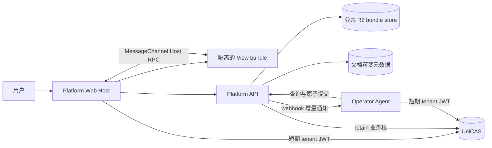

# UniDocs Platform、View 与 Operator API v0

状态：目标设计草案，2026-09-09。本文基于[人与 Agent 协同编辑文档的新范式](../agent-mediated-document-collaboration.md)，只定义新的系统边界与 API，不讨论现有系统兼容、迁移或代码复用。可由 TypeScript language server 检查的契约源位于 [`@unidocs/protocol-platform`](../../packages/protocol-platform/src/index.ts)。

## 1. 决策摘要

系统只保留两类可独立部署的服务：

1. **UniDocs Platform**：面向用户、View、管理员和 Agent 的唯一数据权威；
2. **Operator Agent**：理解具体文档类型并生成 pong 和完整新 snapshot。

View 不是第三类服务。每种文档类型提供一个静态 **View resource bundle**，由 Admin 上传并由 Platform 托管在公共 R2 bucket。浏览器在隔离 iframe 中运行 bundle，通过 Host RPC 使用 Platform 能力。



### 1.1 明确删除的边界

- 不存在独立 editor service；
- 不存在由文档类型服务维护的可变 document session；
- Platform 不向类型服务发送 query/apply/snapshot；
- View 不直接访问 CAS、R2、Operator 或 Platform HTTP API；它通过 MessageChannel 请求 Platform Web Host 代理 `CasBlobClient.openBlob/storeBlob`；
- Operator 注册不授予排他写入权，只决定 Platform 默认向哪里发送通知；
- 不再提供同步 `run/reset` 作为文档协作主协议。

### 1.2 Platform 的职责

- 用户、管理员、Agent 身份和文档权限；
- 文档身份、类型目录、版本 base forest、comment provenance、current pointer 和审计；
- snapshot 与附件的内容存储和引用保留；
- 向已认证的 Web Host 和 Agent 颁发短期 tenant CAS capability；
- ping/pong 双序列、累计确认水位和 open 状态；
- 不透明的类型化 location；
- Agent submission 的幂等记录、双重乐观锁和原子提交；
- operator webhook 的至少一次投递；
- View bundle 的上传、验证、R2 托管和当前绑定。

### 1.3 Operator Agent 的职责

- 按文档类型解释 snapshot 和 location；
- 维护文档级长期 Agent session 及自己的任务队列；
- 查询 current 内容、历史版本和 thread 上下文；
- 判断历史版本上的 ping 是否仍适用于 current；
- 协调冲突，生成 pong；
- 生成完整新 snapshot；
- 通过 Platform API 原子提交可选版本和一组 pong；
- 以最终一致方式编排跨文档修改。

### 1.4 View bundle 的职责

- 在浏览器中渲染 Platform 下发的 snapshot；
- 创建、解释和高亮本类型的 `DocumentLocation`；
- 展示 thread marker 和 pong result locations；
- 将圈选评论和轻编辑编译成 ping；
- 在本地提供类型专用查看工具和草稿体验。

View bundle 不创建正式版本。需要改变正式内容的用户操作最终都成为 ping，由 Agent 生成新 snapshot。

## 2. 通用线类型

以下 TypeScript 表示 JSON API 的线格式。二进制上传和读取接口在对应章节单独标注。

```ts
type TenantId = string;
type DocumentId = string;
type DocumentType = string;
/** 文档内单调递增的版本 record ID。 */
type VersionIdx = number;
type ThreadId = string;
type PingIdx = number;
type PongIdx = number;
type SubmissionId = string;
type ViewBundleId = string;
type ValidationId = string;
type Cursor = string;
type IsoDateTime = string;

type JsonPrimitive = string | number | boolean | null;
type JsonValue = JsonPrimitive | JsonValue[] | { [key: string]: JsonValue };

interface Page<T> {
  readonly items: readonly T[];
  readonly nextCursor: Cursor | null;
}

interface ApiError {
  readonly error: {
    readonly code: string;
    readonly message: string;
    readonly requestId: string;
    readonly details?: JsonValue;
  };
}

/** 与 @unicas/tenant-blob-client 的 CasBlobRef 线格式相同。 */
interface CasBlobRef {
  readonly blobHash: string;
  readonly size: number;
  readonly contentType: string;
}

interface DocumentLocation {
  /** 例如 unidocs.markdown.text-range/v1。 */
  readonly locationType: string;
  readonly payload: JsonValue;
}

interface MessageContent {
  readonly text: string | null;
  readonly richContent: CasBlobRef | null;
  readonly attachments: readonly CasBlobRef[];
}
```

所有文档版本 snapshot、ping/pong 富内容和附件都以 `CasBlobRef` 持久化。其语义与现行 `@unicas/tenant-blob-client` 完全相同：`hash` 是 blob root，`size` 是逻辑总字节数，`contentType` 描述完整逻辑 blob，而不是某个内部 chunk。调用方不能假定 root 是单个 CAS node；大 blob 可以是 blob-index tree。`text` 与 `richContent` 至少一个非空；附件不能替代正文。

## 3. 文档与协作资源

```ts
interface DocumentRecord {
  readonly documentId: DocumentId;
  readonly name: string;
  readonly documentType: DocumentType;
  readonly currentVersionIdx: VersionIdx | null;
  readonly createdAt: IsoDateTime;
}

interface VersionRecord {
  readonly versionIdx: VersionIdx;
  readonly parentVersionIdx: VersionIdx | null;
  readonly snapshot: SValue;
  readonly authorAgentId: string;
  readonly createdAt: IsoDateTime;
}

interface PingRecord {
  readonly pingIdx: PingIdx;
  readonly baseVersionIdx: VersionIdx;
  readonly content: MessageContent;
  readonly location: DocumentLocation | null;
  readonly authorId: string;
  readonly createdAt: IsoDateTime;
}

interface PongRecord {
  readonly pongIdx: PongIdx;
  readonly respondThroughPingIdx: PingIdx;
  readonly content: MessageContent;
  readonly resultLocations: readonly DocumentLocation[];
  readonly authorAgentId: string;
  readonly submissionId: SubmissionId;
  readonly createdAt: IsoDateTime;
}

interface ThreadRef {
  readonly threadId: ThreadId;
}

interface ThreadDetail {
  readonly threadId: ThreadId;
  readonly pings: readonly PingRecord[];
  readonly pongs: readonly PongRecord[];
}
```

`VersionIdx` 是 Platform 在版本提交成功时按 Document 分配的单调递增安全整数，同时表达版本 record 身份和出生顺序。`PingIdx` 和 `PongIdx` 分别由 Platform 在各 thread 的 ping/pong 序列中分配。所有整数 record 身份使用 `Idx`，字符串身份使用 `Id`，内容哈希使用 `Hash`。

snapshot 是逻辑文档值 `SValue`，其中的大型二进制内容以 `SBlob` 引用 UniCAS；它不是 snapshot CAS hash。相同 snapshot 仍可因 parent、provenance、作者和创建时间不同而形成不同版本。HTTP 使用 canonical SValue CBOR 编码，Platform 可将编码结果作为内部 CAS 业务根持久化，但该存储引用不进入 `VersionRecord` 公共模型。

`DocumentLocation` 只描述一个指定版本内部的位置，自身不重复携带 `versionIdx`。`PingRecord.location` 相对于该 ping 的 `baseVersionIdx`；`PongRecord.resultLocations` 相对于产生该 pong 的 submission 所创建的新版本。持久化层通过这些所属关系确定版本上下文。

`latestPing`、`pongWatermark` 和 `open` 都从两个消息序列计算，不作为独立 API 结构或持久状态。`GET /threads?open=true` 可以在服务端按相同规则过滤，但只返回 `ThreadRef`。每个 ping 都绑定一个已存在的确切版本；首版本产生前不能创建 thread 或追加 ping。

## 4. Admin WebUI 调整

Admin 继续只有“文档类型、管理员、审计”三个业务模块，不增加 editor service、bundle release 或 Operator runtime 管理模块。

### 4.1 文档类型列表

列表列调整为：

| 列 | 内容 |
| --- | --- |
| 文档类型 | manifest 中的名称和稳定 `documentType` |
| View bundle | 当前 bundle 短 ID 和 Host 协议 |
| Builtin operator | 已验证的 operator 名称；未配置时明确显示 |
| 主站状态 | enabled / disabled |
| 最近更新 | 类型配置最后更新时间 |

删除 Base URL、存储身份、editor endpoint 和 editor service 健康状态。搜索匹配类型、显示名称、bundle digest 和 operator host。

### 4.2 登记文档类型

登记流程保持在一个弹窗内：

1. 上传 `.zip` View bundle；
2. Platform 完成解包和 manifest 校验，展示发现的类型、能力、location types 与资源摘要；
3. 输入 builtin operator base URL 并执行协议与鉴权验证；
4. 选择是否启用；
5. 原子创建类型配置。

文档类型身份和显示信息来自 bundle manifest，不重复手填。允许把“只有 bundle、暂未配置 operator”的类型保存为 disabled；启用必须同时拥有通过验证的 bundle 和 builtin operator。

### 4.3 类型详情

详情包含两个 tab：

- **接入配置**：当前 bundle、上传新 bundle、operator URL 验证与更换、启用状态；
- **变更记录**：bundle 上传与绑定、operator 变更、启停和验证结果。

上传 bundle 不自动绑定。绑定新 bundle、更换 operator 和启停都通过同一个带 `If-Match` 的配置 PATCH 原子完成，防止管理员互相覆盖。

当前已打开的 View session 固定启动时的 `viewBundleId`。Admin 切换 bundle 只影响新 session，不热替换正在编辑 ping 草稿的 iframe。

### 4.4 Bundle 上传状态

UI 在一次上传请求中展示进度，完成后显示验证结果。失败上传不产生可绑定 bundle，也不改变类型配置。

Platform 至少校验：

- zip 路径穿越、符号链接、文件数量、单文件/总大小和压缩比；
- manifest schema、入口文件、资源摘要和 MIME；
- `documentType`、Host 协议和 location type 格式；
- 禁止远程脚本和可绕过 Platform 内容通道的默认网络权限；
- HTML、JS、CSS 和资源均可从 Platform 的 bundle origin 独立加载。

### 4.5 Operator 状态

Admin 只配置 base URL，不录入或回显密钥。Operator 服务身份和鉴权密钥由部署 secret 配置建立，验证结果显示：

- operator identity；
- 协议版本；
- 支持的 document types；
- webhook 验签是否通过；
- Operator 调用 Platform 的服务身份是否可用。

健康检查不是持续监控。最后验证成功不等于当前服务一定在线。

## 5. View bundle manifest 与托管

### 5.1 Manifest

zip 根目录必须包含 `unidocs-view.json`：

```ts
interface ViewBundleManifestV1 {
  readonly protocol: "unidocs-view-bundle/v1";
  readonly documentType: DocumentType;
  readonly displayName: string;
  readonly description: string;
  readonly entrypoint: string;
  readonly hostProtocol: "unidocs-view-host/v1";
  readonly snapshotContentTypes: readonly string[];
  readonly locationTypes: readonly string[];
}
```

`viewBundleId` 是 Platform 根据规范 manifest 和解包后文件路径、摘要计算出的内容身份。相同内容重复上传得到相同 ID；已有对象可直接复用。

### 5.2 R2 布局与分发

```text
view-bundles/{viewBundleId}/manifest.json
view-bundles/{viewBundleId}/assets/{normalizedPath}
```

ready bundle 的对象不可原地覆盖。资源通过独立 bundle origin 分发：

```text
GET https://views.example/.../{viewBundleId}/{path}
```

响应使用不可变缓存、`nosniff`、严格 CSP 和明确 MIME。R2 bucket 不公开，只有 Platform bundle ingress 可读取。MVP 不实现 bundle GC；旧的不可变 bundle 暂时保留。

bundle 存 R2 是当前实现边界；未来 UniCAS 支持 stack 公共内容后，可以只替换 bundle repository，不改变 manifest、Admin API 或 Host RPC。

## 6. Admin API

根路径：`/admin/api/v1`。继续使用 Admin session、CSRF、近期重新认证、`Idempotency-Key`、`If-Match` 和审计。普通 JSON mutation 的大小限制不应用于 bundle 二进制流。

### 6.1 Admin 类型

```ts
interface ViewBundleRecord {
  readonly viewBundleId: ViewBundleId;
  readonly manifest: ViewBundleManifestV1;
}

interface OperatorDescriptor {
  readonly protocol: "unidocs-operator/v1";
  readonly operatorId: string;
  readonly displayName: string;
  readonly supportedDocumentTypes: readonly DocumentType[];
}

interface OperatorBinding {
  readonly baseUrl: string;
  readonly operatorId: string;
  readonly displayName: string;
}

interface DocumentTypeRegistration {
  readonly documentType: DocumentType;
  readonly enabled: boolean;
  readonly viewBundle: ViewBundleRecord;
  readonly builtinOperator: OperatorBinding | null;
  readonly etag: string;
}
```

### 6.2 Bundle 上传

```text
POST /view-bundles
GET  /view-bundles/{viewBundleId}
```

```ts
interface UploadViewBundleRequest {
  readonly contentType: "application/zip";
  readonly body: ReadableStream<Uint8Array>;
}

type UploadViewBundleResponse = { readonly data: ViewBundleRecord };
type GetViewBundleResponse = { readonly data: ViewBundleRecord };
```

Platform 有界地流式读取 zip、验证并写入内容寻址 R2 路径。成功返回 `201`；相同内容重复上传返回同一 `viewBundleId`。失败时返回同步错误且不产生可绑定 bundle。请求不暴露 R2 bucket 凭据。

### 6.3 Operator 验证

```text
POST /operator-validations
```

```ts
interface CreateOperatorValidationRequest {
  readonly baseUrl: string;
  readonly expectedDocumentType: DocumentType;
  readonly expectedConfigEtag: string | null;
}

interface OperatorValidation {
  readonly validationId: ValidationId;
  readonly baseUrl: string;
  readonly descriptor: OperatorDescriptor;
  readonly expiresAt: IsoDateTime;
}

type CreateOperatorValidationResponse = { readonly data: OperatorValidation };
```

验证在同一请求内读取：

```text
GET {baseUrl}/.well-known/unidocs-operator
```

并向不含用户数据的 probe 路径发送签名 webhook。Platform 不跟随重定向，不允许任意内网目标。成功响应返回短期 `validationId`；失败直接返回错误，不维护验证任务状态机。

### 6.4 文档类型目录

```text
GET   /document-types?q=&enabled=&cursor=&limit=
GET   /document-types/{documentType}
POST  /document-types
PATCH /document-types/{documentType}
```

```ts
interface CreateDocumentTypeRequest {
  readonly viewBundleId: ViewBundleId;
  readonly builtinOperator: {
    readonly baseUrl: string;
    readonly validationId: ValidationId;
  } | null;
  readonly enabled: boolean;
}

interface UpdateDocumentTypeRequest {
  readonly viewBundleId?: ViewBundleId;
  readonly builtinOperator?: {
    readonly baseUrl: string;
    readonly validationId: ValidationId;
  } | null;
  readonly enabled?: boolean;
  readonly reason: string;
}

type GetDocumentTypeResponse = { readonly data: DocumentTypeRegistration };
type ListDocumentTypesResponse = Page<DocumentTypeRegistration>;
type CreateDocumentTypeResponse = { readonly data: DocumentTypeRegistration };
type UpdateDocumentTypeResponse = { readonly data: DocumentTypeRegistration };
```

创建时从 ready bundle manifest 取得 `documentType`、名称、描述和能力。更新 bundle 时，新 manifest 的 `documentType` 必须与现有类型相同。启用要求 bundle 为 ready、Operator 验证仍有效且支持该类型。

管理员、session、audit 和 change receipt API 保持通用形状。审计新增：

```ts
type DocumentTypeAuditAction =
  | "view_bundle.uploaded"
  | "view_bundle.validation_failed"
  | "document_type.registered"
  | "document_type.view_bundle_changed"
  | "document_type.operator_changed"
  | "document_type.enabled"
  | "document_type.disabled"
  | "operator.validation_passed"
  | "operator.validation_failed";
```

## 7. 面向 Platform Web Host 的 HTTP API

根路径：`/api/v1/tenants/{tenantId}`。浏览器顶层 Host 使用用户 session 调用这些 API；隔离 View iframe 不直接调用。

### 7.1 类型目录与文档

```text
GET  /document-types
GET  /documents?documentType=&cursor=&limit=
POST /documents
GET  /documents/{documentId}
GET  /documents/{documentId}/versions?cursor=&limit=
GET  /documents/{documentId}/versions/{versionIdx}
POST /documents/{documentId}/current-version
GET  /documents/{documentId}/audit?cursor=&limit=
```

```ts
interface PublicDocumentType {
  readonly documentType: DocumentType;
  readonly displayName: string;
  readonly viewBundleId: ViewBundleId;
}

interface CreateDocumentRequest {
  readonly documentType: DocumentType;
  readonly name: string;
}

interface MoveCurrentVersionRequest {
  readonly observedCurrentVersionIdx: VersionIdx | null;
  readonly targetVersionIdx: VersionIdx;
  readonly reason: string;
}

type ListPublicDocumentTypesResponse = Page<PublicDocumentType>;
type ListDocumentsResponse = Page<DocumentRecord>;
type ListVersionsResponse = Page<VersionRecord>;
```

单资源成功响应直接返回对应 record，不再包装为 `{ data }` 或 `{ document }`：创建/读取文档和移动 current 返回 `DocumentRecord`，读取版本返回 `VersionRecord`。

`viewEntrypointUrl` 不作为公共类型字段；Platform 根据 `viewBundleId` 读取已验证 manifest，并由固定 bundle origin、bundle ID 和 `entrypoint` 构造入口 URL。

创建文档只原子地产生名称、稳定文档身份和 `currentVersionIdx = null` 的记录，不创建 thread 或 ping。Platform 随即向 builtin operator 投递 `document.created` 事件；Agent 以 `observedCurrentVersionIdx = null`、`newSnapshot` 和空 `threadUpdates` 提交初始 snapshot 后，文档即可打开。用户确有初始化要求或附件时，在创建后通过普通 thread API 添加，不把 instructions 强制耦合进文档创建。

### 7.2 Thread 与 ping

```text
GET  /documents/{documentId}/threads?open=&versionIdx=&cursor=&limit=
GET  /documents/{documentId}/threads/{threadId}
POST /documents/{documentId}/threads
POST /documents/{documentId}/threads/{threadId}/pings
```

```ts
interface CreateThreadRequest {
  readonly baseVersionIdx: VersionIdx;
  readonly content: MessageContent;
  readonly location: DocumentLocation | null;
}

interface AppendPingRequest {
  readonly baseVersionIdx: VersionIdx;
  readonly content: MessageContent;
  readonly location: DocumentLocation | null;
}

type ListThreadsResponse = Page<ThreadRef>;
```

创建/读取 thread 直接返回 `ThreadDetail`，追加 ping 直接返回 `PingRecord`。

Platform 校验 `baseVersionIdx` 指向当前文档中的版本。location 始终相对于同一请求的 `baseVersionIdx`。Platform 在 thread 内分配下一个 `PingIdx`；创建 thread 和追加 ping 使用 HTTP `Idempotency-Key` 保证重试幂等。

### 7.3 Tenant CAS capability

Platform 不代理 CAS node 请求，只颁发短期 capability：

```text
POST /cas-capabilities
```

```ts
interface CasCapabilityGrant {
  readonly baseUrl: string;
  readonly stackId: string;
  readonly tenantId: TenantId;
  readonly accessToken: string;
  readonly expiresAt: number;
  readonly permissions: readonly ["cas:read", "cas:write"];
}

```

成功响应直接返回 `CasCapabilityGrant`。

Platform Web Host 和 Agent 分别使用返回的连接信息与 JWT 构造 `@unicas/tenant-client`，再由 `@unicas/tenant-blob-client` 直接读写 UniCAS。`storeBlob` 在调用方完成分块、blob-index 构造和所有组成 node 的 lease；`openBlob` 解析 blob root 并提供顺序或随机范围读取。Platform 不维护重复的 node read/metadata/lease facade。

capability 只包含 tenant 级 `cas:read` 和 `cas:write`，不包含 `cas:manage` 或 `refDomain`，有效期应短且不能作为 Platform API 凭据。JWT 只保存在调用方内存中，不能写入 localStorage、URL、日志或 View iframe；调用方在到期前向 Platform 重新获取。它允许持有者读取该 tenant 内任何已知 hash，因此 MVP 明确以 tenant 作为内容保密边界；Platform 的文档权限只控制目录、版本、thread 和业务 mutation，不提供 tenant 内 CAS 内容隔离。

隔离 View iframe 不获得该 JWT，而是继续通过 Host RPC 请求顶层 Platform Web Host 代为执行 `openBlob/storeBlob`。CAS 服务必须为受信任的 Platform Web origins 配置 tenant 数据路由 CORS，并允许 `Authorization`、`Range`、内容上传及 lease 所需 headers；不能使用无约束的 credentialed wildcard origin。

未被 ping、pong 或 version 保留的 blob 只有短 lease。业务 mutation 成功时，仍只有 Platform 后端能以带 `refDomain` 的独立 capability 调用 `CasBlobClient.retain`。前端和 Agent 不能声明业务根。MVP 不提供删除或归档，因此暂不调用 `release`；业务 mutation 失败时不 retain，组成 blob 的节点在 lease 到期后可被 GC。

## 8. View Host RPC

### 8.1 信任边界

Platform 顶层 Host 从类型目录取得固定 `viewBundleId` 和入口 URL，在 sandboxed iframe 中加载。双方通过精确 origin、`window.source`、一次性 nonce 和 `MessageChannel` 握手。连接建立后只使用传入的 port。

View 不获得：

- 用户 cookie 或 JWT；
- Agent/Operator 凭据；
- CAS 或 R2 凭据；
- 修改 CAS root refs、执行 GC 或枚举 tenant 节点的能力；
- 任意 Platform fetch 能力；
- 任意外部网络访问能力。

### 8.2 RPC 外壳

```ts
type RpcId = string;

type HostRpcRequest<TMethod extends string, TParams> = {
  readonly kind: "request";
  readonly id: RpcId;
  readonly method: TMethod;
  readonly contextId: string;
  readonly params: TParams;
};

type HostRpcResponse<TResult> = {
  readonly kind: "response";
  readonly id: RpcId;
  readonly result: TResult;
} | {
  readonly kind: "response";
  readonly id: RpcId;
  readonly error: { readonly code: string; readonly message: string };
};

interface ViewContext {
  readonly contextId: string;
  readonly document: DocumentRecord;
  readonly viewVersion: VersionRecord | null;
  readonly viewBundleId: ViewBundleId;
  readonly readonly: boolean;
}
```

### 8.3 Host 调用 View

```ts
interface ViewInitializeRequest {
  readonly protocol: "unidocs-view-host/v1";
  readonly context: ViewContext;
}

interface ViewInitializeResponse {
  readonly acceptedProtocol: "unidocs-view-host/v1";
}

interface ViewLoadSnapshotRequest {
  readonly context: ViewContext;
  readonly snapshot: SValue | null;
}

interface ViewLoadSnapshotResponse {
  readonly renderedVersionIdx: VersionIdx | null;
}

interface ViewSetMarkersRequest {
  readonly revision: number;
  readonly markers: readonly {
    readonly threadId: ThreadId;
    readonly pingIdx: PingIdx;
    readonly open: boolean;
    readonly location: DocumentLocation;
  }[];
}

interface ViewFocusLocationResponse {
  readonly located: boolean;
  readonly reason: "located" | "unsupported_type" | "unresolvable";
}
```

方法：

```text
view.initialize
view.loadSnapshot
view.setMarkers
view.focusLocation
view.dispose
```

### 8.4 View 调用 Host

```ts
interface HostReadBlobRequest {
  readonly blob: CasBlobRef;
  readonly range: { readonly offset: number; readonly length?: number } | null;
}

interface HostReadBlobResponse {
  readonly bytes: ArrayBuffer;
  readonly contentType: string;
  readonly complete: boolean;
}

interface HostListThreadsRequest {
  readonly open: boolean | null;
  readonly versionIdx: VersionIdx | null;
  readonly cursor: Cursor | null;
  readonly limit: number;
}

interface HostAppendPingRequest extends AppendPingRequest {
  readonly threadId: ThreadId;
}

interface HostStoreBlobRequest {
  readonly purpose: "ping_attachment" | "ping_rich_content" | "view_draft";
  readonly contentType: string;
  readonly bytes: ArrayBuffer;
}

```

`view.focusLocation` 直接以 `DocumentLocation` 作为 request；`host.createThread` 直接使用 `CreateThreadRequest`；`host.storeBlob` 直接返回 `CasBlobRef`。

方法：

```text
host.readBlob
host.listThreads
host.getThread
host.createThread
host.appendPing
host.storeBlob
```

Host 以当前 `contextId`、文档权限和 `viewVersion` 限制每次 View RPC。Host 使用短期 tenant capability 直连 UniCAS，并通过 `CasBlobClient.openBlob`/`storeBlob` 为 iframe 提供逻辑 blob 操作；View 不处理 JWT、chunk node 或 blob-index。Host 仍对逻辑 blob 大小、content type 和总草稿配额设限。大 blob 按 bounded range 分块传给 View，二进制 `ArrayBuffer` 通过 MessagePort transfer，不做 JSON/base64 复制。

Host 与 View 之间的 location 一律相对于当前 `viewVersion`。View 提交 location 时，Host 不解释 payload，但检查 `locationType` 已由 bundle manifest 声明、当前 context 已加载版本，并限制 JSON 深度和字节大小。

## 9. Agent API

Agent 通过 Platform OAuth access token 调用与用户相同的数据权威。权限由 token scope、tenant、文档 ACL 和服务策略共同决定，不由 operator 注册决定。

建议 scopes：

```ts
type AgentScope =
  | "documents:read"
  | "cas:read"
  | "cas:lease"
  | "comments:read"
  | "comments:pong"
  | "versions:submit";
```

### 9.1 查询

根路径同样为 `/api/v1/tenants/{tenantId}`：

```text
GET /documents/{documentId}
GET /documents/{documentId}/versions?cursor=&limit=
GET /documents/{documentId}/versions/{versionIdx}
GET /documents/{documentId}/threads?open=&cursor=&limit=
GET /documents/{documentId}/threads/{threadId}
POST /cas-capabilities
```

Agent 先读取 `DocumentRecord.currentVersionIdx`，再按需查询确切版本和 open threads。Platform 不维护第二份聚合工作索引；Agent 根据数量选择逐 thread、分页或 sub-agent 策略。

Agent 从 Platform 取得短期 tenant capability，用服务端 `CasBlobClient.storeBlob` 直连 UniCAS，上传并 lease 候选 snapshot 和 pong 资源。Agent 没有 `retain/release` 权限；只有 submission committed 后，Platform 后端才调用 `retain`。

### 9.2 原子 submission

```text
POST /documents/{documentId}/submissions
GET  /documents/{documentId}/submissions/{submissionId}
```

```ts
interface AgentSubmissionRequest {
  /** 客户端生成，文档内幂等。 */
  readonly submissionId: SubmissionId;
  /** 纯 pong 时可省略；创建版本时必填，包括 null 初始状态。 */
  readonly observedCurrentVersionIdx?: VersionIdx | null;
  readonly newSnapshot?: SValue;
  readonly threadUpdates: readonly {
    readonly threadId: ThreadId;
    /** 当前已确认到的 ping；尚无 pong 时为 null。 */
    readonly observedAcknowledgedPingIdx: PingIdx | null;
    readonly respondThroughPingIdx: PingIdx;
    readonly content: MessageContent;
    readonly resultLocations: readonly DocumentLocation[];
  }[];
}

interface SubmissionConflict {
  readonly currentVersionIdx: VersionIdx | null;
  readonly threads: readonly {
    readonly threadId: ThreadId;
    readonly acknowledgedPingIdx: PingIdx | null;
    readonly latestPingIdx: PingIdx;
  }[];
}

type SubmissionReceipt = {
  readonly submissionId: SubmissionId;
  readonly state: "committed";
  readonly version: VersionRecord | null;
  readonly pongs: readonly PongRecord[];
  readonly committedAt: IsoDateTime;
} | {
  readonly submissionId: SubmissionId;
  readonly state: "rejected";
  readonly reason: "version_conflict" | "pong_watermark_conflict";
  readonly conflict: SubmissionConflict;
  readonly rejectedAt: IsoDateTime;
};

```

创建和查询 submission 都直接返回 `SubmissionReceipt`。

提交规则：

1. 有 `newSnapshot` 时必须显式携带 `observedCurrentVersionIdx`，并与提交时 current 完全相等；
2. 每个 update 的 `observedAcknowledgedPingIdx` 与 thread 当前水位完全相等；
3. `respondThroughPingIdx` 必须在该水位之后且不超过 thread 最新 ping；
4. 一个 submission 内同一 thread 最多出现一次；
5. 非空 `resultLocations` 必须同时携带 `newSnapshot`，并且全部位置都相对于本次创建的新版本；纯 pong 的 `resultLocations` 必须为空；
6. Platform 只在整个 submission 成功时分配下一个 `VersionIdx` 和各 thread 的下一个 `PongIdx`；幂等重试由 `submissionId` 返回同一 receipt；
7. 纯 pong 省略 `newSnapshot` 和 `observedCurrentVersionIdx`；
8. 任一检查失败，版本、全部 pong、current 和内容持久引用都不变化；
9. 成功时，版本、pong、thread 水位、provenance 和 current 在同一业务事务中生效；
10. 网络超时是客户端的 unknown 状态，Agent 必须以同一 `submissionId` 查询或重试，不能生成新 ID 猜测结果。

候选 blob 必须在提交前完成 `storeBlob` 并处于 lease 中。Platform 同步返回并持久化 `committed/rejected` receipt；只有 committed receipt 能作为成功事实。网络断开导致客户端结果未知时，以同一 `submissionId` 查询或重试。

## 10. Operator webhook

### 10.1 Base URL 与文档路由

Admin 保存规范化 builtin operator base URL。Platform 在其下追加：

```text
POST {baseUrl}/tenants/{tenantId}/documents/{documentId}
```

文档级 override 使用相同协议，只改变通知目标。切换通知目标不撤销其他已获授权 Agent 的 API 写权限。

### 10.2 事件类型

```ts
type OperatorEventReason =
  | "document.created"
  | "ping.appended"
  | "current_version.moved";

interface OperatorWebhookRequest {
  readonly protocol: "unidocs-operator-webhook/v1";
  readonly eventId: string;
  readonly reason: OperatorEventReason;
  readonly tenantId: TenantId;
  readonly documentId: DocumentId;
  readonly documentType: DocumentType;
  readonly currentVersionIdx: VersionIdx | null;
  /** 增量提示，不是要求本轮全部处理的任务边界。 */
  readonly newPings: readonly {
    readonly threadId: ThreadId;
    readonly pingIdx: PingIdx;
    readonly acknowledgedPingIdx: PingIdx | null;
  }[];
  readonly occurredAt: IsoDateTime;
}

interface OperatorWebhookResponse {
  readonly accepted: true;
  readonly eventId: string;
}
```

`2xx` 只表示 Operator 已接收通知，不表示对应工作已完成。Platform 至少一次投递；Operator 按 `eventId` 去重，按自己的队列处理。事件允许重复、延迟和乱序，Agent 在工作前必须查询 Platform 权威状态。

`document.created` 事件的 `currentVersionIdx` 为 `null`、`newPings` 为空。它通知 Operator 按文档类型和名称生成空白初始 snapshot，不隐式创建协作消息。

### 10.3 鉴权

Platform 对 webhook 使用每个 Operator 独立的 HMAC key，签名至少覆盖 method、规范 path、body digest、issued/expires、nonce、platform identity、environment 和 operator identity。Operator 在执行前共享去重 nonce。

Operator 调用 Platform 使用自己的 OAuth 服务身份，不复用 webhook HMAC，也不接收用户 JWT。Admin UI 不处理两类 secret，只显示已配置和验证状态。

## 11. 错误、幂等和权限

### 12.1 稳定错误码

```ts
type PlatformErrorCode =
  | "invalid_request"
  | "unauthorized"
  | "forbidden"
  | "not_found"
  | "document_type_disabled"
  | "unsupported_content_type"
  | "unsupported_location_type"
  | "upload_expired"
  | "bundle_invalid"
  | "operator_validation_required"
  | "revision_conflict"
  | "version_conflict"
  | "pong_watermark_conflict"
  | "idempotency_conflict"
  | "content_unavailable"
  | "limit_exceeded"
  | "unavailable";
```

乐观锁冲突使用 `409` 并返回当前 version/thread 水位；Admin `If-Match` 失败使用 `412`；缺少 `If-Match` 使用 `428`。未授权不得通过 404/403 差异泄露其他 tenant 的身份。

### 12.2 幂等

- Admin mutation 使用 `Idempotency-Key`，同 key 不同 body 返回冲突；
- thread/ping 创建使用 `Idempotency-Key`；
- submission 使用 `submissionId`；
- webhook 使用 `eventId`；
- 二进制 complete 操作绑定 upload 身份和接收 digest；
- 读取和状态查询不得产生版本、pong 或 root refs 副作用。

### 12.3 权限分离

- Admin 权限不能读取用户文档内容；
- bundle 上传权限不授予文档访问；
- View 只能通过当前 Host context 使用用户已获授权的窄能力；
- Agent 权限来自 Platform token，不来自被配置为 builtin operator；
- webhook 能力只允许接收和验证 Platform 事件，不能作为 Platform API bearer credential；
- 内容 hash 不是独立访问凭据；读取需要有效 tenant CAS capability。该 capability 在 MVP 中不进一步检查文档可达性。

## 12. API 总览

### 13.1 Admin

| 方法 | 路径 | 用途 |
| --- | --- | --- |
| POST | `/admin/api/v1/view-bundles` | 上传并验证不可变 bundle |
| POST | `/admin/api/v1/operator-validations` | 验证 operator base URL |
| GET | `/admin/api/v1/operator-validations/{id}` | 查询验证状态 |
| GET/POST | `/admin/api/v1/document-types` | 列表/登记类型 |
| GET/PATCH | `/admin/api/v1/document-types/{type}` | 详情/原子更新 |

### 13.2 Viewer Host 与用户

| 方法 | 路径 | 用途 |
| --- | --- | --- |
| GET | `/api/v1/tenants/{tenantId}/document-types` | 动态类型目录 |
| POST/GET | `/api/v1/tenants/{tenantId}/documents` | 创建/列出文档 |
| GET | `/api/v1/tenants/{tenantId}/documents/{id}` | 文档与 current/latest |
| GET | `/api/v1/tenants/{tenantId}/documents/{id}/versions` | 版本浏览 |
| POST | `/api/v1/tenants/{tenantId}/documents/{id}/current-version` | 审计式移动 current |
| GET/POST | `/api/v1/tenants/{tenantId}/documents/{id}/threads` | 列出/创建 thread |
| GET | `/api/v1/tenants/{tenantId}/documents/{id}/threads/{threadId}` | thread 双序列 |
| POST | `/api/v1/tenants/{tenantId}/documents/{id}/threads/{threadId}/pings` | 追加 ping |
| POST | `/api/v1/tenants/{tenantId}/cas-capabilities` | 颁发前端直连 UniCAS 的短期 tenant JWT |

### 13.3 Agent

| 方法 | 路径 | 用途 |
| --- | --- | --- |
| GET | `/api/v1/tenants/{tenantId}/documents/{id}/threads...` | 查询完整上下文 |
| POST | `/api/v1/tenants/{tenantId}/documents/{id}/submissions` | 原子版本/pong 提交 |
| GET | `/api/v1/tenants/{tenantId}/documents/{id}/submissions/{id}` | 核实提交结果 |
| POST | `/api/v1/tenants/{tenantId}/cas-capabilities` | 颁发 Agent 直连 UniCAS 的短期 tenant JWT |
| POST | `{operatorBaseUrl}/tenants/{tenantId}/documents/{id}` | Platform webhook 通知 |

## 13. 实施顺序建议

1. 建立新平台核心类型、初始 ping、version/current 和 thread ping/pong 存储；
2. 实现 submission receipt、内容上传和双重乐观锁；
3. 实现 bundle R2 repository、manifest validator 和隔离静态 ingress；
4. 替换 Admin 类型目录为 bundle + builtin operator 模型；
5. 实现最小 View Host RPC：load/read/create thread/append ping；
6. 实现 Operator discovery、webhook 和 Agent OAuth API；
7. 打通首个文档类型的 document.created → webhook → 首版本 → View 渲染闭环；
8. 增加 result locations 和 current pointer 审计界面。

每一步都以 Platform 为唯一持久权威。不得用临时 editor service 重新引入第二份正式状态，也不得让 View 绕过 Host 直接访问数据面。

## 14. 接口调整清单

下表描述目标替换关系，不承诺旧接口兼容：

| 旧抽象 | 调整后的目标 |
| --- | --- |
| Admin 登记单一 doctype Base URL | Admin 上传 View bundle，并配置 builtin operator base URL |
| `/.well-known/unidocs-doctype` 发现 editor、存储身份和能力 | bundle manifest 提供 View 能力；`/.well-known/unidocs-operator` 只发现 Operator 身份和协议 |
| `/url-validations` | `/operator-validations`；bundle 使用上传后的本地验证流程 |
| editor service 的 `init/import/query/apply/snapshot/export/summary` | 删除；View 本地渲染，用户修改成为 ping，Agent 直接生成完整 snapshot |
| 文档服务维护 session、operation history 和 snapshot | Platform 直接维护 Document、Version、current pointer 和 `CasBlobRef` |
| Gateway 将 `docId` 路由到 doctype `sessionId` | Platform 以 `tenantId + documentId` 直接授权和定位权威数据 |
| 用户或 View 提交 operation | Host 提交 `CreateThreadRequest` / `AppendPingRequest` |
| 同步 Operator `run/reset` | Platform 至少一次 webhook + Agent 查询 API + 原子 submission API |
| 人工 resolved 标志 | 由 ping 最新序号和 pong 累计水位派生 open 状态 |
| 线性 head 与按新旧比较 | current pointer 等值锁 + 每个 thread 的 pong 水位等值锁 |
| editor 页面直接获得服务/数据凭据 | 固定 bundle iframe 只获得 MessageChannel Host RPC |
| 外部 editor URL 在线回源 | Platform 公共 R2 托管不可变 bundle，独立 bundle origin 分发 |

Admin 现有管理员名单、登录、CSRF、审计、幂等键和 `If-Match` 并发控制仍属于 Platform 通用控制面，不因文档类型模型改变而删除。
