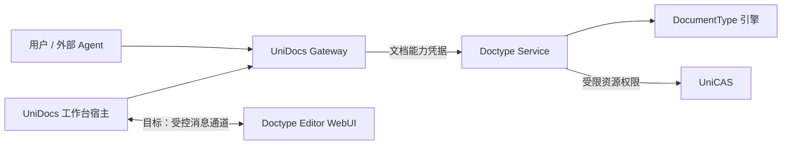

# 将你的文档类型接入 UniDocs

面向文档类型开发者的接入指南 · 2026-09-08

> 架构方向已更新：本文初稿仍描述旧的 doctype 持久服务和前端分发模式，不是下一代接入规范。后续实施以 [Platform 与 Markdown 新协议接入计划](design/platform-markdown-integration-plan.md) 为准：platform 负责持久化，editor 只计算，operator 独立，前端包由平台托管；注册分别配置 editor URL、资源包和可选 operator URL，服务调用采用 HMAC，不转发用户登录 JWT。本指南随每轮 MVP 已验证接口增量更新，不等待完整协议冻结；类型草案见 [protocol-doctype](../packages/protocol-doctype/README.md)。

## 你将交付什么

UniDocs 为不同类型的数字作品提供统一的身份、访问入口、目录和创作工作台。接入一种文档类型，是让平台能够创建、读取和修改这种作品，并让用户在工作台中使用它的专用编辑器。

你交付的是**一个独立部署的 doctype 微服务，以一个 Base URL 对外提供文档 API、类型描述和 editor WebUI**。发布节奏、实现版本、存储兼容和编辑器升级由你的微服务负责；UniDocs 运营后台不是你的发布系统。

目前接入对象仅限我们运营的一方服务，不开放用户上传插件或公开发布第三方服务。

> 当前状态：后台已能验证并保存批准地址的类型配置，主站尚未动态消费该目录。通用嵌入 editor 协议已有草案，尚未接通。本文明确区分可执行步骤与目标契约，不能把注册成功当成编辑器已经上线。

## 1. 先理解三个边界

| 参与方 | 负责 | 不负责 |
| --- | --- | --- |
| 内容引擎 DocumentType | 文档状态、查询、操作计算、导入导出 | 用户登录、全站目录、版本提交事务、HTTP 鉴权 |
| Doctype service/runtime | 执行引擎、持久版本、资源引用、服务鉴权、结果恢复 | 用户 Google 登录、选择用户所属 tenant、公开 docId 目录 |
| Editor WebUI | 类型专属预览、交互、草稿、产生操作候选 | 保管用户 JWT、绕过宿主直接保存、决定自己拥有的权限 |
| UniDocs Gateway/宿主 | 用户鉴权、作品目录、路由、工作台、授权读写协调 | 理解每种类型的内部结构、替微服务发布版本 |

推荐复用现有运行时和云适配器。实现 DocumentType 不等于要重新实现一个文档数据库；自行实现 HTTP service 则必须承担同一协议的鉴权、并发、持久化和失败恢复责任。



不要把“服务端 Editor Durable Object”与“浏览器 editor WebUI”混淆：前者是存储/执行适配器，后者才是用户看到的编辑器。

## 2. 接入进度怎么判断

| 层次 | 当前情况 | 你的交付判据 |
| --- | --- | --- |
| 引擎与文档 API | 已有 Markdown、PSD、DOCX 实现与运行时 | 创建、查询、修改、导入导出通过真实服务测试 |
| 一个 Base URL 的服务描述 | Markdown 已提供描述、health 和 /api/ 别名 | 描述反映真实能力，地址与身份校验通过 |
| 运营后台登记 | 已上线，首版只批准固定 Markdown binding | 登记、读取、修改目标配置、审计闭环通过 |
| 主站消费注册目录 | 尚未接通 | 后续验证无需重新发布主站即可发现并使用新类型 |
| 通用 iframe editor | 协议草案，尚未接通 | 后续验证握手、确切版本加载、草稿和提交协作 |
| 统一 describe/thumbnail 查询 | 讨论中，未形成发布契约 | 当前不要自行占用平台保留查询名称 |
| 持久提交 receipt | Cloudflare Markdown 默认关闭的实验实现 | 不能对外宣称跨云可靠保存已完成 |

主站已有内置 Markdown 编辑草稿和 PSD 预览，不意味着对应微服务已经提供独立 editor。当前 Markdown 描述中的 editorProtocol 为 null，两个嵌入展示能力均为 false。

## 3. 第一步：实现内容引擎

源码契约见 [DocumentType 与 DocumentTypeContext](../packages/protocol/src/types.ts)。先定义三个类型：

- TDoc：持久保存的文档结构。
- TQuery：只读查询输入，例如读取正文、查找节点。
- TOp：修改操作，例如替换正文、移动图层。

通过 DocumentTypeFactory(context) 返回 init、query、apply、formats、defaultFormat 和 contentType。这些泛型可达的字段必须能表示为 SValue，不能直接放 DOM、函数、循环引用或任意运行时对象。

**实现要求：**

- init 创建合法空文档；不要顺便创建用户、分配公开作品 ID 或写全站目录。
- query 不改变文档状态。返回值遵循 SValue；二进制直接结果是否可表示，必须遵循实际类型与 wire codec，不凭 JSON 自动转换猜测。
- apply 按顺序计算一批操作的新状态。校验失败不能留下半批修改；不要修改输入对象造成失败后旧状态已变。
- 重放相同状态和操作应产生相同结果。不要在 apply 中发网络请求、调用模型、读取当前时间或产生随机 ID；这些值应在操作创建阶段固定。
- 引擎 apply 的计算原子性不等于存储事务。baseVersion 检查、持久版本和提交结果由 service/runtime 负责。
- formats 的 load/save 实现外部文件与内部文档的转换；defaultFormat 必须指向存在的格式，声明实际 MIME 和扩展名。导入不支持的内容要明确失败。

从 [Markdown 引擎包](../packages/doctype-markdown/package.json) 和 [Markdown Worker](../packages/cloudflare-markdown/src/worker.ts) 起步，比复制整个 Gateway 更合适。Cloudflare 与 Azure 适配不要渗入文档格式本身的实现。

### 二进制与大资源

文档内使用 SBlob 引用图片、字体等资源。通过 context.makeSBlob 创建，通过 context.openSBlob 得到可复用的读取句柄；优先 read(range) 流式读取或显式有界 readBytes，不默认把整个大文件物化。

SBlob 是有类型的资源引用，不是随意写入的一段 URL。使用官方 SValue codec 保留引用身份及引用集合，不用普通 JSON 代替二进制/引用传输。大文件的内存上限、像素上限与格式解码成本要单独验收。

需要模型或外部 IO 的可选 Agent 工具可放在 DocumentAgent/effect 阶段；effect 返回携带资源引用的普通操作，持久提交仍由内核执行。不要求接入类型必须配备内置 Agent runner。

## 4. 第二步：接入文档服务运行时

先跑通已有服务协议，再加发现入口。完整方法、错误和权限表见 [Doc Service HTTP Protocol](doc-service-http-protocol.md)；机器契约以 protocol-doc/protocol-gateway 为准。

### 不要混用两种作品 ID

| 标识 | 含义 |
| --- | --- |
| tenantId | 权限和资源隔离边界 |
| docType | 类型稳定 ID，例如 markdown |
| docId | 用户使用的公开作品 ID，由 Gateway 管理 |
| sessionId | Gateway 分配的服务内部不透明 ID，不向客户端暴露用于自由路由 |
| serviceId | 作品绑定的稳定服务身份，不是域名或发布版本 |
| storageIdentity | 注册校验使用的存储身份标签；本身不是权限或数据可用性证明 |

用户与外部 Agent 调用 Gateway `/tenants/{tenantId}/docs/{docType}/{docId}/...`。Gateway 解析目录后调用服务 `/tenants/{tenantId}/sessions/{sessionId}/...`。服务不能自己根据用户 email 推导 tenant，不能把 public docId 当 sessionId 使用。

当前提供 `/api/` 别名的 Markdown 服务中，调用示例为：

```text
POST <Base URL>api/tenants/{tenantId}/sessions/{sessionId}/query
POST <Base URL>api/tenants/{tenantId}/sessions/{sessionId}/apply
```

这是 Gateway 到 service 的内部访问边界，不是给浏览器直接带用户 JWT 调用的接口。query/apply 只是代表性操作，create/status/ir/export/history/rollback/clone 等实现范围和权限必须对照完整协议。

### 鉴权与隔离

复用服务鉴权中间件。Gateway 不把用户 Authorization/cookie 原样转给服务，而是签发受 tenant、session、操作和有效期限制的 Doc capability，并按操作委托必要 CAS 权限。

服务必须验证 issuer、audience、签名、subject、有效期和精确权限范围。没有凭据、跨 tenant/session、多余或不完整的委托权限均应按协议拒绝。内部 /_internal/ 路径不是公网快捷入口；资源 hash 也不是读取权限。

### 提交与异常

客户端修改携带 baseVersion；服务不能悄悄用最新 head 替代旧基准。409 表示冲突时保留用户草稿，不自动覆盖。

网络超时不代表未提交，看到版本增加也不能证明本次操作提交成功。当前普通 apply 的可选 opId 不保证持久幂等；不要靠换 opId 重试猜结果。实验 receipt-v1 的提交、核实与恢复见 [第 09 轮](design/iteration-09.md)，未协商支持时不能向旧后端盲发实验字段。

HTTP 输入也是协议的一部分。消费收到的正文，即使该合法入口不使用其内容，也要按现有适配策略安全处理，避免残留请求影响后续连接。我们曾在空白创建 `{}` 时漏消费正文，导致下一次 apply 在本地 workerd 链路断连，见 [第 13 轮](design/iteration-13.md)。不要通过无限缓冲解决流处理问题。

## 5. 第三步：以一个 Base URL 提供接入描述

Base URL 是目录，不只是域名。例如 `https://types.example.com/markdown/`。

| 相对路径 | 责任 |
| --- | --- |
| `./.well-known/unidocs-doctype` | 类型描述与真实能力；目前 GET/HEAD，JSON |
| `./api/` | 服务文档 API 根路径，继续严格鉴权 |
| `./editor/` | 微服务自己的浏览器编辑器入口 |
| `./health` | 明确说明检查范围的健康接口 |

用标准 URL 解析器解析相对路径，保留 Base URL 中的目录前缀。不要以 `/api/` 替代 `./api/`，也不要在描述中偷偷把 editor 指向另一任意来源。当前注册拒绝带凭据、query、fragment、IP 字面地址及非标准端口的 URL。

下面是**当前可被解析器接受、没有嵌入 editor 的示意描述**，示例域名和身份不能复制到生产：

```json
{
  "docType": "markdown",
  "displayName": "Markdown",
  "description": "Markdown text documents",
  "serviceId": "your-stable-service-id",
  "storageIdentity": "your-verified-storage-identity",
  "audience": "your-doc-capability-audience",
  "protocol": "unidocs-doctype/1",
  "editorProtocol": null,
  "formats": [".md", ".markdown"],
  "capabilities": { "preview": false, "edit": false }
}
```

字段与约束见 [当前描述解析器](../packages/gateway-common/src/admin-type-contract.ts)。formats 是对外声明的扩展名列表，不是引擎 formats 对象的键；editorProtocol 为 null 时不得声明嵌入预览或编辑能力。

提供 editor 并完成未来宿主协议验收后，才声明相应协议与能力。protocol 字段是兼容契约，不是后台控制的发布版本；你不需要在运营后台逐次登记微服务 build。

health=200 必须有清楚含义。当前 Markdown 只报告 configuration-only，不证明存储、资源读取或完整编辑流程健康；不得用它代替真实业务探测。

## 6. 第四步：准备 editor WebUI（目标契约）

这一节是后续实现方向，不是已经可用的嵌入 SDK。完整用例和消息草案见 [Editor Host Protocol v0](design/editor-host-protocol-v0.md)。其中早期“后台按 editorBuild 注册”的描述已被最新产品决定取代：后台只登记 Base URL，微服务决定其 editor 实现与版本；握手仍可携带 build 诊断信息和 schema 兼容信息。

### 启动与加载

1. 宿主创建 iframe，生成一次性 bootstrap nonce；它不含 JWT，也不是权限凭据。
2. editor 向批准的 parent origin 发送 hello；宿主检查 origin、iframe source、nonce 与兼容协议。
3. 双方通过 MessageChannel 建立与实例绑定的通道，后续业务消息不靠任意 window message 分派。
4. 宿主提供已授权的作品/版本上下文和受控读取能力，editor 完成真实渲染后再确认已加载。
5. 刷新或替换 iframe 时关闭旧实例通道；迟到消息不能覆盖新上下文，未确认提交仍由宿主核实。

editor origin 应与 UniDocs 工作台及后台不同；service API 与 editor 可同属该 doctype 的 Base URL。使用双方 CSP 和精确 origin 校验，不能用 `targetOrigin="*"` 传内容。后台页面不直接运行 editor 来预览用户文档。

### 编辑与保存

- 默认预览，编辑在类型专属草稿上进行；产生 TOp 候选，不直接修改云端。
- 区分当前已读版本、草稿基准版本、当前 head 提示，不能把它们合成一个 version 字段。
- 宿主协调显式保存：冻结候选、固定操作身份、提交、处理 committed/rejected/unknown；editor 根据明确结果接续草稿。
- 失败、冲突或未知结果不清空草稿，不自动 rebase 或换 opId 重发。现有 DocSession 自动 drain/rebase 不能直接充当这一协议的提交器。
- 只收到数据不等于渲染完成；只收到请求 ACK 不等于已经持久保存。
- 原始二进制与 SBlob 不降格成任意 JSON，资源读取受作品、版本、身份与有效期约束。

最终可用功能是服务、editor、宿主与用户权限的交集。editor 支持编辑不等于服务支持可靠保存；未实现历史读取时，不能展示指定历史版本的伪预览。

## 7. 列表摘要、缩略图和引用卡片

这部分尚未形成统一发布协议。建议开发者将“从某个明确文档状态推导展示信息”作为独立可测试能力准备，但现在不要假定 query 已支持平台统一的 describe/thumbnail 参数。

目标输出包括纯文本标题建议、摘要、结构化属性，以及可选缩略图 SBlob、MIME、尺寸和替代文本。平台应能不启动完整 editor 就展示卡片，不接受任意 HTML 模板或外部跟踪图片 URL。

展示必须属于明确内容版本。微服务需要说明生成成本、尺寸/字节限制、缓存和派生资源回收；建议标题不覆盖用户手工命名。没有缩略图可以返回不支持，由平台展示类型占位图。引用历史版本需要真实历史读取，不能拿最新缩略图代替。

## 8. 第五步：交给运营登记

开发者不向管理接口提交用户名或管理 token 来自助发布。准备以下交付材料，由有权限的一方运营人员登记：

- 一个实际可用的 Base URL。
- 稳定 docType/serviceId、受认证的服务 audience 与已核实存储身份。
- API、editor、schema 与资源限制说明，以及通过的测试证据。
- 部署负责人、健康检查范围、故障恢复与旧文档兼容承诺。

当前后台使用精确地址策略与固定 Cloudflare service binding 做发现，不会根据用户输入任意出网。首版只批准 `https://unidocs-markdown.shazhou.workers.dev/`。新一方服务仍需运维配置对应绑定/策略，**当前并非输入任意 URL 即可零部署接入**。

后台流程是：验证 URL → 核对发现信息 → 保存目标配置 → 查看审计。修改 URL 重新验证，失败不改变原记录；启停目前只保存 enabled 目标值，并显示“尚未接入主站”，不停止 Worker、不迁移作品。

地址变化必须保持稳定服务及存储身份。字段相同不自动证明数据连续性；运营需要部署映射与存量数据检查。微服务内部升级、兼容资源保留、数据迁移由其负责人管理，平台不能通过重新指向另一个空存储来“恢复服务”。

## 9. 接入验收清单

| 检查项 | 必须证明什么 |
| --- | --- |
| 引擎 | 合法空文档、读查询不变更状态、操作顺序和失败原子性、确定性重放 |
| 格式与资源 | 实际格式 round-trip、大文件内存有界、资源引用无丢失 |
| API 权限 | 缺凭据、跨 tenant/session、错误 audience/权限均拒绝；内部路由不公开 |
| 作品连续性 | 公开 docId 不变，重启后同 session 可读；版本冲突不覆盖 |
| 请求流 | 空正文、JSON 空对象、multipart 都正确完成或明确失败，后续请求正常 |
| 发现 | 描述字段真实、相对路径正确、不可达/错身份/重定向不通过验证 |
| 管理 | 登记、重试、URL 变更、目标状态与审计一致，且不误报主站生效 |
| Editor（待宿主落地） | 双 origin 握手、错误来源拒绝、真实渲染 ACK、草稿和未知提交保留 |
| 发布运维 | 升级兼容旧文档/旧会话，故障有明确恢复方法，不伪造历史读取 |

本地命令与参考测试：

```sh
pnpm --filter @unidocs/cloudflare-markdown test
pnpm --filter @unidocs/cloudflare-markdown typecheck
pnpm exec vitest run tests/integration/cloudflare/markdown-discovery.test.mjs --fileParallelism=false
pnpm exec vitest run tests/integration/cloudflare/admin-control.test.mjs --fileParallelism=false
```

这些是当前 Markdown 参考接入的命令，不是新类型生成器。后端集成使用本地 workerd/SQLite/CAS；若缺少 UniCAS 生成资源，先按仓库流程运行 `pnpm --filter @unicas/service-cloudflare build`。不要把带测试身份或故障注入的测试 Worker 发布到生产。

## 10. 从哪里开始

现在可执行的最短路径是：复用运行时 → 完成引擎与 API 测试 → 提供真实描述和健康接口 → 运营批准并登记 → 验收 admin 目录。随后与平台一起完成通用 editor 和主站消费，而不是让每个类型开发者分别修改主站硬编码分支。

参考入口：[核心类型](../packages/protocol/src/types.ts)、[HTTP 协议](doc-service-http-protocol.md)、[Markdown Worker](../packages/cloudflare-markdown/src/worker.ts)、[当前后台能力与部署记录](design/iteration-14.md)、[精简管理 API](design/unidocs-admin-api-v0.md)、[Editor 协议草案](design/editor-host-protocol-v0.md)。