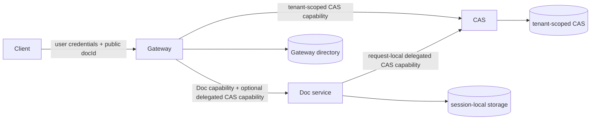

# UniDocs Microservice Architecture

Status: canonical P0 architecture (2026-08-25)

## Service graph



The only allowed runtime dependency directions are:

```text
Gateway -> Doc
Gateway -> CAS
Doc     -> CAS
```

Gateway is the only user-facing service. Doc and CAS endpoints authenticate
service callers and do not accept end-user credentials.

## Identity model

The three identifiers have different owners and must not be collapsed:

- `userId` identifies an authenticated end user. Only Gateway understands it.
- `docId` is Gateway's public document identifier.
- `sessionId` is an opaque internal identifier generated by Gateway. One Doc
  service uses it to address one independent session.
- `tenantId` is the CAS storage, accounting, quota, serialization, and garbage
  collection boundary. It is not an end-user identity.

Gateway maps each public document to at least:

```ts
interface GatewayDocumentRecord {
  docId: string;
  tenantId: string;
  docType: string;
  serviceId: string;
  sessionId: string;
  state: "creating" | "ready" | "failed";
  version: number | null;
  createdAt: number;
  updatedAt: number;
}
```

Clients cannot choose a trusted tenant or session by sending internal headers.
Gateway derives tenant context from authenticated identity or its directory,
then constructs a minimal downstream request.

The public route is `/tenants/{tenantId}/...`. Production identity resolvers
bind the authenticated user to that tenant. Legacy `/users/*` routes are
rejected. The path-based development resolver is disabled unless
`INSECURE_PATH_IDENTITY=true` is explicitly configured.

## Gateway ownership

Gateway owns:

- end-user authentication and authorization;
- the document directory and `list` behavior;
- public `docId` allocation;
- opaque `sessionId` allocation;
- document lifecycle state;
- deployment-time document-service routing;
- translation from user context to tenant/session service context.

Gateway never reads a Doc service's delta, snapshot, or session tables. A list
query reads only the Gateway directory.

## Doc service ownership

One Doc service implements one document type and owns only independent sessions.
It has no user, owner, directory, or list concept.

Its internal API is session-scoped:

```text
PUT  /tenants/{tenantId}/sessions/{sessionId}
GET  /tenants/{tenantId}/sessions/{sessionId}/status
POST /tenants/{tenantId}/sessions/{sessionId}/query
POST /tenants/{tenantId}/sessions/{sessionId}/apply
GET  /tenants/{tenantId}/sessions/{sessionId}/export
GET  /tenants/{tenantId}/sessions/{sessionId}/history
POST /tenants/{tenantId}/sessions/{sessionId}/rollback
GET  /tenants/{tenantId}/sessions/{sessionId}/snapshot
GET  /tenants/{tenantId}/sessions/{sessionId}/ir
POST /tenants/{tenantId}/sessions/{sessionId}/init-from-hash
POST /tenants/{tenantId}/sessions/{sessionId}/run
POST /tenants/{tenantId}/sessions/{sessionId}/reset
```

Creation stores immutable `tenantId` session metadata so later CAS operations
use the same storage scope. No request carries `userId` to a Doc service.

Cloudflare sessions use Durable Object local sqlite. Azure sessions use a
Doc-service-owned Postgres database and service-specific Blob containers.
Multiple replicas of one Azure Doc service share that service's stores; they do
not share the Gateway database or another Doc type's database.

## CAS ownership

CAS knows tenants, not users. All mutable and immutable state is partitioned by
`tenantId`:

```text
cas_nodes              PK (tenant_id, hash)
cas_edges              PK (tenant_id, parent_hash, ordinal)
cas_root_owners        PK (tenant_id, owner)
cas_root_ref_requests  PK (tenant_id, request_id)
R2                     tenants/{tenantId}/nodes/{hash}
CAS queue              idFromName(tenantId)
```

The initial implementation does not deduplicate across tenants. Equal content
in two tenants has the same digest but independent rows, objects, leases,
references, usage, and GC lifecycle.

Tenant usage is a tenant-administration capability. GC and root management are
internal operations. Gateway may proxy an allowlisted subset of node operations
for authenticated tenant members; it never exposes root management.

## Deployment-time registration

There is no runtime registration API or discovery lease. Deploy services first,
then inject one static Gateway registry:

```json
{
  "markdown": {
    "serviceId": "markdown",
    "url": "https://markdown.internal",
    "audience": "unidocs-doc:markdown"
  },
  "docx": {
    "serviceId": "docx",
    "url": "https://docx.internal",
    "audience": "unidocs-doc:docx"
  }
}
```

The deployment value is supplied as `DOC_SERVICES_JSON`. Each Doc registration
has one exact capability audience. Gateway alone receives the private signing
key; Doc and CAS receive public-only trusted JWKS plus their exact audiences.

Configuration is validated as a whole. Unknown document types return 404;
duplicate service IDs, empty audiences, and non-HTTP(S) URLs reject configuration.

## Create lifecycle

1. Gateway authenticates the user and resolves `tenantId`.
2. Gateway validates the static Doc registration.
3. Gateway allocates distinct `docId` and `sessionId` values.
4. Gateway atomically reserves a `creating` directory row under an idempotency
   key.
5. Gateway calls `PUT /tenants/{tenantId}/sessions/{sessionId}` with a Doc
  capability bound to that tenant/session and a separate delegated CAS
  capability when required.
6. A definitive success marks the directory row `ready`; a definitive client
   failure marks it `failed`.
7. A timeout leaves the row `creating`. A repeated idempotency key probes the
   original session's status and converges without allocating a second session.

Normal operations authorize `docId`, resolve its ready directory row, and route
to `sessionId`. Successful mutations update Gateway's `updatedAt`.

Clone is Gateway orchestration: resolve the source document, obtain a snapshot,
reserve a target document/session, then initialize the target. P0 permits only
same-tenant clone because CAS storage is tenant-partitioned.

## Network and credentials

Azure deploys Doc Container Apps with internal ingress and Gateway with external
ingress. Cloudflare Doc workers are reached through configured service URLs or
service bindings and fail closed on missing or invalid capabilities. A
cross-cloud endpoint may be network-routable, but it remains service-facing and
requires the correct audience, issuer, permission, tenant, and session claims.

Gateway strips end-user `Authorization`, cookies, user identity headers, and
caller-supplied tenant/session headers before forwarding. Gateway-to-Doc uses a
short-lived Doc Bearer plus optional `X-UniDocs-CAS-Capability`; Gateway-to-CAS
and Doc-to-CAS use CAS-only Bearers. Doc never forwards its primary token. Doc
and CAS verify locally from deployment-supplied JWKS and never call Gateway for
verification. ES256 capabilities default to 120 seconds, may not exceed 300
seconds, and allow at most 30 seconds of clock skew.

## Storage and migrations

Each deployable service owns its schema and migration entry point:

- Cloudflare Gateway owns `GATEWAY_DB` and `gateway_documents`.
- Cloudflare Doc services own their Durable Object storage.
- Cloudflare CAS owns CAS D1/R2.
- Azure Gateway owns `unidocs_gateway` and its migration image.
- Azure Markdown and DOCX own `unidocs_markdown` and `unidocs_docx`; each runs
  the Doc schema migration separately.

Cloudflare migrations backfill legacy directory rows and lazily migrate legacy
DO metadata and R2 object keys. The Azure dev template leaves a legacy
monolithic `unidocs` database untouched. A deployment containing durable Azure
legacy documents must run an explicit one-time database/Blob import before
switching traffic; routine service migrations do not delete or guess how to
merge that data. After copying one Doc type's rows and Blob objects into its
service-owned storage, operators supply a JSON `sessionId`/`tenantId`/`docType`
map to `pnpm --filter @unidocs/azure-sdk migrate:legacy-identities`. The command
transactionally populates `doc_sessions` only when the map covers every legacy
delta/snapshot row, then the matching Gateway directory map is imported before
traffic moves.
