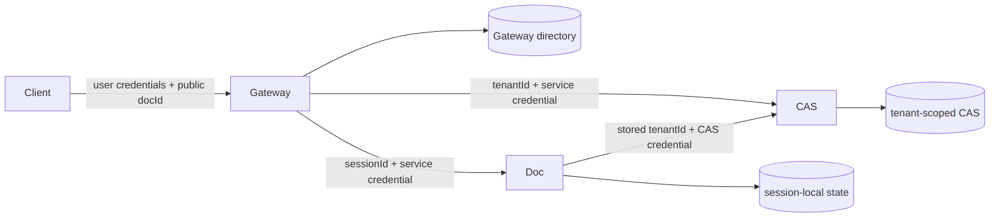

# P0 Microservice Boundaries Working Plan

Status: temporary execution record; in progress (2026-08-25)

This file records the agreed architecture and the execution checkpoints for the
P0 cleanup. Keep it current while the migration is in progress. Once every
completion gate passes, replace it with the final architecture document or mark
it complete; do not leave it as a second source of truth.

## Goal

Make Gateway, Doc, and CAS independently deployable services with these only
runtime dependency directions:

```text
Gateway -> Doc
Gateway -> CAS
Doc     -> CAS
```

Services communicate through configured endpoints and service credentials.
Document-type services are registered at deployment time, not dynamically at
runtime. Only Gateway is exposed to end users.

## Terminology

- `userId`: the stable authenticated end-user identifier. It is Gateway-only.
  Earlier discussion used `principalId` as a generic identity term, but UniDocs
  currently models users, so this plan uses the more precise `userId`.
- `tenantId`: the CAS storage isolation, accounting, quota, serialization, and
  GC boundary. It is not an end-user identity.
- `docId`: the public document identifier exposed by Gateway.
- `sessionId`: an opaque, unguessable internal identifier generated by Gateway
  and used by exactly one Doc service to address session state.
- `docType`: the deployment-time routing key for a Doc service.

## Agreed invariants

1. Gateway is the only service that understands users and performs user
   authorization.
2. Gateway exclusively owns the document directory and list behavior.
3. Gateway maps every public `docId` to at least
   `{ userId, tenantId, docType, sessionId, state }`.
4. Doc services never receive or persist `userId` and never implement list.
5. A Doc service owns only independent sessions addressed by `sessionId`.
6. A Doc session persists an immutable `tenantId` only as its CAS storage scope.
7. CAS understands `tenantId`, but never `userId`.
8. CAS data, roots, idempotency, usage, and GC are scoped by tenant. Initial
   storage keys remain `(tenantId, hash)` and there is no cross-tenant dedup.
9. Client-supplied tenant headers are never trusted. Gateway derives tenant
   context from authenticated identity or its document directory. A Doc service
   reuses the immutable tenant stored when its session is created.
10. Public `docId` and internal `sessionId` are distinct identifiers even when
    both happen to use UUID syntax.
11. Doc and CAS reject missing service credentials. Internal requests carry a
    minimal header set and never forward end-user credentials or `userId`.
12. Existing public `/users/{userId}/...` routes may remain as a compatibility
    surface during this P0 migration, but the user segment stays inside Gateway
    and must ultimately be bound to authenticated identity. It is never sent to
    Doc or CAS.

## Target ownership



### Gateway directory

Conceptual record:

```ts
interface GatewayDocumentRecord {
  docId: string;
  userId: string;
  tenantId: string;
  docType: string;
  sessionId: string;
  state: "creating" | "ready" | "failed";
  createdAt: number;
  updatedAt: number;
}
```

Deployment configuration resolves `docType` to a stable service registration.
Directory rows do not persist deployment URLs or plaintext access keys.

### Doc internal API

Target shape:

```text
PUT  /sessions/{sessionId}                 create idempotently
GET  /sessions/{sessionId}/status          reconcile an ambiguous create
POST /sessions/{sessionId}/query
POST /sessions/{sessionId}/apply
GET  /sessions/{sessionId}/export
GET  /sessions/{sessionId}/history
POST /sessions/{sessionId}/rollback
GET  /sessions/{sessionId}/snapshot
GET  /sessions/{sessionId}/ir
POST /sessions/{sessionId}/init-from-hash
POST /sessions/{sessionId}/run
POST /sessions/{sessionId}/reset
```

Creation carries `tenantId` once. The Doc service persists it as immutable
session metadata. Later requests are addressed only by `sessionId`.

### CAS internal API

CAS paths and storage are tenant-scoped, for example:

```text
/tenants/{tenantId}/cas/nodes/{hash}
tenants/{tenantId}/nodes/{hash}
```

The access credential authorizes the internal caller. `tenantId` selects the
accounting/storage partition; it is not a substitute for authentication.

Gateway may continue exposing selected CAS operations under its public API, but
it translates authenticated user context to `tenantId`. Tenant usage is an
administrative capability and GC is internal-only. Initial raw node access is
assumed tenant-wide; finer document/blob capabilities can be added separately.

## Lifecycle rules

### Create

1. Gateway authenticates the user and resolves `tenantId`.
2. Gateway validates `docType`, allocates distinct `docId` and `sessionId`, and
   inserts a `creating` directory record.
3. Gateway idempotently calls `PUT /sessions/{sessionId}` with tenant context and
   optional import bytes.
4. On a definitive success, Gateway marks the directory row `ready`.
5. On a definitive failure, Gateway marks it `failed`.
6. On timeout or lost response, Gateway asks the Doc service for session status
   and converges instead of blindly allocating another session.

### Normal operations

Gateway authorizes the public `docId`, resolves its ready directory record, and
forwards the operation to the configured Doc service using `sessionId`. After a
successful mutation, Gateway updates directory `updatedAt`.

### Clone

Gateway resolves the source record, obtains a source snapshot, allocates a new
public document/session pair, and initializes the target session. Initial P0
behavior permits same-tenant clone only; cross-tenant content copy is a separate
feature because CAS does not deduplicate across tenants.

## Authentication boundary

The concrete identity provider is not selected in this repository. P0 will keep
identity resolution behind a Gateway-owned interface. Local/test compatibility
may derive identity from the existing public path, but that adapter is not
production authentication. Production adapters must fail closed and bind the
requested user resource to authenticated credentials.

## Execution plan

### Step 0 - Freeze decisions and baseline

Status: complete

- [x] Record agreed terminology and ownership boundaries in this working file.
- [x] Capture the current targeted test baseline before behavior changes.
- [x] Keep the worktree diff scoped and record any pre-existing failures.

Validation:

```text
pnpm --filter @unidocs/http-protocol test
pnpm --filter @unidocs/cas-client test
pnpm --filter @unidocs/cloudflare-cas test
pnpm --filter @unidocs/gateway-common test
pnpm --filter @unidocs/doctype-server-common test
```

### Step 1 - Make CAS tenant-scoped and user-agnostic

Status: complete

- [x] Rename CAS client configuration and internal trust headers from user to
      tenant semantics.
- [x] Change CAS service paths to `/tenants/{tenantId}/cas/...`.
- [x] Change DO routing, D1 schema/query semantics, R2 prefixes, root owners,
      idempotency, usage, and GC to tenant scope.
- [x] Keep Gateway's public compatibility route user-facing, but translate it
      to an internal tenant CAS request.
- [x] Preserve tenant isolation and prove identical hashes in two tenants have
      independent content/lifecycle records.

Completion gate:

- No `userId`, `X-User-Id`, `/users/`, or `user_id` remains in CAS client/server
  code except Gateway compatibility translation tests.
- CAS package tests and focused integration tests pass.

### Step 2 - Add the Gateway-owned directory and session mapping

Status: complete

- [x] Replace the cross-service `DocIndexQuery` contract with a Gateway-owned
      directory port.
- [x] Add directory storage fields for tenant, session, and lifecycle state.
- [x] Make list read only the Gateway-owned directory.
- [x] Add idempotent create reservation/finalization/reconciliation behavior.
- [x] Route all existing document operations through `docId -> sessionId`.

Completion gate:

- Gateway can list and route without reading any Doc-owned table.
- A timeout during create cannot create a second session silently.

### Step 3 - Make the shared Doc runtime session-only

Status: complete

- [x] Replace `DocIdentity` with a session identity containing `sessionId` and
      immutable CAS `tenantId`.
- [x] Change the internal Doc handler to `/sessions/{sessionId}` routes.
- [x] Add idempotent create and status behavior.
- [x] Remove user authorization checks from Doc; service authentication remains
      at the service edge.
- [x] Remove `DocIndex` and directory writes from `DocumentSession` and its unit
      of work.
- [x] Key Azure delta/snapshot/cache storage by `sessionId`.

Completion gate:

- `doctype-server-common` and Azure Doc runtime contain no user or list concept.
- Shared session and Azure integration tests pass.

### Step 4 - Migrate the Cloudflare Doc runtime

Status: complete

- [x] Remove persisted user identity and global D1 directory writes from the
      Editor DO.
- [x] Address Editor and Operator DOs by `sessionId` only.
- [x] Persist immutable `tenantId` per session for CAS calls.
- [x] Align Cloudflare lifecycle behavior with the shared session contract, or
      remove duplicated session semantics where practical.
- [x] Remove obsolete shared D1 and direct CAS storage bindings from Doc workers.

Completion gate:

- Cloudflare Doc workers contain no user/list concept and do not share the
  Gateway directory database.
- Cloudflare focused integration tests pass.

### Step 5 - Harden Gateway public translation

Status: complete

- [x] Introduce the Gateway identity-resolver boundary.
- [x] Strip user credentials and untrusted internal headers before forwarding.
- [x] Translate public Doc and CAS requests to session/tenant internal requests.
- [x] Restrict tenant usage to administration and CAS GC to internal operation.
- [x] Make all Doc/CAS service authentication fail closed.

Completion gate:

- Doc/CAS never receive `userId`, cookies, or end-user authorization headers.
- Direct unauthenticated service access fails.

### Step 6 - Separate deployment ownership

Status: complete

- [x] Give Gateway and each Doc service exclusive storage configuration.
- [x] Replace runtime Cloudflare KV registration with deployment-time config.
- [x] Represent each Doc/CAS endpoint together with its credential reference.
- [x] Keep only Gateway as the user-facing service in supported deployments;
      internally authenticated service ingress may remain routable for
      cross-cloud dependencies.

Completion gate:

- Gateway, every Doc service, and CAS can be deployed independently and linked
  only by endpoint/credential configuration.

### Step 7 - Update clients, tests, and canonical documentation

Status: complete

MVP scope note: caller-specific Gateway-to-CAS and per-Doc-to-CAS credentials,
plus CAS caller-role authorization, are deferred to the dedicated
authentication hardening step. P0 retains one fail-closed internal CAS key.

- [x] Remove user-aware CAS and Doc internals from browser/client packages.
- [x] Rewrite behavior, integration, and treespec coverage around Gateway-owned
      identity and tenant/session downstream boundaries.
- [x] Supersede user-scoped CAS statements in README and architecture docs.
- [x] Run the full repository validation suite.

Validation:

```text
pnpm build
pnpm typecheck
pnpm test
pnpm test:local
```

## Progress log

- 2026-08-25: Architecture audit completed. Confirmed Gateway-only users and
  directory/list ownership, Doc session-only ownership, CAS tenant accounting
  and isolation, no initial cross-tenant dedup, and deployment-time Doc
  registration.
- 2026-08-25: Replaced the ambiguous planning term `principalId` with `userId`.
- 2026-08-25: Step 0 baseline passed: http-protocol 3 tests, cas-client 18,
  cloudflare-cas 35, gateway-common 1, and doctype-server-common 71.
- 2026-08-25: Step 1 completed. CAS paths, headers, DO partitioning, D1 schema,
      R2 keys, roots, idempotency, usage, and GC are tenant-scoped. Gateway keeps
      the public user route as a compatibility surface and emits only tenant CAS
      requests. Legacy D1 `user_id` columns are renamed in place; consolidating
      several legacy partitions into one tenant remains a deployment-specific data
      migration once a real user-to-tenant mapping exists.
- 2026-08-25: Step 1 validation passed: all 22 workspace projects typechecked
      and built; 144 focused package tests and 25 focused integration tests passed,
      including Cloudflare tenant CAS, recoverable outbox, and Azure Docx -> CAS.
- 2026-08-25: Step 2 completed. Gateway owns `gateway_documents`, maps public
      `docId` to opaque `sessionId`, lists only its own ready records, converges
      repeated creates by idempotency key, and probes the original session after an
      ambiguous response. Cloudflare D1 and Azure Postgres both passed concurrent
      idempotent-create and full shared behavior suites (8 tests per backend).
- 2026-08-25: Steps 3-4 completed. Doc services use `/sessions/{sessionId}` and
      `SessionIdentity { docType, sessionId, tenantId }`; all global Doc index
      contracts and writes were removed. Cloudflare Doc workers share the same
      router, store only tenant/session metadata, and no longer bind Gateway D1 or
      CAS R2 directly. Legacy Gateway rows, DO metadata, and CAS R2 keys migrate
      forward in place; executable D1/Postgres/R2 migration tests pass.
      - 2026-08-25: Step 5 completed. Gateway has one identity-resolver boundary,
        defaults to fail-closed, binds authenticated identity to the public path, and
        strips user credentials before tenant/session forwarding. The old path-based
        identity is available only behind the explicit development flag. CAS usage
        requires tenant administration, GC is internal-only, and direct Doc/CAS
        access without service credentials is rejected.
- 2026-08-25: Step 6 completed. Gateways load one validated static
      `DOC_SERVICES_JSON`; each Doc registration and CAS use distinct access keys.
      Cloudflare no longer uses KV discovery or gives Doc workers Gateway D1/CAS
      R2 bindings. Azure provisions independent Gateway/Markdown/DOCX databases,
      service-specific Blob containers, and three service-owned migration jobs.
      Both Bicep templates and all 22 workspace builds pass.
- Azure upgrade note: the dev template creates new service databases and leaves
      any legacy monolithic `unidocs` database untouched for rollback. Deployments
      that contain durable Azure documents must run an explicit one-time data/Blob
      import before switching traffic; routine service migrations intentionally do
      not guess that policy or delete the legacy database.
- 2026-08-25: Step 7 completed. Public clone now authorizes `sourceId` through
      Gateway and keeps snapshot hashes internal; explicit `docId` participates in
      the idempotency fingerprint; D1 lifecycle transitions are conditional; Azure
      legacy session identities have a transactional operator-supplied import path;
      and CAS/PSD default ports no longer collide. CAS caller-specific credentials
      and caller-role authorization remain deferred to the authentication step.
      Final validation passed: `pnpm build`, `pnpm typecheck`, `pnpm test` (483
      passed, 3 skipped), and `pnpm test:local` (228 passed, 2 skipped).
