# 通用 Agent SDK 设计

日期：2026-08-26
分支：`feat/agent-sdk`
状态：待 review

---

## 1. 要建立什么

### 1.1 一个内核，两层抽象边界

建立一份与**文档类型**无关、也与**运行平台**无关的 agent 内核。它的位置由上下两条抽象边界夹住：

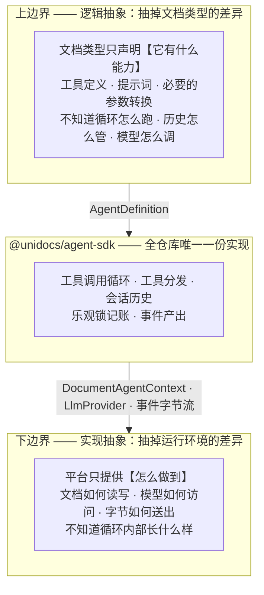

**逻辑抽象**回答的是「一个文档 agent 由什么构成」——工具、提示词、工具语义（读 / 写 / 其他）。它对所有文档类型是同一套，PSD 的图层树和 docx 的段落在这一层是同构的。

**实现抽象**回答的是「这些动作靠什么完成」——文档读写通过什么通道、模型通过什么协议、结果字节怎么送到调用方。它对所有平台是同一套，DurableObject 和 Node 进程在这一层是同构的。

### 1.2 两个方向的扩展互不相交

这是「平台可扩展」的具体含义：

| 要新增什么 | 要做的事 | 不需要碰的 |
|---|---|---|
| 一个新文档类型（例如 xlsx） | 实现上边界：写 `tools` + `instructions`，必要时补几个 handler | 内核、所有平台代码 |
| 一个新平台（例如 AWS） | 实现下边界：一份 `DocumentAgentContext`、一份大模型接入、一层传输外壳 | 内核、所有文档类型 |
| 一个新大模型供应商 | 实现下边界的一个接口：`LlmProvider` | 内核、所有文档类型、所有平台 |

三种扩展都不修改内核，也不互相牵动。

### 1.3 两层边界的接口

| 边界 | 接口 | 由谁实现 | 定义在 |
|---|---|---|---|
| 上（逻辑） | `AgentDefinition` = tools + instructions + maxIterations? + handlers? | 文档类型 | 5.2 |
| 下（实现） | `DocumentAgentContext` —— 文档读写 | 平台 sdk | `protocol/src/types.ts:105`，已存在 |
| 下（实现） | `LlmProvider` —— 模型访问 | agent-sdk 内置 Anthropic / OpenAI，可另加 | 5.4 |
| 下（实现） | 事件字节流 → 平台响应对象 | 平台 sdk | 6.4 |

下边界之所以要拆成三个接口而不是一个，是因为它们的变化原因不同：换平台只影响文档读写和传输，换模型供应商只影响 `LlmProvider`。

### 1.4 今天这两层都不存在

| 边界 | 应该在哪 | 实际在哪 |
|---|---|---|
| 上（逻辑） | 文档类型只做声明 | 文档类型自己实现了循环的一部分——工具分发骨架，三份（2.3 的 P1） |
| 下（实现） | 平台只做实现 | 平台把循环整个吃进了自己的实现里（`cloudflare-sdk/src/operator-do-agent.ts`，296 行里循环与 DurableObject 交织） |

后果见第 2 章。

### 1.5 本次范围

| 编号 | 内容 | 本次 |
|---|---|---|
| A | 建立两层边界：循环内核、工具分发、消息格式、大模型接口 | ✅ 做 |
| B | 会话历史裁剪、会话持久化 | ❌ 下一期，本次只留接口位置（5.5） |
| C | 事件流 + 客户端 SDK | ✅ 做 |

验证方式：以 PSD 为样板走通全链路，并用 Azure 证明下边界确实可换（10 章 V8）。

---

## 2. 现状：两层边界缺失的后果

### 2.1 只有一条链路真正能跑

| 链路 | 状态 | 卡在哪 |
|---|---|---|
| cloudflare-psd | 能跑 | 唯一配置了真实大模型接入的，`cloudflare-psd/src/anthropic.ts` |
| cloudflare-markdown | 不能 | `llmProvider` 是抛异常的占位，`cloudflare-markdown/src/worker.ts:29` |
| cloudflare-docx | 不能 | 同上；且图片路径还会撞 P6 |
| azure-markdown / azure-docx | 不能 | operator 接口一律返回 501，`azure-sdk/src/local-editor.ts:103` |
| azure-psd | 不存在 | Azure 栈里没有 psd |

要让**第二条**链路跑起来，会连续撞上三件事，恰好对应 1.4 的两层缺失：

| # | 撞上什么 | 属于哪层缺失 |
|---|---|---|
| 1 | 工具分发骨架要再抄一遍 | 上边界缺失 |
| 2 | 循环无法复用——唯一能用的那份依赖 `DurableObjectStub` / `Request` / `Response` | 下边界缺失 |
| 3 | 大模型接入要重写——`anthropic.ts` 躺在 `cloudflare-psd` 这个叶子包里 | 下边界缺失 |

需要说明的是，Azure 至今没有 agent，直接原因是那一期把它划在范围外（`azure-sdk/src/local-editor.ts:97-101` 注明是 future work），并不是被 Cloudflare 的实现挡住了。下边界缺失影响的是**现在补做时的成本**，不是它当初没做的原因。

### 2.2 代码分布

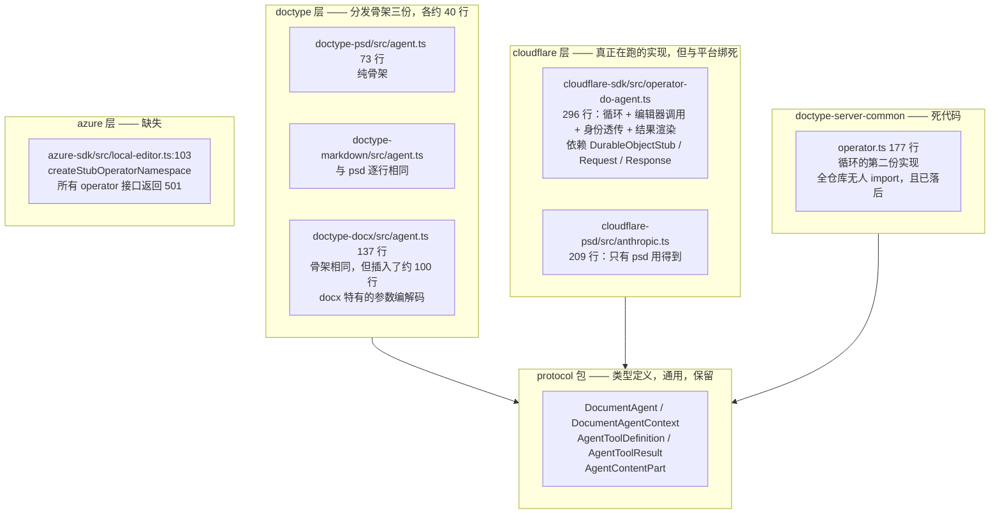

### 2.3 具体问题清单

| # | 问题 | 位置 |
|---|---|---|
| P1 | `query_` / `apply_` 前缀分发骨架在三个 doctype 里各写一遍。psd 与 markdown 逐行相同，连 `requireJsonObject` 都一字不差 | `doctype-psd/src/agent.ts:31-72`、`doctype-markdown/src/agent.ts:85-129` |
| P1b | 参数不总能原样透传给 `query` / `apply`。docx 需要在分发骨架中间插入转换：`apply_insertImage` / `apply_replaceImage` 要先把 `hash` 字符串经 `resolveBlob` 换成 SBlob，`query_getImage` 要走独立分支返回 image content part | `doctype-docx/src/agent.ts:20,36-38,53-84,86-113` |
| P2 | 唯一可用的循环实现依赖 Cloudflare 类型，Azure 无法复用 | `cloudflare-sdk/src/operator-do-agent.ts` |
| P3 | 存在第二份无人使用且已落后的循环实现 | `doctype-server-common/src/operator.ts` |
| P4 | 大模型适配层放在最外层的叶子包里，其他文档类型用不到 | `cloudflare-psd/src/anthropic.ts` |
| P5 | 同一仓库存在两套互相冲突的图片约定 | 见 2.4 |
| P6 | `renderToolResult` 钩子全仓库无人设置，docx 的图片路径一跑就抛异常 | `operator-do-agent.ts:25` 声明、`:112` 调用、`:263` 抛出 |
| P7 | `/run` 是一次阻塞请求，PSD 最多 25 轮循环期间零反馈，断线即全部丢失 | `web-psd/src/main.ts:374-383` |
| P8 | 会话历史无上限增长，且只在内存中，进程重启即丢 | `operator-do-agent.ts:55` |

### 2.4 两套冲突的图片约定

| 文档类型 | 做法 | 位置 |
|---|---|---|
| docx | 返回协议层的 `content: [{ type:"image", blob }]` | `doctype-docx/src/agent.ts:75` |
| psd | 把 base64 塞进普通数据字段 `{ $image: { base64 } }`，再由大模型适配层递归搜索捞出 | `doctype-psd/src/queries.ts:101` + `cloudflare-psd/src/anthropic.ts:72` |

docx 那条路从未真正跑通过：它会撞上 `renderDefaultAgentToolResult` 的抛异常分支（P6），只是因为 docx 的 `llmProvider` 本身就是个抛异常的占位实现（`cloudflare-docx/src/worker.ts:29`），所以一直没暴露。

PSD 那条路的副作用：base64 让数据膨胀三分之一，并且撞过 SValue 的字符串长度上限（提交 `da9028d` 就是修这个）。

---

## 3. 两层边界落到具体的包上

1.1 是抽象形状，这一节是它对应的实际代码归属。

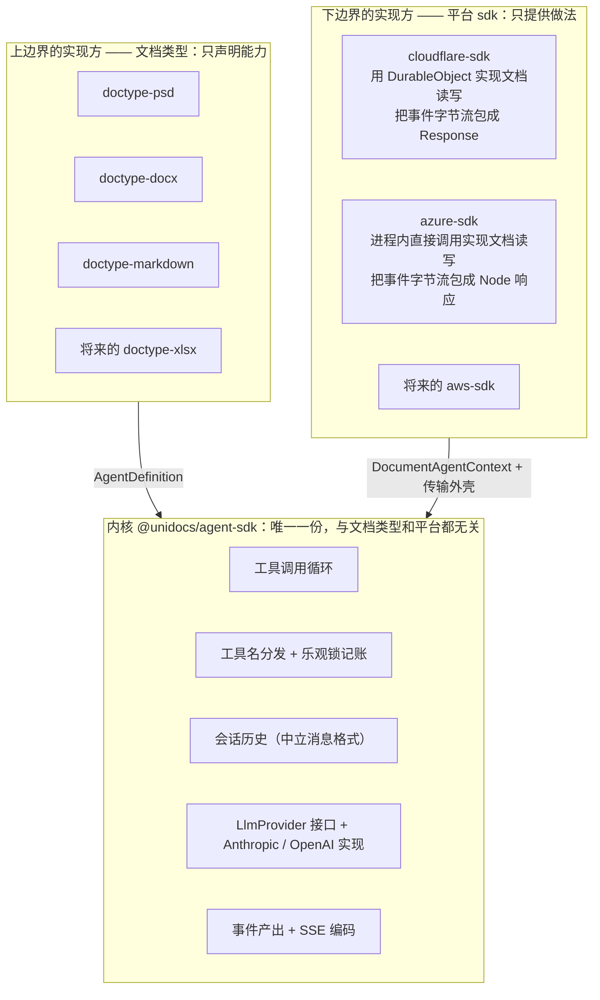

两条不可越界的规则：

1. **文档类型永远看不到 `DocumentAgentContext` 的实现**。它甚至不知道文档是通过 DurableObject 还是进程内调用读到的。
2. **平台 sdk 永远看不到循环内部**。它拿到的是一个事件序列，负责把它变成本平台的响应对象，不参与决定何时调模型、何时调工具。

这两条如果被打破，就退回到今天的状态（1.4）。4.3 给出机器可校验的落地方式。

---

## 4. 包与约束

### 4.1 新增包

| 包名 | 职责 |
|---|---|
| `@unidocs/agent-sdk` | 服务端 agent 内核 |
| `@unidocs/client-sdk` | 浏览器侧：agent 通道 + 文档同步 |

两个包都不依赖任何云 SDK。

### 4.2 依赖方向

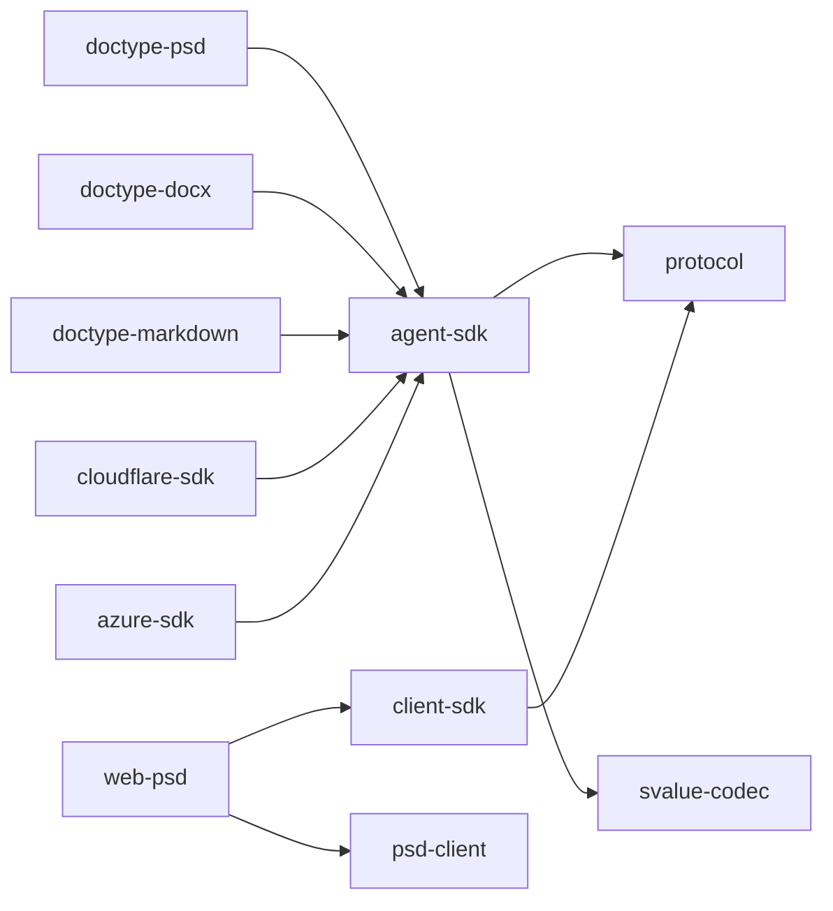

无环。`agent-sdk` 只依赖 `protocol` 和 `svalue-codec`。

### 4.3 平台无关性如何保证

仓库没有 eslint / biome，只有 `tsc` + `vitest`，所以用两道机制：

1. `packages/agent-sdk/tsconfig.json` 的 `types` 不包含 `@cloudflare/workers-types`，`lib` 不包含 `DOM`。写出 `DurableObjectStub` 或 `Response` 直接编译失败。
2. 新增 `tests/unit/agent-sdk-purity.test.ts`：扫描 `packages/agent-sdk/src/**` 的所有 import 语句，断言只出现 `@unidocs/protocol`、`@unidocs/svalue-codec` 和相对路径。

这两道机制守住的是 3 章的**规则 1**（内核不知道平台）。**规则 2**（平台不知道循环内部）没有等价的机器检查——平台 sdk 本来就允许 import `agent-sdk`。它靠两件事守：

- 循环的状态（会话历史、`lastKnownVersion`、迭代计数）全部封在 `AgentSession` 私有字段里，平台拿不到，也就无从参与决策。平台唯一能做的就是消费 `run()` 吐出的事件序列。
- 代码检视：如果某个平台 sdk 里出现了「判断该不该再调一次模型」这类逻辑，就是越界了。

### 4.4 一处需要注意的连带影响

`psd-client/src/doc-session.ts:1` 从 `@unidocs/doctype-psd/engine` 子路径引入 `applyOne`。如果 `doctype-psd` 的主入口开始依赖 `agent-sdk`，必须确认子路径 exports 隔离有效，不要把服务端 agent 代码卷进浏览器 bundle。实施时用打包体积断言验证。

---

## 5. 服务端设计

### 5.1 类图

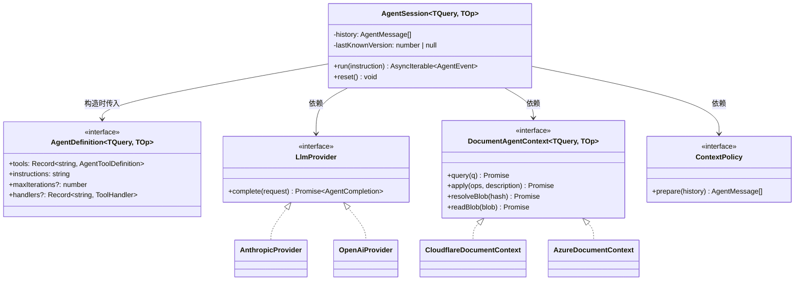

`DocumentAgentContext` 已经存在于 `protocol/src/types.ts:105`，形状正合适：纯语义，不知道 HTTP、DurableObject、CBOR 的存在。不需要新造接口。

### 5.2 文档类型侧的样子

```ts
// packages/doctype-markdown/src/agent.ts —— 全文
export const markdownAgent = defineAgent({ tools: markdownTools, instructions });
```

```ts
// packages/doctype-psd/src/agent.ts —— 全文
export const psdAgent = defineAgent({
  tools,
  instructions,
  maxIterations: 25,
  handlers: {
    generate_image: async (args, ctx) => {
      const png  = await callImageApi(args.prompt);
      const blob = await ctx.makeSBlob({ data: png, contentType: "image/png" });
      return { content: [{ type: "image", blob, mediaType: "image/png" }] };
    },
  },
});
```

`handlers` 可以不填。填了的话，key 用工具的**全名**（`tools` 里的 `name` 字段，例如 `generate_image`），不是 map 的 key —— 因为 `query_` / `apply_` 前缀在 name 上，用全名分发才没有歧义。

> 上面的 `generate_image` 只是用来说明 `handlers` 怎么写，**不属于本次迁移范围**。PSD 现有的工具集（`doctype-psd/src/tools.ts`）保持不变，包括那个目前实际跑不通的 `apply_generative_fill`。

### 5.2.1 `handlers` 不是预留，docx 今天就必须用

`handlers` 承担两类工具：

**第一类：参数需要转换后才能交给 `query` / `apply`。** 这是 docx 今天的真实情况（P1b）——`apply_insertImage` 收到的是一个 `hash` 字符串，而 `DocxOperation` 要的是一个 SBlob，中间必须过一次 `resolveBlob`。今天这段转换被写死在分发骨架里（`doctype-docx/src/agent.ts:86-113` 的 `makeOperation`），所以 docx 的骨架没法直接删掉。

改造后，docx 把这三个工具写成 handler，其余工具走自动分发：

```ts
// packages/doctype-docx/src/agent.ts
export const docxAgent = defineAgent({
  tools, instructions,
  handlers: {
    query_getImage: async (args, ctx) => {
      const { data, version } = await ctx.query({ kind: "getImageContent", payload: { index: args.index } });
      const { blob, ...meta } = requireRecord(data);
      return {
        structuredContent: { data: meta, version },
        content: [{ type: "image", blob, mediaType: mediaTypeOf(meta.format) }],
      };
    },
    apply_insertImage: async (args, ctx) => {
      const blob = await ctx.resolveBlob(args.hash);
      return ctx.applyOne({ kind: "insertImage", payload: { blob, widthPx: args.widthPx, altText: args.altText } });
    },
    apply_replaceImage: async (args, ctx) => {
      const blob = await ctx.resolveBlob(args.hash);
      return ctx.applyOne({ kind: "replaceImage", payload: { index: args.index, blob } });
    },
  },
});
```

**第二类：既不读也不写文档，而是调外部服务或做纯计算。** 例如未来的生成式填充。

**关键约束：** handler 拿到的 `ctx` 里的 `query` / `apply` / `applyOne` 是 **SDK 包装过的**，与自动分发走同一套乐观锁记账（记录 `lastKnownVersion`、`apply` 前校验、冲突时把当前版本喂回模型）。handler 不能绕过它直接碰 `DocumentAgentContext`，否则乐观锁会破。

```ts
export interface ToolHandlerContext<TQuery, TOp> {
  query(q: SValueType<TQuery>): Promise<{ data: SValue; version: number }>;   // 自动记录 version
  apply(ops: readonly SValueType<TOp>[], description?: string): Promise<AgentToolResult>;
  applyOne(op: SValueType<TOp>, description?: string): Promise<AgentToolResult>;
  resolveBlob(hash: string): Promise<SBlob>;
  readBlob(blob: SBlob): Promise<SBlobData>;
  makeSBlob(data: SBlobData): Promise<SBlob>;
}

export type ToolHandler<TQuery, TOp> = (
  args: Readonly<Record<string, JsonValue>>,
  ctx: ToolHandlerContext<TQuery, TOp>,
) => Promise<AgentToolResult>;
```

### 5.3 工具名分发

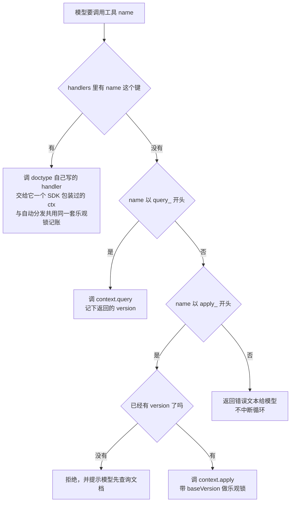

乐观锁的语义完全保留今天的行为：`apply` 前必须先 `query`；遇到版本冲突时，把当前版本号和「请重新查询后重试」的提示喂回给模型（`operator-do-agent.ts:202-220` 的现有逻辑）。

### 5.4 消息格式中立化

这是本次唯一一处**重写而非搬家**的改动。

**今天：** 循环内部用 OpenAI 的消息格式（`operator-do-agent.ts:98` 读 `response.choices[0].message`），于是 Anthropic 适配层必须双向翻译两次。而图片因为被压成了 JSON 字符串，只能靠递归搜索捞回来。

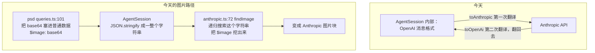

**之后：** 循环内部用 agent-sdk 自己的中立格式，每个大模型适配层只单向翻译一次。图片是结构化字段，不需要搜索。


中立消息类型：

```ts
export type AgentMessage =
  | { readonly role: "user";      readonly content: string }
  | { readonly role: "assistant"; readonly text?: string; readonly toolCalls?: readonly AgentToolCall[] }
  | { readonly role: "tool";      readonly callId: string; readonly result: AgentToolResult };

export interface AgentToolCall {
  readonly id: string;
  readonly name: string;
  readonly arguments: JsonValue;
}

export interface LlmProvider {
  complete(request: {
    readonly system: string;
    readonly messages: readonly AgentMessage[];
    readonly tools: readonly AgentToolDefinition[];
  }): Promise<AgentCompletion>;
}

export interface AgentCompletion {
  readonly text?: string;
  readonly toolCalls?: readonly AgentToolCall[];
}
```

`role: "tool"` 那一支携带的是结构化的 `AgentToolResult`（`protocol/src/types.ts:100`），其中的 `content` 数组里图片是 `{ type:"image", blob, mediaType }`。适配层直接 `filter(p => p.type === "image")` 拿到它。

**随之删除：** `anthropic.ts` 的 `findImage`、`previewMeta`，以及 `OperatorConfig.renderToolResult` 整个钩子（`operator-do-agent.ts:25`）。P5 和 P6 一并解决。

### 5.5 为下一期留的接口位置

```ts
export class AgentSession<TQuery, TOp> {
  constructor(definition: AgentDefinition<TQuery, TOp>, deps: {
    readonly context: DocumentAgentContext<TQuery, TOp>;
    readonly provider: LlmProvider;
    readonly contextPolicy?: ContextPolicy;   // 本次只给恒等实现
  });
  run(instruction: string): AsyncIterable<AgentEvent>;
  reset(): void;
}

export interface ContextPolicy {
  /** 每次调大模型之前，把完整历史裁成实际要发送的消息 */
  prepare(history: readonly AgentMessage[]): readonly AgentMessage[];
}
```

本次的默认实现是恒等函数，行为与今天完全一致。下一期做真正的历史裁剪（旧预览图降级成文字描述、长历史压缩）时不需要改动循环。

会话持久化同理：因为历史已经是 SDK 自己的中立类型，下一期给 `AgentSession` 加 `serialize()` / `restore()` 即可，不影响本次接口。

---

## 6. 事件流

### 6.1 事件表

```ts
export type AgentEvent =
  | { readonly type: "run-start";        readonly runId: string }
  | { readonly type: "assistant-text";   readonly text: string }
  | { readonly type: "tool-call";        readonly callId: string; readonly name: string; readonly arguments: JsonValue }
  | { readonly type: "tool-result";      readonly callId: string; readonly ok: boolean; readonly summary: string }
  | { readonly type: "document-changed"; readonly version: number }
  | { readonly type: "run-end";          readonly response: string; readonly iterations: number }
  | { readonly type: "run-error";        readonly error: string };
```

两个设计决定：

1. **`tool-result` 只带一句摘要，不带完整数据。** 工具结果可能是一整棵图层树或一张预览图，客户端不需要它 —— 需要的是模型，而模型在服务端已经拿到了。这样每个事件都很小，不需要分片。
2. **`document-changed` 单独成一个事件。** 每次 `apply` 成功就发一次，客户端可以立刻调 `reconcile()` 同步画布，不必等整个 run 结束。PSD 跑 25 轮时，用户能看到画布逐步变化，而不是最后一次性跳变。

### 6.2 一次 run 的时序

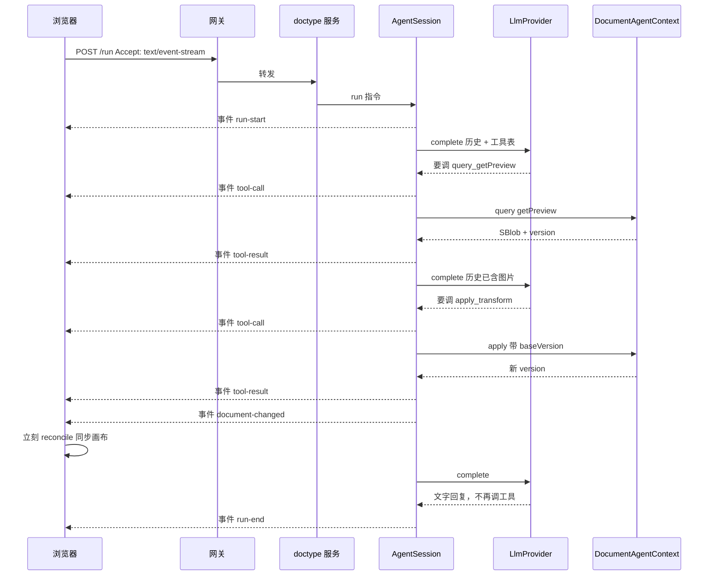

### 6.3 断线的语义

不做重放。断线时：

- 服务端的 `AgentSession` **继续跑完**，文档改动照常落到编辑器（编辑器才是文档状态的持有者）。
- 浏览器收到 `onError`，由调用方决定何时调 `reconcile()` 拿最终状态。

所以「保持连接」在这个设计下的实际含义是：心跳保活 + 断线告知。不是断线续传。

### 6.4 传输链路

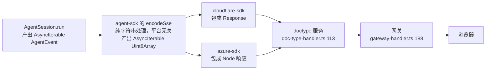

**好消息：链路已经是流式透明的，网关不需要改。**

- `gateway-handler.ts:188-202`：拿到上游 Response 直接 return，不读 body。`Accept` 头在转发白名单里，`Accept-Encoding: identity` 也已经设了，对 SSE 正合适。
- `doc-type-handler.ts:113-125`：转发给 operator，同样直接 return。

（此前担心的 body 缓冲在 `gateway-handler.ts:473`，那是建文档那条路，与 `/run` 无关。）

SSE 帧格式：

```
event: tool-call
data: {"callId":"toolu_01","name":"query_getPreview","arguments":{}}

: keepalive
```

每 15 秒发一次注释帧作为心跳，防止中间代理判定空闲断连。

### 6.5 向后兼容

`/run` 按 `Accept` 头分流：

| 请求头 | 行为 |
|---|---|
| `Accept: text/event-stream` | 返回 SSE 事件流 |
| 其他 | 返回今天的一次性 JSON `{ success, data: { response, iterations } }` |

一次性 JSON 的实现就是把事件流消费完，然后按结尾事件映射：

| 结尾事件 | 返回 |
|---|---|
| `run-end` | `{ success: true, data: { response, iterations } }`，HTTP 200 |
| `run-error` | `{ success: false, error }`，HTTP 500 |

与今天 `operator-do-agent.ts:105-124` 的返回完全一致。这样 markdown / docx 的现有调用和现有测试（`cloudflare-sdk/tests/operator-do.test.ts`，230 行）不受影响，迁移可以逐个文档类型推进。

---

## 7. 客户端设计

### 7.1 psd-client 的现状拆分

`packages/psd-client/src/doc-session.ts`（261 行）已经是一个通用的乐观并发同步引擎：本地立即 apply、待发队列、`opId` 去重重投、409 重整、`reconcile()`。它对 PSD 的耦合只有三处，都可以参数化：

| 耦合点 | 参数化后 |
|---|---|
| `import { applyOne } from "@unidocs/doctype-psd/engine"` | 注入 `applyLocal(doc, op) => doc` |
| `PsdDoc` / `PsdOp` 类型 | 泛型 `<TDoc, TOp>` |
| `RenderLike { applyOp, reset }` | 注入的可选渲染回调 |
| `loadDoc` 来自 `./doc-source.js` | 注入 `reload() => { doc, version }` |

剩下的 `render-client` / `render-core` / `render-worker` / `viewport` / `cas-blob-store`（596 行）才是 PSD 专有的，留在 `psd-client`。

### 7.2 类图

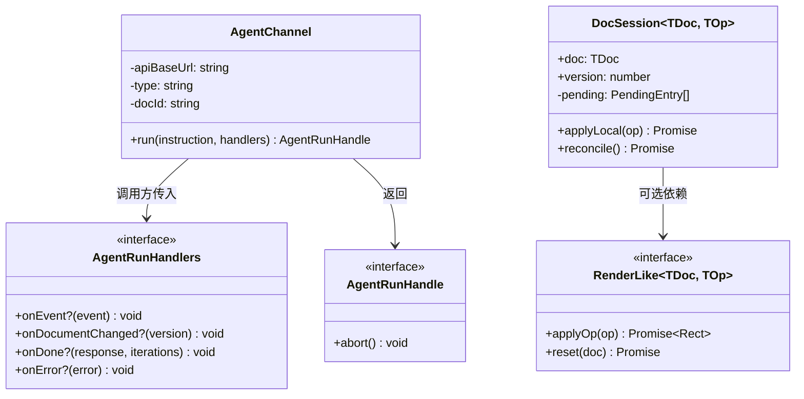

### 7.3 接口

```ts
export class AgentChannel {
  constructor(opts: {
    apiBaseUrl: string;
    type: string;
    docId: string;
    fetchImpl?: typeof fetch;
    /** 超过这个时长没收到任何帧就判定断线，默认 30000 */
    idleTimeoutMs?: number;
  });
  run(instruction: string, handlers: AgentRunHandlers): AgentRunHandle;
}

export class DocSession<TDoc, TOp> {
  constructor(opts: {
    apiBaseUrl: string;
    type: string;
    docId: string;
    doc: TDoc;
    version: number;
    applyLocal: (doc: TDoc, op: TOp) => TDoc | Promise<TDoc>;
    reload: () => Promise<{ doc: TDoc; version: number }>;
    render?: RenderLike<TDoc, TOp>;
    fetchImpl?: typeof fetch;
    genId?: () => string;
  });
  applyLocal(op: TOp): Promise<void>;
  reconcile(): Promise<void>;
}
```

**为什么不用 `EventSource`：** `EventSource` 只能发 GET 请求，不能带请求体，也不能自定义请求头。所以用 `fetch` + `ReadableStream` 手工解析 SSE 帧，大约 80 行。

**为什么不自动重连：** 因为不做重放，重连也拿不到断线期间的事件。自动重连只会制造"好像还连着"的假象。断线就如实告诉调用方。

### 7.4 两者配合

```ts
channel.run(text, {
  onDocumentChanged: () => session.reconcile(),        // 每次 apply 成功立刻同步
  onEvent: (e) => { if (e.type === "tool-call") showStep(e.name); },
  onDone: (reply) => addMsg("agent", reply),
  onError: (err) => { addMsg("err", err.message); session.reconcile(); },
});
```

对比今天（`web-psd/src/main.ts:374-390`）：等整个 run 跑完才 `reconcile()` 一次，中途界面上只有一个不动的「thinking…」。

---

## 8. PSD 迁移改动清单

| 文件 | 改动 |
|---|---|
| `doctype-psd/src/queries.ts:101` | `getPreview` 从 `btoa` 产出 base64 改为 `makeSBlob` 返回 SBlob 引用 |
| `doctype-psd/src/agent.ts` | 73 行 → 约 6 行 `defineAgent(...)` |
| `doctype-psd/tests/agent.test.ts:61-76` | 断言反转：从「`$image` 透传且 `content` 为 undefined」改为「返回 image content part」 |
| `doctype-markdown/src/agent.ts` | 删掉分发骨架，只留工具定义 + `defineAgent`，129 行 → 约 90 行（工具定义占大头） |
| `doctype-docx/src/agent.ts` | 删掉分发骨架；`queryImageContent` / `makeOperation` 改写成三个 handler（见 5.2.1）；`requireString` / `requireNumber` 等校验函数保留 |
| `cloudflare-psd/src/anthropic.ts` | 移到 `agent-sdk/src/providers/anthropic.ts`，删掉 `findImage` / `previewMeta`，翻译改为单向 |
| `cloudflare-psd/src/worker.ts` | 改为注入 `psdAgent` + Cloudflare 的 `DocumentAgentContext` 实现 |
| `cloudflare-sdk/src/operator-do-agent.ts` | 296 行 → 约 90 行，只剩 DurableObject 外壳、身份校验、把事件流包成 Response |
| `doctype-server-common/src/operator.ts` | 删除（177 行死代码） |
| `azure-sdk/src/local-editor.ts:103` | 删掉 501 占位，改为真实的 `DocumentAgentContext` 实现 |
| `psd-client/src/doc-session.ts` | 移到 `client-sdk`，泛型化 |
| `psd-client/src/index.ts` | 重新导出 `client-sdk` 的 `DocSession`，并绑定 PSD 的 `applyLocal` / `reload` |
| `web-psd/src/main.ts:357-397` | 改用 `AgentChannel`，展示逐步进度 |

---

## 9. 实施顺序

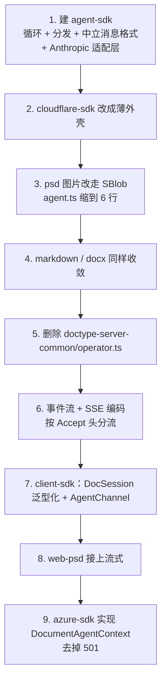

第 1-5 步是 A 块（抽取），第 6-8 步是 C 块（流式），第 9 步是「平台无关」这个目标的真正证明。

每一步结束时全仓库测试必须通过，任何一步都可以独立成为一个提交。

---

## 10. 验收标准

| # | 标准 | 验证方式 |
|---|---|---|
| V1 | `doctype-psd/src/agent.ts` 只剩 `defineAgent` 声明 | 代码检视 |
| V2 | 三个文档类型都不再包含 `query_` / `apply_` 分发逻辑 | 全仓库搜索 `startsWith("query_")` 只应命中 agent-sdk |
| V3 | `agent-sdk` 不 import 任何云相关模块 | `tests/unit/agent-sdk-purity.test.ts` |
| V4 | 循环行为不退化 | 新增契约测试：内存版 `DocumentAgentContext` + 假 provider，跑完整循环，覆盖乐观锁、版本冲突重试、达到上限、未知工具名 |
| V5 | PSD 送给模型的图片字节与改造前完全一致 | 抓一次 provider 请求体，与改造前对比 |
| V6 | 现有 230 行 `operator-do.test.ts` 全绿 | `pnpm test` |
| V7 | 浏览器能看到逐步事件，画布逐步更新 | web-psd 手工端到端 |
| V8 | 同一条指令在 Azure 栈跑通 | `pnpm test:azure` 新增用例 |
| V9 | docx 的三个图片工具改写成 handler 后行为不变 | 现有 `doctype-docx/tests/agent.test.ts` 已覆盖 `getImage` / `insertImage`，全绿即可 |
| V10 | handler 里的 `apply` 与自动分发共用同一套乐观锁 | 契约测试：先在 handler 里 `applyOne` 而未先 `query`，断言被拒绝并提示先查询 |

V8 是整个设计成立与否的判据：如果 Azure 跑不起来，说明抽象层没做到平台无关。

---

## 11. 不在本次范围

| 项 | 原因 |
|---|---|
| 会话历史裁剪 | 下一期（B 块），本次留 `ContextPolicy` 接口位置 |
| 会话持久化 | 同上 |
| 逐字输出 | 需要 provider 支持流式并处理 `input_json_delta` 增量拼接，测试成本高，本次不做 |
| 事件重放 / 断线续传 | 需要事件持久化，会把 B 块提前拖进来 |
| 中途打断 / 追加指令 | 需要额外的控制通道，且「已经 apply 的操作要不要回滚」语义需要单独设计 |
| 数据分片 | 单向进度流下每个事件都很小，SSE 帧天然分帧，不需要 |

---

## 12. 风险

| # | 风险 | 应对 |
|---|---|---|
| R1 | DurableObject 在返回流未读完时无法休眠，一次 run 可能持续数分钟 | 今天的阻塞请求是同样的代价，不算新增开销 |
| R2 | Miniflare 本地栈是否透传流式响应未验证 | 第 6 步优先验证，失败则本地栈退回一次性 JSON，云上走流式 |
| R3 | 图片改走 SBlob 后送给模型的内容若有变化，模型行为会变 | V5 用请求体比对锁死 |
| R4 | 消息格式重写会改掉 `anthropic.ts` 大半 | V4 的契约测试 + V6 的现有测试双重兜底；这部分单独成一个提交，便于回退 |
| R5 | `doctype-psd` 主入口依赖 `agent-sdk` 可能污染浏览器 bundle | 4.4，用打包体积断言验证 |

---

## 13. 已确认的设计决定

| 决定 | 结论 |
|---|---|
| 整体形状 | 一个内核 + 两层抽象边界：上边界抽掉文档类型差异，下边界抽掉运行环境差异。新增文档类型、新增平台、新增模型供应商三种扩展互不相交，且都不改内核 |
| 下边界为何拆成三个接口 | 变化原因不同：换平台影响文档读写和传输，换模型供应商只影响 `LlmProvider` |
| 本次范围 | A + C，B 只留接口位置 |
| 图片通道 | 协议层归一，统一走 SBlob content part；删除 `$image` 和 `renderToolResult` |
| 事件流野心 | 单向进度流，不重放 |
| 客户端范围 | agent 通道 + 泛型化的 DocSession |
| 第三类工具 | 支持，通过可不填的 `handlers` 字段 |
| `handlers` 的定位 | 不是为将来预留 —— docx 的三个图片工具今天就必须用它（见 5.2.1）。handler 拿到的 `ctx` 由 SDK 包装，与自动分发共用乐观锁记账 |
| 平台隔离位置 | 只在 `cloudflare-sdk` / `azure-sdk`，文档类型不感知 |
