# 通用 Agent SDK 设计

日期：2026-08-26
分支：`feat/agent-sdk`
状态：待 review

---

## 1. 要建立什么

### 1.1 一个内核，两层抽象边界

建立一份与**文档类型**无关、也与**运行平台**无关的 agent 内核。它的位置由上下两条抽象边界夹住：

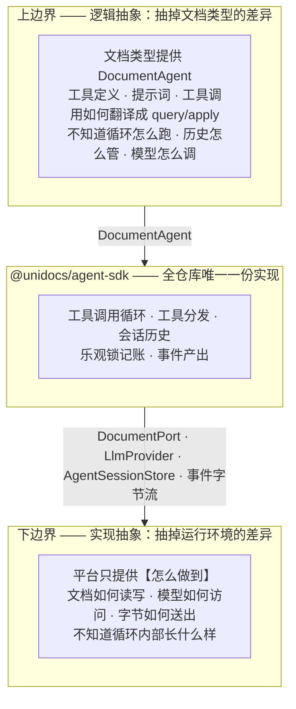

**逻辑抽象**回答的是「一个文档 agent 对外长什么样」——一组工具、一段提示词、一个「给我工具名和参数，我还你一个结果」的调用入口。内核不知道 PSD 有图层、docx 有段落，只知道调用一个工具会返回一个 `AgentToolResult`。

**工具调用如何翻译成 `query` / `apply`，属于上边界的实现方，不属于内核。** 这一点值得写明，因为它容易被当成可以共用的样板：docx 的 `apply_insertImage` 收到 `hash` 字符串，必须先 `resolveBlob` 换成 SBlob 才能构造操作（`doctype-docx/src/agent.ts:86-113`），而 psd 的操作参数可以原样透传。它们今天看起来像，明天就不像——把它抽进内核，只会换来一堆为了让抽象成立而开的口子。

**实现抽象**回答的是「这些动作靠什么完成」——文档读写通过什么通道、模型通过什么协议、结果字节怎么送到调用方。它对所有平台是同一套，DurableObject 和 Node 进程在这一层是同构的。

### 1.2 两个方向的扩展互不相交

这是「平台可扩展」的具体含义：

| 要新增什么 | 要做的事 | 不需要碰的 |
|---|---|---|
| 一个新文档类型（例如 xlsx） | 实现上边界：一个 `DocumentAgentFactory`——工具定义、提示词、以及它自己的 `toolCall` | 内核、所有平台代码 |
| 一个新平台（例如 AWS） | 实现下边界：`DocumentPort`、`AgentSessionStore`、一层传输外壳 | 内核、所有文档类型 |
| 一个新大模型供应商 | 实现下边界的一个接口：`LlmProvider` | 内核、所有文档类型、所有平台 |

三种扩展都不修改内核，也不互相牵动。

### 1.3 两层边界的接口

| 边界 | 接口 | 由谁实现 | 定义在 |
|---|---|---|---|
| 上（逻辑） | `DocumentAgentFactory` → `DocumentAgent` = tools + instructions + toolCall | 文档类型 | `protocol/src/types.ts:118-129`，**已存在，本次不改** |
| 下（实现） | `DocumentPort` —— 文档读写，`apply` 显式收 `baseVersion` | 平台 sdk | 5.2 |
| 下（实现） | `LlmProvider` —— 模型访问 | agent-sdk 内置 Anthropic / OpenAI，可另加 | 5.4 |
| 下（实现） | `AgentSessionStore` —— 会话历史落盘 | 平台 sdk | 6.3 |
| 下（实现） | 事件字节流 → 平台响应对象 | 平台 sdk | 7.4 |

下边界之所以要拆成四个接口而不是一个，是因为它们的变化原因不同：换平台影响文档读写、会话存储和传输，换模型供应商只影响 `LlmProvider`。

另有一个接口属于**内核**而非下边界，容易放错位置：`ContextPolicy`（历史裁剪，6.2）。判断"什么该留在上下文里"与运行环境无关，所以它在内核；"字节存到哪儿"才是下边界。两者的分界线是 `Uint8Array`。

### 1.4 上边界已经有了，缺的是下边界

| 边界 | 状态 |
|---|---|
| 上（逻辑） | **已存在且被遵守。** 三个文档类型都实现了 `DocumentAgentFactory`，拿到的 `context` 只有 `query` / `apply` / `resolveBlob` / `readBlob`，都不知道 DurableObject 的存在。本次不动它。 |
| 下（实现） | **不存在。** 平台把循环整个吃进了自己的实现里——`cloudflare-sdk/src/operator-do-agent.ts` 的 296 行里，ReAct 循环、`DocumentAgentContext` 的 DO 实现、身份透传、结果渲染全部交织在一个类里，没有一条缝能让 Azure 插进来。 |

所以本次的工作是**单向的**：把内核从平台实现里剥出来，并把下边界补成显式接口。上边界只需要确认它没被顺手破坏。

一处例外：`DocumentAgent` 的**返回值**约定要收口——图片必须走 `AgentToolResult.content` 的 image part，不能像 psd 今天那样塞进 `structuredContent` 再让平台层去搜（2.4）。那是协议层的约定，不是分发逻辑。

后果见第 2 章。

### 1.5 本次范围

| 编号 | 内容 | 本次 | 章节 |
|---|---|---|---|
| A | 建立两层边界：循环内核、工具分发、消息格式、大模型接口 | ✅ 做 | 3–5 |
| B | 会话历史裁剪、会话持久化（含两个平台的实现） | ✅ 做 | 6 |
| C | 事件流 + 客户端 SDK | ✅ 做 | 7–8 |

B 里唯一推迟的是**摘要压缩**（把最早若干轮交给模型总结）——接口支持，本次不实现，理由见 6.2.5。

验证方式：以 PSD 为样板走通全链路，并用 Azure 证明下边界确实可换（11 章 V8、V11）。

---

## 2. 现状：两层边界缺失的后果

### 2.1 只有一条链路真正能跑

| 链路 | 状态 | 卡在哪 |
|---|---|---|
| cloudflare-psd | 能跑 | 唯一配置了真实大模型接入的，`cloudflare-psd/src/anthropic.ts` |
| cloudflare-markdown | 不能 | `llmProvider` 是抛异常的占位，`cloudflare-markdown/src/worker.ts:29` |
| cloudflare-docx | 不能 | 同上；且图片路径还会撞 P6 |
| azure-markdown / azure-docx | 不能 | operator 接口一律返回 501，`azure-sdk/src/local-editor.ts:103` |
| azure-psd | 不存在 | Azure 栈里没有 psd |

要让**第二条**链路跑起来，会撞上两件事，都在下边界：

| # | 撞上什么 |
|---|---|
| 1 | 循环无法复用——唯一能用的那份依赖 `DurableObjectStub` / `Request` / `Response` |
| 2 | 大模型接入要重写——`anthropic.ts` 躺在 `cloudflare-psd` 这个叶子包里 |

上边界不在这个清单里：新文档类型写自己的 `DocumentAgentFactory` 本来就是它该做的事，不是重复劳动。

需要说明的是，Azure 至今没有 agent，直接原因是那一期把它划在范围外（`azure-sdk/src/local-editor.ts:97-101` 注明是 future work），并不是被 Cloudflare 的实现挡住了。下边界缺失影响的是**现在补做时的成本**，不是它当初没做的原因。

### 2.2 代码分布

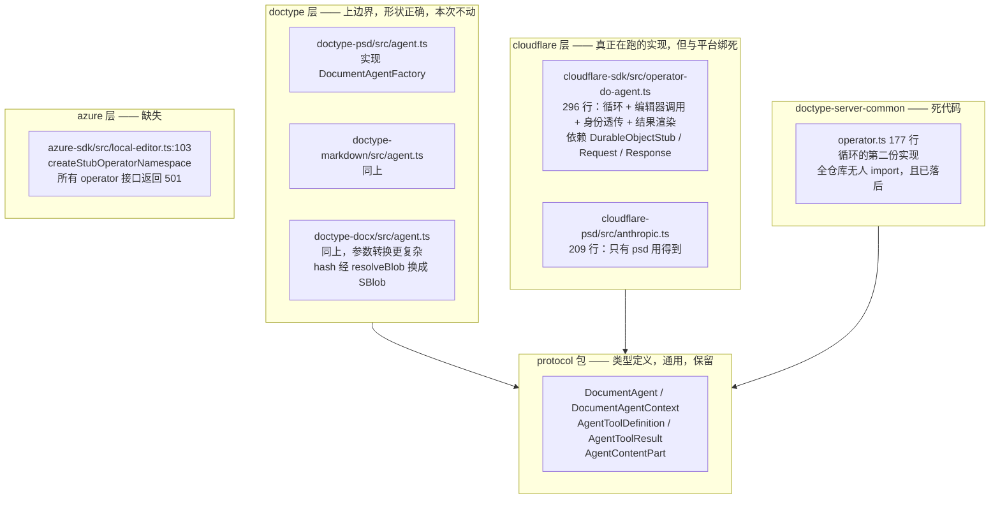

### 2.3 具体问题清单

| # | 问题 | 位置 |
|---|---|---|
| P2 | 唯一可用的循环实现依赖 Cloudflare 类型，Azure 无法复用 | `cloudflare-sdk/src/operator-do-agent.ts` |
| P3 | 存在第二份无人使用且已落后的循环实现 | `doctype-server-common/src/operator.ts` |
| P4 | 大模型适配层放在最外层的叶子包里，其他文档类型用不到 | `cloudflare-psd/src/anthropic.ts` |
| P5 | 同一仓库存在两套互相冲突的图片约定 | 见 2.4 |
| P6 | `renderToolResult` 钩子全仓库无人设置，docx 的图片路径一跑就抛异常 | `operator-do-agent.ts:25` 声明、`:112` 调用、`:263` 抛出 |
| P7 | `/run` 是一次阻塞请求，PSD 最多 25 轮循环期间零反馈，断线即全部丢失 | `web-psd/src/main.ts:374-383` |
| P8 | 会话历史无上限增长，且只在内存中，进程重启即丢 | `operator-do-agent.ts:55` |

### 2.4 两套冲突的图片约定

| 文档类型 | 做法 | 位置 |
|---|---|---|
| docx | 返回协议层的 `content: [{ type:"image", blob }]` | `doctype-docx/src/agent.ts:75` |
| psd | 把 base64 塞进普通数据字段 `{ $image: { base64 } }`，再由大模型适配层递归搜索捞出 | `doctype-psd/src/queries.ts:101` + `cloudflare-psd/src/anthropic.ts:72` |

docx 那条路从未真正跑通过：它会撞上 `renderDefaultAgentToolResult` 的抛异常分支（P6），只是因为 docx 的 `llmProvider` 本身就是个抛异常的占位实现（`cloudflare-docx/src/worker.ts:29`），所以一直没暴露。

PSD 那条路的副作用：base64 让数据膨胀三分之一，并且撞过 SValue 的字符串长度上限（提交 `da9028d` 就是修这个）。

---

## 3. 两层边界落到具体的包上

1.1 是抽象形状，这一节是它对应的实际代码归属。

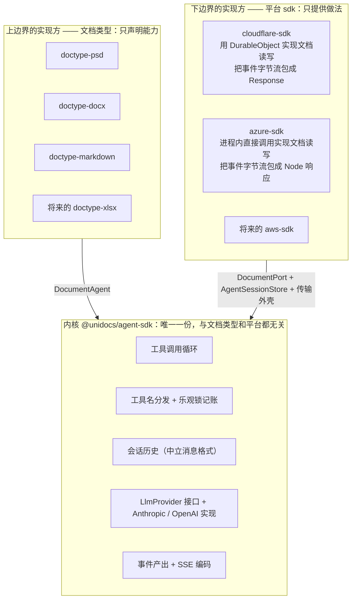

两条不可越界的规则：

1. **文档类型永远看不到 `DocumentPort` 的实现**。它拿到的是内核包装过的 `DocumentAgentContext`，不知道文档是通过 DurableObject 还是进程内调用读到的。
2. **平台 sdk 永远看不到循环内部**。它拿到的是一个事件序列，负责把它变成本平台的响应对象，不参与决定何时调模型、何时调工具。

这两条如果被打破，就退回到今天的状态（1.4）。4.3 给出机器可校验的落地方式。

---

## 4. 包与约束

### 4.1 新增包

| 包名 | 职责 |
|---|---|
| `@unidocs/agent-sdk` | 服务端 agent 内核 |
| `@unidocs/client-sdk` | 浏览器侧：agent 通道 + 文档同步 |

两个包都不依赖任何云 SDK。

### 4.2 依赖方向

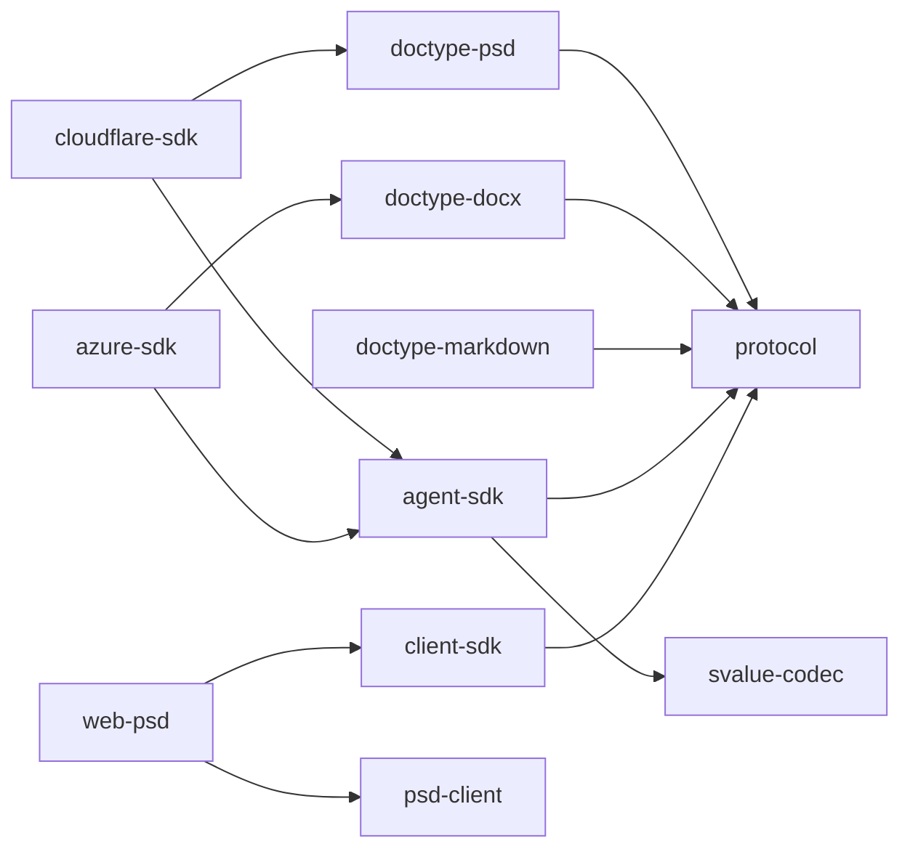

无环。两个值得注意的地方：

- **文档类型不依赖 `agent-sdk`。** 它们只实现 `protocol` 里已有的 `DocumentAgentFactory`，一个新依赖都不加。把两者接起来的是平台 sdk：`cloudflare-psd/src/worker.ts` 同时 import 文档类型和 `agent-sdk`，再把前者交给后者。
- 这也顺带消掉了原本担心的一个问题：`psd-client` 从 `@unidocs/doctype-psd/engine` 引 `applyOne`，如果 `doctype-psd` 依赖了 `agent-sdk`，就要担心服务端代码被卷进浏览器 bundle。现在它不依赖，问题不存在。

`agent-sdk` 自身只依赖 `protocol` 和 `svalue-codec`。

### 4.3 平台无关性如何保证

仓库没有 eslint / biome，只有 `tsc` + `vitest`，所以用两道机制：

1. `packages/agent-sdk/tsconfig.json` 的 `types` 不包含 `@cloudflare/workers-types`，`lib` 不包含 `DOM`。写出 `DurableObjectStub` 或 `Response` 直接编译失败。
2. 新增 `tests/unit/agent-sdk-purity.test.ts`：扫描 `packages/agent-sdk/src/**` 的所有 import 语句，断言只出现 `@unidocs/protocol`、`@unidocs/svalue-codec` 和相对路径。

这两道机制守住的是 3 章的**规则 1**（内核不知道平台）。**规则 2**（平台不知道循环内部）没有等价的机器检查——平台 sdk 本来就允许 import `agent-sdk`。它靠两件事守：

- 循环的状态（会话历史、`lastKnownVersion`、迭代计数）全部封在 `AgentSession` 私有字段里，平台拿不到，也就无从参与决策。平台唯一能做的就是消费 `run()` 吐出的事件序列。
- 代码检视：如果某个平台 sdk 里出现了「判断该不该再调一次模型」这类逻辑，就是越界了。

---

## 5. 服务端设计

### 5.1 类图

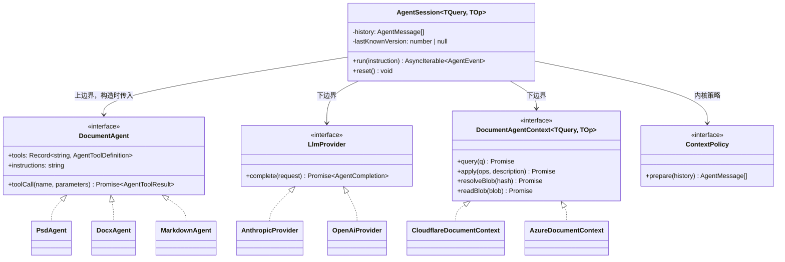

图里只有 `AgentSession`、`LlmProvider`、`ContextPolicy` 是本次新增的。`DocumentAgent`（`protocol/src/types.ts:118`）和 `DocumentAgentContext`（`:105`）都已经存在且形状正合适——纯语义，不知道 HTTP、DurableObject、CBOR 的存在。

**`AgentSession` 与 `DocumentAgent` 的分工**，这是本章最要紧的一条线：

| 归 `AgentSession`（内核） | 归 `DocumentAgent`（文档类型） |
|---|---|
| 什么时候调模型、调几次、什么时候停 | 一个工具名 + 一组参数，具体要做什么 |
| 把工具表交给模型，把模型的选择转成一次 `toolCall` | 把这次调用翻译成 `query` / `apply`，包括参数转换 |
| 记录 `lastKnownVersion`，`apply` 前校验，冲突时把提示喂回模型 | 不管版本，只管调 `context.apply` |
| 会话历史、裁剪、持久化、事件产出 | 无状态 |

内核对工具的全部认知就是「调用它会返回一个 `AgentToolResult`」。它不认识 `query_` / `apply_` 前缀，也不认识图层或段落。

### 5.2 乐观锁记账归内核，但 doctype 看到的接口不变

内核不认识 `query_` / `apply_` 前缀，那「`apply` 之前必须先 `query`」这条规则由谁来守？

今天它守在平台侧：`operator-do-agent.ts:187-220` 的 `#query` / `#apply` 一边转发请求，一边维护 `#lastKnownVersion`，并在构造 apply 请求时把 `baseVersion` 塞进去。这是下边界缺失的又一处症状——一条与平台无关的规则寄生在 DurableObject 的实现里，Azure 要重写一遍。

新的做法是加一个包装层：

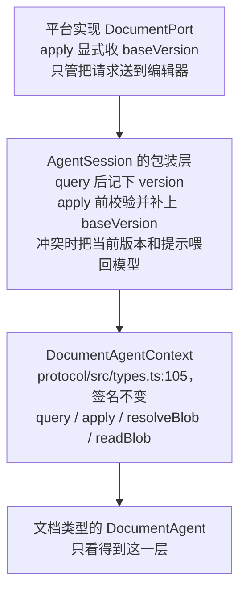

两个接口的差别只在 `apply`：

```ts
// 下边界：平台实现这个。版本由调用方给，平台不猜。
export interface DocumentPort<TQuery, TOp> {
  query(q: SValueType<TQuery>): Promise<{ data: SValue; version: number }>;
  apply(
    operations: readonly SValueType<TOp>[],
    description: string,
    baseVersion: number,          // ← 显式参数
  ): Promise<{ version: number }>;
  resolveBlob(hash: string): Promise<SBlob>;
  readBlob(blob: SBlob): Promise<SBlobData>;
}

// 上边界：文档类型看到的，与今天完全一致，没有 baseVersion
// protocol/src/types.ts:105 的 DocumentAgentContext，一个字不改
```

这样三件事同时成立：

- 乐观锁规则只有一份实现，在内核里，两个平台共享
- 平台实现变成纯粹的传输，不持有任何会话状态
- 文档类型完全无感——`context.apply(ops, desc)` 的写法不变

### 5.3 文档类型侧要改什么

**分发逻辑不动。** `query_` / `apply_` 前缀怎么解析、参数怎么转换，仍然是各文档类型自己的事。psd 和 markdown 今天的 `toolCall` 逐行相同，那是巧合而不是共性——docx 已经先分叉了（它的 `apply_insertImage` 必须先 `resolveBlob` 把 `hash` 换成 SBlob，`doctype-docx/src/agent.ts:86-113`）。把这段抽进内核，只会换来一堆为了让抽象成立而开的口子。

本次对文档类型只有**一处**要求，而且是协议层的，不是分发逻辑：

> `toolCall` 返回图片时，必须放进 `AgentToolResult.content` 的 image part，不能塞进 `structuredContent` 让下游去搜。

docx 已经这么做了（`doctype-docx/src/agent.ts:75`）。psd 需要改（2.4）：

```ts
// doctype-psd/src/queries.ts:101
- return { $image: { base64: btoa(bin), mediaType: "image/png" }, width, height, region };
+ return { image: await ctx.makeSBlob({ data: png, contentType: "image/png" }), width, height, region };

// doctype-psd/src/agent.ts 的 query_getPreview 分支
+ return {
+   content: [{ type: "image", blob: result.data.image, mediaType: "image/png" }],
+   structuredContent: { width, height, region, version: result.version },
+ };
```

改完之后 `cloudflare-psd/src/anthropic.ts:72` 的 `findImage` 递归搜索、`:82` 的 `previewMeta`、以及 `OperatorConfig.renderToolResult` 整个钩子都可以删掉。

### 5.4 消息格式中立化

这是本次唯一一处**重写而非搬家**的改动。

**今天：** 循环内部用 OpenAI 的消息格式（`operator-do-agent.ts:98` 读 `response.choices[0].message`），于是 Anthropic 适配层必须双向翻译两次。而图片因为被压成了 JSON 字符串，只能靠递归搜索捞回来。

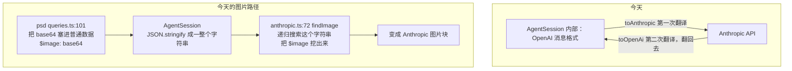

**之后：** 循环内部用 agent-sdk 自己的中立格式，每个大模型适配层只单向翻译一次。图片是结构化字段，不需要搜索。


中立消息类型：

```ts
export type AgentMessage =
  | { readonly role: "user";      readonly content: string }
  | { readonly role: "assistant"; readonly text?: string; readonly toolCalls?: readonly AgentToolCall[] }
  | { readonly role: "tool";      readonly callId: string; readonly result: AgentToolResult };

export interface AgentToolCall {
  readonly id: string;
  readonly name: string;
  readonly arguments: JsonValue;
}

export interface LlmProvider {
  complete(request: {
    readonly system: string;
    readonly messages: readonly AgentMessage[];
    readonly tools: readonly AgentToolDefinition[];
  }): Promise<AgentCompletion>;
}

export interface AgentCompletion {
  readonly text?: string;
  readonly toolCalls?: readonly AgentToolCall[];
}
```

`role: "tool"` 那一支携带的是结构化的 `AgentToolResult`（`protocol/src/types.ts:100`），其中的 `content` 数组里图片是 `{ type:"image", blob, mediaType }`。适配层直接 `filter(p => p.type === "image")` 拿到它。

**随之删除：** `anthropic.ts` 的 `findImage`、`previewMeta`，以及 `OperatorConfig.renderToolResult` 整个钩子（`operator-do-agent.ts:25`）。P5 和 P6 一并解决。

### 5.5 AgentSession 的完整构造签名

```ts
export class AgentSession<TQuery, TOp> {
  constructor(deps: {
    /** 上边界：文档类型的工厂。protocol/src/types.ts:127，签名不变 */
    readonly agentFactory: DocumentAgentFactory<TQuery, TOp>;
    /** 下边界：文档读写，apply 显式收 baseVersion（5.2） */
    readonly port: DocumentPort<TQuery, TOp>;
    /** 下边界：模型访问 */
    readonly provider: LlmProvider;
    /** 下边界：会话持久化（6.3），不传则只在内存里 */
    readonly store?: AgentSessionStore;
    /** 下边界：根引用提交（6.4），不传则不保活 */
    readonly cas?: CasRootRefGateway;
    /** 内核策略：历史裁剪（6.2），不传用默认三级策略 */
    readonly contextPolicy?: ContextPolicy;
    /** 循环上限，不传为 10。PSD 传 25 */
    readonly maxIterations?: number;
  });
  run(instruction: string): AsyncIterable<AgentEvent>;
  reset(): Promise<void>;
  /** 从 store 恢复历史；进程或实例重建后由平台外壳调用一次 */
  restore(): Promise<void>;
}
```

构造时 `AgentSession` 用 `port` 包出一个带乐观锁记账的 `DocumentAgentContext`，再调 `agentFactory(context)` 拿到 `DocumentAgent`（5.2）。文档类型全程只接触最后那个 context。

`maxIterations` 从 `OperatorConfig`（`operator-do-agent.ts:32`）移到这里——它是循环参数，属于内核，不属于平台配置。PSD 需要 25 的理由不变：一次编辑要「找图层 → 看预览 → 变换 → 再看预览确认」，默认的 10 会把真实指令切在半路。

---

## 6. 会话历史：裁剪与持久化

### 6.1 共同前提：历史是 SValue 可编码的

裁剪和持久化处理的是同一个对象——`AgentSession` 的 `history`。因为 5.4 把它改成了 SDK 自己的中立类型，它整体是 SValue 可编码的：

| 消息 | 字段 | 可编码性 |
|---|---|---|
| `user` | `content: string` | SPrimitive |
| `assistant` | `text?`、`toolCalls?: [{id, name, arguments: JsonValue}]` | 全部是 JSON 值 |
| `tool` | `callId`、`result: AgentToolResult` | `structuredContent` 是 JsonValue；`content` 里图片的 `blob` 是 SBlob，本身就是 SPrimitive |

推论很关键：**图片在历史里只是一个 CAS hash，不是字节**（SBlob 走 `SBlobTag = 65_536` 编码，`protocol/src/types.ts:174`）。所以一段 25 轮、含 10 张预览图的会话，落盘只有几十 KB，而不是几十 MB。

#### 6.1.1 必须用 SValue 编码，不能用 JSON

这不是偏好，是硬性的：SBlob 的品牌是一个 Symbol（`protocol/src/types.ts:32` 的 `sBlobSignature`），而 `JSON.stringify` **丢弃 Symbol 键**。JSON 往返之后 `isSBlob()` 返回 false，图片引用变成一个普通的 `{hash}` 对象，再也认不出来。

仓库对此的立场是明写在代码里的（`editor-do-svalue.ts:843`）：

```ts
if (encoded.refs.length > 0) {
  return Response.json({ error: "This response requires the SValue media type" }, { status: 406 });
}
```

含 SBlob 引用的值请求 JSON 输出，直接 406。

值得注意的是，端口层现有的两个 `DeltaLog` 实现恰恰用的是 JSON——`ports-cf.ts:81` 的 `JSON.stringify(d.operations)` 和 `ports-pg.ts:104` 的同一句。**所以那两条路承载不了含 SBlob 的操作**，它们服务的是不带二进制引用的文档类型。真正跑 PSD 的 `editor-do-svalue.ts:305` 走的是 `encodeSValue`。会话历史含图片，必须跟后者。

#### 6.1.2 三件互相独立的事

设计这一章时最容易犯的错，是把下面三件事搅成一件：

| 关注点 | 结论 | 依据 |
|---|---|---|
| 用什么格式序列化 | SValue CBOR | 6.1.1 |
| 编出来的字节存哪儿 | 直接写进表的字节列 | 6.3 |
| 历史引用的图片怎么不被回收 | 单独提交根引用，与字节存哪儿无关 | 6.4 |

第二件和第三件是正交的：无论字节放在 SQLite、Postgres 还是别处，引用计数都得单独做；反过来，引用计数做好了也不会替你决定字节该放哪。

### 6.2 裁剪

#### 6.2.1 硬约束：不能拆散工具调用的配对

Anthropic 的 Messages API 要求每个 `tool_use` 块在紧随其后的消息里有对应的 `tool_result`；OpenAI 要求每个 `tool_calls` 有对应的 `role:"tool"`。所以**裁剪的最小单位不是消息，是一轮**：

```
一轮 = 一条 assistant 消息（含 N 个 toolCalls）
     + 对应的 N 条 tool 消息
```

这条约束直接排除了「保留最近 K 条消息」这种最直觉的写法——它会切出孤立的 `tool_result`，请求会被 API 拒绝。

#### 6.2.2 三级策略，从轻到重

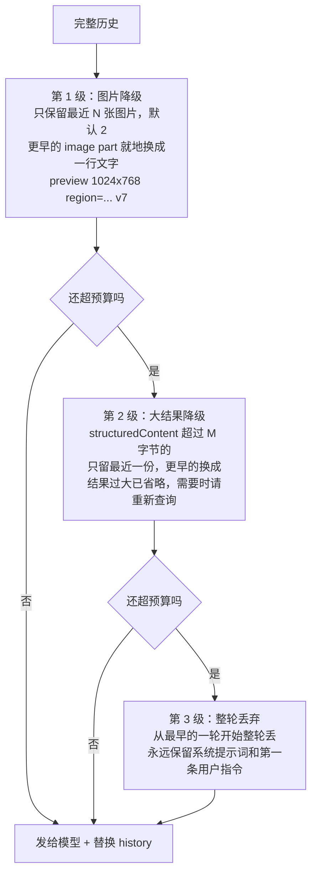

前两级是**就地替换**，不改变消息数量，因此不可能破坏 6.2.1 的配对；只有第 3 级会删消息，而它以「轮」为单位。

第 1 级用的那行文字，正是今天 `cloudflare-psd/src/anthropic.ts:82` 的 `previewMeta` 生成的内容。它从大模型适配层搬到裁剪策略里——这才是它该在的位置：保留多少张图是上下文管理的决定，不是协议翻译的决定。

第 2 级针对的是 PSD 的 `getDoc`——它返回整棵图层树，一次就可能几十 KB。

#### 6.2.3 预算怎么算

`agent-sdk` 不引入 tokenizer 依赖（那会带来一个几 MB 的词表，且各家模型不同）。用估算：

| 内容 | 估算方式 |
|---|---|
| 文字 | UTF-8 字节数 ÷ 3.5 |
| 图片 | 宽 × 高 ÷ 750 |

预算默认取模型上下文窗口的 60%，余量留给回复和估算误差。估算不准不会导致错误，只会裁多或裁少；真的超限时 provider 会报错，此时按错误再裁一次并重试一次，仍失败则以 `run-error` 结束。

#### 6.2.4 一个明确的取舍：裁剪就地生效

`ContextPolicy.prepare` 的返回值**直接替换 `AgentSession` 的 history**，不是只用于本次发送。

| | 就地生效（选定） | 只用于发送 |
|---|---|---|
| 历史体量 | 有界 | 无界增长 |
| 持久化 | 存的就是当前历史，天然有界 | 要么存完整历史（无界），要么存裁剪后的（与发送的不一致） |
| 可预测性 | 发给模型的 = 存下来的 = 恢复出来的 | 三者不一致，出问题难排查 |
| 代价 | 降级不可逆，旧预览图找不回来 | 理论上可找回 |

选就地生效。降级本来就是有损的，保留完整历史只是把同一份损失往后推，却换来无界增长和三份不一致的状态。

#### 6.2.5 接口

```ts
export interface ContextPolicy {
  prepare(history: readonly AgentMessage[]): Promise<readonly AgentMessage[]>;
}

export function createDefaultContextPolicy(opts?: {
  maxImages?: number;        // 默认 2
  maxResultBytes?: number;   // 默认 8192
  budgetTokens?: number;     // 默认 120_000
}): ContextPolicy;
```

`prepare` 是异步的，为的是给「摘要压缩」留路——把最早若干轮交给模型总结成一段文字需要额外调一次模型，所以 `ContextPolicy` 实现可以在构造时拿到 `LlmProvider`。**本次不实现摘要压缩**，只保证接口不必回头改。

### 6.3 持久化

#### 6.3.1 下边界的第四个接口

持久化回答的是「字节存哪儿」，属于实现抽象，所以它是下边界的接口，与 `DocumentPort` 平级。

```ts
export interface AgentSessionStore {
  load(): Promise<{ bytes: Uint8Array; token: string } | null>;
  /** token 传 null 表示"我认为它还不存在"。不匹配时抛 SessionStoreConflictError */
  save(bytes: Uint8Array, token: string | null): Promise<string>;
  clear(): Promise<void>;
}
```

三点说明：

- **存字节，不存对象。** `agent-sdk` 负责 `encodeSValue(history)`，平台只管把一串字节按 sessionId 存起来。平台实现不需要理解消息结构，消息格式演进时也不用跟着改。
- **带条件写。** `token` 是一个自增序号，两个平台都一样。这与仓库现有纪律一致——`ports.ts` 对 `DeltaLog.append` 的要求原文是 "Enforce it structurally (primary key / etag / conditional insert), not with a read-then-write check"。
- **按会话作用域。** store 实例在构造时就绑定了 sessionId，接口上不再出现它。与 `ports.ts` 开头 "Every port in this module is scoped to one Doc session" 一致。

#### 6.3.2 为什么需要条件写：两个平台的并发模型不同

| | Cloudflare | Azure |
|---|---|---|
| 承载 | 一个 sessionId 对应一个 OperatorDO 实例 | 无状态多副本，任一副本都可能处理请求 |
| 并发 | DO 单线程，天然串行 | 两个并发 run 可能落在不同副本上 |
| 条件写 | 恒成立，`token` 只是形式 | 真正起作用 |

`ports.ts:44-63` 已经为 `DeltaLog.remove` 点明过这个差异："Cloudflare has one (the Durable Object's `#requestTail`), Azure's stateless replicas do not"。会话历史面对的是完全相同的问题。

除条件写外还需要一条约束：**同一会话同时只允许一个 run**。CF 上由 DO 天然保证；Azure 上靠条件写检测冲突后拒绝第二个 run，返回明确错误，而不是让两段对话互相覆盖。今天客户端其实已经在做这件事（`web-psd/src/main.ts` 的 `chatBusy` 标志），但那是建议而非保证。

#### 6.3.3 字节直接进表的字节列

`encodeSValue` 产出的就是 `Uint8Array`，写进 SQLite 的 `BLOB` 列或 Postgres 的 `BYTEA` 列即可，读回来 `decodeSValue` 就把 SBlob 的品牌重建了。**不需要绕道 CAS。**

仓库已有现成先例——`editor-do-svalue.ts:123-132` 的暂存表就是这么存 SValue 字节的：

```sql
CREATE TABLE IF NOT EXISTS svalue_pending (
  singleton INTEGER PRIMARY KEY CHECK (singleton = 1),
  ...
  delta_bytes    BLOB NOT NULL,
  snapshot_bytes BLOB
)
```

**曾经考虑过、但不采用的做法：** 把历史本身做成一个 CAS 节点（`makeSBlob({data, contentType: SValueContentType})`），表里只存 hash。它的吸引力在于 `sblob-context.ts:145` 会自动从 CBOR 里提取内部 refs 并逐个 lease，引用计数顺带就做了。不采用的理由：多一次 CAS 往返，恢复时多一次读，而内容寻址的去重收益接近零——每轮对话历史都不同，永远不会命中已有节点。引用计数改为显式提交（6.4），只多几行代码。

#### 6.3.4 Cloudflare 实现

DO 的 SQLite 存储，与 Editor DO 同一做法（`editor-do-svalue.ts:107` 起用的就是 `ctx.storage.sql.exec`）：

```sql
CREATE TABLE IF NOT EXISTS agent_session (
  singleton INTEGER PRIMARY KEY CHECK (singleton = 1),
  seq       INTEGER NOT NULL,
  bytes     BLOB    NOT NULL
);
```

`token` 就是 `seq` 的字符串形式。`save` 是一条 `UPDATE ... WHERE seq = ?`（首次则 `INSERT`），条件写由主键和 WHERE 结构性保证，不做读-改-写。

用 SQLite 而不是 DO 的 KV（`ctx.storage.put`）：KV 单值上限 128KB，而裁剪后的历史以模型上下文窗口的 60% 为目标，会顶破；SQLite 的 BLOB 列没有这个限制。Editor DO 早已因为同样的原因走 SQLite。

#### 6.3.5 Azure 实现

Postgres 一张表，与 `PgDeltaLog` 同一个库、同一套 `Queryable` 抽象（`ports-pg.ts:28`）：

```sql
CREATE TABLE IF NOT EXISTS agent_sessions (
  doc_type   TEXT    NOT NULL,
  session_id TEXT    NOT NULL,
  seq        INTEGER NOT NULL,
  bytes      BYTEA   NOT NULL,
  PRIMARY KEY (doc_type, session_id)
);
```

`save` 是 `UPDATE ... WHERE seq = $expected`，受影响行数为 0 即冲突——与 `PgDeltaLog.append`（`ports-pg.ts:89-111`）完全相同的写法，连错误处理都能照抄。

用 Postgres 而不是 Azure Blob：会话历史需要的是条件写，Postgres 一条 `UPDATE ... WHERE` 就够，而 Blob 要走 ETag 的 `If-Match`，多一层往返和一套单独的错误映射。既然 Azure 侧已经有 Postgres 连接池和事务抽象（`PgUnitOfWork`，`ports-pg.ts:270`），复用它比新引一条 Blob 路径简单。Blob 在这套架构里的位置是放大对象（CAS 内容、文档快照），而会话历史几十 KB，不属于那一类。

#### 6.3.6 两个平台对照

| | Cloudflare | Azure |
|---|---|---|
| 实现类 | `DoAgentSessionStore` | `PgAgentSessionStore` |
| 落在 | `packages/cloudflare-sdk/src/agent-store-do.ts` | `packages/azure-sdk/src/agent-store-pg.ts` |
| 介质 | DO SQLite `BLOB` 列 | Postgres `BYTEA` 列 |
| 条件写凭据 | 自增 `seq` | 自增 `seq` |
| 条件写机制 | `UPDATE ... WHERE seq = ?` | `UPDATE ... WHERE seq = $n`，看 `rowCount` |
| 参照的现有代码 | `editor-do-svalue.ts:107,123` | `ports-pg.ts:89-111` `PgDeltaLog.append` |
| 本地测试 | Miniflare | Azurite + Postgres（`pnpm azure:up`） |

两边的凭据和机制现在是同构的——这本身是个好信号：说明 `AgentSessionStore` 这个接口没有偏向任何一方。

#### 6.3.7 共享契约测试

`doctype-server-common/src/testing/port-contract.ts` 已经立了「一份契约测试，两个平台各跑一遍」的先例。`agent-sdk` 导出同样形状的 `agentSessionStoreContract(makeStore)`，覆盖：

- 空 store 的 `load()` 返回 null
- `save(bytes, null)` 之后 `load()` 拿回同样的字节
- 用过期 token 调 `save` 抛 `SessionStoreConflictError`
- `clear()` 之后 `load()` 返回 null
- 两个并发 `save` 只有一个成功
- **存进去的字节含 SBlob 时，读回来 `isSBlob()` 仍为 true**（这条是为了钉死 6.1.1：任何一天有人把实现悄悄换成 JSON，这条会红）

### 6.4 引用保活：让历史里的图片不被回收

这是与「字节存哪儿」正交的一件事。历史里的图片是 CAS hash；如果没有人声明持有它，CAS 会把它回收，历史就烂了。

仓库现有的做法是显式提交**根引用**（`session.ts:633-643`）：

```ts
await commitRootRefsOrRollback(
  cas,
  `apply:${sessionId}:${nextVersion}`,   // requestId，用于幂等
  refs,                                   // CasReferences = Record<hash, 增量>
  () => rollbackTheDeltaWeJustWrote(),
);
```

`CasReferences`（`protocol/src/types.ts:24`）是**增量**而不是绝对集合，所以释放旧引用就是提交负数。

会话历史照此办理，只是换一个 requestId 前缀：

```ts
const { data, refs } = encodeSValueWithRefs(history);
// changes：新历史引用的 hash 各 +1，上一版引用但新版不再引用的各 -1
await commitRootRefsOrRollback(
  cas,
  `agent:${sessionId}:${seq}`,
  diffRefs(previousRefs, refs),
  () => store.save(previousBytes, seq),   // 失败则回滚到上一版
);
```

顺序与 `session.ts` 的写入顺序同构：**先落字节，再提交引用，引用失败就回滚字节**。反过来会在崩溃窗口里留下"引用已加、字节没写"的孤儿引用。

一个值得留意的取舍：会话历史持有的引用与文档持有的引用是**独立的两套**（前缀 `agent:` 与 `apply:`）。所以一个图层被删掉之后，文档不再引用那张预览图，但对话历史仍然引用着它——用户往回翻聊天记录时那张图还看得见。代价是这些像素会多留一段时间，直到裁剪把那条消息降级成文字（6.2.2 第 1 级），引用随之释放。

### 6.5 写入时机

选择：**每次 run 结束写一次，中途不写。**

理由：run 中途崩溃时，文档改动已经独立落在 Editor 里（那是另一套持久化，不受影响），丢的只是对话上下文；而在「不重放」的设计下（7.3），客户端本来就要靠 `reconcile()` 拿最终状态。为一个罕见路径付 25 次写的代价不划算。

留一个可配置的中途检查点 `checkpointEveryTurns`，**默认关闭**。PSD 这种单次 run 长达几分钟的场景如果实测体验不好，打开即可，不用改结构。

### 6.6 恢复时的防御性兜底

6.4 的根引用**应当**保证历史里的图片一直在。但引用计数系统总有失灵的可能——迁移脚本、手工清理、跨区域复制延迟。恢复时 `readBlob` 一旦失败：

**必须降级，不能抛异常。** 否则单个 blob 丢失会让整个会话永久打不开，而它本可以只是少一张图。

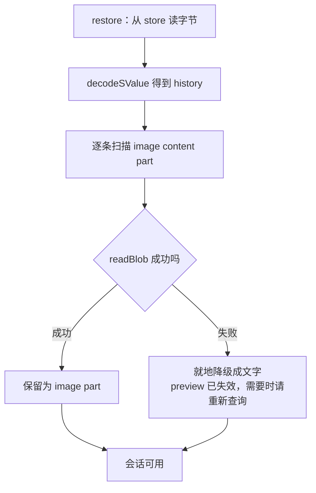

裁剪策略保证了最多只有 N 张（默认 2）图片还是 image part，更早的早已降级成文字，所以需要保活的 hash 极少，失效的影响面也小。这是 6.2 和 6.4 互相支撑的地方。

### 6.7 与第 1 章两层边界的对应

| 组件 | 属于哪层 | 由谁实现 |
|---|---|---|
| `ContextPolicy`（什么该留在上下文里） | 内核（逻辑） | `agent-sdk` 提供默认实现，文档类型只调参数 |
| `encodeSValue(history)`（序列化格式） | 内核 | `agent-sdk` |
| 根引用增量的计算（`diffRefs`） | 内核 | `agent-sdk` |
| `AgentSessionStore`（字节存哪儿） | 下边界（实现） | 平台 sdk |
| `CasRootRefGateway`（引用提交到哪儿） | 下边界（实现） | 平台 sdk，已存在于 `cas-client` |

分界线就是 `Uint8Array` 和 `CasReferences`：**什么该留在上下文里、编成什么格式、引用增量是多少**都是与平台无关的判断，属于内核；**字节和引用最终落到哪个存储**是与平台强相关的做法，属于下边界。

---

## 7. 事件流

### 7.1 事件表

```ts
export type AgentEvent =
  | { readonly type: "run-start";        readonly runId: string }
  | { readonly type: "assistant-text";   readonly text: string }
  | { readonly type: "tool-call";        readonly callId: string; readonly name: string; readonly arguments: JsonValue }
  | { readonly type: "tool-result";      readonly callId: string; readonly ok: boolean; readonly summary: string }
  | { readonly type: "document-changed"; readonly version: number }
  | { readonly type: "run-end";          readonly response: string; readonly iterations: number }
  | { readonly type: "run-error";        readonly error: string };
```

两个设计决定：

1. **`tool-result` 只带一句摘要，不带完整数据。** 工具结果可能是一整棵图层树或一张预览图，客户端不需要它 —— 需要的是模型，而模型在服务端已经拿到了。这样每个事件都很小，不需要分片。
2. **`document-changed` 单独成一个事件。** 每次 `apply` 成功就发一次，客户端可以立刻调 `reconcile()` 同步画布，不必等整个 run 结束。PSD 跑 25 轮时，用户能看到画布逐步变化，而不是最后一次性跳变。

### 7.2 一次 run 的时序

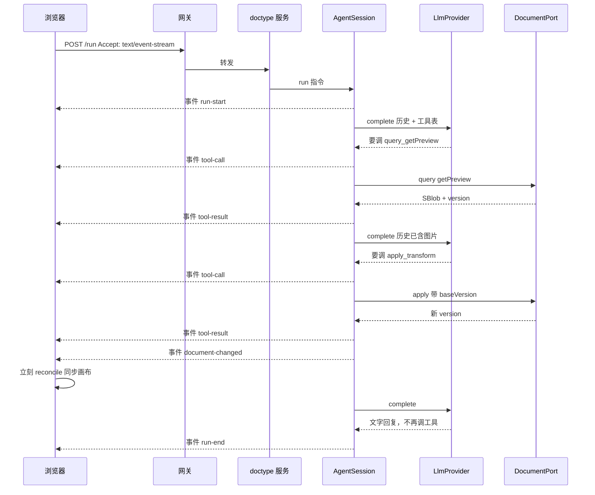

### 7.3 断线的语义

不做重放。断线时：

- 服务端的 `AgentSession` **继续跑完**，文档改动照常落到编辑器（编辑器才是文档状态的持有者）。
- 浏览器收到 `onError`，由调用方决定何时调 `reconcile()` 拿最终状态。

所以「保持连接」在这个设计下的实际含义是：心跳保活 + 断线告知。不是断线续传。

### 7.4 传输链路

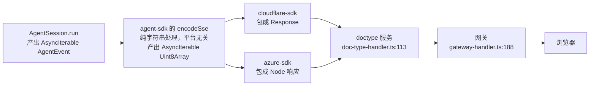

**好消息：链路已经是流式透明的，网关不需要改。**

- `gateway-handler.ts:188-202`：拿到上游 Response 直接 return，不读 body。`Accept` 头在转发白名单里，`Accept-Encoding: identity` 也已经设了，对 SSE 正合适。
- `doc-type-handler.ts:113-125`：转发给 operator，同样直接 return。

（此前担心的 body 缓冲在 `gateway-handler.ts:473`，那是建文档那条路，与 `/run` 无关。）

SSE 帧格式：

```
event: tool-call
data: {"callId":"toolu_01","name":"query_getPreview","arguments":{}}

: keepalive
```

每 15 秒发一次注释帧作为心跳，防止中间代理判定空闲断连。

### 7.5 向后兼容

`/run` 按 `Accept` 头分流：

| 请求头 | 行为 |
|---|---|
| `Accept: text/event-stream` | 返回 SSE 事件流 |
| 其他 | 返回今天的一次性 JSON `{ success, data: { response, iterations } }` |

一次性 JSON 的实现就是把事件流消费完，然后按结尾事件映射：

| 结尾事件 | 返回 |
|---|---|
| `run-end` | `{ success: true, data: { response, iterations } }`，HTTP 200 |
| `run-error` | `{ success: false, error }`，HTTP 500 |

与今天 `operator-do-agent.ts:105-124` 的返回完全一致。这样 markdown / docx 的现有调用和现有测试（`cloudflare-sdk/tests/operator-do.test.ts`，230 行）不受影响，迁移可以逐个文档类型推进。

---

## 8. 客户端设计

### 8.1 psd-client 的现状拆分

`packages/psd-client/src/doc-session.ts`（261 行）已经是一个通用的乐观并发同步引擎：本地立即 apply、待发队列、`opId` 去重重投、409 重整、`reconcile()`。它对 PSD 的耦合只有三处，都可以参数化：

| 耦合点 | 参数化后 |
|---|---|
| `import { applyOne } from "@unidocs/doctype-psd/engine"` | 注入 `applyLocal(doc, op) => doc` |
| `PsdDoc` / `PsdOp` 类型 | 泛型 `<TDoc, TOp>` |
| `RenderLike { applyOp, reset }` | 注入的可选渲染回调 |
| `loadDoc` 来自 `./doc-source.js` | 注入 `reload() => { doc, version }` |

剩下的 `render-client` / `render-core` / `render-worker` / `viewport` / `cas-blob-store`（596 行）才是 PSD 专有的，留在 `psd-client`。

### 8.2 类图

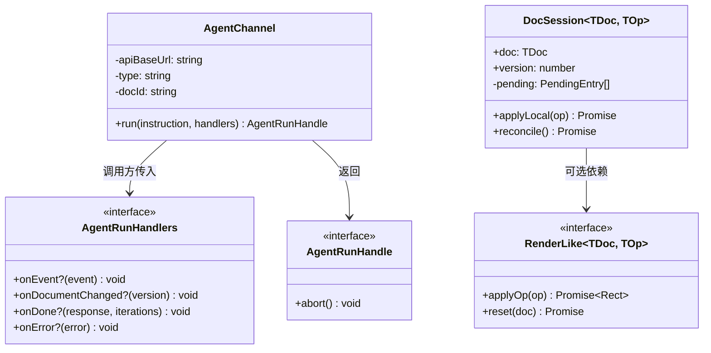

### 8.3 接口

```ts
export class AgentChannel {
  constructor(opts: {
    apiBaseUrl: string;
    type: string;
    docId: string;
    fetchImpl?: typeof fetch;
    /** 超过这个时长没收到任何帧就判定断线，默认 30000 */
    idleTimeoutMs?: number;
  });
  run(instruction: string, handlers: AgentRunHandlers): AgentRunHandle;
}

export class DocSession<TDoc, TOp> {
  constructor(opts: {
    apiBaseUrl: string;
    type: string;
    docId: string;
    doc: TDoc;
    version: number;
    applyLocal: (doc: TDoc, op: TOp) => TDoc | Promise<TDoc>;
    reload: () => Promise<{ doc: TDoc; version: number }>;
    render?: RenderLike<TDoc, TOp>;
    fetchImpl?: typeof fetch;
    genId?: () => string;
  });
  applyLocal(op: TOp): Promise<void>;
  reconcile(): Promise<void>;
}
```

**为什么不用 `EventSource`：** `EventSource` 只能发 GET 请求，不能带请求体，也不能自定义请求头。所以用 `fetch` + `ReadableStream` 手工解析 SSE 帧，大约 80 行。

**为什么不自动重连：** 因为不做重放，重连也拿不到断线期间的事件。自动重连只会制造"好像还连着"的假象。断线就如实告诉调用方。

### 8.4 两者配合

```ts
channel.run(text, {
  onDocumentChanged: () => session.reconcile(),        // 每次 apply 成功立刻同步
  onEvent: (e) => { if (e.type === "tool-call") showStep(e.name); },
  onDone: (reply) => addMsg("agent", reply),
  onError: (err) => { addMsg("err", err.message); session.reconcile(); },
});
```

对比今天（`web-psd/src/main.ts:374-390`）：等整个 run 跑完才 `reconcile()` 一次，中途界面上只有一个不动的「thinking…」。

---

## 9. PSD 迁移改动清单

| 文件 | 改动 |
|---|---|
| `doctype-psd/src/queries.ts:101` | `getPreview` 从 `btoa` 产出 base64 改为 `makeSBlob` 返回 SBlob 引用 |
| `doctype-psd/src/agent.ts` | 分发逻辑保留不动；只改 `query_getPreview` 分支，改为返回 image content part（5.3） |
| `doctype-psd/tests/agent.test.ts:61-76` | 断言反转：从「`$image` 透传且 `content` 为 undefined」改为「返回 image content part」 |
| `doctype-markdown/src/agent.ts` | **不动** |
| `doctype-docx/src/agent.ts` | **不动**。它的图片返回方式（`:75`）本来就是对的，只是从没跑通过——删掉 `renderToolResult` 钩子后这条路才真正打开（P6） |
| `cloudflare-psd/src/anthropic.ts` | 移到 `agent-sdk/src/providers/anthropic.ts`，删掉 `findImage` / `previewMeta`，翻译改为单向 |
| `cloudflare-psd/src/worker.ts` | 改为注入 `createPsdDocumentAgent` + Cloudflare 的 `DocumentPort` 实现 |
| `cloudflare-sdk/src/operator-do-agent.ts` | 296 行 → 约 90 行，只剩 DurableObject 外壳、身份校验、把事件流包成 Response |
| `doctype-server-common/src/operator.ts` | 删除（177 行死代码） |
| `azure-sdk/src/local-editor.ts:103` | 删掉 501 占位，改为真实的 `DocumentPort` 实现 |
| `cloudflare-sdk/src/agent-store-do.ts` | 新增：`DoAgentSessionStore`，DO SQLite `BLOB` 列 + `seq` 条件写（6.3.4） |
| `azure-sdk/src/agent-store-pg.ts` | 新增：`PgAgentSessionStore`，Postgres `BYTEA` 列 + `seq` 条件写，写法照搬 `ports-pg.ts:89-111`（6.3.5） |
| `azure-sdk` 的建表脚本 | 新增 `agent_sessions` 表；`migrate.ts` 加一版 |
| `psd-client/src/doc-session.ts` | 移到 `client-sdk`，泛型化 |
| `psd-client/src/index.ts` | 重新导出 `client-sdk` 的 `DocSession`，并绑定 PSD 的 `applyLocal` / `reload` |
| `web-psd/src/main.ts:357-397` | 改用 `AgentChannel`，展示逐步进度 |

---

## 10. 实施顺序

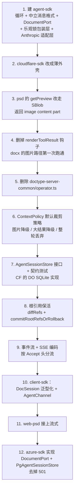

第 1-5 步是 A 块（两层边界），第 6-8 步是 B 块（裁剪与持久化），第 9-11 步是 C 块（流式），第 12 步是「平台无关」这个目标的真正证明——它同时验证下边界的两个接口（`DocumentPort` 和 `AgentSessionStore`）都确实可换。

每一步结束时全仓库测试必须通过，任何一步都可以独立成为一个提交。

---

## 11. 验收标准

| # | 标准 | 验证方式 |
|---|---|---|
| V1 | 文档类型的分发逻辑一行未动 | `git diff` 里 `doctype-markdown/src/agent.ts` 与 `doctype-docx/src/agent.ts` 无改动；`doctype-psd/src/agent.ts` 只有 `getPreview` 分支变化 |
| V2 | 内核不认识 `query_` / `apply_` | 全仓库搜索 `startsWith("query_")` **不应**命中 `packages/agent-sdk/` |
| V3 | `agent-sdk` 不 import 任何云相关模块 | `tests/unit/agent-sdk-purity.test.ts` |
| V4 | 循环行为不退化 | 新增契约测试：内存版 `DocumentPort` + 假 provider，跑完整循环，覆盖乐观锁、版本冲突重试、达到上限、未知工具名 |
| V5 | PSD 送给模型的图片字节与改造前完全一致 | 抓一次 provider 请求体，与改造前对比 |
| V6 | 现有 230 行 `operator-do.test.ts` 全绿 | `pnpm test` |
| V7 | 浏览器能看到逐步事件，画布逐步更新 | web-psd 手工端到端 |
| V8 | 同一条指令在 Azure 栈跑通 | `pnpm test:azure` 新增用例 |
| V9 | docx 的图片路径第一次真正跑通 | 现有 `doctype-docx/tests/agent.test.ts` 已覆盖 `getImage` / `insertImage`；再补一条端到端：删掉 renderToolResult 后，image content part 能被 Anthropic 适配层翻成图片块而不抛异常（P6） |
| V10 | 乐观锁记账在内核，平台不参与 | 契约测试：文档类型直接调 `context.apply` 而未先 `query`，断言被拒绝并提示先查询；且 `DocumentPort` 的假实现里没有任何版本状态 |
| V11 | `AgentSessionStore` 在两个平台行为一致 | 共享契约测试 `agentSessionStoreContract`，CF 用 Miniflare、Azure 用 Postgres 各跑一遍（6.3.7） |
| V12 | 会话历史存取不丢 SBlob | 契约测试最后一条：存进去含 SBlob 的历史，读回来 `isSBlob()` 仍为 true。这条钉死"不能改用 JSON"（6.1.1） |
| V13 | 裁剪不会切出孤立的 `tool_result` | 属性测试：随机生成含多工具调用的历史，裁剪后断言每个 `toolCall.id` 都有配对的 tool 消息（6.2.1） |
| V14 | 长会话不再无限增长 | PSD 跑满 25 轮后，`history` 的编码字节数低于设定预算，且图片 part 不超过 `maxImages` |
| V15 | 重启后会话可续 | 端到端：跑一轮 → 销毁 OperatorDO / 重启 Azure 进程 → 再发一条指令，模型能引用上一轮的内容 |
| V16 | 历史引用的图片不被回收 | 跑一轮产生预览图 → 删掉对应图层并 apply → 断言历史里那张图仍可 `readBlob`（6.4 的根引用生效） |

V8 是整个设计成立与否的判据：如果 Azure 跑不起来，说明抽象层没做到平台无关。V11 是它在存储维度上的对应判据。

---

## 12. 不在本次范围

| 项 | 原因 |
|---|---|
| 摘要压缩（把最早若干轮交给模型总结） | 需要额外一次模型调用，成本和质量都要实测才好定参数。接口已支持（`prepare` 是 async），前三级裁剪先跑一段时间看是否够用 |
| 逐字输出 | 需要 provider 支持流式并处理 `input_json_delta` 增量拼接，测试成本高，本次不做 |
| 事件重放 / 断线续传 | 需要把**事件序列**也持久化，那是与会话历史不同的一份数据（历史是给模型看的，事件是给界面看的）。7.3 已选定不重放 |
| 跨会话的长期记忆 | 本次的持久化只保证"同一个文档的对话可以续上"，不涉及跨文档、跨会话的知识沉淀 |
| 中途打断 / 追加指令 | 需要额外的控制通道，且「已经 apply 的操作要不要回滚」语义需要单独设计 |
| 数据分片 | 单向进度流下每个事件都很小，SSE 帧天然分帧，不需要 |

---

## 13. 风险

| # | 风险 | 应对 |
|---|---|---|
| R1 | DurableObject 在返回流未读完时无法休眠，一次 run 可能持续数分钟 | 今天的阻塞请求是同样的代价，不算新增开销 |
| R2 | Miniflare 本地栈是否透传流式响应未验证 | 第 6 步优先验证，失败则本地栈退回一次性 JSON，云上走流式 |
| R3 | 图片改走 SBlob 后送给模型的内容若有变化，模型行为会变 | V5 用请求体比对锁死 |
| R4 | 消息格式重写会改掉 `anthropic.ts` 大半 | V4 的契约测试 + V6 的现有测试双重兜底；这部分单独成一个提交，便于回退 |
| R5 | 内核不认识工具语义，等于把「守规矩」的责任交给了各文档类型——某天有人在 `toolCall` 里直接发网络请求、或者绕过 `context` 自己缓存版本，内核拦不住 | 这是选择上边界位置时接受的代价。用 V10 的契约测试守住最要紧的一条（乐观锁），其余靠代码检视 |

---

## 14. 已确认的设计决定

| 决定 | 结论 |
|---|---|
| 整体形状 | 一个内核 + 两层抽象边界：上边界抽掉文档类型差异，下边界抽掉运行环境差异。新增文档类型、新增平台、新增模型供应商三种扩展互不相交，且都不改内核 |
| 下边界为何拆成三个接口 | 变化原因不同：换平台影响文档读写和传输，换模型供应商只影响 `LlmProvider` |
| 本次范围 | A + B + C，B 里只推迟摘要压缩 |
| 会话历史的序列化格式 | SValue CBOR，**不能用 JSON**——SBlob 的品牌是 Symbol，`JSON.stringify` 会丢。端口层现有的两个 `DeltaLog` 恰恰用了 JSON，所以承载不了含 SBlob 的值 |
| 字节存哪儿 | 直接进表的字节列：CF 用 DO SQLite `BLOB`，Azure 用 Postgres `BYTEA`。不绕 CAS——历史每轮都变，内容寻址去重收益接近零 |
| 图片保活 | 与字节存哪儿正交，靠显式提交根引用 `agent:<sessionId>:<seq>`，与文档的 `apply:` 引用各自独立 |
| 裁剪的最小单位 | 一轮（assistant + 它全部的 tool 消息），不是一条消息——否则会切出孤立的 `tool_result`，被 API 拒绝 |
| 裁剪是否就地生效 | 是。返回值直接替换 history，让"发给模型的 = 存下来的 = 恢复出来的" |
| 图片通道 | 协议层归一，统一走 SBlob content part；删除 `$image` 和 `renderToolResult` |
| 事件流野心 | 单向进度流，不重放 |
| 客户端范围 | agent 通道 + 泛型化的 DocSession |
| 工具分发归谁 | **归文档类型，内核不接管。** `query_` / `apply_` 的解析和参数转换本来就是各文档类型不同的事——docx 的 `apply_insertImage` 要先 `resolveBlob`，psd 的可以直接透传。psd 与 markdown 今天逐行相同是巧合，不是共性。内核对工具的全部认知是「调用它返回一个 `AgentToolResult`」 |
| 上边界用什么接口 | 沿用已有的 `DocumentAgentFactory` / `DocumentAgent`（`protocol/src/types.ts:118-129`），本次不新造，也不修改 |
| 乐观锁记账归谁 | **归内核**，但通过包装层实现：平台实现 `DocumentPort`（`apply` 显式收 `baseVersion`），内核包成签名不变的 `DocumentAgentContext` 再交给文档类型。规则只有一份实现，文档类型无感（5.2） |
| 平台隔离位置 | 只在 `cloudflare-sdk` / `azure-sdk`，文档类型不感知 |
