# 通用 Agent SDK 设计

日期：2026-08-26
分支：`feat/agent-sdk`
状态：待 review

---

## 1. 要建立什么

### 1.1 一个内核，两层抽象边界

建立一份与**文档类型**无关、也与**运行平台**无关的 agent 内核。它的位置由上下两条抽象边界夹住：

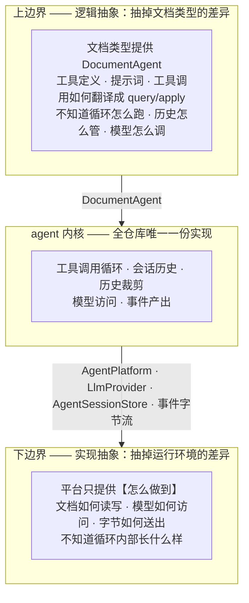

**逻辑抽象**回答的是「一个文档 agent 对外长什么样」——一组工具、一段提示词、一个「给我工具名和参数，我还你一个结果」的调用入口。内核不知道 PSD 有图层、docx 有段落，只知道调用一个工具会返回一个 `AgentToolResult`。

**工具调用如何翻译成 `query` / `apply`，属于上边界的实现方，不属于内核。** 这一点值得写明，因为它容易被当成可以共用的样板：docx 的 `apply_insertImage` 收到 `hash` 字符串，必须先 `resolveBlob` 换成 SBlob 才能构造操作（`doctype-docx/src/agent.ts:86-113`），而 psd 的操作参数可以原样透传。它们今天看起来像，明天就不像——把它抽进内核，只会换来一堆为了让抽象成立而额外增加的特殊处理。

**实现抽象**回答的是「这些动作靠什么完成」——文档读写通过什么通道、模型通过什么协议、结果字节怎么送到调用方。它对所有平台是同一套，DurableObject 和 Node 进程在这一层是同构的。

### 1.2 两个方向的扩展互不相交

这是「平台可扩展」的具体含义：

| 要新增什么 | 要做的事 | 不需要碰的 |
|---|---|---|
| 一个新文档类型（例如 xlsx） | 实现上边界：一张工具表 + 一段提示词。每个工具声明自己是读还是写，并给一个把参数转成 query / op 的纯函数 | 内核、所有平台代码 |
| 一个新平台（例如 AWS） | 实现下边界：`AgentPlatform`、`AgentSessionStore`、一层传输外壳 | 内核、所有文档类型 |
| 一个新大模型供应商 | 实现下边界的一个接口：`LlmProvider` | 内核、所有文档类型、所有平台 |

三种扩展都不修改内核，也不互相牵动。

### 1.3 两层边界的接口

| 边界 | 接口 | 由谁实现 | 定义在 |
|---|---|---|---|
| 上（逻辑） | `DocumentAgent` = `AgentTool[]` + instructions，全是数据和纯函数 | 文档类型 | 5.1.2。由既有的 `DocumentAgent`（`protocol/src/types.ts:118`）改形状而来 |
| 下（实现） | `AgentPlatform` —— `query` / `apply` / `readBlob`。**文档类型看不到它**，只有内核调 | 平台 sdk | 5.1.4。由既有的 `DocumentAgentContext`（`protocol/src/types.ts:105`）演变而来 |
| 下（实现） | `LlmProvider` —— 模型访问 | 内核内置 Anthropic / OpenAI，可另加 | 5.4 |
| 下（实现） | `AgentSessionStore` —— 会话历史落盘 | 平台 sdk | 6.3 |
| 下（实现） | 事件字节流 → 平台响应对象 | 平台 sdk | 7.4 |

下边界之所以要拆成四个接口而不是一个，是因为它们的变化原因不同：换平台影响文档读写、会话存储和传输，换模型供应商只影响 `LlmProvider`。

历史裁剪（6.2）不在这张表里，因为它**不是接口**：判断「哪些消息该留在发给模型的历史里」与运行环境无关，所以它就是内核里的一个函数，写死在 `history.ts`，不暴露成可替换的策略（6.2.5）。属于下边界的是「这些消息落到哪个存储」。

既有的 `DocumentAgentContext` 不再存在。它原本是递给文档类型的一组句柄，而这一版文档类型不接受任何句柄（5.1.1），所以它退化成纯粹的平台接口，改名 `AgentPlatform`。顺带消掉了一处歧义："context" 在这个仓库里曾同时指「交给 agent 的执行环境」和「模型的上下文窗口」，现在不再有任何接口叫 context。

### 1.4 上边界已经有了，缺的是下边界

| 边界 | 状态 |
|---|---|
| 上（逻辑） | **位置对，形状要收紧。** 三个文档类型今天都实现 `DocumentAgentFactory`，拿到的句柄只有 `query` / `apply` / `resolveBlob` / `readBlob`，都不知道 DurableObject 存在——这一点是好的。但它们**持有一个指向平台的句柄**，而一个工具无非是读或写，本不需要句柄。本次把它收紧成一张纯数据的工具表（5.1）。 |
| 下（实现） | **不存在。** 平台把循环整个吃进了自己的实现里——`cloudflare-sdk/src/operator-do-agent.ts` 的 296 行里，ReAct 循环、文档读写的 DO 实现、身份透传、结果渲染全部交织在一个类里，没有一条缝能让 Azure 插进来。 |

所以本次的工作以下边界为主：把内核从平台实现里剥出来，补成显式接口。上边界的位置不动，但形状要收紧——文档类型从「持有句柄自己去调」改成「只声明工具，由内核去调」。

另有一处协议层的约定要收口，与工具形状无关：图片必须走 `AgentToolResult.content` 的 image part，不能像 psd 今天那样塞进 `structuredContent` 再让平台层去搜（2.4）。

后果见第 2 章。

### 1.5 本次范围

| 编号 | 内容 | 本次 | 章节 |
|---|---|---|---|
| A | 建立两层边界：循环内核、工具分发、消息格式、大模型接口 | ✅ 做 | 3–5 |
| B | 会话历史裁剪、会话持久化（含两个平台的实现） | ✅ 做 | 6 |
| C | 事件流 + 客户端 SDK | ✅ 做 | 7–8 |

B 里唯一推迟的是**摘要压缩**（把最早若干轮交给模型总结）——接口支持，本次不实现，理由见 6.2.7。

验证方式：以 PSD 为样板走通全链路，并用 Azure 证明下边界确实可换（11 章 V8、V11）。

---

## 2. 现状：两层边界缺失的后果

### 2.1 只有一条链路真正能跑

| 链路 | 状态 | 卡在哪 |
|---|---|---|
| cloudflare-psd | 能跑 | 唯一配置了真实大模型接入的，`cloudflare-psd/src/anthropic.ts` |
| cloudflare-markdown | 不能 | `llmProvider` 是抛异常的占位，`cloudflare-markdown/src/worker.ts:29` |
| cloudflare-docx | 不能 | 同上；且图片路径还会撞 P6 |
| azure-markdown / azure-docx | 不能 | operator 接口一律返回 501，`azure-sdk/src/local-editor.ts:103` |
| azure-psd | 不存在 | Azure 栈里没有 psd |

要让**第二条**链路跑起来，会撞上两件事，都在下边界：

| # | 撞上什么 |
|---|---|
| 1 | 循环无法复用——唯一能用的那份依赖 `DurableObjectStub` / `Request` / `Response` |
| 2 | 大模型接入要重写——`anthropic.ts` 躺在 `cloudflare-psd` 这个叶子包里 |

上边界不在这个清单里：新文档类型写自己的工具表本来就是它该做的事，不是重复劳动。

需要说明的是，Azure 至今没有 agent，直接原因是那一期把它划在范围外（`azure-sdk/src/local-editor.ts:97-101` 注明是 future work），并不是被 Cloudflare 的实现挡住了。下边界缺失影响的是**现在补做时的成本**，不是它当初没做的原因。

### 2.2 代码分布

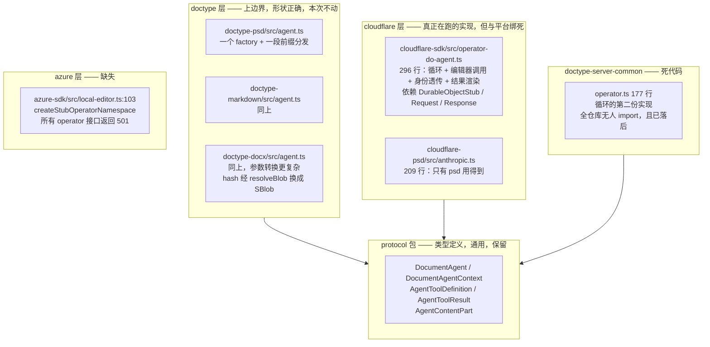

### 2.3 具体问题清单

| # | 问题 | 位置 |
|---|---|---|
| P2 | 唯一可用的循环实现依赖 Cloudflare 类型，Azure 无法复用 | `cloudflare-sdk/src/operator-do-agent.ts` |
| P3 | 存在第二份无人使用且已落后的循环实现 | `doctype-server-common/src/operator.ts` |
| P4 | 大模型适配层放在最外层的叶子包里，其他文档类型用不到 | `cloudflare-psd/src/anthropic.ts` |
| P5 | 同一仓库存在两套互相冲突的图片约定 | 见 2.4 |
| P6 | `renderToolResult` 钩子全仓库无人设置，docx 的图片路径一跑就抛异常 | `operator-do-agent.ts:25` 声明、`:112` 调用、`:263` 抛出 |
| P7 | `/run` 是一次阻塞请求，PSD 最多 25 轮循环期间零反馈，断线即全部丢失 | `web-psd/src/main.ts:374-383` |
| P8 | 会话历史无上限增长，且只在内存中，进程重启即丢 | `operator-do-agent.ts:55` |

### 2.4 两套冲突的图片约定

| 文档类型 | 做法 | 位置 |
|---|---|---|
| docx | 返回协议层的 `content: [{ type:"image", blob }]` | `doctype-docx/src/agent.ts:75` |
| psd | 把 base64 塞进普通数据字段 `{ $image: { base64 } }`，再由大模型适配层递归搜索捞出 | `doctype-psd/src/queries.ts:101` + `cloudflare-psd/src/anthropic.ts:72` |

docx 那条路从未真正跑通过：它会撞上 `renderDefaultAgentToolResult` 的抛异常分支（P6），只是因为 docx 的 `llmProvider` 本身就是个抛异常的占位实现（`cloudflare-docx/src/worker.ts:29`），所以一直没暴露。

PSD 那条路的副作用：base64 让数据膨胀三分之一，并且撞过 SValue 的字符串长度上限（提交 `da9028d` 就是修这个）。

---

## 3. 两层边界落到具体的包上

1.1 是抽象形状，这一节是它对应的实际代码归属。

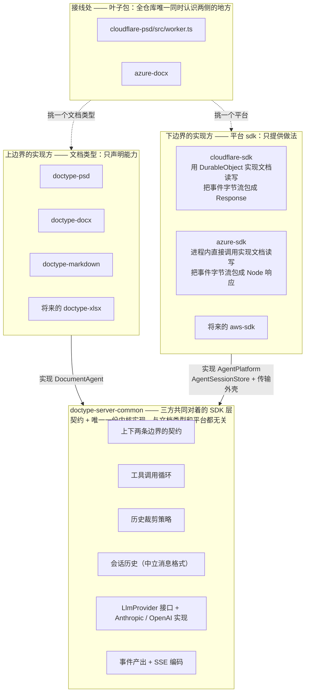

三条不可越界的规则：

1. **文档类型根本拿不到 `AgentPlatform`**，连一个收窄过的接口都拿不到。它只提供工具表，由内核去调平台（5.1）。所以它不知道文档是通过 DurableObject 还是进程内调用读到的，也不知道 `baseVersion` 的存在。
2. **平台 sdk 永远看不到循环内部**。它拿到的是一个事件序列，负责把它变成本平台的响应对象，不参与决定何时调模型、何时调工具。
3. **平台 sdk 永远不依赖任何文档类型，文档类型也不依赖任何平台 sdk**。今天已经如此（4.3 有 `package.json` 的实据），本次不能破坏。两者的组合只发生在叶子包，而叶子包本来就是「某个文档类型 × 某个平台」这一个具体部署的入口——`cloudflare-psd` 就是「PSD 跑在 Cloudflare 上」这一件事。

前两条如果被打破，就退回到今天的状态（1.4）；第三条被打破，「新增文档类型」和「新增平台」这两个方向就会互相牵动，1.2 的表就不成立了。4.4 给出机器可校验的落地方式。

L2 这一层同时装着**契约**和**唯一一份内核实现**。文档类型对着它写 agent，平台 sdk 对着它实现 platform 接口，两者之间没有任何箭头——这就是依赖倒置。它自己只依赖 `protocol`（SValue / SBlob / CAS 那些文档层的东西）。

---

## 4. 包与约束

### 4.1 契约的物理位置：留在 `protocol`

`doctype-server-common` 是三方对着写代码的那一层（4.3），但两条边界的**契约类型**不必搬进去——它们今天已经在 `protocol` 里，全是纯类型、零平台代码，搬家没有收益还要处理 `DocumentType.tools` 造成的环（4.3.1）：

```
protocol/src/types.ts
  :82-98    AgentContentPart                        工具结果里的文字 / 图片 / 文件
  :100-103  AgentToolResult
  :105-116  DocumentAgentContext    ← 下边界，本次改形状为 AgentPlatform（5.1.4）
  :118-129  DocumentAgent / DocumentAgentFactory  ← 上边界，本次改形状为纯数据的工具表（5.1.2）
```

本次只往里补下边界还缺的几个契约：

```ts
// 新增到 protocol
export interface LlmProvider { complete(request): Promise<AgentCompletion> }
export interface AgentSessionStore { load(options?); append(messages, meta, token); clear() }
export type AgentMessage = ...    // 中立消息格式（5.4）
export type AgentEvent = ...      // 事件表（7.1）
```

规则一句话：**契约的定义在 `protocol`，实现和门面在 `doctype-server-common`。** 文档类型作者不需要知道这个区分——`doctype-server-common/agent` 把契约再导出一次，只有一个 import 来源（4.3.1）。

### 4.2 内核实现放在 `doctype-server-common/src/agent/`

不新建包。理由是依赖边：三方里已经有两方（`cloudflare-sdk`、`azure-sdk`）依赖着 `doctype-server-common`——

```
cloudflare-sdk 的 deps: cas-client, cas-server-common, doctype-server-common, http-protocol, protocol, svalue-codec
azure-sdk 的 deps:      @azure/*, cas-client, doctype-server-common, http-protocol, protocol, svalue-codec, pg
```

放进去，平台侧新增零条依赖边，只有文档类型侧要加一条（4.3.1）。新建一个包则三方都要加边，还要多一套 `package.json` / `tsconfig` / 构建脚本 / 测试配置，换来的只是包名更好听。

```
packages/doctype-server-common/src/agent/
  ├── session.ts          AgentSession —— 工具调用循环、会话历史
  ├── history.ts          三级裁剪，纯函数，参数写死（6.2）
  ├── store.ts            AgentSessionStore 的契约测试（6.3.9）
  ├── sse.ts              AgentEvent 序列 → SSE 字节流（7.4）
  └── providers/
      ├── anthropic.ts    从 cloudflare-psd 搬过来，删掉图片嗅探
      └── openai.ts
```

按包已有的子路径约定（`./port-contract`、`./memory-ports`）再加一个 `./agent` 导出入口。

### 4.3 依赖方向

`doctype-server-common` 是**三方共同对着的那一层**：文档类型对着它写 agent，平台 sdk 对着它实现 platform 接口，内核实现也住在里面。它只依赖 `protocol`。

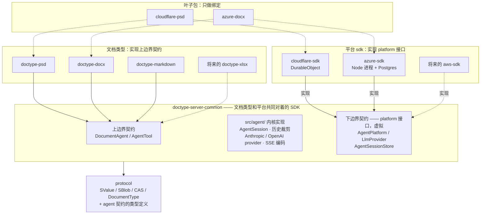

箭头方向是这张图的全部意义：**文档类型和平台 sdk 都指向 `doctype-server-common`，两者之间没有任何箭头。** 具体实现依赖抽象，抽象不依赖具体。叶子包在最上面，只负责挑一个文档类型和一个平台把它们接起来。

#### 4.3.1 本次唯一新增的依赖边

| 包 | 今天依赖 | 本次之后 |
|---|---|---|
| `doctype-psd` / `docx` / `markdown` | `protocol`、`svalue-codec` | **加 `doctype-server-common`** ← 唯一的新边 |
| `cloudflare-sdk` / `azure-sdk` | 已含 `doctype-server-common` | 不变 |
| `cloudflare-psd` / `azure-docx` | 一个文档类型 + 一个平台 sdk | 不变，只是接线代码变了 |

平台侧一条边都不用加——内核放进了它们本来就依赖的包（4.2）。文档类型侧加的这一条，是为了让「写一个文档 agent」有一个明确的对着写的地方，而不是去 `protocol` 里翻类型。

**契约的物理位置不动。** `DocumentAgent` 等类型仍然定义在 `protocol/src/types.ts:82-129`——搬家没有收益，还要处理 `DocumentType.tools` 造成的环。`doctype-server-common/agent` 把它们**再导出**一次，于是文档类型作者只需要记住一个 import 来源：

```ts
import type {
  DocumentAgent, AgentTool,
  AgentToolDefinition, AgentToolResult, AgentContentPart,
} from "@unidocs/doctype-server-common/agent";
```

#### 4.3.2 一个要留意的点：包名里的 "server"

`doctype-psd` 通过 `./engine` 子路径供浏览器使用（`psd-client/src/doc-session.ts:1` 就是这么引的），而现在它的主入口要依赖一个名字里带 `server` 的包。

实际不会有问题：`./engine` 子路径不 import agent 相关的任何东西，而 agent 那部分对 `doctype-server-common` 是**仅类型依赖**（`import type`），编译后擦除。实施时用打包体积断言验证一次（V3c）。

如果将来觉得名字别扭，可以把包改名为 `@unidocs/doctype-sdk`——但那是纯改名，不属于本次范围。

### 4.4 三条边界规则怎么守

仓库没有 eslint / biome，只有 `tsc` + `vitest`。

**规则 1（内核不知道平台）** —— 新增 `tests/unit/agent-kernel-purity.test.ts`：扫描 `packages/doctype-server-common/src/agent/**` 的所有 import 与全局标识符，断言不出现 `Request` / `Response` / `DurableObject*` / `@cloudflare/*` / `@azure/*`。

按目录扫而不是按包扫，是因为同包的 `doc-type-handler.ts` 和 `session-handler.ts` 本来就要用 `Request` / `Response`——它们是 HTTP 外壳，不在 agent 内核里。这也是不新建包所付的唯一代价：拿不到「整包 tsconfig 禁用平台类型」那道更硬的保险，只能靠目录级的扫描。不过目录扫描本来就是主要手段，tsconfig 那道只是额外的一层。

**规则 3（两侧互不依赖）** —— 同一测试文件里的 `package.json` 断言：

```ts
// packages/{cloudflare,azure}-sdk：dependencies 里不得出现任何 @unidocs/doctype-*
//                                （doctype-server-common 除外）
// packages/doctype-*：dependencies 里不得出现 @unidocs/cloudflare-sdk /
//                     @unidocs/azure-sdk
//                     （@unidocs/doctype-server-common 是预期的，见 4.3.1）
```

**规则 2（平台不知道循环内部）** —— 没有等价的机器检查，平台 sdk 本来就允许 import 内核。靠两件事守：

- 循环状态（会话历史、迭代计数）全部封在 `AgentSession` 私有字段里，平台拿不到，无从参与决策。平台唯一能做的是消费 `run()` 吐出的事件序列。
- 代码检视：平台 sdk 里若出现「判断该不该再调一次模型」这类逻辑，就是越界。

---

## 5. 服务端设计

### 5.1 文档类型只给数据和纯函数，不接受任何句柄

#### 5.1.1 为什么不需要一个 runtime 对象

一个工具要么读文档，要么产出 op。既然如此，工具**声明**自己是哪一种、再附一个把参数转成 query 或 op 的纯函数，就够了——不需要有人递给文档类型一个 `query` / `apply` 句柄让它自己去调。

三个候选方法逐个看：

| 原本打算给的 | 实际不需要的理由 |
|---|---|
| `query(q)` | 工具声明 `kind: "query"` 并给出 `toQuery(args)`，由内核拿去执行 |
| `apply(ops, desc)` | 工具声明 `kind: "op"` 并给出 `toOps(args)`，由内核拿去执行 |
| `resolveBlob(hash)` | 它做两件事：向 CAS 租约，然后把 hash 包成一个带标记的 `SBlob`。**租约是多余的**——`session.ts:608` 的 `leaseOpRefs(ops, cas)` 在 apply 第 1 步就把 op 里提到的所有引用租好了；剩下的 `createSBlob(hash)`（`svalue-codec/src/svalue.ts:144`）是同步纯函数，谁都能直接调 |

于是 `DocumentAgent` 里的 `toolCall` 也没有存在的理由了，`DocumentAgentFactory` 更没有——它唯一的作用就是把那个句柄注进来。

#### 5.1.2 工具的形状

```ts
export type AgentTool<TQuery, TOp> =
  | {
      readonly kind: "query";
      readonly name: string;
      readonly description: string;
      readonly inputSchema: Record<string, unknown>;
      /** 纯函数：模型给的参数 → 一个 query */
      readonly toQuery: (args: Readonly<Record<string, JsonValue>>) => SValueType<TQuery>;
      /** 纯函数：query 结果 → 交给模型的东西。不给则用默认（见下） */
      readonly toResult?: (data: SValue, version: number) => AgentToolResult;
    }
  | {
      readonly kind: "op";
      readonly name: string;
      readonly description: string;
      readonly inputSchema: Record<string, unknown>;
      /** 纯函数：模型给的参数 → 一批 op */
      readonly toOps: (args: Readonly<Record<string, JsonValue>>) => readonly SValueType<TOp>[];
    };

export interface DocumentAgent<TQuery, TOp> {
  readonly tools: readonly AgentTool<TQuery, TOp>[];
  readonly instructions: string;
}
```

两个默认值保证行为与今天一致：`kind: "query"` 不给 `toResult` 时返回 `{ structuredContent: { data, version } }`；`kind: "op"` 固定返回 `{ structuredContent: { success: true, version } }`。这正是三个文档类型今天 `toolCall` 里那两段代码做的事。

`toResult` 的 `data` 类型是 `SValue`——它是从编辑器返回、跨过一次序列化的数据，静态类型到这里就断了。文档类型需要自己窄化一次，**不要写 `as any`**：

```ts
// doctype-server-common/agent 导出，供各文档类型使用
export function requireRecord(v: SValue, what: string): Readonly<Record<string, SValue>>;
export function requireNumber(v: SValue | undefined, what: string): number;
export function requireSBlob(v: SValue | undefined, what: string): SBlob;

// 用法
toResult: (data, version) => {
  const d = requireRecord(data, "renderChart 结果");
  return {
    content: [{ type: "image", blob: requireSBlob(d.image, "image"), mediaType: "image/png",
                altText: `chart ${requireNumber(d.width, "width")}x${requireNumber(d.height, "height")} v${version}` }],
    structuredContent: { width: d.width, height: d.height, version },
  };
}
```

这三个函数不是新发明——docx 今天就有一模一样的（`doctype-docx/src/agent.ts:120-137` 的 `requireSValueRecord` / `requireNumber` / `requireString`）。本次把它们从 docx 提到共享位置，三个文档类型不用各写一份。窄化失败时抛错，被内核接住变成一条给模型的错误消息（5.1.5）。

文档类型侧于是只剩一个常量：

```ts
// packages/doctype-psd/src/agent.ts —— 全文
export const psdAgent: DocumentAgent<PsdQuery, PsdOp> = { tools, instructions };
```

#### 5.1.3 三个文档类型的实际写法

**markdown / psd 的普通工具**——参数原样透传：

```ts
{ kind: "query", name: "getLayers", description: "...", inputSchema: {...},
  toQuery: () => ({ kind: "getLayers" }) }

{ kind: "op", name: "transform", description: "...", inputSchema: {...},
  toOps: args => [{ kind: "transform", payload: args }] }
```

**psd 的 getPreview**——要返回图片，用 `toResult`：

```ts
{ kind: "query", name: "getPreview", description: "...", inputSchema: {...},
  toQuery: args => ({ kind: "getPreview", payload: args }),
  toResult: (data, version) => ({
    content: [{
      type: "image", blob: data.image, mediaType: "image/png",
      altText: `preview ${data.width}x${data.height} region=${JSON.stringify(data.region)} v${version}`,
    }],
    structuredContent: { width: data.width, height: data.height, region: data.region, version },
  }) }
```

`altText` 这行正好把今天 `cloudflare-psd/src/anthropic.ts:82` 的 `previewMeta` 放回了 PSD 自己的代码里，裁剪降级时会用到它（6.2.3）。

**docx 的 insertImage**——今天要 `await resolveBlob(hash)`，现在是同步的：

```ts
{ kind: "op", name: "insertImage", description: "...", inputSchema: {...},
  toOps: args => [{ kind: "insertImage", payload: {
    blob: createSBlob(args.hash),          // 同步，纯函数
    ...(typeof args.widthPx === "number" ? { widthPx: args.widthPx } : {}),
    ...(typeof args.altText === "string" ? { altText: args.altText } : {}),
  } }] }
```

**docx 的 getImage**——和 psd 的 getPreview 同一形状，只是 `altText` 用图片自己的替换文字。

#### 5.1.4 类图

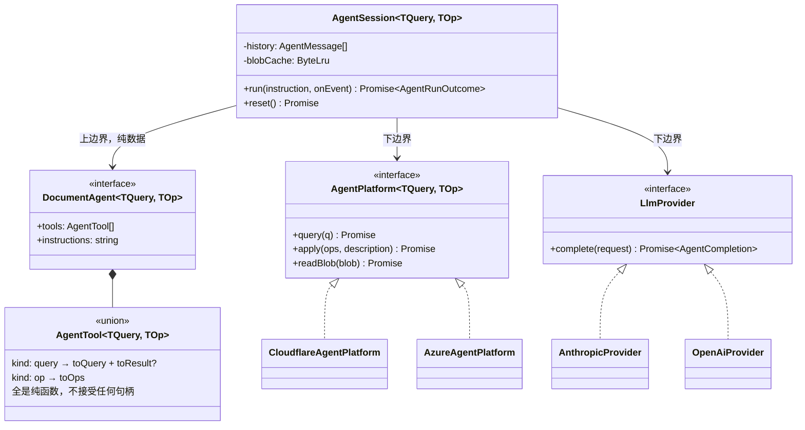

**`DocumentAgent` 和 `AgentPlatform` 之间没有箭头**——文档类型不再持有任何指向平台的引用，连一个收窄过的接口都不持有。这是这一版比上一版更强的地方。

#### 5.1.5 一次工具调用的执行

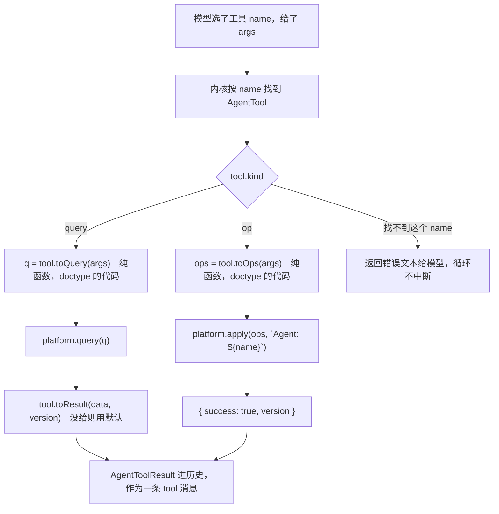

内核确实知道一个工具是读还是写——但那是工具**声明**的，不是内核从名字里猜的。这跟之前否掉的「按 `query_` / `apply_` 前缀猜」是两回事：前缀约定要求所有文档类型服从同一套命名，而 `kind` 只是让工具说清自己是什么。

参数怎么转成 query 或 op，仍然完全是文档类型的事——`toQuery` / `toOps` 是它自己的代码，内核只负责调用。

#### 5.1.6 内核与文档类型的分工

| 归 `AgentSession`（内核） | 归 `DocumentAgent`（文档类型） |
|---|---|
| 什么时候调模型、调几次、什么时候停 | 有哪些工具，各自的描述和参数结构 |
| 按名字找到工具，按 `kind` 决定走 query 还是 apply | 参数怎么转成 query / op，结果怎么转成给模型看的东西 |
| 会话历史、裁剪、持久化、事件产出 | 无状态，全是纯函数 |
| 工具的纯函数抛错时，变成一条 tool 消息喂回模型 | 该抛就抛，不自己吞 |

内核对工具的全部认知是：**它叫什么、是读还是写、把参数交给它的纯函数会得到一个 query 或一批 op**。它不认识图层或段落，也不认识版本号（5.2）。

#### 5.1.7 还没有的第三类工具

上面两种覆盖「读文档」和「写文档」。既不读也不写、而是调外部服务的工具（例如真正的生成式填充），今天在仓库里**没有一个实例**——`apply_generative_fill` 的参数要求调用方提供已经生成好的像素，所以它是一个普通的 op 工具。

等真的出现时再加 `kind: "action"`，它的函数不再是纯的（要发网络请求），因此需要单独设计错误和超时语义。现在不加。

### 5.2 内核不管版本

`AgentSession` 不持有 `lastKnownVersion`，不强制「apply 之前必须先 query」，也不解读版本冲突。**agent 的职责到「生成 op」为止。**

理由：`apply` 是确定性算法，它自己就是校验器——这个仓库的编辑器本来就要求 `apply()` 完整校验，否则一个坏 op 会把文档写坏。既然如此，版本检查就是在问一个不精确的问题：它问的是「文档变了没」，而真正该问的是「我这个 op 现在还成不成立」。别人调了个图层透明度并不影响我裁剪画布，版本检查却会把它拒绝掉，让模型多花一轮重新查询。

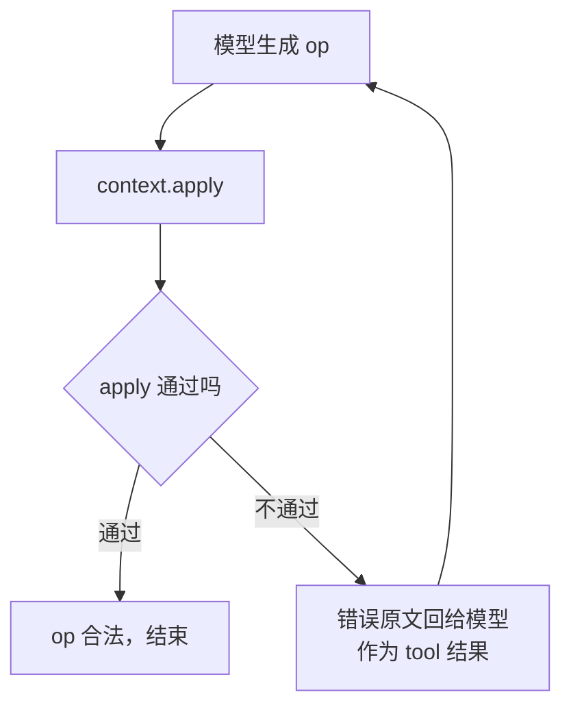

#### 5.2.1 版本号并没有消失，只是不归 agent 算

`baseVersion` 是编辑器写入路径的**必需参数**，不是可选校验：`session.ts:625` 的 `nextVersion = baseVersion + 1` 是 delta 日志保持无空洞序列的机制，`editor-do-svalue.ts:534` 缺了它直接报错。

所以问题不是「要不要版本号」，而是「agent 发起的 apply，`baseVersion` 由谁算」。选定：**由平台的 `AgentPlatform.apply` 实现自己读当前 head**。

| | 今天 | 本次 |
|---|---|---|
| 谁记 `lastKnownVersion` | agent 循环，`operator-do-agent.ts:56` | 没人记 |
| `apply` 用什么 `baseVersion` | 上次 `query` 看到的版本，`:208` | 平台读当前 head |
| 「必须先 query」 | 循环强制拒绝，`:202-204` | 删掉。提示词里已经写了「先查询再编辑」，而真正的兜底是 apply 自己会拒绝非法 op |
| op 不成立时 | 版本冲突 → 提示重新查询 → 重试 | apply 的错误原文回给模型 → 重新生成 |

因为版本记账整个消失，`AgentPlatform.apply(operations, description)` 里不需要出现 `baseVersion`——它一直是平台实现的内部细节。

#### 5.2.2 这样做失去了什么

诚实记一笔：版本检查确实能拦住一类情况——模型基于 v7 的图层树推理出坐标，期间浏览器把图层移走了，op 应用到 v9 上位置就错了，而 `apply` 校验不出来（坐标合法，只是不是模型想要的）。

接受这个代价，理由有三条：

- 这类竞争要求「用户一边手工编辑一边让 agent 跑」，而客户端今天已经在避免（`web-psd/src/main.ts` 的 `chatBusy`）。
- 就算发生，结果是一次编辑位置不对，用户看得见也能撤销；而版本检查的代价是每次并发都多花一轮。
- 模型的工作流本来就是「改完看预览确认」（`doctype-psd/src/tools.ts:166` 的提示词明确要求），位置错了它自己会发现并纠正。

### 5.3 文档类型侧的改动量

三个文档类型的 `agent.ts` 都从「一个 factory 里包着一段 if/else 分发」变成「一张工具表 + 一个常量」。改动是机械的，逐条对照：

| 今天 | 之后 |
|---|---|
| `tools.ts` 里 `Record<string, AgentToolDefinition>`，`name` 带 `query_` / `apply_` 前缀 | 同一张表改成 `AgentTool[]`，每项加 `kind` 和 `toQuery` / `toOps` |
| `agent.ts` 里的 `createXxxDocumentAgent`（psd 73 行、markdown 129 行、docx 137 行） | 一个常量导出 |
| `toolCall` 里判前缀、拆 `kind`、拼 `payload` 的那段 | 挪进各工具的 `toQuery` / `toOps`，逐个工具一行 |
| `requireJsonObject` 参数校验 | 内核统一做，三份重复代码消失 |
| docx 的 `makeOperation`（`agent.ts:86-113`） | 拆进 `insertImage` / `replaceImage` 两个工具的 `toOps`，`await resolveBlob` 变成同步的 `createSBlob` |
| docx 的 `queryImageContent`（`agent.ts:53-84`） | 变成 `getImage` 工具的 `toResult` |

另有一处协议层的要求，与工具形状无关：

> 返回图片时必须放进 `AgentToolResult.content` 的 image part，不能塞进 `structuredContent` 让下游去搜。

docx 已经这么做了（`agent.ts:75`）。psd 需要改（2.4）：

```ts
// doctype-psd/src/queries.ts:101
- return { $image: { base64: btoa(bin), mediaType: "image/png" }, width, height, region };
+ return { image: await ctx.makeSBlob({ data: png, contentType: "image/png" }), width, height, region };
```

配上 5.1.3 里 `getPreview` 的 `toResult`，改完之后 `cloudflare-psd/src/anthropic.ts:72` 的 `findImage` 递归搜索、`:82` 的 `previewMeta`、以及 `OperatorConfig.renderToolResult` 整个钩子都可以删掉。

#### 5.3.1 工具改名：顺带修掉一个已有的缺陷

`doctype-psd/src/tools.ts:156-176` 的提示词里有五个工具名，在工具表里**根本不存在**：

| 提示词让模型调 | 工具表里实际是 |
|---|---|
| `transformLayer` | `apply_transform` |
| `editMask` | `apply_mask_edit` |
| `setAdjustment` | `apply_adjust` |
| `addLayer` | `apply_add_layer` |
| `generativeFill` | `apply_generative_fill` |

模型只能自己从工具列表里猜映射。这件事本身说明 `query_` / `apply_` 前缀是**给分发器用的机器语言，不是给模型用的名字**——连写提示词的人自己都没照着用。

而这一版之后前缀彻底没有用处了：工具是读是写由 `kind` 声明，内核不看名字。所以名字应该改成领域动词，并让提示词和工具表对齐：

```
query_getLayers        → getLayers
query_getPreview       → getPreview
apply_transform        → transform
apply_add_layer        → addLayer
apply_mask_edit        → editMask
apply_adjust           → setAdjustment
apply_generative_fill  → generativeFill
```

右边这些名字大多本来就是提示词里在用的。

还有一点：`apply_transform` 把「变换」和「提交」讲成了两步，而它们本来是一步。agent 产生一个 op，op 就该像人在浏览器里拖动图层一样直接生效并拿到版本号，不存在一个单独的「apply」动作需要模型显式发起。叫 `transform` 就够了。

改名和工具表重写是同一次改动，所以放进本次范围。

### 5.4 消息格式中立化

这是本次唯一一处**重写而非搬家**的改动。

**今天：** 循环内部用 OpenAI 的消息格式（`operator-do-agent.ts:98` 读 `response.choices[0].message`），于是 Anthropic 适配层必须双向翻译两次。而图片因为被压成了 JSON 字符串，只能靠递归搜索捞回来。

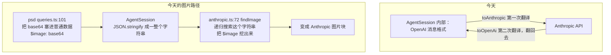

**之后：** 循环内部用内核自己的中立格式，每个大模型适配层只单向翻译一次。图片是结构化字段，不需要搜索。

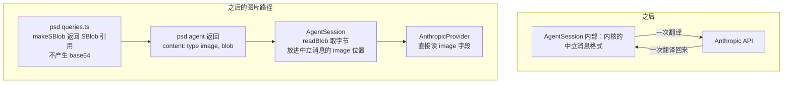

中立消息类型：

```ts
export type AgentMessage =
  | { readonly role: "user";      readonly content: string }
  | { readonly role: "assistant"; readonly text?: string; readonly toolCalls?: readonly AgentToolCall[] }
  | { readonly role: "tool";      readonly callId: string; readonly result: AgentToolResult };

export interface AgentToolCall {
  readonly id: string;
  readonly name: string;
  readonly arguments: JsonValue;
}

export interface LlmProvider {
  complete(request: {
    readonly system: string;
    readonly messages: readonly AgentMessage[];
    readonly tools: readonly AgentToolDefinition[];
  }): Promise<AgentCompletion>;
}

export interface AgentCompletion {
  readonly text?: string;
  readonly toolCalls?: readonly AgentToolCall[];
}
```

`role: "tool"` 那一支携带的是结构化的 `AgentToolResult`（`protocol/src/types.ts:100`），其中的 `content` 数组里图片是 `{ type:"image", blob, mediaType }`。适配层直接 `filter(p => p.type === "image")` 拿到它。

**取字节这一步要缓存。** 每次调模型之前，内核都要把历史里的 image part 变成真正的字节交给适配层，走的是 `platform.readBlob`。PSD 一次 run 跑 25 圈，若每圈都重读，就是 50 次 `readBlob`——而裁剪保证了同时最多只有 `MAX_IMAGES` 张图（默认 2），也就是说其中 48 次读的是同样的两个 hash。

`AgentSession` 内部按 hash 缓存字节，按总字节数封顶后淘汰最久未用的：

```ts
#blobCache = new ByteLru(32 * 1024 * 1024);   // 上限与 sblob-context.ts:69 的默认一致
```

放在内核而不是平台，因为「同一个 blob 会被反复要」是**循环的性质**，平台没有理由知道这件事。

**随之删除：** `anthropic.ts` 的 `findImage`、`previewMeta`，以及 `OperatorConfig.renderToolResult` 整个钩子（`operator-do-agent.ts:25`）。P5 和 P6 一并解决。

### 5.5 AgentSession 的接口与生命周期

```ts
export class AgentSession<TQuery, TOp> {
  constructor(deps: {
    /** 会话身份。构造时机见 5.5.1 —— 必须等第一个请求带来身份之后 */
    readonly sessionId: string;
    /** 上边界：文档类型的工具表 + 提示词，纯数据（5.1.2） */
    readonly agent: DocumentAgent<TQuery, TOp>;
    /** 下边界：文档读写 + 取 blob 字节（5.1.4） */
    readonly platform: AgentPlatform<TQuery, TOp>;
    /** 下边界：模型访问 */
    readonly provider: LlmProvider;
    /** 下边界：会话持久化（6.3），不传则只在内存里 */
    readonly store?: AgentSessionStore;
    /** 下边界：根引用提交（6.4），不传则不保活 */
    readonly cas?: CasRootRefGateway;
    /** 循环上限，不传为 10。PSD 传 25 */
    readonly maxIterations?: number;
  });

  /**
   * 跑一轮对话。**推送式**：事件通过 onEvent 送出，不是返回一个可迭代对象。
   * 理由见 5.5.2。onEvent 同步返回，内核不等它，它抛错也被忽略。
   */
  run(instruction: string, onEvent: (event: AgentEvent) => void): Promise<AgentRunOutcome>;

  /** 清空这个会话：内存、存储、以及它持有的全部根引用。见 5.5.4 */
  reset(): Promise<void>;
}

export type AgentRunOutcome =
  | { readonly ok: true;  readonly response: string; readonly iterations: number }
  | { readonly ok: false; readonly error: string };
```

`agent` 是一个常量，没有工厂、没有注入——文档类型不接受任何句柄（5.1.1）。`platform` 只有内核自己拿着。

`maxIterations` 从 `OperatorConfig`（`operator-do-agent.ts:32`）移到这里——它是循环参数，属于内核，不属于平台配置。PSD 需要 25 的理由不变：一次编辑要「找图层 → 看预览 → 变换 → 再看预览确认」，默认的 10 会把真实指令切在半路。

没有 `restore()` 这个公开方法，理由见 5.5.3。

#### 5.5.1 构造时机：第一个请求到达之后，不是 DO 构造时

`sessionId` 是构造参数，但**平台外壳不能在自己的构造函数里创建 `AgentSession`**：sessionId 来自请求头 `X-Session-Id`（`operator-do-agent.ts:167-185` 今天就是这么读的），而 DO 实例在第一个请求到达之前就已经存在了。

所以外壳惰性创建，创建之后随实例一直活着：

```ts
#ensureSession(sessionId: string): AgentSession<TQuery, TOp> {
  return this.#session ??= new AgentSession({ sessionId, agent, platform, provider, store, cas });
}
```

今天那套「后续请求的身份必须与首次一致，否则 403」的校验（`operator-do-agent.ts:173-176`）原样保留，正好守住这个惰性创建。

#### 5.5.2 为什么是推送式而不是返回 `AsyncIterable`

`AsyncIterable` 是**拉取式**的：没有人调 `next()`，生成器就停在 `yield` 上。而平台外壳会这样用它：

```ts
void encodeSse(session.run(instruction)).pipeTo(writable);
```

客户端一断线，`writable` 报错，管道停止拉取，**整个循环就此冻住**。这与 7.3 写明的「服务端继续跑完，文档改动照常落到编辑器」直接冲突——两者同时只能成立一个。

推送式没有这个问题：内核调 `onEvent(e)` 就继续往下走，不关心有没有人在听。外壳把 `onEvent` 实现成「写 SSE，写失败就记下断了、后续直接丢弃」：

```ts
let broken = false;
const onEvent = (e: AgentEvent) => {
  if (broken) return;
  writer.write(encode(sseFrame(e))).catch(() => { broken = true; });
};
this.#ctx.waitUntil(session.run(instruction, onEvent).finally(() => writer.close().catch(() => {})));
```

`waitUntil` 是另一半：它让 DO 在响应已经返回之后继续执行这个 Promise。Azure 侧对应的是不 `await` 这个 Promise 而让请求处理函数先返回。

内核对 `onEvent` 的约定写死两条：**同步返回**（内核不 `await` 它），**抛错被吞掉**（一个坏的监听者不能让 agent 停下来）。

#### 5.5.3 恢复历史由内核自己保证

先前的版本有个公开的 `restore()`，并规定「必须在 `run()` 之前调」。这种顺序要求本身就是缺陷——两个平台外壳各自记着别忘了调，迟早有一个忘，而症状是模型莫名其妙失忆，很难查。

改成内核内部惰性执行：`run()` 开头 `await this.#ensureRestored()`，只在第一次真正读库。外壳没有任何顺序义务。

#### 5.5.4 `reset()` 的完整语义

清三样东西，顺序是固定的：

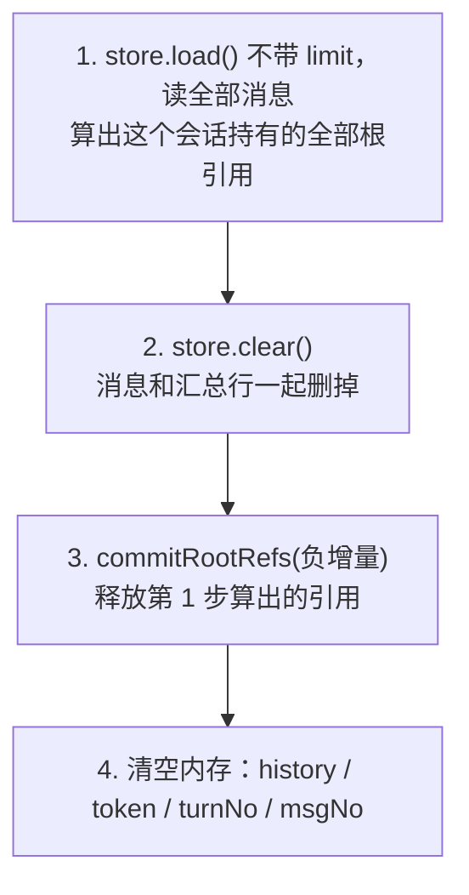

**为什么先删数据再释放引用**，与 6.4 的写入顺序正好相反：写入时先落数据再加引用，是为了避免「引用已加、数据没写」的孤立引用；删除时先删数据再减引用，是为了避免「引用已减、数据还在」——那会让存活的历史指向已被回收的 blob，是真正的坏数据。两边遵循的是同一条原则：**任何时刻的崩溃都只能留下可回收的多余引用，不能留下悬空的引用。**

第 1 步是全文档里唯一一处 `load()` 不带 `limit` 的调用（6.3.4）。`reset` 是低频操作，读全量可以接受。

#### 5.5.5 同一会话同时只允许一个 run

两个平台的并发模型不同（6.3.7），但拒绝**必须发生在 `run()` 入口**，不能等到落盘时才靠 token 冲突发现——那时模型已经白跑了一整轮，用户也白等了。

统一做成一个带过期时间的租约，`agent_sessions` 加一列：

```sql
running_since BIGINT NULL     -- 有值表示正在跑
```

`run()` 的第一件事是抢这个租约：

```sql
UPDATE agent_sessions
   SET running_since = $now, seq = seq + 1
 WHERE <定位条件>
   AND seq = $token
   AND (running_since IS NULL OR running_since < $now - RUN_LEASE_MS);
```

受影响行数为 0 → 别人正在跑，`run()` 立刻返回 `{ ok: false, error: "会话正在处理另一条指令" }`，一次模型都不调。跑完（无论成功失败）把 `running_since` 置回 NULL。

`RUN_LEASE_MS` 取一个略大于最坏情况的值（PSD 25 轮，给 10 分钟），避免进程崩溃后会话被永久锁住。

**这条在 Cloudflare 上恒成立**——DO 单线程，不可能有并发的 `run`。所以它是一条两端共用的代码，在 CF 上退化成一次必然成功的写，不需要平台分支。

---

## 6. 会话历史：裁剪与持久化

### 6.1 共同前提：历史是 SValue 可编码的

裁剪和持久化处理的是同一个对象——`AgentSession` 的 `history`。因为 5.4 把它改成了 SDK 自己的中立类型，它整体是 SValue 可编码的：

| 消息 | 字段 | 可编码性 |
|---|---|---|
| `user` | `content: string` | SPrimitive |
| `assistant` | `text?`、`toolCalls?: [{id, name, arguments: JsonValue}]` | 全部是 JSON 值 |
| `tool` | `callId`、`result: AgentToolResult` | `structuredContent` 是 JsonValue；`content` 里图片的 `blob` 是 SBlob，本身就是 SPrimitive |

推论很关键：**图片在历史里只是一个 CAS hash，不是字节**（SBlob 走 `SBlobTag = 65_536` 编码，`protocol/src/types.ts:174`）。所以一段 25 轮、含 10 张预览图的会话，落盘只有几十 KB，而不是几十 MB。

#### 6.1.1 必须用 SValue 编码，不能用 JSON

这不是偏好，是硬性的：SBlob 的品牌是一个 Symbol（`protocol/src/types.ts:32` 的 `sBlobSignature`），而 `JSON.stringify` **丢弃 Symbol 键**。JSON 往返之后 `isSBlob()` 返回 false，图片引用变成一个普通的 `{hash}` 对象，再也认不出来。

仓库对此的立场是明写在代码里的（`editor-do-svalue.ts:843`）：

```ts
if (encoded.refs.length > 0) {
  return Response.json({ error: "This response requires the SValue media type" }, { status: 406 });
}
```

含 SBlob 引用的值请求 JSON 输出，直接 406。

值得注意的是，端口层现有的两个 `DeltaLog` 实现恰恰用的是 JSON——`ports-cf.ts:81` 的 `JSON.stringify(d.operations)` 和 `ports-pg.ts:104` 的同一句。**所以那两条路承载不了含 SBlob 的操作**，它们服务的是不带二进制引用的文档类型。真正跑 PSD 的 `editor-do-svalue.ts:305` 走的是 `encodeSValue`。会话历史含图片，必须跟后者。

#### 6.1.2 三件互相独立的事

设计这一章时最容易犯的错，是把下面三件事搅成一件：

| 关注点 | 结论 | 依据 |
|---|---|---|
| 用什么格式序列化 | SValue CBOR | 6.1.1 |
| 编出来的字节存哪儿 | 直接写进表的字节列 | 6.3 |
| 历史引用的图片怎么不被回收 | 单独提交根引用，与字节存哪儿无关 | 6.4 |

第二件和第三件是正交的：无论字节放在 SQLite、Postgres 还是别处，引用计数都得单独做；反过来，引用计数做好了也不会替你决定字节该放哪。

### 6.2 裁剪

#### 6.2.1 硬约束：不能拆散工具调用的配对

Anthropic 的 Messages API 要求每个 `tool_use` 块在紧随其后的消息里有对应的 `tool_result`；OpenAI 要求每个 `tool_calls` 有对应的 `role:"tool"`。所以**裁剪的最小单位不是消息，是一轮**：

```
配对块 = 一条 assistant 消息（含 N 个 toolCalls）
       + 对应的 N 条 tool 消息
```

这条约束直接排除了「保留最近 K 条消息」这种最直觉的写法——它会切出孤立的 `tool_result`，请求会被 API 拒绝。

**「配对块」和「轮」不是一回事**，这两个词此前混用过，在这里定清楚：

| | 定义 | 用途 |
|---|---|---|
| 配对块 | 一条 assistant + 它的全部 tool 消息 | API 的硬性要求，不能拆 |
| 轮（`turn_no`） | 一条 user 消息，直到下一条 user 消息之前的所有内容 | 丢弃的单位，也是落盘时的分组 |

一轮里可以有多个配对块——模型为一条指令连着调三次工具，就是一轮里的三个配对块。

**丢弃以「轮」为单位**，因为它是更大的单位，天然包含完整的配对块，所以配对约束自动满足。更重要的是语义：一条用户指令和它引发的全部往返是一个整体，只丢掉其中一半会让历史读起来不连贯——模型会看到一段没有起因的工具调用。

#### 6.2.2 为什么裁剪属于内核而不是文档类型

这一节容易被误认为是 PSD 的私事——毕竟只有 PSD 会一次跑 25 轮、每轮塞一张预览图。但有两条理由把它按在内核里。

**第一，会让上下文超出上限的不只有 PSD。**

| 文档类型 | 会让上下文超出上限的东西 |
|---|---|
| markdown | `query_getContent` 的描述原文是 "Get the **full** markdown content"——一篇长文档一次就是几万 token，多轮对话里会重复出现好几份 |
| docx | `query_getImage` 返回 image content part（`doctype-docx/src/agent.ts:75`），和 PSD 的预览图一样占位 |
| psd | 25 轮 × 每轮一张预览图，撞得最狠 |

**第二，只有内核能安全地裁。** 6.2.1 的配对约束要求以「轮」为单位操作，而历史由 `AgentSession` 私有持有——文档类型根本看不到它。把裁剪交给文档类型，等于要么把历史暴露出去，要么每个文档类型自己实现一遍配对逻辑。

所以分工是：**内核提供裁剪的机制和一套通用默认策略；文档类型通过数据影响它，不通过代码。** 后半句的落地方式见 6.2.3 和 6.2.4。

#### 6.2.3 三级策略，从轻到重

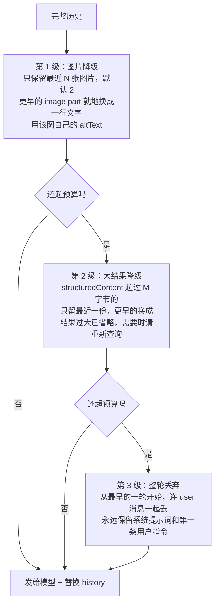

前两级是**就地替换**，不改变消息数量，因此不可能破坏 6.2.1 的配对；只有第 3 级会删消息，而它以「轮」为单位。

**第 1 级怎么做到不懂文档类型：** 协议层的 image content part 本来就带一个 `altText` 字段（`protocol/src/types.ts:88-93`），docx 今天已经在设它（`doctype-docx/src/agent.ts:78-82`）。内核降级时只做一件事：

```ts
// image part → text part
{ type: "text", text: `[image: ${part.altText ?? part.mediaType}]` }
```

内核只知道「这里原来有张图，文档类型说它是这样」。至于那句话里写什么，是文档类型的事：

| 文档类型 | 建议的 `altText` | 降级后模型看到 |
|---|---|---|
| psd | `preview 1024x768 region=[0,0,1024,768] v7` | `[image: preview 1024x768 region=[0,0,1024,768] v7]` |
| docx | 图片本身的替换文字 | `[image: 公司组织架构图]` |

这样一来，今天 `cloudflare-psd/src/anthropic.ts:82` 的 `previewMeta` 就回到了它该在的位置——它一直是 PSD 的知识，此前却写在大模型适配层里。改造后它移到 PSD 自己的 `agent.ts`，作为 `altText` 的值，而不是写进内核的裁剪代码。

**第 2 级同理不懂文档类型：** 它只看 `structuredContent` 编码后的字节数，不看里面是什么。PSD 的 `getDoc` 返回整棵图层树、markdown 的 `getContent` 返回全文，对它是一回事。

#### 6.2.4 预算怎么算

内核不引入 tokenizer 依赖（那会带来一个几 MB 的词表，且各家模型不同）。用估算：

| 内容 | 估算方式 |
|---|---|
| 文字 | UTF-8 字节数 ÷ 3.5 |
| 图片 | 宽 × 高 ÷ 750 |

估算不准不会导致错误，只会裁多或裁少；真的超限时 provider 会报错，此时按错误再裁一次并重试一次，仍失败则以 `run-error` 结束。

#### 6.2.5 三个数字先写死

```ts
// doctype-server-common/src/agent/history.ts
const MAX_IMAGES            = 2;        // 发给模型时保留最近几张图片
const MAX_RESULT_BYTES      = 8_192;    // 单条工具结果超过这个就降级
const BUDGET_TOKENS         = 120_000;  // 上下文预算，约为窗口的 60%
const RESTORE_MESSAGE_LIMIT = 200;      // restore 时从存储读回多少条（6.3.5）
```

**不做成可配置项，也不暴露成可替换的策略接口。** 理由：

- 这三个数字合不合适，要跑起来才知道。现在就把它们做成参数，等于在没有依据的情况下先固化一套 API，而这套 API 会立刻被三个文档类型和两个平台引用。
- 「让文档类型自己实现一套裁剪」这种扩展点更是如此——今天一个使用者都没有。如果将来默认策略覆盖不了某个文档类型，那**首先说明默认策略需要改进**，而不是每个文档类型各写一份。

裁剪逻辑单独放在 `history.ts` 一个文件里，输入是 `AgentMessage[]`、输出也是 `AgentMessage[]`，没有其他依赖。真到了需要按文档类型调参、或者需要换整套策略的那天，把这个文件的入口函数改成接口是一次局部改动，不牵动调用方。

#### 6.2.6 裁剪只作用于发送，不改存储

裁剪函数的输出**只用于这一次发给模型**，`AgentSession` 内存里的历史窗口也随之替换，但**存储里的消息一条都不动**。

这一条曾经写反过。先前的版本选了「裁剪就地生效、连存储一起改」，理由是「存的就是当前历史，天然有界」。那是错的，代价直到把使用者列全才看清：

| 使用者 | 要什么 |
|---|---|
| 模型 | 最近若干轮，且总量塞得进上下文窗口 |
| 用户 | 从头到尾任意往回翻 |
| 运维 | 这个会话多大、多久没动 |

裁剪服务的是第一个。让它去删存储，等于为了第一个使用者把第二个使用者的数据毁掉——**旧轮次一旦被裁掉就再也翻不出来了**。

所以：

- `agent_messages` **只追加，写入后不再修改**。这与 `deltas` 是同一种表。
- 图片降级、大结果省略、整轮丢弃，全部发生在读出来之后、发给模型之前，是内存里的一次纯函数变换。
- 每次会话恢复时重新算一遍。降级是纯函数，重算的结果一致。

存储会随对话增长——这是正常的，一条消息就是一小段文字加几个 CAS 引用。真需要控制体量时，那是**独立的清理策略**（按 `updated_at` 清理长期不动的会话，或丢弃很老的轮次），与上下文裁剪无关，本次不做。

#### 6.2.7 摘要压缩：本次不做，也不预留接口

把最早若干轮交给模型总结成一段文字，是第 4 级裁剪的自然候选。本次不做——它需要额外一次模型调用，成本和质量都要实测才好定参数。

也不为它预留接口。前三级都是同步纯函数，为一个还没实测过的功能把入口改成异步、再顺带引入一个 `LlmProvider` 依赖，是在为想象中的需求付真实的复杂度。真要加时，改 `history.ts` 一个文件即可。

### 6.3 持久化

#### 6.3.1 一条消息一行，不是整段一个字节块

历史是一串消息，每条消息有 `role`（`user` / `assistant` / `tool`）、属于第几轮、是不是在回应某次工具调用。这些是消息的结构，不是内容——**把它们编进 CBOR 埋起来，数据库就什么都答不上来**：这个会话里模型说了几次话、调了几次工具、用户发过哪些指令，全要先把几十 KB 解码一遍才知道。

所以按仓库已有的形状来：一张表存身份和并发凭据，另一张表存序列。这正是 `doc_sessions`（一行）配 `deltas`（多行）的关系。

| | 对应现有的 | 装什么 |
|---|---|---|
| `agent_sessions` | `doc_sessions` | 一个会话一行：条件写凭据 `seq`、汇总元数据 |
| `agent_messages` | `deltas` | 一条消息一行：`role` 等结构成列，消息本体是 SValue 字节 |

结构成列、内容成字节，这条分界线的依据是 6.1.1：SBlob 的品牌是 Symbol，JSON 承载不了，所以消息本体只能是 SValue CBOR；但 `role` / `turn_no` 这些是纯标量，没有理由跟着埋进去。

#### 6.3.2 表结构

**Azure（Postgres）** —— 作为 `migrations/0003_agent_sessions.sql`：

```sql
CREATE TABLE IF NOT EXISTS agent_sessions (
  doc_type      TEXT    NOT NULL,
  session_id    TEXT    NOT NULL,
  seq           INTEGER NOT NULL,   -- 条件写凭据，每次写 +1
  running_since BIGINT  NULL,       -- run 租约，有值表示正在跑（5.5.5）
  turn_count    INTEGER NOT NULL,
  byte_size     INTEGER NOT NULL,   -- 所有消息 payload 之和
  updated_at    BIGINT  NOT NULL,
  PRIMARY KEY (doc_type, session_id)
);

CREATE TABLE IF NOT EXISTS agent_messages (
  doc_type     TEXT    NOT NULL,
  session_id   TEXT    NOT NULL,
  msg_no       INTEGER NOT NULL,   -- 消息序号，单调递增
  turn_no      INTEGER NOT NULL,   -- 属于第几轮，裁剪以轮为单位（6.2.1）
  role         TEXT    NOT NULL,   -- user | assistant | tool
  tool_call_id TEXT,               -- role=tool 时，它在回应哪次调用
  text         TEXT,               -- 可读的纯文字部分，见下
  payload      BYTEA   NOT NULL,   -- 该条 AgentMessage 的 SValue CBOR
  byte_size    INTEGER NOT NULL,
  created_at   BIGINT  NOT NULL,
  PRIMARY KEY (doc_type, session_id, msg_no)
);
```

**Cloudflare（DO SQLite）** —— 同名同列，只有主键不同：`agent_sessions` 用 `singleton INTEGER PRIMARY KEY CHECK (singleton = 1)`（一个 OperatorDO 实例就是一个 session，表里永远一行，与 `editor-do-svalue.ts:123` 的 `svalue_pending` 同一写法）；`agent_messages` 用 `msg_no INTEGER PRIMARY KEY`。`doc_type` / `session_id` 两列仍然保留，不参与定位，只为排查问题时能一眼看出这个 DO 是谁。

**关于 `text` 列：** 它是从 `payload` 里抽出来的可读文字——`user` 的指令原文、`assistant` 的回复文字、`tool` 结果的一句摘要。它是派生数据，**永远不是权威**，权威是 `payload`。留它是为了不解码就能看懂一段对话，以及将来做内容检索时有个落脚点。图片、工具参数这些没有文字表示的，这一列为空。

#### 6.3.3 身份用 `session_id`，不用 doc id

这是仓库刻意迁过去的约定：`migrations/0002_session_identity.sql:15,24` 把 `deltas` 和 `doc_snapshots` 的 `doc_id` 列改名成了 `session_id`。一个文档对应一个 session（网关按 `(userId, docId)` 查出 `record.sessionId` 再转发，`gateway-handler.ts:195`），`doc_sessions` 表负责 `session_id → (tenant_id, doc_type)` 的映射。agent 会话跟着走，不另立身份。

#### 6.3.4 接口

```ts
export interface StoredMessage {
  readonly msgNo: number;
  readonly turnNo: number;
  readonly role: "user" | "assistant" | "tool";
  readonly toolCallId?: string;
  readonly text?: string;
  readonly payload: Uint8Array;      // 该条消息的 SValue CBOR
}

export interface AgentSessionStore {
  /**
   * 按 msgNo **倒序**取，返回时正序排好。
   * 不传 options 才是读全部——那只用于导出或迁移，正常路径都带 limit。
   */
  load(options?: {
    /** 最多取几条 */
    readonly limit?: number;
    /** 只取 msgNo 小于它的，用于往回翻页 */
    readonly before?: number;
  }): Promise<{
    readonly messages: readonly StoredMessage[];   // 正序
    readonly token: string;
    /** 还有更早的没取，用于决定要不要显示"加载更多" */
    readonly hasMore: boolean;
  } | null>;

  /**
   * 追加本轮产生的消息。表是只追加的，写进去的消息不再修改（6.2.6）。
   * token 不匹配时抛 SessionStoreConflictError，整个事务不生效。
   */
  append(
    messages: readonly StoredMessage[],
    meta: { turnCount: number; byteSize: number },
    token: string | null,
  ): Promise<string>;

  clear(): Promise<void>;
}
```

`save` 改成了 `append`，而且不再有 `upsert` 和 `dropTurnsBefore`——因为裁剪不再动存储（6.2.6），消息写进去就不会被改写或删除。这与 `deltas` 是同一种表。

两处写入在一个事务里：`agent_messages` 的 INSERT，和 `agent_sessions` 的 `seq` 条件更新。Azure 用现成的 `PgUnitOfWork`（`ports-pg.ts:270`），CF 用 `ctx.storage.transaction`。

#### 6.3.5 `load` 的两个调用方

`load` 必须带条件，因为两个调用方要的都不是全部。

**内核首次 `run()` 时的恢复**（5.5.3）：只需要最近若干轮，够裁剪函数挑就行。

```ts
const RESTORE_MESSAGE_LIMIT = 200;   // 写死在 history.ts，与三个阈值放一起
const { messages, token } = await store.load({ limit: RESTORE_MESSAGE_LIMIT }) ?? ...;
```

取 200 条而不是「最近 10 轮」，是因为一轮的消息条数不固定（一轮可能有多次工具调用）。200 条足够裁剪函数在 12 万 token 的预算里挑满，多取的部分会被裁掉，代价只是一次多读几行。

**界面往回翻**：`load({ limit: 50, before: 最早已显示的 msgNo })`，靠 `hasMore` 决定还要不要显示「加载更多」。这条路要配一个 HTTP 端点，本次不做（7.2.1 的文档变更通道那一侧），但接口现在就支持，不用回头改。

并发控制不靠 `load` 的参数，靠它的**返回值**：`load` 给出 `token`，写的时候 `append(..., token)` 校验。翻页时的 `load` 返回的 token 会是当时的最新值，不影响正在进行的 run——因为翻页只读不写。

#### 6.3.6 条件写


凭据是 `agent_sessions.seq`，两端机制同构：

```sql
-- 事务的最后一步，两端都是这一句
UPDATE agent_sessions SET seq = ?, turn_count = ?, byte_size = ?, updated_at = ?
WHERE <定位条件> AND seq = ?;      -- 最后一个 ? 是 expectedToken
```

受影响行数为 0 即冲突，整个事务回滚并抛 `SessionStoreConflictError`。首次写入用 `INSERT ... ON CONFLICT DO NOTHING`（Azure）/ `INSERT OR IGNORE`（CF），同样看受影响行数。这与 `PgDeltaLog.append`（`ports-pg.ts:89-111`）是同一套写法。

为什么需要条件写，见 6.3.7：两个平台的并发模型不同。

#### 6.3.7 为什么需要条件写：两个平台的并发模型不同

| | Cloudflare | Azure |
|---|---|---|
| 承载 | 一个 sessionId 对应一个 OperatorDO 实例 | 无状态多副本，任一副本都可能处理请求 |
| 并发 | DO 单线程，天然串行 | 两个并发 run 可能落在不同副本上 |
| 条件写 | 恒成立，`token` 只是形式 | 真正起作用 |

`ports.ts:44-63` 已经为 `DeltaLog.remove` 点明过这个差异："Cloudflare has one (the Durable Object's `#requestTail`), Azure's stateless replicas do not"。会话历史面对的是完全相同的问题。

除条件写外还需要一条约束：**同一会话同时只允许一个 run**。CF 上由 DO 天然保证；Azure 上靠条件写检测冲突后拒绝第二个 run，返回明确错误，而不是让两段对话互相覆盖。今天客户端其实已经在做这件事（`web-psd/src/main.ts` 的 `chatBusy` 标志），但那是建议而非保证。

#### 6.3.8 现在能从数据库直接问出什么

```sql
-- 这个会话里模型说了几次话、调了几次工具
SELECT role, count(*) FROM agent_messages
WHERE doc_type = $1 AND session_id = $2 GROUP BY role;

-- 用户发过哪些指令
SELECT msg_no, text FROM agent_messages
WHERE doc_type = $1 AND session_id = $2 AND role = 'user' ORDER BY msg_no;

-- 哪些会话最占地方、多久没动了
SELECT session_id, byte_size, turn_count, updated_at
FROM agent_sessions ORDER BY byte_size DESC LIMIT 20;

-- 按租户统计用量
SELECT s.tenant_id, count(*), sum(a.byte_size)
FROM agent_sessions a JOIN doc_sessions s USING (session_id)
GROUP BY s.tenant_id;
```

仍然答不了的：`payload` 内部的东西——某次工具调用的具体参数、图片的尺寸。要问这些必须解码。这是 6.1.1 的必然结果（SValue 才能承载 SBlob），不是这一版设计的遗漏。

#### 6.3.9 共享契约测试

`doctype-server-common/src/testing/port-contract.ts` 已经立了「一份契约测试，两个平台各跑一遍」的先例。内核从 `@unidocs/doctype-server-common/agent` 导出同样形状的 `agentSessionStoreContract(makeStore)`，覆盖：

- 空 store 的 `load()` 返回 null
- `append(messages, meta, null)` 之后 `load()` 按 `msgNo` 升序拿回同样的消息，`role` / `turnNo` / `toolCallId` / `text` 逐字段一致
- `load({ limit: n })` 返回**最后** n 条且正序排好；条数不足时 `hasMore` 为 false
- `load({ limit: n, before: k })` 只返回 `msgNo < k` 的最后 n 条——翻页读得到更早的内容
- 追加之后再 `load`，先前写入的消息一条不少、一个字节不变（只追加，6.2.6）
- 用过期 token 调 `append` 抛 `SessionStoreConflictError`，且**这次调用的所有写入都不生效**（事务性，6.3.4）
- `clear()` 之后 `load()` 返回 null
- 两个并发 `save` 只有一个成功
- `agent_sessions` 的 `turn_count` / `byte_size` / `updated_at` 与传入的 `meta` 一致
- **`payload` 里含 SBlob 时，读回来解码后 `isSBlob()` 仍为 true**（这条对应 6.1.1：任何一天有人把实现改成 JSON，这个断言会失败）

### 6.4 引用保活：让历史里的图片不被回收

这是与「字节存哪儿」正交的一件事。历史里的图片是 CAS hash；如果没有人声明持有它，CAS 会把它回收，历史就烂了。

仓库现有的做法是显式提交**根引用**（`session.ts:633-643`）：

```ts
await commitRootRefsOrRollback(
  cas,
  `apply:${sessionId}:${nextVersion}`,   // requestId，用于幂等
  refs,                                   // CasReferences = Record<hash, 增量>
  () => rollbackTheDeltaWeJustWrote(),
);
```

`CasReferences`（`protocol/src/types.ts:24`）是**增量**而不是绝对集合，所以释放旧引用就是提交负数。

会话历史照此办理，只是换一个 requestId 前缀：

```ts
// 表是只追加的，所以增量永远只有加号，没有减号
const refs = new Map<string, number>();
for (const m of appendedMessages) addRefs(refs, encodeSValueWithRefs(m).refs, +1);

await commitRootRefsOrRollback(
  cas,
  `agent:${sessionId}:${seq}`,
  refs,
  () => rollbackToPreviousSeq(),          // 失败则回滚本次事务
);
```

因为裁剪不再动存储（6.2.6），这里比先前的版本简单一档：**引用只增不减**，不需要算差集，也不需要跟踪哪条消息被覆盖或删除了。

释放引用是清理策略的事——将来真要丢弃很老的轮次时，那次操作提交对应的负数增量。那是独立的一件事，本次不做。

顺序与 `session.ts` 的写入顺序同构：**先落消息，再提交引用，引用失败就回滚这次事务**。反过来会在崩溃的时间窗里留下「引用已加、消息没写」的孤立引用。

一个值得留意的取舍：会话历史持有的引用与文档持有的引用是**独立的两套**（前缀 `agent:` 与 `apply:`）。所以一个图层被删掉之后，文档不再引用那张预览图，但对话历史仍然引用着它——用户往回翻聊天记录时那张图还看得见。代价是这些像素会多留一段时间，直到裁剪把那条消息降级成文字（6.2.3 第 1 级），引用随之释放。

### 6.5 写入时机

选择：**每一轮结束写一次。**

这一条因为 6.3.1 改成一条消息一行而变了。原本打算 run 结束才写一次，理由是「整段重写几十 KB，写 25 次不划算」；现在一轮只 INSERT 新增的那两三行，写 25 次的代价和写 1 次差不多，那就没有理由让崩溃丢掉整段对话。

PSD 一次 run 可能跑几分钟。中途崩溃时：文档改动本来就独立落在 Editor 里不受影响，而对话历史现在也停在最后一个完整的轮次上，用户重开就能接着聊，不是从头开始。

### 6.6 恢复时的防御性兜底

6.4 的根引用**应当**保证历史里的图片一直在。但引用计数系统总有失灵的可能——迁移脚本、手工清理、跨区域复制延迟。恢复时 `readBlob` 一旦失败：

**必须降级，不能抛异常。** 否则单个 blob 丢失会让整个会话永久打不开，而它本可以只是少一张图。降级用的文字与裁剪走同一条路——该图自己的 `altText`（6.2.3），内核不需要为此多认识任何文档类型概念。

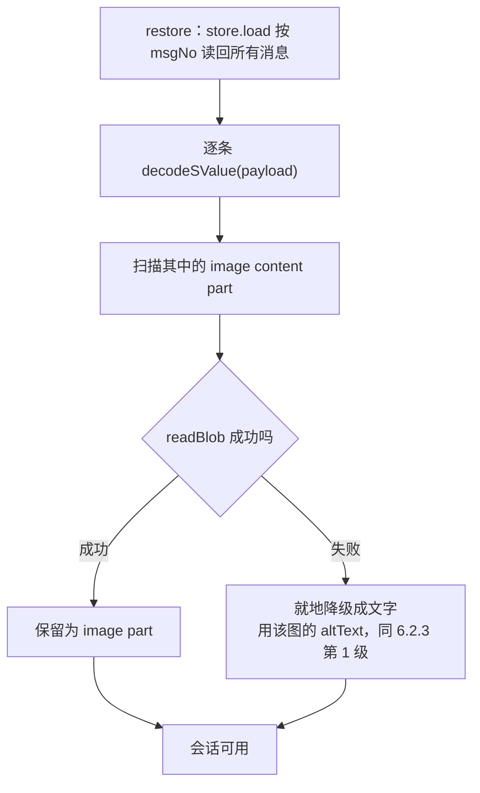

裁剪策略保证了最多只有 N 张（默认 2）图片还是 image part，更早的早已降级成文字，所以需要保活的 hash 极少，失效的影响面也小。这是 6.2 和 6.4 互相支撑的地方。

### 6.7 与第 1 章两层边界的对应

| 组件 | 属于哪层 | 由谁实现 |
|---|---|---|
| 历史裁剪（什么该留在上下文里） | 内核（逻辑） | 内核里的一个纯函数，参数写死，不可替换（6.2.5） |
| `encodeSValue(每条消息)`（序列化格式） | 内核 | 内核 |
| 从消息里抽出 `role` / `turnNo` / `text`（6.3.2） | 内核 | 内核——它知道消息结构，平台不知道 |
| 根引用增量的计算（`diffRefs`） | 内核 | 内核 |
| `AgentSessionStore`（字节存哪儿） | 下边界（实现） | 平台 sdk |
| `CasRootRefGateway`（引用提交到哪儿） | 下边界（实现） | 平台 sdk，已存在于 `cas-client` |

分界线是 `StoredMessage` 和 `CasReferences`：**什么该留在上下文里、编成什么格式、每条消息的结构字段是什么、引用增量是多少**都是与平台无关的判断，属于内核；**这些行和引用最终落到哪个存储、用什么语法条件写**是与平台强相关的做法，属于下边界。

---

## 7. 事件流

### 7.1 事件表

```ts
export type AgentEvent =
  | { readonly type: "run-start";      readonly runId: string }
  | { readonly type: "assistant-text"; readonly text: string }
  | { readonly type: "tool-call";      readonly callId: string; readonly name: string; readonly arguments: JsonValue }
  | { readonly type: "tool-result";    readonly callId: string; readonly ok: boolean; readonly summary: string }
  | { readonly type: "run-end";        readonly response: string; readonly iterations: number }
  | { readonly type: "run-error";      readonly error: string };
```

**这里只有 agent 自己的事件——它在想什么、调了什么工具、说了什么。没有「文档变了」。** 理由见 7.2.1。

一个设计决定：**`tool-result` 只带一句摘要，不带完整数据。** 工具结果可能是一整棵图层树或一张预览图，客户端不需要它——需要的是模型，而模型在服务端已经拿到了。这样每个事件都很小，不需要分片。

### 7.2 一次 run 的时序

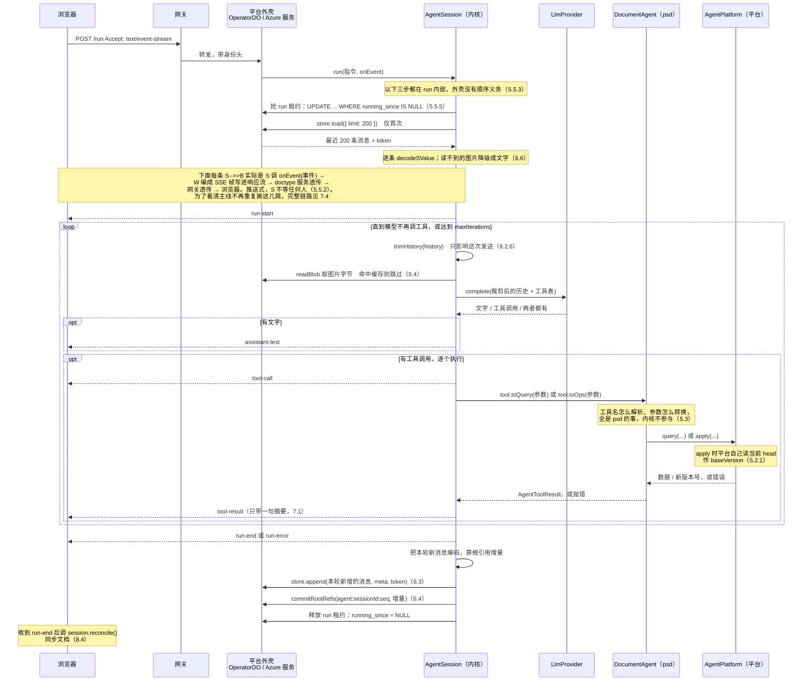

三处顺序是有意为之，不能调换：

1. **抢租约在最前面。** 别人正在跑就立刻返回，一次模型都不调（5.5.5）。
2. **恢复历史在 `run()` 内部**，外壳没有顺序义务（5.5.3）。DO 从休眠中唤醒、Azure 换了一个副本，都由内核自己发现「还没恢复过」并去读库。
3. **裁剪在每次调模型之前，不是每轮结束之后。** 因为要裁的正是「即将发出去的这一份」，而新一轮的工具结果刚刚追加进来。
4. **先存消息，再提交根引用。** 反过来会在崩溃的时间窗里留下「引用已加、消息没写」的孤立引用（6.4）。删除时顺序相反，理由见 5.5.4。

`tool-result` 事件在工具抛错时也发，`ok: false` 加错误摘要——循环不中断，错误原文作为一条 tool 消息进入历史，模型下一轮自己纠正（5.2）。

#### 7.2.1 为什么事件流里没有「文档变了」

agent 不是特殊的写入者，它和坐在浏览器前的人是**对等的编辑者**：两边都产生 op，op 提交后云端生成一个新版本。人拖动图层和 agent 调 `transform`，在编辑器眼里应该是同一件事。

顺着这个前提，「文档变到 v9 了」这条消息就不该从 agent 的事件流里出来：

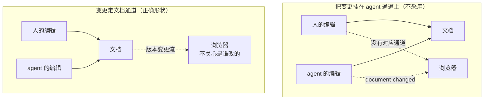

左边那张图里，agent 的编辑有通知、人的编辑没有——这就等于给 agent 单开了一条别人没有的路径。而一旦将来要支持两个人同时编辑，那条 `document-changed` 通道会被整个拆掉重做。

**所以本次不建它。** 文档变更通道属于协同编辑，需要编辑器向订阅者扇出、需要订阅生命周期、在 Azure 的无状态多副本上尤其麻烦，是独立的一块工作。

代价说清楚：客户端在一次 run 期间看不到画布逐步变化，仍然是 `run-end` 之后统一 `reconcile()` 一次——也就是今天的行为。用户在 25 轮期间能看到 agent 的思考和工具调用（这是本次流式带来的改进），但画布是最后一次性更新的。

连带取消：上一版我提议给 `AgentToolResult` 加的 `documentVersion` 字段不要了。它存在的唯一理由就是喂那条通道。

### 7.3 断线的语义

不做重放。断线时：

- 服务端的 `AgentSession` **继续跑完**，文档改动照常落到编辑器（编辑器才是文档状态的持有者）。
- 浏览器收到 `onError`，由调用方决定何时调 `reconcile()` 拿最终状态。

所以「保持连接」在这个设计下的实际含义是：心跳保活 + 断线告知。不是断线续传。

### 7.4 传输链路

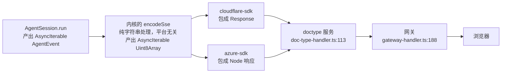

**好消息：链路已经是流式透明的，网关不需要改。**

- `gateway-handler.ts:188-202`：拿到上游 Response 直接 return，不读 body。`Accept` 头在转发白名单里，`Accept-Encoding: identity` 也已经设了，对 SSE 正合适。
- `doc-type-handler.ts:113-125`：转发给 operator，同样直接 return。

（此前担心的 body 缓冲在 `gateway-handler.ts:473`，那是建文档那条路，与 `/run` 无关。）

SSE 帧格式：

```
event: tool-call
data: {"callId":"toolu_01","name":"query_getPreview","arguments":{}}

: keepalive
```

每 15 秒发一次注释帧作为心跳，防止中间代理判定空闲断连。

### 7.5 向后兼容

`/run` 按 `Accept` 头分流：

| 请求头 | 行为 |
|---|---|
| `Accept: text/event-stream` | 返回 SSE 事件流 |
| 其他 | 返回今天的一次性 JSON `{ success, data: { response, iterations } }` |

一次性 JSON 的实现就是把事件流消费完，然后按结尾事件映射：

| 结尾事件 | 返回 |
|---|---|
| `run-end` | `{ success: true, data: { response, iterations } }`，HTTP 200 |
| `run-error` | `{ success: false, error }`，HTTP 500 |

与今天 `operator-do-agent.ts:105-124` 的返回完全一致。这样 markdown / docx 的现有调用和现有测试（`cloudflare-sdk/tests/operator-do.test.ts`，230 行）不受影响，迁移可以逐个文档类型推进。

---

## 8. 客户端设计

### 8.1 psd-client 的现状拆分

`packages/psd-client/src/doc-session.ts`（261 行）已经是一个通用的乐观并发同步引擎：本地立即 apply、待发队列、`opId` 去重重投、409 重整、`reconcile()`。它对 PSD 的耦合只有三处，都可以参数化：

| 耦合点 | 参数化后 |
|---|---|
| `import { applyOne } from "@unidocs/doctype-psd/engine"` | 注入 `applyLocal(doc, op) => doc` |
| `PsdDoc` / `PsdOp` 类型 | 泛型 `<TDoc, TOp>` |
| `RenderLike { applyOp, reset }` | 注入的可选渲染回调 |
| `loadDoc` 来自 `./doc-source.js` | 注入 `reload() => { doc, version }` |

剩下的 `render-client` / `render-core` / `render-worker` / `viewport` / `cas-blob-store`（596 行）才是 PSD 专有的，留在 `psd-client`。

### 8.2 类图

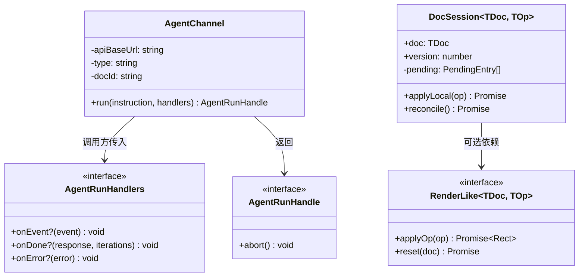

### 8.3 接口

```ts
export class AgentChannel {
  constructor(opts: {
    apiBaseUrl: string;
    type: string;
    docId: string;
    fetchImpl?: typeof fetch;
    /** 超过这个时长没收到任何帧就判定断线，默认 30000 */
    idleTimeoutMs?: number;
  });
  run(instruction: string, handlers: AgentRunHandlers): AgentRunHandle;
}

export class DocSession<TDoc, TOp> {
  constructor(opts: {
    apiBaseUrl: string;
    type: string;
    docId: string;
    doc: TDoc;
    version: number;
    applyLocal: (doc: TDoc, op: TOp) => TDoc | Promise<TDoc>;
    reload: () => Promise<{ doc: TDoc; version: number }>;
    render?: RenderLike<TDoc, TOp>;
    fetchImpl?: typeof fetch;
    genId?: () => string;
  });
  applyLocal(op: TOp): Promise<void>;
  reconcile(): Promise<void>;
}
```

**为什么不用 `EventSource`：** `EventSource` 只能发 GET 请求，不能带请求体，也不能自定义请求头。所以用 `fetch` + `ReadableStream` 手工解析 SSE 帧，大约 80 行。

**为什么不自动重连：** 因为不做重放，重连也拿不到断线期间的事件。自动重连只会制造"好像还连着"的假象。断线就如实告诉调用方。

### 8.4 两者配合

```ts
channel.run(text, {
  onEvent: (e) => {
    if (e.type === "tool-call")     showStep(e.name);      // 实时看到 agent 在做什么
    if (e.type === "assistant-text") addMsg("agent", e.text);
  },
  onDone: async (reply) => {
    addMsg("agent", reply);
    await session.reconcile();                             // 文档同步仍在 run 结束时做
  },
  onError: async (err) => {
    addMsg("err", err.message);
    await session.reconcile();                             // 服务端可能已经改完了
  },
});
```

两个通道各管各的，这是 7.2.1 的直接体现：

| 通道 | 管什么 | 何时同步 |
|---|---|---|
| `AgentChannel` | agent 在想什么、调了什么工具、说了什么 | 实时 |
| `DocSession` | 文档内容 | run 结束后 `reconcile()` 一次 |

对比今天（`web-psd/src/main.ts:374-390`）：中途界面上只有一个不动的「thinking…」，用户不知道 agent 在干什么、跑到哪一步了、是不是卡死了。本次改进的是**这一半**。

画布的逐步更新要等文档变更通道（7.2.1），那时 `DocSession` 订阅它即可，`AgentChannel` 一行都不用改——这正是把两件事分开的好处。

---

## 9. PSD 迁移改动清单

| 文件 | 改动 |
|---|---|
| `doctype-psd/src/queries.ts:101` | `getPreview` 从 `btoa` 产出 base64 改为 `makeSBlob` 返回 SBlob 引用 |
| `doctype-psd/src/agent.ts` | 分发逻辑保留不动，只改 `getPreview` 分支返回 image content part（5.3） |
| `doctype-psd/tests/agent.test.ts:61-76` | 断言反转：从「`$image` 透传且 `content` 为 undefined」改为「返回 image content part」 |
| `doctype-markdown/src/agent.ts` | **不动** |
| `doctype-docx/src/agent.ts` | **不动**。它的图片返回方式（`:75`）本来就是对的，只是从没跑通过——删掉 `renderToolResult` 钩子后这条路才真正打开（P6） |
| `cloudflare-psd/src/anthropic.ts` | 移到 `doctype-server-common/src/agent/providers/anthropic.ts`，删掉 `findImage` / `previewMeta`，翻译改为单向 |
| `cloudflare-psd/src/worker.ts` | 改为注入 `createPsdDocumentAgent` + Cloudflare 的 `AgentPlatform` 实现 |
| `cloudflare-sdk/src/operator-do-agent.ts` | 296 行 → 约 90 行，只剩 DurableObject 外壳、身份校验、把事件流包成 Response |
| `doctype-server-common/src/operator.ts` | 删除（177 行死代码） |
| `azure-sdk/src/local-editor.ts:103` | 删掉 501 占位，改为真实的 `AgentPlatform` 实现，`apply` 提交时自己读当前 head 作 baseVersion |
| `protocol/src/types.ts:100-129` | `DocumentAgent` 改成 `AgentTool[]` + instructions（5.1.2）；`DocumentAgentFactory` 删除；`DocumentAgentContext` 改形状为 `AgentPlatform`（5.1.4） |
| `cloudflare-sdk/src/agent-store-do.ts` | 新增：`DoAgentSessionStore`，DO SQLite 两张表 + `seq` 条件写，写入走 `ctx.storage.transaction`（6.3.2、6.3.4） |
| `azure-sdk/src/agent-store-pg.ts` | 新增：`PgAgentSessionStore`，Postgres 两张表 + `seq` 条件写，事务复用 `PgUnitOfWork`（`ports-pg.ts:270`），条件写照搬 `PgDeltaLog.append`（`:89-111`） |
| `azure-sdk/migrations/0003_agent_sessions.sql` | 新增：`agent_sessions` 与 `agent_messages` 两张表（6.3.2） |
| `azure-sdk/tests/migrate.test.ts:36` | 断言的表名列表加上 `agent_sessions`、`agent_messages` |
| `psd-client/src/doc-session.ts` | 移到 `client-sdk`，泛型化 |
| `psd-client/src/index.ts` | 重新导出 `client-sdk` 的 `DocSession`，并绑定 PSD 的 `applyLocal` / `reload` |
| `web-psd/src/main.ts:357-397` | 改用 `AgentChannel`，展示逐步进度 |

---

## 10. 实施顺序

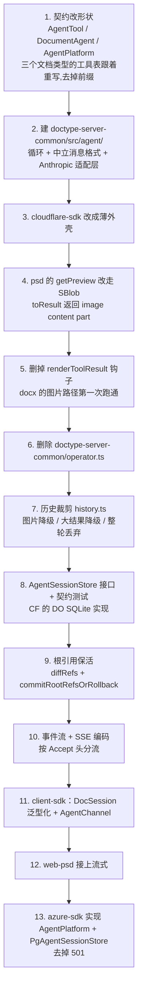

第 1-6 步是 A 块（两层边界），第 7-9 步是 B 块（裁剪与持久化），第 10-12 步是 C 块（流式），第 13 步是「平台无关」这个目标的真正证明——它同时验证下边界的两个接口（`AgentPlatform` 和 `AgentSessionStore`）都确实可换。

每一步结束时全仓库测试必须通过，任何一步都可以独立成为一个提交。

---

## 11. 验收标准

| # | 标准 | 验证方式 |
|---|---|---|
| V1 | 文档类型不再持有任何平台句柄 | 搜索 `packages/doctype-*/src/`：不应出现 `context.query` / `context.apply` / `resolveBlob`；`agent.ts` 只导出一个常量，没有 factory |
| V2 | 内核不按名字猜工具语义 | 全仓库搜索 `startsWith("query_")` / `startsWith("apply_")` 应无任何命中——前缀彻底消失（5.3.1） |
| V3 | 内核不 import 任何云相关模块，也不用 `Request` / `Response` | `tests/unit/agent-kernel-purity.test.ts` 按目录扫 `src/agent/**`（4.4） |
| V3b | 平台 sdk 不依赖任何文档类型，反之亦然 | 同一测试文件断言 `package.json`：`{cloudflare,azure}-sdk` 的 dependencies 无 `@unidocs/doctype-*`（`doctype-server-common` 除外）；`doctype-*` 的 dependencies 无任何平台 sdk（`doctype-server-common` 是预期的）（4.4） |
| V3c | 文档类型对 SDK 是仅类型依赖，浏览器 bundle 不受影响 | 打包 `psd-client`，断言产物体积与改造前持平，且不含 `AgentSession` 等符号（4.3.2） |
| V4 | 循环行为不退化 | 新增契约测试：内存版 `AgentPlatform` + 假 provider，跑完整循环，覆盖工具调用往返、apply 失败后模型重试、达到迭代上限、未知工具名 |
| V5 | PSD 送给模型的图片字节与改造前完全一致 | 抓一次 provider 请求体，与改造前对比 |
| V6 | 现有 230 行 `operator-do.test.ts` 全绿 | `pnpm test` |
| V7 | 浏览器能实时看到 agent 的每一步 | web-psd 手工端到端：发一条多步指令，chat 区逐条出现工具调用；画布在 run 结束后一次性更新（本次不做逐步更新，见 7.2.1） |
| V8 | 同一条指令在 Azure 栈跑通 | `pnpm test:azure` 新增用例 |
| V9 | docx 的图片路径第一次真正跑通 | 现有 `doctype-docx/tests/agent.test.ts` 已覆盖 `getImage` / `insertImage`；再补一条端到端：删掉 renderToolResult 后，image content part 能被 Anthropic 适配层翻成图片块而不抛异常（P6） |
| V10 | 内核不持有任何版本状态 | 代码检视 + 搜索：`packages/doctype-server-common/src/agent/` 里不应出现 `version` 相关字段；契约测试：apply 失败时错误原文出现在下一轮的 tool 消息里，且循环继续而不是中止 |
| V10b | `toQuery` / `toOps` 确实是纯函数 | 契约测试：同一组参数连调两次，结果深相等；调用期间不发生任何 IO（用假的全局 fetch 断言未被调用） |
| V11 | `AgentSessionStore` 在两个平台行为一致 | 共享契约测试 `agentSessionStoreContract`，CF 用 Miniflare、Azure 用 Postgres 各跑一遍（6.3.9） |
| V12 | 会话历史存取不丢 SBlob | 契约测试最后一条：`payload` 含 SBlob 存进去，读回来解码后 `isSBlob()` 仍为 true。这条对应 6.1.1「不能改用 JSON」 |
| V12c | 消息的结构字段真的成了列，不用解码就能查 | 跑完一轮后直接查库：`SELECT role, count(*) FROM agent_messages GROUP BY role` 能分出 user / assistant / tool 三类，且条数与实际一致（6.3.8） |
| V12b | 内核的裁剪代码不含任何文档类型词汇 | 搜索 `packages/doctype-server-common/src/agent/history.ts`：不应出现 `preview` / `region` / `layer` / `heading` 等任一文档类型的概念；降级文字只由 `altText` 和 `mediaType` 拼出（6.2.3） |
| V13 | 裁剪不会切出孤立的 `tool_result` | 属性测试：随机生成含多工具调用的历史，裁剪后断言每个 `toolCall.id` 都有配对的 tool 消息（6.2.1） |
| V14 | 发给模型的历史不超预算 | PSD 跑满 25 轮后，抓一次 provider 请求体：估算 token 低于 `BUDGET_TOKENS`，图片 part 不超过 `MAX_IMAGES` |
| V14b | 裁剪不动存储 | 同一次运行结束后查库：`agent_messages` 里本轮所有消息一条不少，且早期那些含图片的消息 `payload` 与写入时逐字节相同——裁剪只发生在发送路径上（6.2.6） |
| V15 | 重启后会话可续 | 端到端：跑一轮 → 销毁 OperatorDO / 重启 Azure 进程 → 再发一条指令，模型能引用上一轮的内容 |
| V17 | 断线之后服务端跑完 | 端到端：发一条多步指令，中途关掉浏览器标签；等待后重新打开，`reconcile()` 能拿到 agent 全部改动的结果，且 `agent_messages` 里本次对话完整（5.5.2） |
| V18 | 并发 run 在入口就被拒绝 | 同一 sessionId 连发两个 run，第二个立刻返回错误，且**假 provider 的调用次数只增加了第一个 run 的量**——证明第二个一次模型都没调（5.5.5） |
| V19 | `reset()` 清干净 | reset 之后：`load()` 返回 null，且该会话此前引用的 blob 引用计数归零 |
| V20 | 图片字节不重复读取 | PSD 跑满 25 轮，统计 `platform.readBlob` 的调用次数应等于出现过的**不同** hash 数，而不是轮数乘图片数（5.4） |
| V16 | 历史引用的图片不被回收 | 跑一轮产生预览图 → 删掉对应图层并 apply → 断言历史里那张图仍可 `readBlob`（6.4 的根引用生效） |

V8 是整个设计成立与否的判据：如果 Azure 跑不起来，说明抽象层没做到平台无关。V11 是它在存储维度上的对应判据。

---

## 12. 不在本次范围

| 项 | 原因 |
|---|---|
| 摘要压缩（把最早若干轮交给模型总结） | 需要额外一次模型调用，成本和质量都要实测才好定参数。**也不预留接口**——理由见 6.2.7。前三级裁剪先跑一段时间看是否够用 |
| **文档变更通道** | agent 与人是对等的编辑者，「文档变了」该走文档通道而不是 agent 通道（7.2.1）。建它需要编辑器向订阅者扇出、订阅生命周期管理，Azure 的无状态多副本上尤其麻烦——是协同编辑那一块的工作。本次不建，也不建会被拆掉的临时替代 |
| 逐字输出 | 需要 provider 支持流式并处理 `input_json_delta` 增量拼接，测试成本高，本次不做 |
| 事件重放 / 断线续传 | 需要把**事件序列**也持久化，那是与会话历史不同的一份数据（历史是给模型看的，事件是给界面看的）。7.3 已选定不重放 |
| 跨会话的长期记忆 | 本次的持久化只保证"同一个文档的对话可以续上"，不涉及跨文档、跨会话的知识沉淀 |
| 中途打断 / 追加指令 | 需要额外的控制通道，且「已经 apply 的操作要不要回滚」语义需要单独设计 |
| 数据分片 | 单向进度流下每个事件都很小，SSE 帧天然分帧，不需要 |

---

## 13. 风险

| # | 风险 | 应对 |
|---|---|---|
| R1 | DurableObject 在返回流未读完时无法休眠，一次 run 可能持续数分钟 | 今天的阻塞请求是同样的代价，不算新增开销 |
| R2 | Miniflare 本地栈是否透传流式响应未验证 | 第 6 步优先验证，失败则本地栈退回一次性 JSON，云上走流式 |
| R3 | 图片改走 SBlob 后送给模型的内容若有变化，模型行为会变 | V5 用请求体比对锁死 |
| R4 | 消息格式重写会改掉 `anthropic.ts` 大半 | V4 的契约测试 + V6 的现有测试双重兜底；这部分单独成一个提交，便于回退 |
| R5 | `toQuery` / `toOps` 声明是纯函数，但 TypeScript 拦不住有人在里面发网络请求或读全局状态。真这么写，内核的重试和裁剪都会出意外行为 | 契约测试里对同一组参数调两次，断言结果深相等；代码检视时重点看这两个函数 |

---

## 14. 已确认的设计决定

| 决定 | 结论 |
|---|---|
| 整体形状 | 一个内核 + 两层抽象边界：上边界抽掉文档类型差异，下边界抽掉运行环境差异。新增文档类型、新增平台、新增模型供应商三种扩展互不相交，且都不改内核 |
| 下边界为何拆成三个接口 | 变化原因不同：换平台影响文档读写和传输，换模型供应商只影响 `LlmProvider` |
| 本次范围 | A + B + C，B 里只推迟摘要压缩 |
| 会话历史的序列化格式 | SValue CBOR，**不能用 JSON**——SBlob 的品牌是 Symbol，`JSON.stringify` 会丢。端口层现有的两个 `DeltaLog` 恰恰用了 JSON，所以承载不了含 SBlob 的值 |
| 字节存哪儿 | 直接进表的字节列：CF 用 DO SQLite `BLOB`，Azure 用 Postgres `BYTEA`。不绕 CAS——历史每轮都变，内容寻址去重收益接近零 |
| 会话表怎么定位 | 用 `session_id`，不用 doc id。这是仓库刻意迁过去的约定——`migrations/0002_session_identity.sql` 把 `deltas` / `doc_snapshots` 的 `doc_id` 列改名成了 `session_id`，`doc_sessions` 负责映射到 `(tenant_id, doc_type)` |
| 会话历史怎么存 | **一条消息一行**，两张表：`agent_sessions`（一行，条件写凭据 + 汇总元数据）配 `agent_messages`（一条消息一行，`role` / `turn_no` / `tool_call_id` / `text` 成列，消息本体是 SValue 字节）。形状照搬 `doc_sessions` 配 `deltas`。两端同名同列，只有主键不同——CF 用 `singleton`，Azure 用复合主键（6.3.1、6.3.2） |
| 哪些东西成列、哪些成字节 | **结构成列，内容成字节。** `role` / `turn_no` / `tool_call_id` 是消息的结构，是纯标量，没有理由埋进 CBOR；消息本体含 SBlob，只能是 SValue 字节（6.1.1）。另存一列派生的 `text` 用于不解码就能看懂对话，它永远不是权威（6.3.2） |
| 写入时机 | **每一轮结束写一次。** 一条消息一行之后，一轮只 INSERT 两三行，代价与整段重写完全不同，没有理由让崩溃丢掉整段对话（6.5） |
| 裁剪要不要改存储 | **不要。** 裁剪服务的是「塞进模型窗口」，存储服务的是「用户能往回翻」，两个使用者要的不是一回事。让裁剪去删存储，等于为了前者把后者的数据毁掉——旧轮次一裁就再也翻不出来。表只追加，裁剪是读出来之后的一次内存变换（6.2.6） |
| `load` 要不要带条件 | **要。** 两个调用方要的都不是全部：内核 `restore()` 只需最近若干条（写死 200），界面往回翻需要 `limit` + `before` 分页。控制体量的清理策略是第三件事，与前两者都无关，本次不做（6.3.5） |
| 图片保活 | 与字节存哪儿正交，靠显式提交根引用 `agent:<sessionId>:<seq>`，与文档的 `apply:` 引用各自独立 |
| 文档类型要不要持有平台句柄 | **不要。** 一个工具无非是读或写，声明自己是哪一种再给一个纯函数就够了，不需要有人递给它 `query` / `apply`。`resolveBlob` 也不需要——租约由 `session.ts:608` 的 `leaseOpRefs` 在 apply 第 1 步做掉了，剩下的 `createSBlob(hash)` 是同步纯函数（5.1.1） |
| `DocumentAgentContext` 的去向 | 它原本是递给文档类型的句柄，现在文档类型不接受句柄，它就退化成纯粹的平台接口 `AgentPlatform`（`query` / `apply` / `readBlob`），只有内核调。`readBlob` 本来也没有任何文档类型在用——今天唯一的调用点 `operator-do-agent.ts:158` 正是要删的那条路（5.1.4） |
| 裁剪要不要做成可替换的策略 | **不要。** 四个阈值直接写死在 `history.ts`，不做成参数，也不暴露策略接口。这些数字合不合适要跑起来才知道，现在固化成 API 等于在没有依据的情况下先定契约，而它会立刻被三个文档类型和两个平台引用。裁剪逻辑是一个输入输出都是 `AgentMessage[]` 的纯函数，将来真要可配置，改这一个文件即可（6.2.5） |
| 摘要压缩要不要预留接口 | **不预留。** 前三级都是同步纯函数；为一个还没实测过的功能把入口改成异步、再引入 `LlmProvider` 依赖，是为想象中的需求付真实的复杂度（6.2.7） |
| 裁剪归内核还是文档类型 | **机制在内核，内容知识在文档类型。** 需要裁剪的不只 PSD——markdown 的 getContent 返回全文、docx 的 getImage 返回图片，一样会让上下文超出上限；而 tool_use/tool_result 的配对约束只有持有历史的内核能守。文档类型通过**数据**影响裁剪（图片的 `altText`、叶子包传的阈值），不通过代码（6.2.2） |
| 裁剪的最小单位 | 一轮（assistant + 它全部的 tool 消息），不是一条消息——否则会切出孤立的 `tool_result`，被 API 拒绝 |
| 裁剪是否就地生效 | 是。返回值直接替换 history，让"发给模型的 = 存下来的 = 恢复出来的" |
| 图片通道 | 协议层归一，统一走 SBlob content part；删除 `$image` 和 `renderToolResult` |
| 事件流野心 | 单向进度流，不重放 |
| 客户端范围 | agent 通道 + 泛型化的 DocSession |
| 参数怎么转成 query / op | **归文档类型**，写在每个工具自己的 `toQuery` / `toOps` 里——docx 的 `insertImage` 要把 hash 包成 SBlob，psd 的可以直接透传，本来就该各写各的。内核只负责按名字找到工具、按 `kind` 决定调 query 还是 apply，不解析名字也不猜（5.1.5） |
| 上边界用什么接口 | `DocumentAgent` = `AgentTool[]` + instructions。每个工具声明 `kind: "query" | "op"`，并给一个纯函数把参数转成 query 或 op。文档类型**不接受任何句柄**，因此没有工厂，导出的是常量（5.1） |
| agent 与人的关系 | **对等的编辑者。** 两边都产生 op，op 提交后云端生成版本，编辑器眼里是同一件事。不给 agent 开任何特殊写入路径 |
| `apply_xxx` 这类工具名 | 前缀是分发器的机器语言，不是给模型的名字，而这一版之后它彻底没有用处——工具是读是写由 `kind` 声明。改成领域动词并对齐提示词，与工具表重写是同一次改动，放进本次范围（5.3.1） |
| 文档变更怎么通知客户端 | **不通过 agent 事件流。** agent 与浏览器前的人是对等的编辑者，两边都产生 op；「文档变了」属于文档通道，人和 agent 的改动都从那里出来。把它挂在 agent 通道上，等于给 agent 单开一条人的编辑没有的路径，将来支持多人编辑时要整个拆掉。本次不建那条通道，客户端沿用 run-end 后统一 reconcile（7.2.1） |
| 版本与乐观锁归谁 | **不归 agent。** agent 的职责到「生成 op」为止；`apply` 是确定性算法，它自己就是校验器，能 apply 即合法，不能则错误回给模型重新生成。内核不持有 `lastKnownVersion`，不强制「先 query 再 apply」。`baseVersion` 仍是编辑器写入路径的必需参数（`session.ts:625`），由平台的 `apply` 实现读当前 head 得到（5.2） |
| 平台隔离位置 | 只在 `cloudflare-sdk` / `azure-sdk`，文档类型不感知 |
