# 通用 Agent SDK 设计

日期：2026-08-26
分支：`feat/agent-sdk`
状态：待 review

---

## 1. 要建立什么

### 1.1 一个内核，两层抽象边界

建立一份与**文档类型**无关、也与**运行平台**无关的 agent 内核。它的位置由上下两条抽象边界夹住：

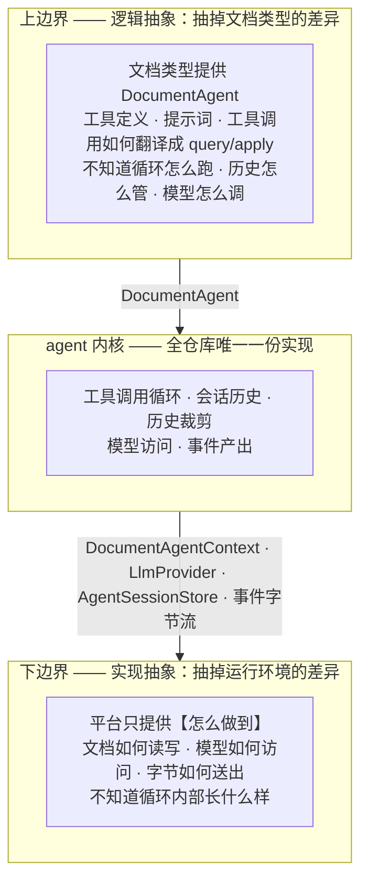

**逻辑抽象**回答的是「一个文档 agent 对外长什么样」——一组工具、一段提示词、一个「给我工具名和参数，我还你一个结果」的调用入口。内核不知道 PSD 有图层、docx 有段落，只知道调用一个工具会返回一个 `AgentToolResult`。

**工具调用如何翻译成 `query` / `apply`，属于上边界的实现方，不属于内核。** 这一点值得写明，因为它容易被当成可以共用的样板：docx 的 `apply_insertImage` 收到 `hash` 字符串，必须先 `resolveBlob` 换成 SBlob 才能构造操作（`doctype-docx/src/agent.ts:86-113`），而 psd 的操作参数可以原样透传。它们今天看起来像，明天就不像——把它抽进内核，只会换来一堆为了让抽象成立而额外增加的特殊处理。

**实现抽象**回答的是「这些动作靠什么完成」——文档读写通过什么通道、模型通过什么协议、结果字节怎么送到调用方。它对所有平台是同一套，DurableObject 和 Node 进程在这一层是同构的。

### 1.2 两个方向的扩展互不相交

这是「平台可扩展」的具体含义：

| 要新增什么 | 要做的事 | 不需要碰的 |
|---|---|---|
| 一个新文档类型（例如 xlsx） | 实现上边界：一个 `DocumentAgentFactory`——工具定义、提示词、以及它自己的 `toolCall` | 内核、所有平台代码 |
| 一个新平台（例如 AWS） | 实现下边界：`DocumentAgentContext`、`AgentSessionStore`、一层传输外壳 | 内核、所有文档类型 |
| 一个新大模型供应商 | 实现下边界的一个接口：`LlmProvider` | 内核、所有文档类型、所有平台 |

三种扩展都不修改内核，也不互相牵动。

### 1.3 两层边界的接口

| 边界 | 接口 | 由谁实现 | 定义在 |
|---|---|---|---|
| 上（逻辑） | `DocumentAgentFactory` → `DocumentAgent` = tools + instructions + toolCall | 文档类型 | `protocol/src/types.ts:118-129`，**已存在，本次不改** |
| 下（实现） | `DocumentAgentContext` —— 文档读写 | 平台 sdk | `protocol/src/types.ts:105`，**已存在，本次不改** |
| 下（实现） | `LlmProvider` —— 模型访问 | 内核内置 Anthropic / OpenAI，可另加 | 5.4 |
| 下（实现） | `AgentSessionStore` —— 会话历史落盘 | 平台 sdk | 6.3 |
| 下（实现） | 事件字节流 → 平台响应对象 | 平台 sdk | 7.4 |

下边界之所以要拆成四个接口而不是一个，是因为它们的变化原因不同：换平台影响文档读写、会话存储和传输，换模型供应商只影响 `LlmProvider`。

另有一个接口属于**内核**而非下边界，容易放错位置：`ContextPolicy`（历史裁剪，6.2）。判断"什么该留在上下文里"与运行环境无关，所以它在内核；"字节存到哪儿"才是下边界。两者的分界线是 `Uint8Array`。

### 1.4 上边界已经有了，缺的是下边界

| 边界 | 状态 |
|---|---|
| 上（逻辑） | **已存在且被遵守。** 三个文档类型都实现了 `DocumentAgentFactory`，拿到的 `context` 只有 `query` / `apply` / `resolveBlob` / `readBlob`，都不知道 DurableObject 的存在。本次不动它。 |
| 下（实现） | **不存在。** 平台把循环整个吃进了自己的实现里——`cloudflare-sdk/src/operator-do-agent.ts` 的 296 行里，ReAct 循环、`DocumentAgentContext` 的 DO 实现、身份透传、结果渲染全部交织在一个类里，没有一条缝能让 Azure 插进来。 |

所以本次的工作是**单向的**：把内核从平台实现里剥出来，并把下边界补成显式接口。上边界只需要确认它没被顺手破坏。

一处例外：`DocumentAgent` 的**返回值**约定要收口——图片必须走 `AgentToolResult.content` 的 image part，不能像 psd 今天那样塞进 `structuredContent` 再让平台层去搜（2.4）。那是协议层的约定，不是分发逻辑。

后果见第 2 章。

### 1.5 本次范围

| 编号 | 内容 | 本次 | 章节 |
|---|---|---|---|
| A | 建立两层边界：循环内核、工具分发、消息格式、大模型接口 | ✅ 做 | 3–5 |
| B | 会话历史裁剪、会话持久化（含两个平台的实现） | ✅ 做 | 6 |
| C | 事件流 + 客户端 SDK | ✅ 做 | 7–8 |

B 里唯一推迟的是**摘要压缩**（把最早若干轮交给模型总结）——接口支持，本次不实现，理由见 6.2.7。

验证方式：以 PSD 为样板走通全链路，并用 Azure 证明下边界确实可换（11 章 V8、V11）。

---

## 2. 现状：两层边界缺失的后果

### 2.1 只有一条链路真正能跑

| 链路 | 状态 | 卡在哪 |
|---|---|---|
| cloudflare-psd | 能跑 | 唯一配置了真实大模型接入的，`cloudflare-psd/src/anthropic.ts` |
| cloudflare-markdown | 不能 | `llmProvider` 是抛异常的占位，`cloudflare-markdown/src/worker.ts:29` |
| cloudflare-docx | 不能 | 同上；且图片路径还会撞 P6 |
| azure-markdown / azure-docx | 不能 | operator 接口一律返回 501，`azure-sdk/src/local-editor.ts:103` |
| azure-psd | 不存在 | Azure 栈里没有 psd |

要让**第二条**链路跑起来，会撞上两件事，都在下边界：

| # | 撞上什么 |
|---|---|
| 1 | 循环无法复用——唯一能用的那份依赖 `DurableObjectStub` / `Request` / `Response` |
| 2 | 大模型接入要重写——`anthropic.ts` 躺在 `cloudflare-psd` 这个叶子包里 |

上边界不在这个清单里：新文档类型写自己的 `DocumentAgentFactory` 本来就是它该做的事，不是重复劳动。

需要说明的是，Azure 至今没有 agent，直接原因是那一期把它划在范围外（`azure-sdk/src/local-editor.ts:97-101` 注明是 future work），并不是被 Cloudflare 的实现挡住了。下边界缺失影响的是**现在补做时的成本**，不是它当初没做的原因。

### 2.2 代码分布

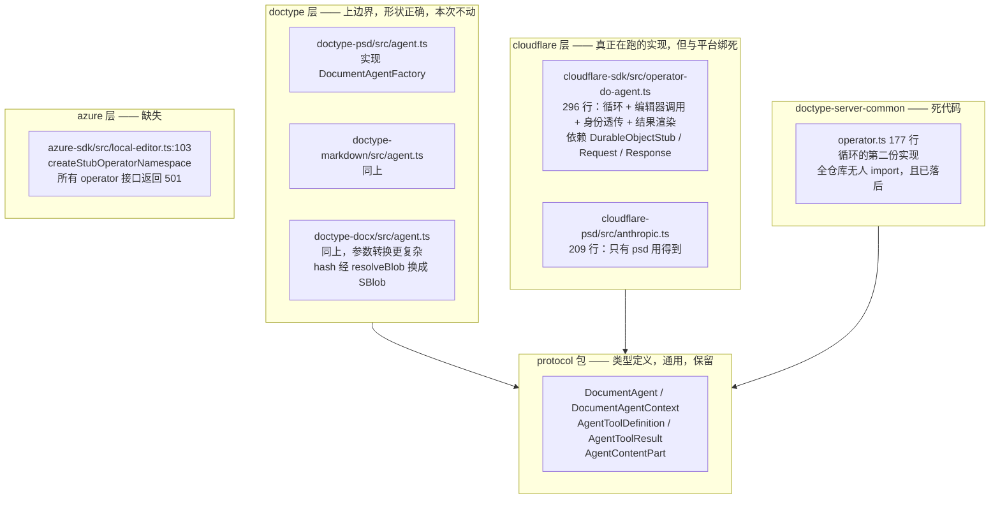

### 2.3 具体问题清单

| # | 问题 | 位置 |
|---|---|---|
| P2 | 唯一可用的循环实现依赖 Cloudflare 类型，Azure 无法复用 | `cloudflare-sdk/src/operator-do-agent.ts` |
| P3 | 存在第二份无人使用且已落后的循环实现 | `doctype-server-common/src/operator.ts` |
| P4 | 大模型适配层放在最外层的叶子包里，其他文档类型用不到 | `cloudflare-psd/src/anthropic.ts` |
| P5 | 同一仓库存在两套互相冲突的图片约定 | 见 2.4 |
| P6 | `renderToolResult` 钩子全仓库无人设置，docx 的图片路径一跑就抛异常 | `operator-do-agent.ts:25` 声明、`:112` 调用、`:263` 抛出 |
| P7 | `/run` 是一次阻塞请求，PSD 最多 25 轮循环期间零反馈，断线即全部丢失 | `web-psd/src/main.ts:374-383` |
| P8 | 会话历史无上限增长，且只在内存中，进程重启即丢 | `operator-do-agent.ts:55` |

### 2.4 两套冲突的图片约定

| 文档类型 | 做法 | 位置 |
|---|---|---|
| docx | 返回协议层的 `content: [{ type:"image", blob }]` | `doctype-docx/src/agent.ts:75` |
| psd | 把 base64 塞进普通数据字段 `{ $image: { base64 } }`，再由大模型适配层递归搜索捞出 | `doctype-psd/src/queries.ts:101` + `cloudflare-psd/src/anthropic.ts:72` |

docx 那条路从未真正跑通过：它会撞上 `renderDefaultAgentToolResult` 的抛异常分支（P6），只是因为 docx 的 `llmProvider` 本身就是个抛异常的占位实现（`cloudflare-docx/src/worker.ts:29`），所以一直没暴露。

PSD 那条路的副作用：base64 让数据膨胀三分之一，并且撞过 SValue 的字符串长度上限（提交 `da9028d` 就是修这个）。

---

## 3. 两层边界落到具体的包上

1.1 是抽象形状，这一节是它对应的实际代码归属。

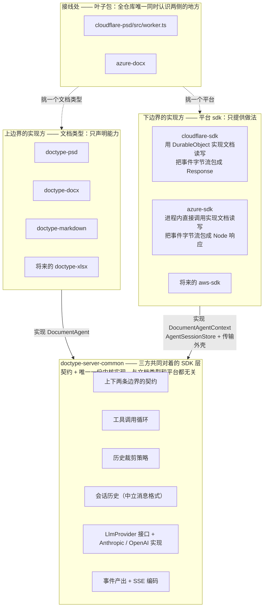

三条不可越界的规则：

1. **文档类型永远看不到 `DocumentAgentContext` 的实现**。它不知道文档是通过 DurableObject 还是进程内调用读到的，也不知道 `baseVersion` 的存在。
2. **平台 sdk 永远看不到循环内部**。它拿到的是一个事件序列，负责把它变成本平台的响应对象，不参与决定何时调模型、何时调工具。
3. **平台 sdk 永远不依赖任何文档类型，文档类型也不依赖任何平台 sdk**。今天已经如此（4.3 有 `package.json` 的实据），本次不能破坏。两者的组合只发生在叶子包，而叶子包本来就是「某个文档类型 × 某个平台」这一个具体部署的入口——`cloudflare-psd` 就是「PSD 跑在 Cloudflare 上」这一件事。

前两条如果被打破，就退回到今天的状态（1.4）；第三条被打破，「新增文档类型」和「新增平台」这两个方向就会互相牵动，1.2 的表就不成立了。4.4 给出机器可校验的落地方式。

L2 这一层同时装着**契约**和**唯一一份内核实现**。文档类型对着它写 agent，平台 sdk 对着它实现 platform 接口，两者之间没有任何箭头——这就是依赖倒置。它自己只依赖 `protocol`（SValue / SBlob / CAS 那些文档层的东西）。

---

## 4. 包与约束

### 4.1 契约的物理位置：留在 `protocol`

`doctype-server-common` 是三方对着写代码的那一层（4.3），但两条边界的**契约类型**不必搬进去——它们今天已经在 `protocol` 里，全是纯类型、零平台代码，搬家没有收益还要处理 `DocumentType.tools` 造成的环（4.3.1）：

```
protocol/src/types.ts
  :82-98    AgentContentPart                        工具结果里的文字 / 图片 / 文件
  :100-103  AgentToolResult
  :105-116  DocumentAgentContext    ← 下边界契约（平台实现）
  :118-129  DocumentAgent / DocumentAgentFactory  ← 上边界契约（文档类型实现）
```

本次只往里补下边界还缺的几个契约：

```ts
// 新增到 protocol
export interface LlmProvider { complete(request): Promise<AgentCompletion> }
export interface AgentSessionStore { load(); save(bytes, token); clear() }
export type AgentMessage = ...    // 中立消息格式（5.4）
export type AgentEvent = ...      // 事件表（7.1）
```

规则一句话：**契约的定义在 `protocol`，实现和门面在 `doctype-server-common`。** 文档类型作者不需要知道这个区分——`doctype-server-common/agent` 把契约再导出一次，只有一个 import 来源（4.3.1）。

### 4.2 内核实现放在 `doctype-server-common/src/agent/`

不新建包。理由是依赖边：三方里已经有两方（`cloudflare-sdk`、`azure-sdk`）依赖着 `doctype-server-common`——

```
cloudflare-sdk 的 deps: cas-client, cas-server-common, doctype-server-common, http-protocol, protocol, svalue-codec
azure-sdk 的 deps:      @azure/*, cas-client, doctype-server-common, http-protocol, protocol, svalue-codec, pg
```

放进去，平台侧新增零条依赖边，只有文档类型侧要加一条（4.3.1）。新建一个包则三方都要加边，还要多一套 `package.json` / `tsconfig` / 构建脚本 / 测试配置，换来的只是包名更好听。

```
packages/doctype-server-common/src/agent/
  ├── session.ts          AgentSession —— 工具调用循环、会话历史
  ├── context-policy.ts   默认三级裁剪策略（6.2）
  ├── store.ts            AgentSessionStore 的契约测试（6.3.7）
  ├── sse.ts              AgentEvent 序列 → SSE 字节流（7.4）
  └── providers/
      ├── anthropic.ts    从 cloudflare-psd 搬过来，删掉图片嗅探
      └── openai.ts
```

按包已有的子路径约定（`./port-contract`、`./memory-ports`）再加一个 `./agent` 导出入口。

### 4.3 依赖方向

`doctype-server-common` 是**三方共同对着的那一层**：文档类型对着它写 agent，平台 sdk 对着它实现 platform 接口，内核实现也住在里面。它只依赖 `protocol`。

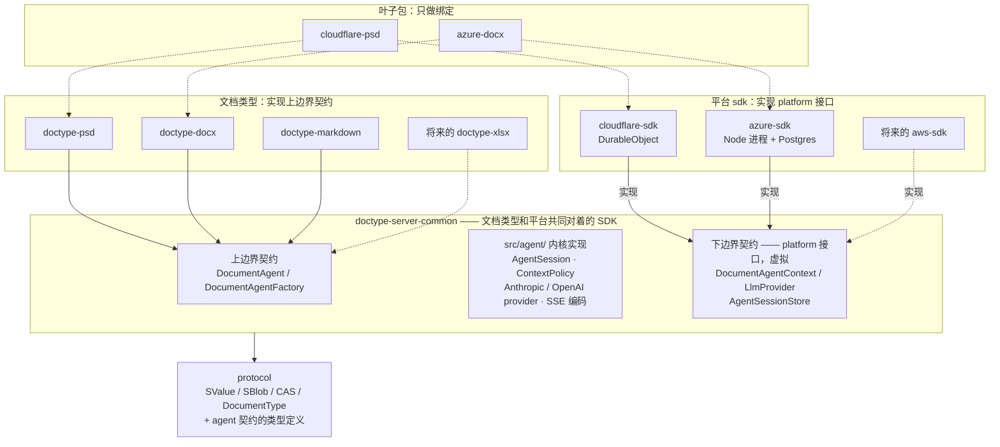

箭头方向是这张图的全部意义：**文档类型和平台 sdk 都指向 `doctype-server-common`，两者之间没有任何箭头。** 具体实现依赖抽象，抽象不依赖具体。叶子包在最上面，只负责挑一个文档类型和一个平台把它们接起来。

#### 4.3.1 本次唯一新增的依赖边

| 包 | 今天依赖 | 本次之后 |
|---|---|---|
| `doctype-psd` / `docx` / `markdown` | `protocol`、`svalue-codec` | **加 `doctype-server-common`** ← 唯一的新边 |
| `cloudflare-sdk` / `azure-sdk` | 已含 `doctype-server-common` | 不变 |
| `cloudflare-psd` / `azure-docx` | 一个文档类型 + 一个平台 sdk | 不变，只是接线代码变了 |

平台侧一条边都不用加——内核放进了它们本来就依赖的包（4.2）。文档类型侧加的这一条，是为了让「写一个文档 agent」有一个明确的对着写的地方，而不是去 `protocol` 里翻类型。

**契约的物理位置不动。** `DocumentAgent` 等类型仍然定义在 `protocol/src/types.ts:82-129`——搬家没有收益，还要处理 `DocumentType.tools` 造成的环。`doctype-server-common/agent` 把它们**再导出**一次，于是文档类型作者只需要记住一个 import 来源：

```ts
import type {
  DocumentAgentFactory, DocumentAgent,
  AgentToolDefinition, AgentToolResult, AgentContentPart,
} from "@unidocs/doctype-server-common/agent";
```

#### 4.3.2 一个要留意的点：包名里的 "server"

`doctype-psd` 通过 `./engine` 子路径供浏览器使用（`psd-client/src/doc-session.ts:1` 就是这么引的），而现在它的主入口要依赖一个名字里带 `server` 的包。

实际不会有问题：`./engine` 子路径不 import agent 相关的任何东西，而 agent 那部分对 `doctype-server-common` 是**仅类型依赖**（`import type`），编译后擦除。实施时用打包体积断言验证一次（V3c）。

如果将来觉得名字别扭，可以把包改名为 `@unidocs/doctype-sdk`——但那是纯改名，不属于本次范围。

### 4.4 三条边界规则怎么守

仓库没有 eslint / biome，只有 `tsc` + `vitest`。

**规则 1（内核不知道平台）** —— 新增 `tests/unit/agent-kernel-purity.test.ts`：扫描 `packages/doctype-server-common/src/agent/**` 的所有 import 与全局标识符，断言不出现 `Request` / `Response` / `DurableObject*` / `@cloudflare/*` / `@azure/*`。

按目录扫而不是按包扫，是因为同包的 `doc-type-handler.ts` 和 `session-handler.ts` 本来就要用 `Request` / `Response`——它们是 HTTP 外壳，不在 agent 内核里。这也是不新建包所付的唯一代价：拿不到「整包 tsconfig 禁用平台类型」那道更硬的保险，只能靠目录级的扫描。不过目录扫描本来就是主要手段，tsconfig 那道只是额外的一层。

**规则 3（两侧互不依赖）** —— 同一测试文件里的 `package.json` 断言：

```ts
// packages/{cloudflare,azure}-sdk：dependencies 里不得出现任何 @unidocs/doctype-*
//                                （doctype-server-common 除外）
// packages/doctype-*：dependencies 里不得出现 @unidocs/cloudflare-sdk /
//                     @unidocs/azure-sdk
//                     （@unidocs/doctype-server-common 是预期的，见 4.3.1）
```

**规则 2（平台不知道循环内部）** —— 没有等价的机器检查，平台 sdk 本来就允许 import 内核。靠两件事守：

- 循环状态（会话历史、迭代计数）全部封在 `AgentSession` 私有字段里，平台拿不到，无从参与决策。平台唯一能做的是消费 `run()` 吐出的事件序列。
- 代码检视：平台 sdk 里若出现「判断该不该再调一次模型」这类逻辑，就是越界。

---

## 5. 服务端设计

### 5.1 类图

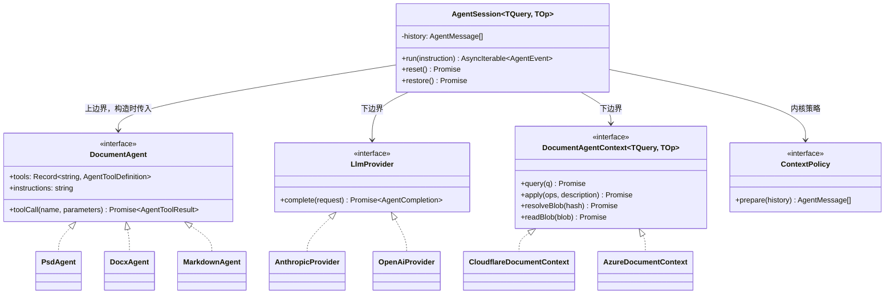

图里只有 `AgentSession`、`LlmProvider`、`ContextPolicy` 是本次新增的。`DocumentAgent`（`protocol/src/types.ts:118`）和 `DocumentAgentContext`（`:105`）都已经存在且形状正合适——纯语义，不知道 HTTP、DurableObject、CBOR 的存在。

**`AgentSession` 与 `DocumentAgent` 的分工**，这是本章最要紧的一条线：

| 归 `AgentSession`（内核） | 归 `DocumentAgent`（文档类型） |
|---|---|
| 什么时候调模型、调几次、什么时候停 | 一个工具名 + 一组参数，具体要做什么 |
| 把工具表交给模型，把模型的选择转成一次 `toolCall` | 把这次调用翻译成 `query` / `apply`，包括参数转换 |
| 会话历史、裁剪、持久化、事件产出 | 无状态 |
| 把 `toolCall` 抛出的错误变成一条 tool 消息喂回模型 | 该抛就抛，不自己吞 |

内核对工具的全部认知就是「调用它会返回一个 `AgentToolResult`，或者抛一个错」。它不认识 `query_` / `apply_` 前缀，不认识图层或段落，**也不认识版本号**（5.2）。

### 5.2 内核不管版本

`AgentSession` 不持有 `lastKnownVersion`，不强制「apply 之前必须先 query」，也不解读版本冲突。**agent 的职责到「生成 op」为止。**

理由：`apply` 是确定性算法，它自己就是校验器——这个仓库的编辑器本来就要求 `apply()` 完整校验，否则一个坏 op 会把文档写坏。既然如此，版本检查就是在问一个不精确的问题：它问的是「文档变了没」，而真正该问的是「我这个 op 现在还成不成立」。别人调了个图层透明度并不影响我裁剪画布，版本检查却会把它拒绝掉，让模型多花一轮重新查询。

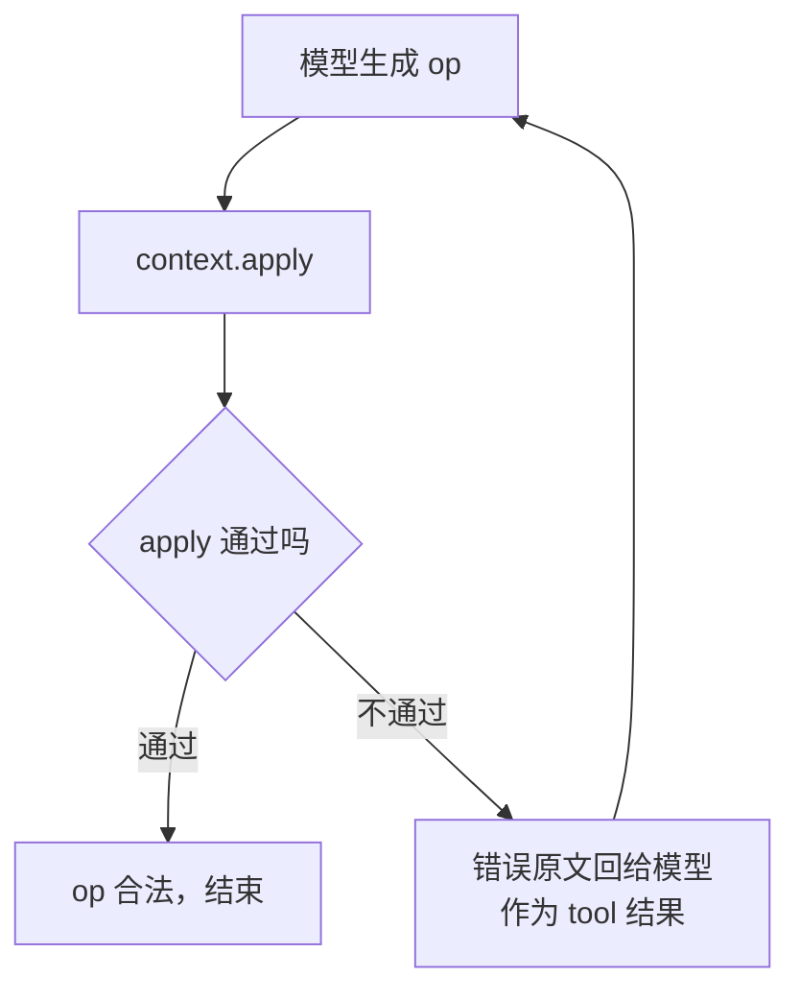

#### 5.2.1 版本号并没有消失，只是不归 agent 算

`baseVersion` 是编辑器写入路径的**必需参数**，不是可选校验：`session.ts:625` 的 `nextVersion = baseVersion + 1` 是 delta 日志保持无空洞序列的机制，`editor-do-svalue.ts:534` 缺了它直接报错。

所以问题不是「要不要版本号」，而是「agent 发起的 apply，`baseVersion` 由谁算」。选定：**由平台的 `DocumentAgentContext.apply` 实现自己读当前 head**。

| | 今天 | 本次 |
|---|---|---|
| 谁记 `lastKnownVersion` | agent 循环，`operator-do-agent.ts:56` | 没人记 |
| `apply` 用什么 `baseVersion` | 上次 `query` 看到的版本，`:208` | 平台读当前 head |
| 「必须先 query」 | 循环强制拒绝，`:202-204` | 删掉。提示词里已经写了「先查询再编辑」，而真正的兜底是 apply 自己会拒绝非法 op |
| op 不成立时 | 版本冲突 → 提示重新查询 → 重试 | apply 的错误原文回给模型 → 重新生成 |

因为版本记账整个消失，`DocumentAgentContext`（`protocol/src/types.ts:105`）的签名**一个字都不用改**，`apply(operations, description)` 里本来就没有 `baseVersion`——它一直是平台实现的内部细节。下边界不需要新接口。

#### 5.2.2 这样做失去了什么

诚实记一笔：版本检查确实能拦住一类情况——模型基于 v7 的图层树推理出坐标，期间浏览器把图层移走了，op 应用到 v9 上位置就错了，而 `apply` 校验不出来（坐标合法，只是不是模型想要的）。

接受这个代价，理由有三条：

- 这类竞争要求「用户一边手工编辑一边让 agent 跑」，而客户端今天已经在避免（`web-psd/src/main.ts` 的 `chatBusy`）。
- 就算发生，结果是一次编辑位置不对，用户看得见也能撤销；而版本检查的代价是每次并发都多花一轮。
- 模型的工作流本来就是「改完看预览确认」（`doctype-psd/src/tools.ts:166` 的提示词明确要求），位置错了它自己会发现并纠正。

### 5.3 文档类型侧要改什么

**分发逻辑不动。** `query_` / `apply_` 前缀怎么解析、参数怎么转换，仍然是各文档类型自己的事。psd 和 markdown 今天的 `toolCall` 逐行相同，那是巧合而不是共性——docx 已经先分叉了（它的 `apply_insertImage` 必须先 `resolveBlob` 把 `hash` 换成 SBlob，`doctype-docx/src/agent.ts:86-113`）。把这段抽进内核，只会换来一堆为了让抽象成立而额外增加的特殊处理。

本次对文档类型只有**一处**要求，而且是协议层的，不是分发逻辑：

> `toolCall` 返回图片时，必须放进 `AgentToolResult.content` 的 image part，不能塞进 `structuredContent` 让下游去搜。

docx 已经这么做了（`doctype-docx/src/agent.ts:75`）。psd 需要改（2.4）：

```ts
// doctype-psd/src/queries.ts:101
- return { $image: { base64: btoa(bin), mediaType: "image/png" }, width, height, region };
+ return { image: await ctx.makeSBlob({ data: png, contentType: "image/png" }), width, height, region };

// doctype-psd/src/agent.ts 的 query_getPreview 分支
+ return {
+   content: [{ type: "image", blob: result.data.image, mediaType: "image/png" }],
+   structuredContent: { width, height, region, version: result.version },
+ };
```

改完之后 `cloudflare-psd/src/anthropic.ts:72` 的 `findImage` 递归搜索、`:82` 的 `previewMeta`、以及 `OperatorConfig.renderToolResult` 整个钩子都可以删掉。

#### 5.3.1 顺带发现：psd 的提示词在教模型调不存在的工具

不属于本次范围（工具表是文档类型自己的事），但既然查到了就记下来，建议 psd 一并修。

`doctype-psd/src/tools.ts:156-176` 的提示词里有五个工具名，在工具表里根本不存在：

| 提示词让模型调 | 工具表里实际是 |
|---|---|
| `transformLayer` | `apply_transform` |
| `editMask` | `apply_mask_edit` |
| `setAdjustment` | `apply_adjust` |
| `addLayer` | `apply_add_layer` |
| `generativeFill` | `apply_generative_fill` |

模型只能自己从工具列表里猜映射。这件事本身说明 `query_` / `apply_` 前缀是**给分发器用的机器语言，不是给模型用的名字**——连写提示词的人自己都没照着用。

更根本的一点：`apply_transform` 这个名字把「变换」和「提交」讲成了两步，而它们本来是一步。agent 产生一个 op，op 就应该像人在浏览器里拖动图层一样直接生效并拿到一个版本号——不存在一个单独的「apply」动作需要模型显式发起。工具名叫 `transform` 就够了。

建议 psd 把工具名改成领域动词（`getLayers` / `getPreview` / `transform` / `crop` / `addLayer` …），提示词与工具表对齐。内核不认识前缀（5.1），所以怎么改都不影响内核；分发改成一张名字到 op kind 的映射表即可。

### 5.4 消息格式中立化

这是本次唯一一处**重写而非搬家**的改动。

**今天：** 循环内部用 OpenAI 的消息格式（`operator-do-agent.ts:98` 读 `response.choices[0].message`），于是 Anthropic 适配层必须双向翻译两次。而图片因为被压成了 JSON 字符串，只能靠递归搜索捞回来。

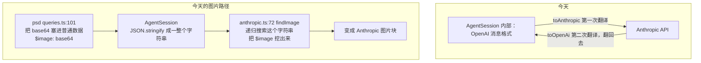

**之后：** 循环内部用内核自己的中立格式，每个大模型适配层只单向翻译一次。图片是结构化字段，不需要搜索。

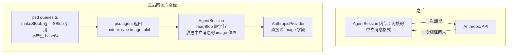

中立消息类型：

```ts
export type AgentMessage =
  | { readonly role: "user";      readonly content: string }
  | { readonly role: "assistant"; readonly text?: string; readonly toolCalls?: readonly AgentToolCall[] }
  | { readonly role: "tool";      readonly callId: string; readonly result: AgentToolResult };

export interface AgentToolCall {
  readonly id: string;
  readonly name: string;
  readonly arguments: JsonValue;
}

export interface LlmProvider {
  complete(request: {
    readonly system: string;
    readonly messages: readonly AgentMessage[];
    readonly tools: readonly AgentToolDefinition[];
  }): Promise<AgentCompletion>;
}

export interface AgentCompletion {
  readonly text?: string;
  readonly toolCalls?: readonly AgentToolCall[];
}
```

`role: "tool"` 那一支携带的是结构化的 `AgentToolResult`（`protocol/src/types.ts:100`），其中的 `content` 数组里图片是 `{ type:"image", blob, mediaType }`。适配层直接 `filter(p => p.type === "image")` 拿到它。

**随之删除：** `anthropic.ts` 的 `findImage`、`previewMeta`，以及 `OperatorConfig.renderToolResult` 整个钩子（`operator-do-agent.ts:25`）。P5 和 P6 一并解决。

### 5.5 AgentSession 的完整构造签名

```ts
export class AgentSession<TQuery, TOp> {
  constructor(deps: {
    /** 上边界：文档类型的工厂。protocol/src/types.ts:127，签名不变 */
    readonly agentFactory: DocumentAgentFactory<TQuery, TOp>;
    /** 下边界：文档读写。protocol/src/types.ts:105，签名不变 */
    readonly context: DocumentAgentContext<TQuery, TOp>;
    /** 下边界：模型访问 */
    readonly provider: LlmProvider;
    /** 下边界：会话持久化（6.3），不传则只在内存里 */
    readonly store?: AgentSessionStore;
    /** 下边界：根引用提交（6.4），不传则不保活 */
    readonly cas?: CasRootRefGateway;
    /** 内核策略：历史裁剪（6.2），不传用默认三级策略 */
    readonly contextPolicy?: ContextPolicy;
    /** 循环上限，不传为 10。PSD 传 25 */
    readonly maxIterations?: number;
  });
  run(instruction: string): AsyncIterable<AgentEvent>;
  reset(): Promise<void>;
  /** 从 store 恢复历史；进程或实例重建后由平台外壳调用一次 */
  restore(): Promise<void>;
}
```

构造时 `AgentSession` 把平台给的 `context` 原样交给 `agentFactory(context)`，拿到 `DocumentAgent`。中间没有包装层——内核不记版本，也就没有要记的东西（5.2）。

`maxIterations` 从 `OperatorConfig`（`operator-do-agent.ts:32`）移到这里——它是循环参数，属于内核，不属于平台配置。PSD 需要 25 的理由不变：一次编辑要「找图层 → 看预览 → 变换 → 再看预览确认」，默认的 10 会把真实指令切在半路。

---

## 6. 会话历史：裁剪与持久化

### 6.1 共同前提：历史是 SValue 可编码的

裁剪和持久化处理的是同一个对象——`AgentSession` 的 `history`。因为 5.4 把它改成了 SDK 自己的中立类型，它整体是 SValue 可编码的：

| 消息 | 字段 | 可编码性 |
|---|---|---|
| `user` | `content: string` | SPrimitive |
| `assistant` | `text?`、`toolCalls?: [{id, name, arguments: JsonValue}]` | 全部是 JSON 值 |
| `tool` | `callId`、`result: AgentToolResult` | `structuredContent` 是 JsonValue；`content` 里图片的 `blob` 是 SBlob，本身就是 SPrimitive |

推论很关键：**图片在历史里只是一个 CAS hash，不是字节**（SBlob 走 `SBlobTag = 65_536` 编码，`protocol/src/types.ts:174`）。所以一段 25 轮、含 10 张预览图的会话，落盘只有几十 KB，而不是几十 MB。

#### 6.1.1 必须用 SValue 编码，不能用 JSON

这不是偏好，是硬性的：SBlob 的品牌是一个 Symbol（`protocol/src/types.ts:32` 的 `sBlobSignature`），而 `JSON.stringify` **丢弃 Symbol 键**。JSON 往返之后 `isSBlob()` 返回 false，图片引用变成一个普通的 `{hash}` 对象，再也认不出来。

仓库对此的立场是明写在代码里的（`editor-do-svalue.ts:843`）：

```ts
if (encoded.refs.length > 0) {
  return Response.json({ error: "This response requires the SValue media type" }, { status: 406 });
}
```

含 SBlob 引用的值请求 JSON 输出，直接 406。

值得注意的是，端口层现有的两个 `DeltaLog` 实现恰恰用的是 JSON——`ports-cf.ts:81` 的 `JSON.stringify(d.operations)` 和 `ports-pg.ts:104` 的同一句。**所以那两条路承载不了含 SBlob 的操作**，它们服务的是不带二进制引用的文档类型。真正跑 PSD 的 `editor-do-svalue.ts:305` 走的是 `encodeSValue`。会话历史含图片，必须跟后者。

#### 6.1.2 三件互相独立的事

设计这一章时最容易犯的错，是把下面三件事搅成一件：

| 关注点 | 结论 | 依据 |
|---|---|---|
| 用什么格式序列化 | SValue CBOR | 6.1.1 |
| 编出来的字节存哪儿 | 直接写进表的字节列 | 6.3 |
| 历史引用的图片怎么不被回收 | 单独提交根引用，与字节存哪儿无关 | 6.4 |

第二件和第三件是正交的：无论字节放在 SQLite、Postgres 还是别处，引用计数都得单独做；反过来，引用计数做好了也不会替你决定字节该放哪。

### 6.2 裁剪

#### 6.2.1 硬约束：不能拆散工具调用的配对

Anthropic 的 Messages API 要求每个 `tool_use` 块在紧随其后的消息里有对应的 `tool_result`；OpenAI 要求每个 `tool_calls` 有对应的 `role:"tool"`。所以**裁剪的最小单位不是消息，是一轮**：

```
一轮 = 一条 assistant 消息（含 N 个 toolCalls）
     + 对应的 N 条 tool 消息
```

这条约束直接排除了「保留最近 K 条消息」这种最直觉的写法——它会切出孤立的 `tool_result`，请求会被 API 拒绝。

#### 6.2.2 为什么裁剪属于内核而不是文档类型

这一节容易被误认为是 PSD 的私事——毕竟只有 PSD 会一次跑 25 轮、每轮塞一张预览图。但有两条理由把它按在内核里。

**第一，会让上下文超出上限的不只有 PSD。**

| 文档类型 | 会让上下文超出上限的东西 |
|---|---|
| markdown | `query_getContent` 的描述原文是 "Get the **full** markdown content"——一篇长文档一次就是几万 token，多轮对话里会重复出现好几份 |
| docx | `query_getImage` 返回 image content part（`doctype-docx/src/agent.ts:75`），和 PSD 的预览图一样占位 |
| psd | 25 轮 × 每轮一张预览图，撞得最狠 |

**第二，只有内核能安全地裁。** 6.2.1 的配对约束要求以「轮」为单位操作，而历史由 `AgentSession` 私有持有——文档类型根本看不到它。把裁剪交给文档类型，等于要么把历史暴露出去，要么每个文档类型自己实现一遍配对逻辑。

所以分工是：**内核提供裁剪的机制和一套通用默认策略；文档类型通过数据影响它，不通过代码。** 后半句的落地方式见 6.2.3 和 6.2.4。

#### 6.2.3 三级策略，从轻到重

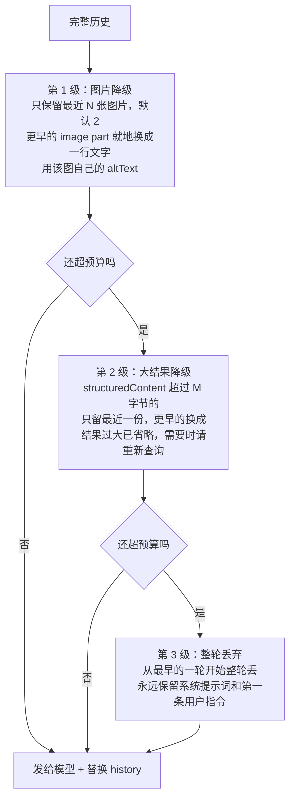

前两级是**就地替换**，不改变消息数量，因此不可能破坏 6.2.1 的配对；只有第 3 级会删消息，而它以「轮」为单位。

**第 1 级怎么做到不懂文档类型：** 协议层的 image content part 本来就带一个 `altText` 字段（`protocol/src/types.ts:88-93`），docx 今天已经在设它（`doctype-docx/src/agent.ts:78-82`）。内核降级时只做一件事：

```ts
// image part → text part
{ type: "text", text: `[image: ${part.altText ?? part.mediaType}]` }
```

内核只知道「这里原来有张图，文档类型说它是这样」。至于那句话里写什么，是文档类型的事：

| 文档类型 | 建议的 `altText` | 降级后模型看到 |
|---|---|---|
| psd | `preview 1024x768 region=[0,0,1024,768] v7` | `[image: preview 1024x768 region=[0,0,1024,768] v7]` |
| docx | 图片本身的替换文字 | `[image: 公司组织架构图]` |

这样一来，今天 `cloudflare-psd/src/anthropic.ts:82` 的 `previewMeta` 就回到了它该在的位置——它一直是 PSD 的知识，此前却写在大模型适配层里。改造后它移到 PSD 自己的 `agent.ts`，作为 `altText` 的值，而不是写进内核的裁剪代码。

**第 2 级同理不懂文档类型：** 它只看 `structuredContent` 编码后的字节数，不看里面是什么。PSD 的 `getDoc` 返回整棵图层树、markdown 的 `getContent` 返回全文，对它是一回事。

#### 6.2.4 文档类型能调什么

参数在接线处（叶子包）传入，与 `maxIterations` 同一个位置——`cloudflare-psd/src/worker.ts` 今天传 `maxIterations: 25` 就是先例。

| 参数 | 默认 | 谁该改 |
|---|---|---|
| `maxImages` | 2 | 图片信息密度高的文档类型可以调大 |
| `maxResultBytes` | 8192 | 结果天然很大的可以调大 |
| `budgetTokens` | 120_000 | 跟模型走，不跟文档类型走 |

如果哪天某个文档类型需要完全不同的裁剪逻辑，可以自己实现 `ContextPolicy` 传进来（6.2.7 的接口）——但那是给特殊情况留的出口，不是预期路径。默认策略应当覆盖绝大多数情况；如果不覆盖，说明默认策略需要改进，而不是每个文档类型各写一份。

#### 6.2.5 预算怎么算

内核不引入 tokenizer 依赖（那会带来一个几 MB 的词表，且各家模型不同）。用估算：

| 内容 | 估算方式 |
|---|---|
| 文字 | UTF-8 字节数 ÷ 3.5 |
| 图片 | 宽 × 高 ÷ 750 |

预算默认取模型上下文窗口的 60%，余量留给回复和估算误差。估算不准不会导致错误，只会裁多或裁少；真的超限时 provider 会报错，此时按错误再裁一次并重试一次，仍失败则以 `run-error` 结束。

#### 6.2.6 一个明确的取舍：裁剪就地生效

`ContextPolicy.prepare` 的返回值**直接替换 `AgentSession` 的 history**，不是只用于本次发送。

| | 就地生效（选定） | 只用于发送 |
|---|---|---|
| 历史体量 | 有界 | 无界增长 |
| 持久化 | 存的就是当前历史，天然有界 | 要么存完整历史（无界），要么存裁剪后的（与发送的不一致） |
| 可预测性 | 发给模型的 = 存下来的 = 恢复出来的 | 三者不一致，出问题难排查 |
| 代价 | 降级不可逆，旧预览图找不回来 | 理论上可找回 |

选就地生效。降级本来就是有损的，保留完整历史只是把同一份损失往后推，却换来无界增长和三份不一致的状态。

#### 6.2.7 接口

```ts
export interface ContextPolicy {
  prepare(history: readonly AgentMessage[]): Promise<readonly AgentMessage[]>;
}

export function createDefaultContextPolicy(opts?: {
  maxImages?: number;        // 默认 2
  maxResultBytes?: number;   // 默认 8192
  budgetTokens?: number;     // 默认 120_000
}): ContextPolicy;
```

`prepare` 是异步的，为的是给「摘要压缩」留路——把最早若干轮交给模型总结成一段文字需要额外调一次模型，所以 `ContextPolicy` 实现可以在构造时拿到 `LlmProvider`。**本次不实现摘要压缩**，只保证接口不必回头改。

### 6.3 持久化

#### 6.3.1 下边界的第四个接口

持久化回答的是「字节存哪儿」，属于实现抽象，所以它是下边界的接口，与 `DocumentAgentContext` 平级。

```ts
export interface AgentSessionStore {
  load(): Promise<{ bytes: Uint8Array; token: string } | null>;
  /**
   * token 传 null 表示"我认为它还不存在"。不匹配时抛 SessionStoreConflictError。
   * meta 是内核才知道、又值得单独成列的元数据，见 6.3.6。
   */
  save(
    bytes: Uint8Array,
    meta: { turnCount: number },
    token: string | null,
  ): Promise<string>;
  clear(): Promise<void>;
}
```

三点说明：

- **存字节，不存对象。** 内核负责 `encodeSValue(history)`，平台只管把一串字节按 session 存起来。平台实现不需要理解消息结构，消息格式演进时也不用跟着改。唯一的例外是 `meta`——它是为了让数据库能回答「这个会话多大、多少轮」而单独抽出来的几个标量（6.3.6）。
- **带条件写。** `token` 是一个自增序号，两个平台都一样。这与仓库现有纪律一致——`ports.ts` 对 `DeltaLog.append` 的要求原文是 "Enforce it structurally (primary key / etag / conditional insert), not with a read-then-write check"。
- **按会话作用域。** store 实例在构造时就绑定了 sessionId，接口上不再出现它。与 `ports.ts` 开头 "Every port in this module is scoped to one Doc session" 一致。

#### 6.3.2 为什么需要条件写：两个平台的并发模型不同

| | Cloudflare | Azure |
|---|---|---|
| 承载 | 一个 sessionId 对应一个 OperatorDO 实例 | 无状态多副本，任一副本都可能处理请求 |
| 并发 | DO 单线程，天然串行 | 两个并发 run 可能落在不同副本上 |
| 条件写 | 恒成立，`token` 只是形式 | 真正起作用 |

`ports.ts:44-63` 已经为 `DeltaLog.remove` 点明过这个差异："Cloudflare has one (the Durable Object's `#requestTail`), Azure's stateless replicas do not"。会话历史面对的是完全相同的问题。

除条件写外还需要一条约束：**同一会话同时只允许一个 run**。CF 上由 DO 天然保证；Azure 上靠条件写检测冲突后拒绝第二个 run，返回明确错误，而不是让两段对话互相覆盖。今天客户端其实已经在做这件事（`web-psd/src/main.ts` 的 `chatBusy` 标志），但那是建议而非保证。

#### 6.3.3 字节直接进表的字节列

`encodeSValue` 产出的就是 `Uint8Array`，写进 SQLite 的 `BLOB` 列或 Postgres 的 `BYTEA` 列即可，读回来 `decodeSValue` 就把 SBlob 的品牌重建了。**不需要绕道 CAS。**

仓库已有现成先例——`editor-do-svalue.ts:123-132` 的暂存表就是这么存 SValue 字节的：

```sql
CREATE TABLE IF NOT EXISTS svalue_pending (
  singleton INTEGER PRIMARY KEY CHECK (singleton = 1),
  ...
  delta_bytes    BLOB NOT NULL,
  snapshot_bytes BLOB
)
```

**曾经考虑过、但不采用的做法：** 把历史本身做成一个 CAS 节点（`makeSBlob({data, contentType: SValueContentType})`），表里只存 hash。它的吸引力在于 `sblob-context.ts:145` 会自动从 CBOR 里提取内部 refs 并逐个 lease，引用计数顺带就做了。不采用的理由：多一次 CAS 往返，恢复时多一次读，而内容寻址的去重收益接近零——每轮对话历史都不同，永远不会命中已有节点。引用计数改为显式提交（6.4），只多几行代码。

#### 6.3.4 表结构：两端同名同列

表名统一为 `agent_sessions`，与现有的 `doc_sessions` / `doc_snapshots` / `deltas` 一样用复数。

**身份用 `session_id`，不用 doc id。** 这是仓库既定的约定，而且是刻意迁过去的——`migrations/0002_session_identity.sql:15,24` 把 `deltas` 和 `doc_snapshots` 的 `doc_id` 列改名成了 `session_id`。一个文档对应一个 session（网关按 `(userId, docId)` 查出 `record.sessionId` 再转发，`gateway-handler.ts:195`），而 `doc_sessions` 表负责 `session_id → (tenant_id, doc_type)` 的映射。agent 会话跟着走，不另立身份。

**Cloudflare（DO SQLite）**

```sql
CREATE TABLE IF NOT EXISTS agent_sessions (
  singleton   INTEGER PRIMARY KEY CHECK (singleton = 1),
  session_id  TEXT    NOT NULL,
  doc_type    TEXT    NOT NULL,
  seq         INTEGER NOT NULL,   -- 条件写凭据
  turn_count  INTEGER NOT NULL,   -- 元数据，见 6.3.6
  byte_size   INTEGER NOT NULL,
  updated_at  INTEGER NOT NULL,
  bytes       BLOB    NOT NULL
);
```

主键仍是 `singleton`：一个 OperatorDO 实例**就是**一个 session，表里永远只有一行——与 `editor-do-svalue.ts:123` 的 `svalue_pending` 同样的写法。`session_id` / `doc_type` 两列不参与定位，只为排查问题时能一眼看出这个 DO 是谁（`editor-do-svalue.ts:163-167` 把同样的身份存进 DO storage，是同一个用意）。

**Azure（Postgres）**

```sql
CREATE TABLE IF NOT EXISTS agent_sessions (
  doc_type   TEXT    NOT NULL,
  session_id TEXT    NOT NULL,
  seq        INTEGER NOT NULL,
  turn_count INTEGER NOT NULL,
  byte_size  INTEGER NOT NULL,
  updated_at BIGINT  NOT NULL,
  bytes      BYTEA   NOT NULL,
  PRIMARY KEY (doc_type, session_id)
);
```

列的顺序、命名、`BIGINT` 时间戳都照抄 `deltas`（`migrations/0001_init.sql:6-14`）。作为 `0003_agent_sessions.sql` 加进 `migrations/`。

**两端唯一的差别**是主键——CF 用 `singleton` 因为一个 DO 只装一个 session，Azure 用 `(doc_type, session_id)` 因为一张表装所有 session。这是承载方式的必然差异，不是随意选择。

#### 6.3.5 条件写

两端都是 `seq`，机制同构：

```sql
-- Cloudflare
UPDATE agent_sessions SET seq = ?, turn_count = ?, byte_size = ?, updated_at = ?, bytes = ?
WHERE singleton = 1 AND seq = ?;        -- ? 为 expectedSeq

-- Azure
UPDATE agent_sessions SET seq = $1, turn_count = $2, byte_size = $3, updated_at = $4, bytes = $5
WHERE doc_type = $6 AND session_id = $7 AND seq = $8;
```

受影响行数为 0 即冲突，抛 `SessionStoreConflictError`。首次写入用 `INSERT ... ON CONFLICT DO NOTHING`（Azure）/ `INSERT OR IGNORE`（CF），同样看受影响行数。这与 `PgDeltaLog.append`（`ports-pg.ts:89-111`）是同一套写法，连错误处理都能照抄。

#### 6.3.6 bytes 不可查询，所以元数据单独成列

`bytes` 是 SValue CBOR，数据库看不进去。这不是缺陷而是选择——但代价要用元数据列补上，否则连「这个会话多大、多久没动了」都要先把几十 KB 解码一遍。

三列元数据由谁填：

| 列 | 谁提供 | 为什么 |
|---|---|---|
| `turn_count` | 内核 | 只有它知道历史里有几轮 |
| `byte_size` | 平台实现 | `bytes.length`，自己能算 |
| `updated_at` | 平台实现 | 平台有时钟，内核不该依赖它 |

所以 `AgentSessionStore.save` 多一个参数：

```ts
save(
  bytes: Uint8Array,
  meta: { turnCount: number },
  token: string | null,
): Promise<string>;
```

**加了这三列之后，下面这些问题一条 SQL 就能答**：

- 哪些会话存在、各多大、各多少轮
- 最后活动时间，据此清理长期不动的会话
- join `doc_sessions` 拿到 `tenant_id`，做租户级用量统计

**仍然答不了的**：按对话内容搜索、查「第 3 轮说了什么」。两者都要先解码 `bytes`。本次的设计里没有任何地方需要它们——UI 恢复聊天记录是把整段历史读出来解码，不是查询。真要做内容检索，得另建索引，属于另一件事。

#### 6.3.7 为什么不是一轮一行

考虑过 `agent_turns(doc_type, session_id, turn_no, bytes, ...)`——一轮一行，和 `deltas` 一样。它更可查询，追加也是增量的。不采用的理由：

| | 一个会话一行（选定） | 一轮一行 |
|---|---|---|
| 读 | 一行，一次 | N 行，要排序拼接 |
| 写 | 全量重写几十 KB | 追加一行 |
| 裁剪（6.2） | 本来就是全量替换，天然契合 | 降级要 UPDATE 若干行、丢弃要 DELETE 若干行 |
| 条件写 | 一个 `seq` 守住整体 | 要额外的版本列，且多行更新的原子性要靠事务 |
| 内容可查询性 | 无 | **也无**——每行的 `bytes` 一样是 CBOR |

最后一行是关键：一轮一行**并不能**让内容可查询，只是把不可查询的粒度变细了。而裁剪就地生效（6.2.6）意味着历史不是纯追加的，一轮一行的主要优势（增量追加）在这里本就发挥不出来。

如果将来真的需要按轮查询（比如做对话回放或审计），再拆表不迟——那时 `bytes` 的格式已经稳定，拆分是一次机械迁移。

#### 6.3.8 共享契约测试

`doctype-server-common/src/testing/port-contract.ts` 已经立了「一份契约测试，两个平台各跑一遍」的先例。内核从 `@unidocs/doctype-server-common/agent` 导出同样形状的 `agentSessionStoreContract(makeStore)`，覆盖：

- 空 store 的 `load()` 返回 null
- `save(bytes, meta, null)` 之后 `load()` 拿回同样的字节
- 用过期 token 调 `save` 抛 `SessionStoreConflictError`
- `clear()` 之后 `load()` 返回 null
- 两个并发 `save` 只有一个成功
- `save` 之后元数据列可查：`turn_count` / `byte_size` / `updated_at` 都不为空且与传入一致（6.3.6）
- **存进去的字节含 SBlob 时，读回来 `isSBlob()` 仍为 true**（这条对应 6.1.1：任何一天有人把实现改成 JSON，这个断言会失败）

### 6.4 引用保活：让历史里的图片不被回收

这是与「字节存哪儿」正交的一件事。历史里的图片是 CAS hash；如果没有人声明持有它，CAS 会把它回收，历史就烂了。

仓库现有的做法是显式提交**根引用**（`session.ts:633-643`）：

```ts
await commitRootRefsOrRollback(
  cas,
  `apply:${sessionId}:${nextVersion}`,   // requestId，用于幂等
  refs,                                   // CasReferences = Record<hash, 增量>
  () => rollbackTheDeltaWeJustWrote(),
);
```

`CasReferences`（`protocol/src/types.ts:24`）是**增量**而不是绝对集合，所以释放旧引用就是提交负数。

会话历史照此办理，只是换一个 requestId 前缀：

```ts
const { data, refs } = encodeSValueWithRefs(history);
// changes：新历史引用的 hash 各 +1，上一版引用但新版不再引用的各 -1
await commitRootRefsOrRollback(
  cas,
  `agent:${sessionId}:${seq}`,
  diffRefs(previousRefs, refs),
  () => store.save(previousBytes, seq),   // 失败则回滚到上一版
);
```

顺序与 `session.ts` 的写入顺序同构：**先落字节，再提交引用，引用失败就回滚字节**。反过来会在崩溃窗口里留下"引用已加、字节没写"的孤儿引用。

一个值得留意的取舍：会话历史持有的引用与文档持有的引用是**独立的两套**（前缀 `agent:` 与 `apply:`）。所以一个图层被删掉之后，文档不再引用那张预览图，但对话历史仍然引用着它——用户往回翻聊天记录时那张图还看得见。代价是这些像素会多留一段时间，直到裁剪把那条消息降级成文字（6.2.3 第 1 级），引用随之释放。

### 6.5 写入时机

选择：**每次 run 结束写一次，中途不写。**

理由：run 中途崩溃时，文档改动已经独立落在 Editor 里（那是另一套持久化，不受影响），丢的只是对话上下文；而在「不重放」的设计下（7.3），客户端本来就要靠 `reconcile()` 拿最终状态。为一个罕见路径付 25 次写的代价不划算。

留一个可配置的中途检查点 `checkpointEveryTurns`，**默认关闭**。PSD 这种单次 run 长达几分钟的场景如果实测体验不好，打开即可，不用改结构。

### 6.6 恢复时的防御性兜底

6.4 的根引用**应当**保证历史里的图片一直在。但引用计数系统总有失灵的可能——迁移脚本、手工清理、跨区域复制延迟。恢复时 `readBlob` 一旦失败：

**必须降级，不能抛异常。** 否则单个 blob 丢失会让整个会话永久打不开，而它本可以只是少一张图。

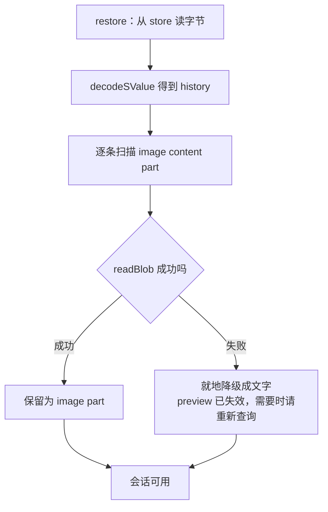

裁剪策略保证了最多只有 N 张（默认 2）图片还是 image part，更早的早已降级成文字，所以需要保活的 hash 极少，失效的影响面也小。这是 6.2 和 6.4 互相支撑的地方。

### 6.7 与第 1 章两层边界的对应

| 组件 | 属于哪层 | 由谁实现 |
|---|---|---|
| `ContextPolicy`（什么该留在上下文里） | 内核（逻辑） | 内核提供默认实现，文档类型只调参数 |
| `encodeSValue(history)`（序列化格式） | 内核 | 内核 |
| 根引用增量的计算（`diffRefs`） | 内核 | 内核 |
| `AgentSessionStore`（字节存哪儿） | 下边界（实现） | 平台 sdk |
| `CasRootRefGateway`（引用提交到哪儿） | 下边界（实现） | 平台 sdk，已存在于 `cas-client` |

分界线就是 `Uint8Array` 和 `CasReferences`：**什么该留在上下文里、编成什么格式、引用增量是多少**都是与平台无关的判断，属于内核；**字节和引用最终落到哪个存储**是与平台强相关的做法，属于下边界。

---

## 7. 事件流

### 7.1 事件表

```ts
export type AgentEvent =
  | { readonly type: "run-start";      readonly runId: string }
  | { readonly type: "assistant-text"; readonly text: string }
  | { readonly type: "tool-call";      readonly callId: string; readonly name: string; readonly arguments: JsonValue }
  | { readonly type: "tool-result";    readonly callId: string; readonly ok: boolean; readonly summary: string }
  | { readonly type: "run-end";        readonly response: string; readonly iterations: number }
  | { readonly type: "run-error";      readonly error: string };
```

**这里只有 agent 自己的事件——它在想什么、调了什么工具、说了什么。没有「文档变了」。** 理由见 7.2.1。

一个设计决定：**`tool-result` 只带一句摘要，不带完整数据。** 工具结果可能是一整棵图层树或一张预览图，客户端不需要它——需要的是模型，而模型在服务端已经拿到了。这样每个事件都很小，不需要分片。

### 7.2 一次 run 的时序

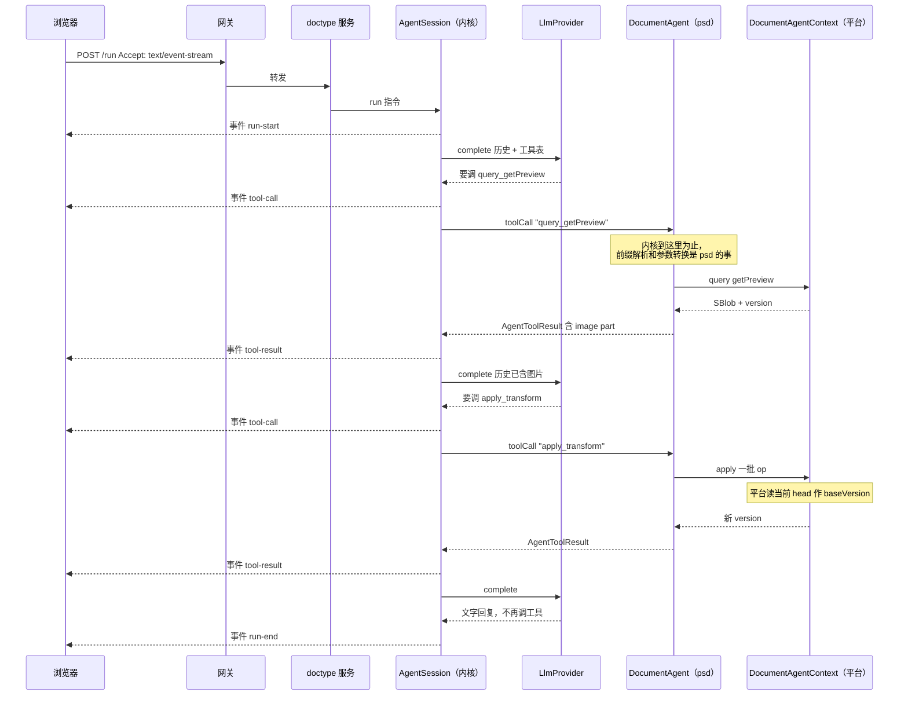

#### 7.2.1 为什么事件流里没有「文档变了」

agent 不是特殊的写入者，它和坐在浏览器前的人是**对等的编辑者**：两边都产生 op，op 提交后云端生成一个新版本。人拖动图层和 agent 调 `transform`，在编辑器眼里应该是同一件事。

顺着这个前提，「文档变到 v9 了」这条消息就不该从 agent 的事件流里出来：

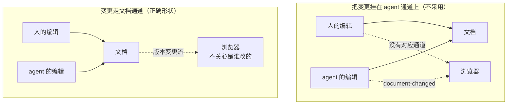

左边那张图里，agent 的编辑有通知、人的编辑没有——这就等于给 agent 单开了一条别人没有的路径。而一旦将来要支持两个人同时编辑，那条 `document-changed` 通道会被整个拆掉重做。

**所以本次不建它。** 文档变更通道属于协同编辑，需要编辑器向订阅者扇出、需要订阅生命周期、在 Azure 的无状态多副本上尤其麻烦，是独立的一块工作。

代价说清楚：客户端在一次 run 期间看不到画布逐步变化，仍然是 `run-end` 之后统一 `reconcile()` 一次——也就是今天的行为。用户在 25 轮期间能看到 agent 的思考和工具调用（这是本次流式带来的改进），但画布是最后一次性更新的。

连带取消：上一版我提议给 `AgentToolResult` 加的 `documentVersion` 字段不要了。它存在的唯一理由就是喂那条通道。

### 7.3 断线的语义

不做重放。断线时：

- 服务端的 `AgentSession` **继续跑完**，文档改动照常落到编辑器（编辑器才是文档状态的持有者）。
- 浏览器收到 `onError`，由调用方决定何时调 `reconcile()` 拿最终状态。

所以「保持连接」在这个设计下的实际含义是：心跳保活 + 断线告知。不是断线续传。

### 7.4 传输链路

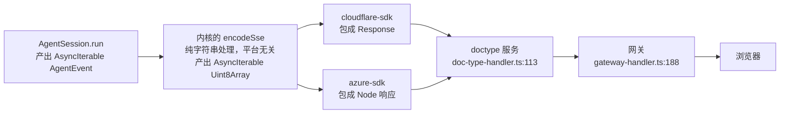

**好消息：链路已经是流式透明的，网关不需要改。**

- `gateway-handler.ts:188-202`：拿到上游 Response 直接 return，不读 body。`Accept` 头在转发白名单里，`Accept-Encoding: identity` 也已经设了，对 SSE 正合适。
- `doc-type-handler.ts:113-125`：转发给 operator，同样直接 return。

（此前担心的 body 缓冲在 `gateway-handler.ts:473`，那是建文档那条路，与 `/run` 无关。）

SSE 帧格式：

```
event: tool-call
data: {"callId":"toolu_01","name":"query_getPreview","arguments":{}}

: keepalive
```

每 15 秒发一次注释帧作为心跳，防止中间代理判定空闲断连。

### 7.5 向后兼容

`/run` 按 `Accept` 头分流：

| 请求头 | 行为 |
|---|---|
| `Accept: text/event-stream` | 返回 SSE 事件流 |
| 其他 | 返回今天的一次性 JSON `{ success, data: { response, iterations } }` |

一次性 JSON 的实现就是把事件流消费完，然后按结尾事件映射：

| 结尾事件 | 返回 |
|---|---|
| `run-end` | `{ success: true, data: { response, iterations } }`，HTTP 200 |
| `run-error` | `{ success: false, error }`，HTTP 500 |

与今天 `operator-do-agent.ts:105-124` 的返回完全一致。这样 markdown / docx 的现有调用和现有测试（`cloudflare-sdk/tests/operator-do.test.ts`，230 行）不受影响，迁移可以逐个文档类型推进。

---

## 8. 客户端设计

### 8.1 psd-client 的现状拆分

`packages/psd-client/src/doc-session.ts`（261 行）已经是一个通用的乐观并发同步引擎：本地立即 apply、待发队列、`opId` 去重重投、409 重整、`reconcile()`。它对 PSD 的耦合只有三处，都可以参数化：

| 耦合点 | 参数化后 |
|---|---|
| `import { applyOne } from "@unidocs/doctype-psd/engine"` | 注入 `applyLocal(doc, op) => doc` |
| `PsdDoc` / `PsdOp` 类型 | 泛型 `<TDoc, TOp>` |
| `RenderLike { applyOp, reset }` | 注入的可选渲染回调 |
| `loadDoc` 来自 `./doc-source.js` | 注入 `reload() => { doc, version }` |

剩下的 `render-client` / `render-core` / `render-worker` / `viewport` / `cas-blob-store`（596 行）才是 PSD 专有的，留在 `psd-client`。

### 8.2 类图

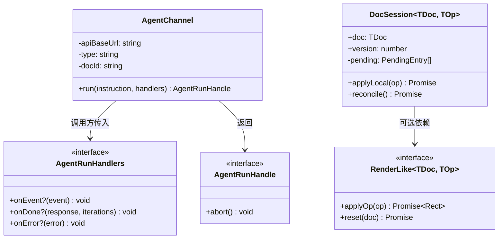

### 8.3 接口

```ts
export class AgentChannel {
  constructor(opts: {
    apiBaseUrl: string;
    type: string;
    docId: string;
    fetchImpl?: typeof fetch;
    /** 超过这个时长没收到任何帧就判定断线，默认 30000 */
    idleTimeoutMs?: number;
  });
  run(instruction: string, handlers: AgentRunHandlers): AgentRunHandle;
}

export class DocSession<TDoc, TOp> {
  constructor(opts: {
    apiBaseUrl: string;
    type: string;
    docId: string;
    doc: TDoc;
    version: number;
    applyLocal: (doc: TDoc, op: TOp) => TDoc | Promise<TDoc>;
    reload: () => Promise<{ doc: TDoc; version: number }>;
    render?: RenderLike<TDoc, TOp>;
    fetchImpl?: typeof fetch;
    genId?: () => string;
  });
  applyLocal(op: TOp): Promise<void>;
  reconcile(): Promise<void>;
}
```

**为什么不用 `EventSource`：** `EventSource` 只能发 GET 请求，不能带请求体，也不能自定义请求头。所以用 `fetch` + `ReadableStream` 手工解析 SSE 帧，大约 80 行。

**为什么不自动重连：** 因为不做重放，重连也拿不到断线期间的事件。自动重连只会制造"好像还连着"的假象。断线就如实告诉调用方。

### 8.4 两者配合

```ts
channel.run(text, {
  onEvent: (e) => {
    if (e.type === "tool-call")     showStep(e.name);      // 实时看到 agent 在做什么
    if (e.type === "assistant-text") addMsg("agent", e.text);
  },
  onDone: async (reply) => {
    addMsg("agent", reply);
    await session.reconcile();                             // 文档同步仍在 run 结束时做
  },
  onError: async (err) => {
    addMsg("err", err.message);
    await session.reconcile();                             // 服务端可能已经改完了
  },
});
```

两个通道各管各的，这是 7.2.1 的直接体现：

| 通道 | 管什么 | 何时同步 |
|---|---|---|
| `AgentChannel` | agent 在想什么、调了什么工具、说了什么 | 实时 |
| `DocSession` | 文档内容 | run 结束后 `reconcile()` 一次 |

对比今天（`web-psd/src/main.ts:374-390`）：中途界面上只有一个不动的「thinking…」，用户不知道 agent 在干什么、跑到哪一步了、是不是卡死了。本次改进的是**这一半**。

画布的逐步更新要等文档变更通道（7.2.1），那时 `DocSession` 订阅它即可，`AgentChannel` 一行都不用改——这正是把两件事分开的好处。

---

## 9. PSD 迁移改动清单

| 文件 | 改动 |
|---|---|
| `doctype-psd/src/queries.ts:101` | `getPreview` 从 `btoa` 产出 base64 改为 `makeSBlob` 返回 SBlob 引用 |
| `doctype-psd/src/agent.ts` | 分发逻辑保留不动，只改 `getPreview` 分支返回 image content part（5.3） |
| `doctype-psd/tests/agent.test.ts:61-76` | 断言反转：从「`$image` 透传且 `content` 为 undefined」改为「返回 image content part」 |
| `doctype-markdown/src/agent.ts` | **不动** |
| `doctype-docx/src/agent.ts` | **不动**。它的图片返回方式（`:75`）本来就是对的，只是从没跑通过——删掉 `renderToolResult` 钩子后这条路才真正打开（P6） |
| `cloudflare-psd/src/anthropic.ts` | 移到 `doctype-server-common/src/agent/providers/anthropic.ts`，删掉 `findImage` / `previewMeta`，翻译改为单向 |
| `cloudflare-psd/src/worker.ts` | 改为注入 `createPsdDocumentAgent` + Cloudflare 的 `DocumentAgentContext` 实现 |
| `cloudflare-sdk/src/operator-do-agent.ts` | 296 行 → 约 90 行，只剩 DurableObject 外壳、身份校验、把事件流包成 Response |
| `doctype-server-common/src/operator.ts` | 删除（177 行死代码） |
| `azure-sdk/src/local-editor.ts:103` | 删掉 501 占位，改为真实的 `DocumentAgentContext` 实现，`apply` 提交时自己读当前 head 作 baseVersion |
| `cloudflare-sdk/src/agent-store-do.ts` | 新增：`DoAgentSessionStore`，DO SQLite `BLOB` 列 + `seq` 条件写（6.3.4） |
| `azure-sdk/src/agent-store-pg.ts` | 新增：`PgAgentSessionStore`，Postgres `BYTEA` 列 + `seq` 条件写，写法照搬 `ports-pg.ts:89-111`（6.3.5） |
| `azure-sdk/migrations/0003_agent_sessions.sql` | 新增：`agent_sessions` 表，列照抄 `deltas` 的形状（6.3.4） |
| `azure-sdk/tests/migrate.test.ts:36` | 断言的表名列表加上 `agent_sessions` |
| `psd-client/src/doc-session.ts` | 移到 `client-sdk`，泛型化 |
| `psd-client/src/index.ts` | 重新导出 `client-sdk` 的 `DocSession`，并绑定 PSD 的 `applyLocal` / `reload` |
| `web-psd/src/main.ts:357-397` | 改用 `AgentChannel`，展示逐步进度 |

---

## 10. 实施顺序

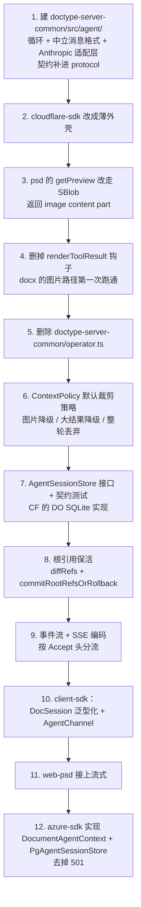

第 1-5 步是 A 块（两层边界），第 6-8 步是 B 块（裁剪与持久化），第 9-11 步是 C 块（流式），第 12 步是「平台无关」这个目标的真正证明——它同时验证下边界的两个接口（`DocumentAgentContext` 和 `AgentSessionStore`）都确实可换。

每一步结束时全仓库测试必须通过，任何一步都可以独立成为一个提交。

---

## 11. 验收标准

| # | 标准 | 验证方式 |
|---|---|---|
| V1 | 文档类型的分发逻辑一行未动 | `git diff` 里 `doctype-markdown/src/agent.ts` 与 `doctype-docx/src/agent.ts` 无改动；`doctype-psd/src/agent.ts` 只有 `getPreview` 分支变化 |
| V2 | 内核不认识 `query_` / `apply_` | 全仓库搜索 `startsWith("query_")` **不应**命中 `packages/doctype-server-common/src/agent/` |
| V3 | 内核不 import 任何云相关模块，也不用 `Request` / `Response` | `tests/unit/agent-kernel-purity.test.ts` 按目录扫 `src/agent/**`（4.4） |
| V3b | 平台 sdk 不依赖任何文档类型，反之亦然 | 同一测试文件断言 `package.json`：`{cloudflare,azure}-sdk` 的 dependencies 无 `@unidocs/doctype-*`（`doctype-server-common` 除外）；`doctype-*` 的 dependencies 无任何平台 sdk（`doctype-server-common` 是预期的）（4.4） |
| V3c | 文档类型对 SDK 是仅类型依赖，浏览器 bundle 不受影响 | 打包 `psd-client`，断言产物体积与改造前持平，且不含 `AgentSession` 等符号（4.3.2） |
| V4 | 循环行为不退化 | 新增契约测试：内存版 `DocumentAgentContext` + 假 provider，跑完整循环，覆盖工具调用往返、apply 失败后模型重试、达到迭代上限、未知工具名 |
| V5 | PSD 送给模型的图片字节与改造前完全一致 | 抓一次 provider 请求体，与改造前对比 |
| V6 | 现有 230 行 `operator-do.test.ts` 全绿 | `pnpm test` |
| V7 | 浏览器能实时看到 agent 的每一步 | web-psd 手工端到端：发一条多步指令，chat 区逐条出现工具调用；画布在 run 结束后一次性更新（本次不做逐步更新，见 7.2.1） |
| V8 | 同一条指令在 Azure 栈跑通 | `pnpm test:azure` 新增用例 |
| V9 | docx 的图片路径第一次真正跑通 | 现有 `doctype-docx/tests/agent.test.ts` 已覆盖 `getImage` / `insertImage`；再补一条端到端：删掉 renderToolResult 后，image content part 能被 Anthropic 适配层翻成图片块而不抛异常（P6） |
| V10 | 内核不持有任何版本状态 | 代码检视 + 搜索：`packages/doctype-server-common/src/agent/` 里不应出现 `version` 相关字段；契约测试：apply 失败时错误原文出现在下一轮的 tool 消息里，且循环继续而不是中止 |
| V11 | `AgentSessionStore` 在两个平台行为一致 | 共享契约测试 `agentSessionStoreContract`，CF 用 Miniflare、Azure 用 Postgres 各跑一遍（6.3.7） |
| V12 | 会话历史存取不丢 SBlob | 契约测试最后一条：存进去含 SBlob 的历史，读回来 `isSBlob()` 仍为 true。这条对应 6.1.1「不能改用 JSON」 |
| V12b | 内核的裁剪代码不含任何文档类型词汇 | 搜索 `packages/doctype-server-common/src/agent/context-policy.ts`：不应出现 `preview` / `region` / `layer` / `heading` 等任一文档类型的概念；降级文字只由 `altText` 和 `mediaType` 拼出（6.2.3） |
| V13 | 裁剪不会切出孤立的 `tool_result` | 属性测试：随机生成含多工具调用的历史，裁剪后断言每个 `toolCall.id` 都有配对的 tool 消息（6.2.1） |
| V14 | 长会话不再无限增长 | PSD 跑满 25 轮后，`history` 的编码字节数低于设定预算，且图片 part 不超过 `maxImages` |
| V15 | 重启后会话可续 | 端到端：跑一轮 → 销毁 OperatorDO / 重启 Azure 进程 → 再发一条指令，模型能引用上一轮的内容 |
| V16 | 历史引用的图片不被回收 | 跑一轮产生预览图 → 删掉对应图层并 apply → 断言历史里那张图仍可 `readBlob`（6.4 的根引用生效） |

V8 是整个设计成立与否的判据：如果 Azure 跑不起来，说明抽象层没做到平台无关。V11 是它在存储维度上的对应判据。

---

## 12. 不在本次范围

| 项 | 原因 |
|---|---|
| 摘要压缩（把最早若干轮交给模型总结） | 需要额外一次模型调用，成本和质量都要实测才好定参数。接口已支持（`prepare` 是 async），前三级裁剪先跑一段时间看是否够用 |
| **文档变更通道** | agent 与人是对等的编辑者，「文档变了」该走文档通道而不是 agent 通道（7.2.1）。建它需要编辑器向订阅者扇出、订阅生命周期管理，Azure 的无状态多副本上尤其麻烦——是协同编辑那一块的工作。本次不建，也不建会被拆掉的临时替代 |
| 逐字输出 | 需要 provider 支持流式并处理 `input_json_delta` 增量拼接，测试成本高，本次不做 |
| 事件重放 / 断线续传 | 需要把**事件序列**也持久化，那是与会话历史不同的一份数据（历史是给模型看的，事件是给界面看的）。7.3 已选定不重放 |
| 跨会话的长期记忆 | 本次的持久化只保证"同一个文档的对话可以续上"，不涉及跨文档、跨会话的知识沉淀 |
| 中途打断 / 追加指令 | 需要额外的控制通道，且「已经 apply 的操作要不要回滚」语义需要单独设计 |
| 数据分片 | 单向进度流下每个事件都很小，SSE 帧天然分帧，不需要 |

---

## 13. 风险

| # | 风险 | 应对 |
|---|---|---|
| R1 | DurableObject 在返回流未读完时无法休眠，一次 run 可能持续数分钟 | 今天的阻塞请求是同样的代价，不算新增开销 |
| R2 | Miniflare 本地栈是否透传流式响应未验证 | 第 6 步优先验证，失败则本地栈退回一次性 JSON，云上走流式 |
| R3 | 图片改走 SBlob 后送给模型的内容若有变化，模型行为会变 | V5 用请求体比对锁死 |
| R4 | 消息格式重写会改掉 `anthropic.ts` 大半 | V4 的契约测试 + V6 的现有测试双重兜底；这部分单独成一个提交，便于回退 |
| R5 | 内核不认识工具语义，等于把「守规矩」的责任交给了各文档类型——某天有人在 `toolCall` 里直接发网络请求、或者绕过 `context` 自己缓存版本，内核拦不住 | 这是选择上边界位置时接受的代价。用 V10 的契约测试守住最要紧的一条（乐观锁），其余靠代码检视 |

---

## 14. 已确认的设计决定

| 决定 | 结论 |
|---|---|
| 整体形状 | 一个内核 + 两层抽象边界：上边界抽掉文档类型差异，下边界抽掉运行环境差异。新增文档类型、新增平台、新增模型供应商三种扩展互不相交，且都不改内核 |
| 下边界为何拆成三个接口 | 变化原因不同：换平台影响文档读写和传输，换模型供应商只影响 `LlmProvider` |
| 本次范围 | A + B + C，B 里只推迟摘要压缩 |
| 会话历史的序列化格式 | SValue CBOR，**不能用 JSON**——SBlob 的品牌是 Symbol，`JSON.stringify` 会丢。端口层现有的两个 `DeltaLog` 恰恰用了 JSON，所以承载不了含 SBlob 的值 |
| 字节存哪儿 | 直接进表的字节列：CF 用 DO SQLite `BLOB`，Azure 用 Postgres `BYTEA`。不绕 CAS——历史每轮都变，内容寻址去重收益接近零 |
| 会话表怎么定位 | 用 `session_id`，不用 doc id。这是仓库刻意迁过去的约定——`migrations/0002_session_identity.sql` 把 `deltas` / `doc_snapshots` 的 `doc_id` 列改名成了 `session_id`，`doc_sessions` 负责映射到 `(tenant_id, doc_type)` |
| 两端表名与列 | 完全一致：`agent_sessions`，同样的 `seq` / `turn_count` / `byte_size` / `updated_at` / `bytes`。唯一差别是主键——CF 用 `singleton`（一个 DO 只装一个 session），Azure 用 `(doc_type, session_id)`（一张表装所有）。这是承载方式的必然差异（6.3.4） |
| bytes 不可查询怎么办 | 元数据单独成列。`turn_count` 由内核给（只有它知道），`byte_size` / `updated_at` 由平台自己算。能答的是「哪些会话、多大、多少轮、多久没动」；答不了的是内容检索——本次没有任何地方需要它（6.3.6） |
| 为什么不是一轮一行 | 一轮一行**也不能**让内容可查询，只是把不可查询的粒度变细；而裁剪就地生效意味着历史不是纯追加，它的主要优势发挥不出来（6.3.7） |
| 图片保活 | 与字节存哪儿正交，靠显式提交根引用 `agent:<sessionId>:<seq>`，与文档的 `apply:` 引用各自独立 |
| 裁剪归内核还是文档类型 | **机制在内核，内容知识在文档类型。** 需要裁剪的不只 PSD——markdown 的 getContent 返回全文、docx 的 getImage 返回图片，一样会让上下文超出上限；而 tool_use/tool_result 的配对约束只有持有历史的内核能守。文档类型通过**数据**影响裁剪（图片的 `altText`、叶子包传的阈值），不通过代码（6.2.2） |
| 裁剪的最小单位 | 一轮（assistant + 它全部的 tool 消息），不是一条消息——否则会切出孤立的 `tool_result`，被 API 拒绝 |
| 裁剪是否就地生效 | 是。返回值直接替换 history，让"发给模型的 = 存下来的 = 恢复出来的" |
| 图片通道 | 协议层归一，统一走 SBlob content part；删除 `$image` 和 `renderToolResult` |
| 事件流野心 | 单向进度流，不重放 |
| 客户端范围 | agent 通道 + 泛型化的 DocSession |
| 工具分发归谁 | **归文档类型，内核不接管。** `query_` / `apply_` 的解析和参数转换本来就是各文档类型不同的事——docx 的 `apply_insertImage` 要先 `resolveBlob`，psd 的可以直接透传。psd 与 markdown 今天逐行相同是巧合，不是共性。内核对工具的全部认知是「调用它返回一个 `AgentToolResult`」 |
| 上边界用什么接口 | 沿用已有的 `DocumentAgentFactory` / `DocumentAgent`（`protocol/src/types.ts:118-129`），本次不新造，也不修改 |
| agent 与人的关系 | **对等的编辑者。** 两边都产生 op，op 提交后云端生成版本，编辑器眼里是同一件事。不给 agent 开任何特殊写入路径 |
| `apply_xxx` 这类工具名 | 是分发器的机器语言，不是给模型的名字。它把「变换」和「提交」讲成两步，而本来是一步。建议 psd 改成领域动词并对齐提示词（5.3.1），但不属于本次范围——内核不认识前缀，怎么改都不影响内核 |
| 文档变更怎么通知客户端 | **不通过 agent 事件流。** agent 与浏览器前的人是对等的编辑者，两边都产生 op；「文档变了」属于文档通道，人和 agent 的改动都从那里出来。把它挂在 agent 通道上，等于给 agent 单开一条人的编辑没有的路径，将来支持多人编辑时要整个拆掉。本次不建那条通道，客户端沿用 run-end 后统一 reconcile（7.2.1） |
| 版本与乐观锁归谁 | **不归 agent。** agent 的职责到「生成 op」为止；`apply` 是确定性算法，它自己就是校验器，能 apply 即合法，不能则错误回给模型重新生成。内核不持有 `lastKnownVersion`，不强制「先 query 再 apply」。`baseVersion` 仍是编辑器写入路径的必需参数（`session.ts:625`），由平台的 `apply` 实现读当前 head 得到（5.2） |
| 平台隔离位置 | 只在 `cloudflare-sdk` / `azure-sdk`，文档类型不感知 |
