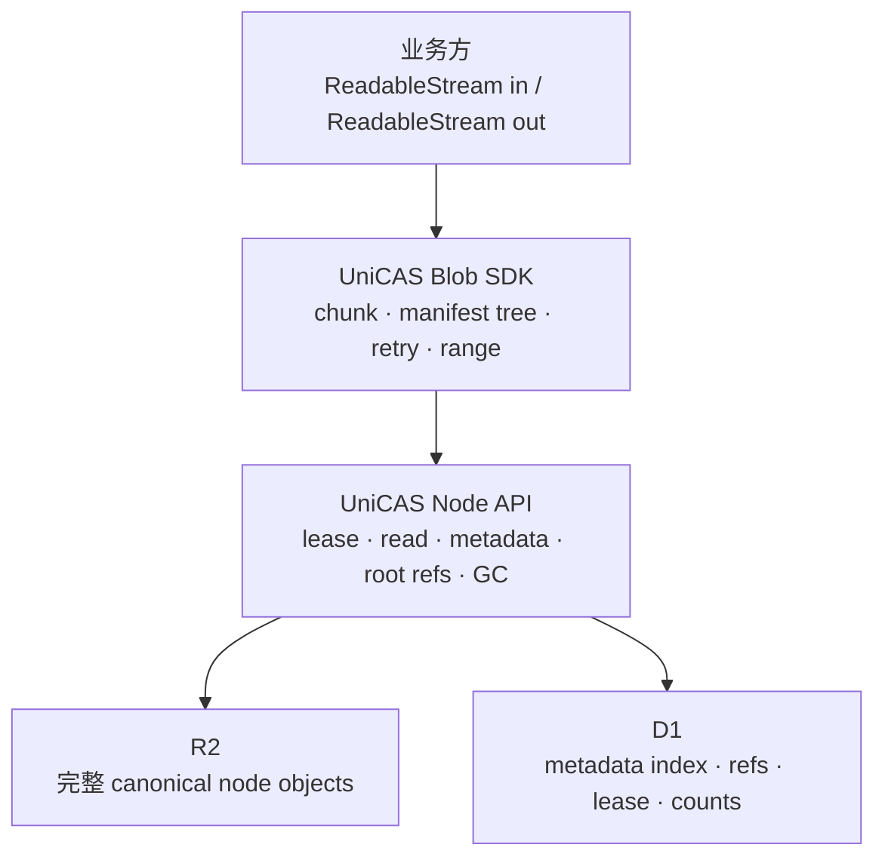

# UniCAS 流式 Node 与透明大 Blob 设计

日期：2026-08-28

状态：实施中

当前已落地：

- canonical node 64 MiB / 256 refs 限制和 bounded stream prefix parser；
- `nodes-v2` 完整 canonical object 和 reservation 表；
- `/nodes/{hash}/lease` 有/无 body 统一语义；
- known-length request body 到 R2 的 streaming SHA-256 验证；
- own-content Range read、root-ref/GC/usage；
- verified orphan adoption；
- deterministic blob-index CBOR、默认 32 MiB chunk、256-way tree；
- client `storeBlob`、`openBlob`、`openBlobRange` stream API。

尚待后续 rollout：

- hard tenant quota 配置、reservation reconciliation 和 orphan scanner；
- SBlob/DocumentType consumers 从 eager bytes 迁移到 stream facade；
- 线上灰度、指标和 production R2 failure drill。

取代：

- `2026-08-19-cas-lease-with-content-design.md` 中关于两条 lease 路径、上传
  wire format 和 R2 只存 `ownContent` 的决定；
- `cas-binary-format.md` 中「Cloudflare 物理拆分 canonical node」和「CAS 不提供
  大文件分块模型」的决定；
- `cas-architecture.md` 中独立 `leaseExisting` 公共操作和 R2 readiness 的旧定义。

不改变：现有 version-1 canonical node 字节格式和 node hash。已有 hash、child ref、
root ref、lease 和 GC 的业务含义保持不变。

---

## 1. 决策摘要

本设计作出五个相互配套的决定：

1. 一个 canonical CAS node 最大 `64 MiB`。这是完整 node 的上限，不只是
   `ownContent` 的上限。
2. R2 存完整 canonical node，object key 是该 object body 的 SHA-256。
3. CAS 只暴露一个 lease 操作。同一路径可以不带 body 续租 ready node，也可以带
   完整 canonical node body 创建或修复 node。
4. Worker 不缓冲完整 node，也不自己计算完整 node SHA-256。它只解析一个有界前缀，
   然后把完整请求流交给 R2 binding，并用 `sha256` 选项让 R2 验证内容。
5. 大 blob 由 UniCAS client SDK 自动切成固定大小 chunk node 和有界 fan-out 的
   manifest tree。业务只读写 blob stream，不感知 node、分块和拼接。

最终分层如下：



这里的「透明」只针对业务 API。chunk manifest 是公开、版本化、跨语言可实现的
UniCAS 协议，不是某一个 TypeScript SDK 的私有格式。

---

## 2. 目标与非目标

### 2.1 目标

- 任意逻辑大小的 blob 都能以固定内存上传和读取；
- Worker 单次请求最多处理一个不超过 `64 MiB` 的 canonical node；
- R2 原生验证 `SHA-256(object body) == node hash`；
- 上传失败时不建立 lease，不写 D1 node/edge 状态；
- 大 blob 支持断点式 chunk 重试、去重、流式读取和 range read；
- 业务只管理一个 blob root hash；
- 现有 node hash 和已有 Merkle DAG 引用保持有效；
- Cloudflare、Gateway 和未来其他平台共用同一 node/blob 协议。

### 2.2 非目标

- 不支持超过 `64 MiB` 的单 node；
- 不使用 presigned R2 URL；
- 不使用 R2 multipart 形成一个超大 CAS node；
- 不把 blob 拼接逻辑放进 CAS 服务端；
- 第一版不做 content-defined chunking、压缩或加密；
- 不为一次 blob 上传提供跨所有 chunk 的分布式事务；
- 不改变 SHA-256、version-1 header 或 child ref 的 identity 规则。

---

## 3. 两层数据模型

### 3.1 Node 是 CAS 内核原语

一个 node 仍由 version-1 canonical bytes 定义：

```text
header || contentTypeUtf8 || orderedChildHashes || ownContent
```

```text
nodeHash = SHA256(canonicalNodeBytes)
```

header 中的 `contentSize` 仍表示 `ownContent` 长度。`CasNodeMetadata.size` 也继续表示
own-content size，不改成 object size 或递归 blob size。

### 3.2 Blob 是 SDK 和协议层抽象

一个 blob root 有两种合法形态：

1. 小 blob：一个普通 leaf node；
2. 大 blob：一个 blob-index root node，递归引用 chunk node 或下一级 index node。

业务看到的 `hash` 始终是 root node hash。业务 root refs 只引用这个 root；CAS 的
immutable child refs 负责保护整棵树。

### 3.3 为什么分块不进入 CAS 服务端

CAS 服务端无需理解 `blob-index` 的内容语义。它只执行通用规则：

- 验证 node hash；
- 要求所有 child ready；
- 保存 ordered child refs；
- 维护 child/root ref counts；
- 按 lease 和 ref counts GC。

manifest 解码、range 映射、chunk 预取和拼接都在 SDK。这样 CAS 内核仍能保存
SValue、普通 leaf、未来其他 DAG 类型，而不是退化成文件服务。

---

## 4. Node 大小和资源限制

### 4.1 固定常量

```ts
export const MAX_CANONICAL_NODE_BYTES = 64 * 1024 * 1024;
export const MAX_NODE_CONTENT_TYPE_BYTES = 1024;
export const MAX_NODE_REFS = 256;
```

canonical node 长度为：

```text
24 + contentTypeBytes.length + refs.length * 32 + ownContent.length
```

服务端必须在接受上传前后分别验证：

```text
canonicalNodeBytes <= 67_108_864
contentTypeBytes   <= 1_024
refs.length        <= 128
```

因此 own-content 上限不是一个恒定的 64 MiB，而是：

```text
MAX_CANONICAL_NODE_BYTES - 24 - contentTypeBytes.length - refs.length * 32
```

### 4.2 限制的层次

所有入口使用同一常量，但各层独立 fail closed：

| 层 | 责任 |
|---|---|
| SDK | 不生成超限 node；默认 chunk 远小于硬上限 |
| Gateway | 要求 canonical upload 携带 `Content-Length`，超限时立即 `413` |
| cas-edge | 保留 body stream，不调用 `arrayBuffer()` |
| tenant Worker/DO | 解析 header 后核对声明总长，并对实际流计数 |
| R2 | 用预期 SHA-256 验证完整 object body |

canonical upload 必须携带 `Content-Length`；缺少时返回 `411`。R2 streaming put 只接受
request/response body 或 `FixedLengthStream` 的 known-length readable half。SDK 在调用
node lease 前已经构造了不超过 64 MiB 的 canonical node，因此知道精确长度。header
推导总长必须与 `Content-Length` 相等，实际流式计数仍是最终权威值。

tenant Worker 在转发到 DO 前验证原始 `Content-Length` 的数字语法和 64 MiB 上限，并
把已验证值放入受信内部 header；或者显式转发原 header。DO 不能假设当前重建 Request
会自动保留它。最终实际字节计数始终是权威值。

256 refs 意味着当前逐 child readiness check 加 edge/count 写入必须落在付费 Worker 的
请求预算内。实现前必须用真实 D1/R2 binding 验证一次 parent lease 的 subrequest、D1
statement 和 batch 上限；验证不过就必须在发布前进一步降低这个协议上限，不能依靠
运行时偶发宽限。

---

## 5. R2 物理格式

### 5.1 强不变量

新格式满足：

```text
R2 object body = canonicalNodeBytes
R2 object key  = nodeHash
SHA256(R2 object body) = nodeHash
```

新对象使用版本化路径：

```text
stacks/{stackId}/tenants/{tenantId}/nodes-v2/{hash}
```

`nodes-v2` 是唯一物理 node 路径，object body 始终是完整 canonical bytes。

### 5.2 D1 仍是查询和生命周期索引

D1 继续保存：

- own-content size；
- content type；
- ordered refs/edges；
- lease；
- child/root ref counts。

### 5.3 计费和 usage

`CasNodeMetadata.size` 和已有 `readyContentBytes` 保持逻辑 own-content 语义，避免 API
静默变义。新增物理统计：

```ts
readonly readyStoredBytes: number;
```

canonical-v1 的物理大小可由 D1 精确计算：

```text
24 + utf8(contentType).length + refCount * 32 + contentSize
```

tenant quota 使用 `readyStoredBytes`，不使用只统计业务 payload 的
`readyContentBytes`。

为覆盖 R2 成功但 D1 node commit 失败的窗口，新增内部 reservation：

```sql
CREATE TABLE cas_upload_reservations (
  stack_id TEXT NOT NULL,
  tenant_id TEXT NOT NULL,
  hash TEXT NOT NULL,
  stored_bytes INTEGER NOT NULL,
  created_at INTEGER NOT NULL,
  expires_at INTEGER NOT NULL,
  PRIMARY KEY (stack_id, tenant_id, hash)
);
```

reservation 不是 lease、ticket 或公开 upload session。它只在一次带 body lease 内部、
R2 put 之前创建，用于硬 quota 和 crash reconciliation。quota 使用：

```text
active physical bytes + migration duplicate bytes + reserved bytes
```

node commit 成功时，在同一 D1 batch 中删除 reservation；失败时 reservation 保留，直到
重试采用 object，或串行 reconciler 删除 object 后释放。仅按时间到期不能直接释放一个
仍有 R2 object 的 reservation。

---

## 6. 统一 Lease 协议

### 6.1 唯一路径

```http
POST /stacks/{stackId}/tenants/{tenantId}/cas/nodes/{hash}/lease
Authorization: Bearer <capability>
X-CAS-Lease-Duration: 900000
```

同一路径有两种请求形态：

| 请求 | 含义 |
|---|---|
| 无 body | 只 lease 已 ready 的 node |
| body = 完整 canonical node | 确保 node ready，然后 lease |

canonical node 至少包含 24-byte header 和非空 content type，因此有效上传永远不是
零字节。`Content-Length: 0` 与没有 body 都解释为无内容 lease。

旧 `POST .../nodes/{hash}` 在兼容期作为 upload alias，最终移除。

### 6.2 为什么 wire body 也改成完整 node

完整 node body 带来三个直接收益：

1. HTTP body、R2 body 和 hash preimage 是同一份字节；
2. refs 不再塞进有 128 KiB 平台限制的 `X-CAS-Refs` header；
3. R2 binding 可以直接验证 URL 中的 hash，不需要 Worker 计算 metadata prefix hash。

`Content-Type` HTTP header 表示 wire body：

```text
application/vnd.unidocs.cas-node.v1
```

业务内容类型只存在 canonical node 内部，不再从 HTTP `Content-Type` 推导。

### 6.3 无 body lease

处理顺序：

1. 验证 capability、stack、tenant、hash 和 duration；
2. 查 D1 row；
3. row 存在且对应 R2 object ready：原子延长 lease；
4. row 存在但 object 缺失：返回 `409 NODE_NOT_READY`；
5. row 不存在：检查是否存在可恢复的 canonical-v1 orphan；
6. 没有可恢复 orphan：返回 `404 NODE_NOT_FOUND`。

续租不得缩短已有保护期：

```text
newExpiry = max(existingExpiry, now + grantedDuration)
```

如果旧 lease 尚未过期，保留原 `leaseStartedAt`；否则从 `now` 开始新的连续 lease。

### 6.4 带 body lease

服务端处理顺序：

1. 完成认证和路由验证，不读取 body；
2. 若 D1 + R2 已 ready，取消请求 body，按 6.3 续租并立即返回；
3. 否则从流中读取恰好 24-byte header；
4. 验证 signature、version、flags、reserved、长度字段和总长上限；
5. 继续读取有界的 content-type 和 child-ref prefix；
6. 在读取 ref 区前要求 `refCount <= MAX_NODE_REFS`，使用 checked arithmetic 计算总长；
7. 对 content type raw bytes 验证 printable ASCII，或使用 fatal UTF-8 decoder；
8. 验证每个 ref，并要求所有 child ready；
9. 如果已有 not-ready D1 row，要求 prefix metadata 与现有 row/ordered edges 完全一致；
10. 为 canonical physical size 创建或复用同 hash 的 quota reservation；
11. 将已经消费的小前缀重新接到剩余 request stream 前面；
12. 通过计数 stream 把完整 canonical bytes 写入 R2；
13. 调用 `R2Bucket.put(key, stream, { sha256: expectedHashBytes })`；
14. R2 成功后按 create/repair 两条互斥路径提交 D1；
15. 返回统一 `CasLeaseResult`。

步骤 11 只缓存以下有界数据：

```text
24 + 1024 + 128 * 32 = 5,144 bytes
```

不存在 `request.arrayBuffer()`、完整 node 拼接或 Worker 自己的完整 SHA-256。

步骤 14 的两条路径不得混用：

- **absent-row create/adopt**：插入 node、ordered edges，按 occurrence 增加 child counts，
  建立 lease，并删除 reservation；
- **existing-row repair**：R2 缺失但 D1 metadata/edges 已存在时，只恢复 R2 object、更新
  lease并删除 reservation；绝不重复插 edge，也绝不再次增加 child counts。

如果 existing row 与上传 prefix 不一致，这是持久状态损坏，返回 integrity error 并保留
原 row 供运维修复，不能当作一个新的 node 覆盖。

### 6.5 R2 写入原子性

R2 `put` 只有在流完整且 SHA-256 匹配时才成功并发布 object。错误摘要、短 body、
长 body、中断和超限都不能留下 canonical object。

写入顺序固定为：

```text
R2 verified object -> D1 node/edges/lease
```

失败结果：

| 失败位置 | durable state |
|---|---|
| R2 完成前 | 没有 object，没有 D1 lease |
| R2 成功、D1 失败 | 一个内容正确的 orphan object，没有 lease |
| D1 成功后 | ready 且 leased |

因为 R2 object 已由目标 SHA-256 验证，D1 失败后的 orphan 是安全、幂等、可采用的，
不需要 staging key 或 upload ticket。

上述 R2 行为是发布前必须实测的外部依赖。针对生产 R2 的集成测试必须证明：stream
成功可见、checksum mismatch 不可见、source abort 不可见，并且成功 object 的 `HEAD`
能读到 SHA-256。若 `checksums.sha256` 缺失，object 不能走快速 orphan adoption，只能
重新带 body 写入，或由有界运维任务完整复核。

### 6.6 Orphan adoption

无 body lease 遇到 D1 row 不存在时，可以检查 `nodes-v2/{hash}`：

1. `HEAD` object；
2. 要求 `size <= 64 MiB`；
3. 要求 R2 保存的 `checksums.sha256` 等于 hash；
4. range-read 有界 canonical prefix，解析 metadata 和 refs；
5. 要求每个 child ready；
6. 创建或接管该 hash 的 quota reservation；
7. 写 D1 node、edges、counts 和 lease，并删除 reservation。

如果 checksum 缺失或不匹配，不采用 object；要求客户端重新带 body lease，或由运维
完整验证后修复。bucket 不对外公开，只有受控写路径能够产生可采用 orphan。

orphan list/scrub job 只能发现候选，不能直接删除。每个候选删除都必须进入相同的
`(stackId, tenantId)` DO 串行边界，重新检查 D1 row、reservation、object age 和当前
R2 version；确认仍是 orphan 后先删除 object，再释放 reservation。这样 scrub 不会与
lease commit 或 adoption 竞态删除有效 object。

### 6.7 响应和错误

两个请求形态成功时都返回：

```ts
export interface CasLeaseResult {
  readonly hash: CasHash;
  readonly ready: true;
  readonly leaseStartedAt: number;
  readonly leaseExpiresAt: number;
}
```

| 状态 | 场景 |
|---:|---|
| `400` | malformed canonical node、长度不符、digest 不符、非法 refs |
| `404` | 无 body lease 且 node 不存在 |
| `409` | D1 row 存在但 object not ready；child not ready；持久 metadata 损坏 |
| `413` | canonical node 超过 64 MiB |
| `415` | 带 body 但 wire content type 不是 canonical-node media type |
| `422` | canonical 格式正确但 blob-index 等受管格式语义非法 |

摘要不匹配对外返回稳定错误码 `NODE_DIGEST_MISMATCH`，不泄露内部 R2 错误文本。

---

## 7. Read 协议

### 7.1 Node content read 保持 ownContent 语义

现有：

```http
GET /stacks/{stackId}/tenants/{tenantId}/cas/nodes/{hash}/content
```

继续只返回 ownContent，不返回 canonical prefix。对于 canonical-v1，服务端根据 D1
metadata 计算：

```text
contentOffset = 24 + utf8(contentType).length + refs.length * 32
```

然后使用 R2 range GET 流式返回 `[contentOffset, objectEnd)`。响应不得调用
`arrayBuffer()`。

### 7.2 Range read

content endpoint 支持一个标准 HTTP byte range：

```text
bytes={first}-{last}
bytes={first}-
bytes=-{suffixLength}
```

`last` 是 inclusive。合法 range 返回 `206`，并带 `Content-Range`、精确
`Content-Length`、业务 `Content-Type` 和 `Accept-Ranges: bytes`。无 Range 时返回
`200` 和精确 own-content `Content-Length`。malformed、多 range、算术溢出或不可满足
range 返回 `416` 和 `Content-Range: bytes */{contentSize}`。所有坐标先用 checked
arithmetic 转换成 ownContent 的 `{ offset, length }`，再加 canonical prefix offset
传给 R2；range 坐标永远相对于 ownContent，不相对于 canonical R2 object。

split-v1 与 canonical-v1 对外具有相同 content/range 行为。

### 7.3 Metadata read

metadata 仍从 D1 返回，不为每次读取重新 hash R2 body。R2 write-time SHA-256 是
canonical-v1 的完整性根；定期 scrubber 可以重新读取和复核，但不在请求热路径。

---

## 8. Blob Manifest 协议

### 8.1 固定参数

```ts
export const BLOB_CHUNK_BYTES = 32 * 1024 * 1024;
export const BLOB_INDEX_FANOUT = 256;
```

`64 MiB` 是 node 硬上限，不是 blob chunk 默认值。32 MiB 默认值让绝大多数实际
blob 保持单层 index，同时给 canonical header 和 refs 留出充足空间。

这些值是协议推荐默认值与互操作上限。client 实现可以在构造时配置不超过上限的
`chunkBytes` 和 `indexFanout`，测试可以用很小的值构造多层 tree；使用不同参数会得到
不同但均有效的 root hash。

参数不随 lease request 发送，也不授信。CAS 从 canonical node body 自行验证实际字节
长度、ref count 和 hash，只拒绝超过服务实例限制的节点。服务实例限制可以在协议上限
内下调以便测试或部署约束，不能通过配置突破协议安全上限。

### 8.2 Chunk node

chunk node：

```text
contentType = application/vnd.unicas.blob-chunk
refs        = []
ownContent  = 默认最多 32 MiB 原始 blob bytes
```

固定技术 content type 允许不同业务 media type 之间复用相同 chunk。最后一个 chunk
可以短于配置的 chunk size。空 blob 不生成 chunk tree。

### 8.3 Index node

index node：

```text
contentType = application/vnd.unicas.blob-index+cbor;version=1
refs        = ordered child hashes
ownContent  = deterministic CBOR metadata
```

逻辑结构：

```ts
export interface CasBlobIndexV1 {
  readonly version: 1;
  readonly level: number;
  readonly size: number;
  readonly mediaType: string;
  readonly children: readonly {
    readonly size: number;
  }[];
}
```

规则：

- `children.length == refs.length`；
- `1 <= children.length <= 256`；
- 每个 child size 是正安全整数；
- `size == sum(children[].size)`；
- `level == 0` 时 children 必须是 chunk nodes；
- `level > 0` 时 children 必须是 `level - 1` 的 index nodes；
- 每个 index 都写相同的业务 `mediaType`，使在线折叠出的 index 可以直接成为 root；
- CBOR 使用 RFC 8949 deterministic encoding；
- refs 只出现在 canonical child-ref 区，不在 CBOR 中重复保存 hash。

CAS 通用内核不解释这些规则；SDK 在读取时验证。服务端可以为受管 media type 增加
防御性 validator，但 validator 失败只影响该受管格式，不改变通用 node identity。

### 8.4 Tree 容量

默认 32 MiB chunk、fan-out 256 时：

| root level | 最大 blob 大小 |
|---:|---:|
| leaf node | 32 MiB |
| index level 0 | 8 GiB |
| index level 1 | 2 TiB |
| index level 2 | 512 TiB |
| index level 3 | 128 PiB |

因此不需要让单个 manifest 带数十万个 refs，也不会触碰 HTTP header 或 node metadata
上限。

### 8.5 唯一的在线建树算法

并发上传可以乱序完成，但 builder 必须按 source chunk ordinal 提交结果。对每一层维护
一个最多 256 项的 ordered pending group：

1. chunk descriptor 进入 level 0；
2. 某层达到 256 项时，立即生成该层 index，清空该 group，并把生成的 index descriptor
  追加到下一层；
3. EOF 后从最低非空层向上 flush partial group；partial group 即使只有一项也生成
  index，除非它已经是全树唯一剩余的 index；
4. 当所有层只剩一个 index descriptor 时，它就是 root；
5. 只有一个 chunk 且没有 index 时，直接返回 leaf root。

例如 257 个 chunks：前 256 个生成一个 level-0 index；最后一个 chunk 在 EOF 时生成一个
singleton level-0 index；二者生成 level-1 root。恰好 256 个 chunks 则已生成的唯一
level-0 index 直接是 root，不再增加 unary level。

每个 index 都携带同一个 `mediaType`，所以一个提前生成的 index 后来成为 root 时不需要
重写。规范 test vectors 必须覆盖 `255/256/257` 和 `256^2-1/256^2/256^2+1` chunks。

### 8.6 小 blob 与空 blob

- `size <= chunkBytes`：直接保存一个普通 leaf node，content type 是业务 media type；
- `size > chunkBytes`：chunk tree root；
- 空 blob：普通零长度 leaf node，不创建空 manifest。

同一 chunk size 下，相同字节序列和 media type 产生稳定 root hash。

---

## 9. Blob SDK API

### 9.1 业务公开类型

业务层不再以完整 `Uint8Array` 作为 blob 输入输出：

```ts
export interface CasBlobRef {
  readonly hash: CasHash;
  readonly size: number;
  readonly contentType: string;
}

export type CasBlobSource =
  | ReadableStream<Uint8Array>
  | Blob;

export interface CasBlobWriteOptions {
  readonly contentType: string;
  /** Optional assertion; storeBlob rejects if measured bytes differ. */
  readonly size?: number;
  readonly signal?: AbortSignal;
  readonly onProgress?: (uploadedBytes: number) => void;
}

export interface CasBlobReadOptions {
  readonly signal?: AbortSignal;
}

export interface CasBlobRange {
  readonly offset: number;
  readonly length?: number;
}

export interface CasBlobClient {
  storeBlob(
    source: CasBlobSource,
    options: CasBlobWriteOptions,
  ): Promise<CasBlobRef>;

  openBlob(
    ref: CasBlobRef | CasHash,
    options?: CasBlobReadOptions,
  ): Promise<ReadableStream<Uint8Array>>;

  openBlobRange(
    ref: CasBlobRef | CasHash,
    range: CasBlobRange,
    options?: CasBlobReadOptions,
  ): Promise<ReadableStream<Uint8Array>>;

  statBlob(ref: CasBlobRef | CasHash): Promise<CasBlobRef>;
}
```

`createCasBlobClient(cas, { chunkBytes, indexFanout })` allows tests and
constrained runtimes to choose smaller positive values. Production defaults to
`BlobChunkBytes` and `BlobIndexFanout`; configured values may not exceed those
bounds.

Node.js adapter可以另接受 `AsyncIterable<Uint8Array>`，但跨运行时核心接口使用 Web
Streams。`Uint8Array` 只表示 stream 中的一块数据，不表示完整 blob。

### 9.2 低层 Node API

SDK 内部和高级调用方可以使用：

```ts
export interface CasNodeClient {
  leaseNode(
    hash: CasHash,
    body?: ReadableStream<Uint8Array>,
    options?: { durationMs?: number; signal?: AbortSignal },
  ): Promise<CasLeaseResult>;

  openNodeContent(
    hash: CasHash,
    options?: { range?: CasBlobRange; signal?: AbortSignal },
  ): Promise<ReadableStream<Uint8Array>>;

  metadata(hash: CasHash): Promise<CasNodeMetadata>;
}
```

现有 `ensureNode(Uint8Array)` 和 `read(): Promise<Uint8Array>` 降为兼容 convenience
API，并加严格上限。新业务代码和文档协议不得依赖它们。

### 9.3 上传流水线

`storeBlob()` 单次读取 source：

1. 累积最多 `chunkBytes` 数据，默认 32 MiB；
2. 构造一个完整 canonical chunk node；
3. 在 SDK 本地计算 node hash；
4. 带 canonical body 调统一 lease；
5. 最多并发上传一个小的固定数量，例如 3；
6. 每收集 256 个 ready child，生成并 lease 一个 index node；
7. 逐层在线折叠，避免把所有 chunk hashes 留在内存；
8. source 结束后完成剩余层，生成唯一 root；
9. 如果调用方提供 `size`，要求它与累计 source bytes 完全相同；
10. 返回 `CasBlobRef`。

SDK 必须先知道 node hash 才能调用 hash 路径，因此至少需要保留一个 chunk。默认峰值
数据内存约为：

```text
BLOB_CHUNK_BYTES * uploadConcurrency + bounded index metadata
```

按并发 3 计算，默认约 `32 MiB * 3`，不随 blob 总大小增长。

### 9.4 Lease 与失败回收

上传 chunk/index 时使用 upload lease，例如 24 小时，并在超长上传期间按需续租最早的
尚未被 parent 引用的 nodes。

一旦 parent index 创建成功，其 child refs 保护 children，不再依赖 child 自身 lease。
最终 root lease 保护 root，业务提交后通过 root ref 长期保护整棵树。

上传中断可能留下无 parent 的 leased chunks。它们在 upload lease 到期后由普通 GC
回收，不需要 blob 专用回滚事务。

### 9.5 读取流水线和 backpressure

`openBlob()`：

1. 读取 root metadata；
2. 非 blob-index 时要求 `refs.length == 0`，再流式返回该 leaf ownContent；
3. blob-index 时验证 deterministic manifest 和 ref 对齐；
4. 深度优先按顺序展开 children；
5. 维持最多 2 到 4 个有界预取；
6. 下游 backpressure 停止后续读取；
7. cancel/abort 时取消未完成 child 请求。

SDK 不把完整 blob、完整 chunk 列表或整棵 manifest tree 常驻内存。

调用方传入 `CasBlobRef` 时，SDK 仍要核对 resolved root 的 size/content type；不匹配
返回 integrity error。只传 hash 时先执行等价于 `statBlob()` 的解析。普通、有 refs 且
不是 blob-index 的 CAS node 不是 blob，不能静默忽略其 descendants。

### 9.6 Range read

`openBlobRange()` 使用每个 index child 的 subtree size 跳过无关子树，只访问覆盖目标
range 的分支。边界 chunk 使用 node content HTTP range，避免下载无关首尾数据。

range 越界规则：

- `offset < 0`、`length < 0`：同步参数错误；
- `offset > blob.size`：`416` 等价错误；
- `offset == blob.size`：返回空 stream；
- 省略 `length`：读取到 blob 末尾。

---

## 10. SBlob 和文档类型集成

### 10.1 SBlob 保持 opaque root ref

SBlob 的 CBOR 表示仍然只携带一个 32-byte CAS root hash。它不区分 leaf 和 chunked
blob，因此已有 SValue 引用提取、child refs 和 root-ref 记账模型无需改变。

### 10.2 SBlob 数据 API 流式化

当前 `SBlobData.data: Uint8Array` 和 `readSBlob(): Promise<SBlobData>` 会重新引入完整
blob 内存风险。目标接口改为：

```ts
export interface SBlobWrite {
  readonly body: ReadableStream<Uint8Array> | Blob;
  readonly contentType: string;
  readonly size?: number;
}

export interface SBlobRead {
  readonly body: ReadableStream<Uint8Array>;
  readonly contentType: string;
  readonly size: number;
}
```

文档类型如果调用的第三方解析器必须接收完整 bytes，应在文档类型边界显式 collect，
并执行该格式自己的大小限制。通用 CAS/SBlob API 不替它隐藏全量内存分配。

迁移必须先并行增加 stream 接口，再逐个迁移当前 `CasReadContext`、DOCX、PSD 和
SBlob consumers。每个仍需 collect 的调用点都要声明格式级最大值和 typed
`CONTENT_TOO_LARGE` 错误。旧 eager 接口在所有调用方迁完之前保持兼容，但不得承接
chunked blob。

### 10.3 Cache 语义

现有按完整 `Uint8Array` 缓存的 SBlob LRU 不再缓存任意 blob body。它只缓存：

- blob stat/root metadata；
- 小型 manifest；
- 可配置上限内的小 leaf/chunk。

打开 stream 每次都产生新的读取过程；不能复用已经消费过的 stream。

---

## 11. 并发与幂等

### 11.1 相同 node 并发上传

同一 `(stackId, tenantId)` 的 tenant DO 仍序列化状态改变。第一个请求完成 R2 + D1；
后续请求进入 ready-hit，取消 body 并续租。

R2 key 的不可变性来自 hash：任何写到同一 key 且通过预期 SHA-256 的 body 必然相同。
因此 D1 失败重试时重复 `put` 是安全的。

### 11.2 不同 node 并发上传

SDK 可以并发发送 chunk，但不能无限并发。默认 3，允许平台实现降低，不允许业务提高到
无界。tenant DO 不应把整个 blob 当成一项串行工作；每个 node lease 是独立请求。

### 11.3 超时重试

客户端在未收到响应时可用相同 hash 和 body 重试：

- R2 未完成：重新上传；
- R2 完成但 D1 失败：采用或重写相同 object，然后提交 D1；
- D1 已完成：ready-hit，取消重传 body，续租并返回成功。

不需要 request ID、upload ticket 或 upload session。

---

## 12. GC 和生命周期

GC eligibility 不变：

```text
childRefCount == 0
AND rootRefCount == 0
AND leaseExpiresAt <= now
```

chunk tree 不需要特殊递归删除。删除一个 index node 时，普通 edge 事务减少直接
children 的 `childRefCount`；后续 GC pass 逐层回收新近归零的 descendants。

无 D1 row 的 orphan 由单独、低频、带安全窗口的 R2 scanner 发现；scanner 只提交
候选，实际删除按 6.6 经 tenant DO 串行复核。

---

## 13. 安全与滥用控制

- 所有 node 和 blob 操作仍绑定 verified `(stackId, tenantId)` capability；
- R2 bucket 保持 private，不签发 presigned URL；
- hash 相同不跨 tenant 去重或授权；
- 在读取可变长度 prefix 前验证每个长度和乘法不溢出；
- child refs 在 R2 put 前必须 ready，避免持久化悬空 DAG；
- 单 tenant 同时进行的 node uploads 有硬上限；
- tenant physical-byte quota 在 R2 put 前预检，在 D1 commit 时复核；
- 受管 manifest decoder 限制 tree depth、visited nodes 和累计 size；
- blob read 检测 cycle，即使 SHA-256 DAG 正常情况下无法构造自引用；
- HTTP content type 不作为浏览器执行或业务格式安全判断依据。

R2 checksum 证明 object body 与预期 node hash 相同；它不替代 capability、child
readiness、quota 或受管格式语义验证。

---

## 14. 发布顺序

- 先发布能读 leaf 和 chunk tree 的 SDK；
- 再启用自动 chunk 写入；
- document services、Gateway 和浏览器客户端逐步切换 stream API；
- root-ref 协议不变，只引用返回的 root hash。

---

## 15. 包和代码归属

| 能力 | 归属 |
|---|---|
| canonical header/codec/limits | `@unicas/server-common`，后续可抽纯 protocol codec |
| node/blob wire types 和 manifest schema | `@unicas/protocol` |
| stream-first node/blob client | `@unicas/tenant-client` |
| Cloudflare streaming lease/R2 adapter | `@unicas/server-cloudflare` |
| capability 和路由映射 | `gateway-common` / `protocol-gateway` |
| SBlob stream facade | `doctype-server-common`，平台 SDK 复用 |
| R2 split-v1 -> canonical-v1 migration | `@unicas/server-cloudflare` migration tooling |

Azure 当前通过 Gateway/CAS endpoint 使用同一协议，不复用 Azure snapshot `BlobCasStore`
作为 UniCAS node store。未来原生 Azure CAS adapter 必须实现相同 canonical object、限制和
stream contract，但可以使用 Azure Blob Storage 的对应 checksum/conditional primitives。

---

## 16. 可观测性

每次 node lease 记录结构化指标，不记录内容或 capability：

- stack/tenant 的不可逆短标识；
- ready-hit、new-upload、repair、orphan-adopt；
- canonical bytes、own-content bytes、ref count；
- R2 put wall time；
- lease total wall time；
- body canceled bytes 若平台可得；
- error code；
- object format。

blob SDK 提供：

- source bytes read；
- chunks discovered/uploaded/deduplicated/retried；
- index nodes written；
- upload concurrency；
- range 请求实际下载字节；
- abort reason。

上线门槛不是假设 64 MiB 安全，而是用线上同 runtime benchmark 验证：无完整 body
allocation、峰值 isolate memory 稳定、R2 checksum mismatch 不发布 object。

---

## 17. 验证矩阵

### 17.1 Codec 和限制

- canonical node 的 byte-for-byte test vectors 不变；
- `SHA256(concatenateNodeBytes(...)) == nodeHash`；
- 恰好 64 MiB 成功，64 MiB + 1 返回 `413`；
- ref/content-type/长度边界和安全整数溢出测试；
- deterministic blob-index CBOR golden vectors；
- 相同 blob 在浏览器/Node SDK 中得到相同 root hash。

### 17.2 Streaming

- 测试 body 在读取时才生产，证明没有预先 `arrayBuffer()`；
- 使用慢 source 验证 backpressure；
- 缺少 `Content-Length` 返回 `411`，伪造 length 与 canonical header 不一致时拒绝；
- short/long/interrupted stream 不留下 R2 object 或 D1 lease；
- R2 checksum mismatch 返回稳定错误；
- ready-hit 会 cancel body，并不等待其完整发送。
- 生产 R2 验证 checksum mismatch/abort 不发布 object，成功 `HEAD` 暴露 SHA-256；

### 17.3 原子性和重试

- R2 成功后注入 D1 失败，重试可采用 orphan；
- existing-not-ready repair 不重复 edges 或 child counts；
- reservation 覆盖 R2-before-D1 窗口，失败重试不能绕过 quota；
- orphan scanner 与 adoption/commit 竞态时只能由 tenant DO 决定删除；
- D1 成功响应丢失，重试走 ready-hit；
- 两个相同 hash 并发上传只创建一组 edges/counts；
- lease renewal 不缩短已有 expiry；
- child 在 parent put 前消失时 parent 不落地。

### 17.4 Blob 行为

- `0`、`1`、`32 MiB`、`32 MiB + 1`、多层 tree 边界；
- `255/256/257` 和 `256^2-1/256^2/256^2+1` chunks 的 root golden vectors；
- 重复 chunks 产生相同 child hash；
- 顺序不同产生不同 root；
- 整体 read 与原 source byte-for-byte 相同；
- range 覆盖首 chunk、尾 chunk、跨 chunk、跨 index level；
- 下游 cancel 会停止预取；
- 单 chunk 失败只重试该 chunk；
- root ref 保护整棵树，移除后 GC 可逐层回收。

### 17.5 迁移

- canonical object checksum 与 node hash 一致；
- usage/GC/root refs 对唯一物理格式语义一致。

---

## 18. 实施顺序

1. 固化 constants、stream codec 和边界测试；
2. 增加唯一的 `nodes-v2` canonical object 存储；
3. 实现统一 lease route 和 R2 checksum streaming put；
4. 将 Gateway、edge、DO 全链路改为 stream，并删除上传路径的 `arrayBuffer()`；
5. 实现 own-content range read；
6. 在 protocol 中固化 blob-index vectors；
7. 在 client 中实现 stream-first node API；
8. 实现在线 chunk/index tree builder 和 streaming reader/range reader；
9. 将 SBlob 与 document consumers 迁到 stream facade；
11. 线上灰度自动 chunk 写入；
12. 完成 backfill、rollback/restore 验证后 contract legacy surface。

每一步都必须保持可部署、可读旧数据。实现计划应另写 task-level plan；本文件只定义
目标语义、边界和不变量。

---

## 19. 最终不变量

实现完成后，下列语句必须始终成立：

1. 每个 ready canonical-v1 node 都满足
   `R2 key == SHA256(R2 body) == D1 hash`。
2. 单个 canonical node 永远不超过 64 MiB。
3. Worker 上传热路径的内存不随 node body 大小线性增长。
4. R2 验证成功之前不存在可见 canonical object，D1 成功之前不存在有效 lease。
5. 业务 blob API 不要求完整 `Uint8Array`。
6. 大 blob 的 root 是普通 CAS node；业务只引用 root，CAS refs 保护 descendants。
7. blob 总大小只影响 node 数量和传输时间，不影响任一 Worker 请求的内存上界。
8. 已有 version-1 node hash 在物理格式迁移前后保持不变。
