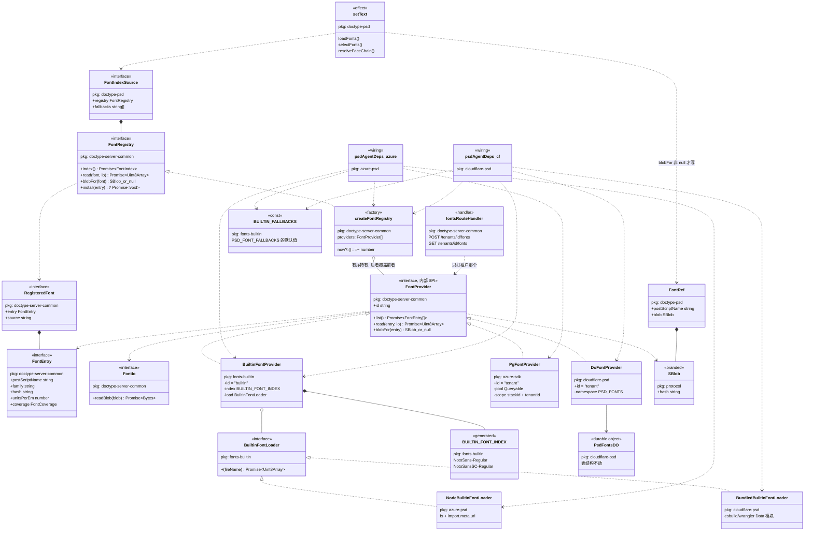

# 默认字体随包发行 —— FontRegistry 升为多来源门面

**日期：** 2026-09-08
**状态：** 待 review
**基线：** `main @ 1c49102`

## 现状

`setText` 能不能工作，取决于租户级字体索引里有没有字体。而那张索引今天**只有本地
`pnpm dev` 有内容**，两个部署环境都是空的：

- Cloudflare 生产 `packages/cloudflare-psd/wrangler.toml` 里 `PSD_FONT_FALLBACKS = ""`；
- Azure 从未传过 `--psd-font-fallbacks`，`stacks/unidocs-azure/README.md` 的
  「新环境的字体预置」至今挂着——doc service 的 ingress 是内部的，
  `scripts/seed-psd-fonts.mjs` 得先在容器环境里有个落脚点才跑得起来。

本地那三套（`scripts/psd-font-bootstrap.mjs` 的 `PSD_FONT_PLAN`）：

| postScriptName | 体积 | 角色 |
| --- | --- | --- |
| NotoSans-Regular | 621 KB | 兜底（拉丁） |
| NotoSansSC-Regular | 8.0 MB | 兜底（中文） |
| JosefinSans-Bold | 60 KB | `fallback: false` —— 素材 PSD 点名的字体，故意不进回退链 |

### 缺的不是"新环境漏跑一次脚本"，是两个洞

1. **新环境是空的。** 预置是人工动作，`2026-09-04-azure-font-registry-design.md`
   当时明确否决了自动灌的方案，理由是「字节要么进仓库（违反裁定 R19），要么构建时
   从公网下载，等于给部署加一条供应链依赖」。
2. **新租户也是空的。** 索引的作用域是 `(stackId, tenantId)`。就算某个环境灌过一次，
   一个新租户下的第一篇 psd 文档仍然一个字形都取不到。这一条比第一条更难发现，
   因为它不随环境走，而随用户走。

两个洞的症状相同且**都不报错**：`setText` 仍在工具表里（注册判据是"有没有那张登记表"，
不是"表里有没有字体"），只是每次调用都取不到字形，中文层整层画不出来。

### 为什么当初是这个形状

不是设计失误，是当时的约束真的封死了别的路。裁定 R19「字体二进制不进仓库」的理由
是"一套中文字体 5–20 MB，进 git 就永远留在历史里"；而公司构建网络只放行 Microsoft
的 npm 代理（`stacks/unidocs-azure/deploy/Dockerfile` 里两处 `--registry` 就是为这个），
构建时从 GitHub 拉字体大概率拿不到。于是"字节从哪来"无解，只能留一个人工步骤。

本设计推翻的正是这个前提：**字节可以进仓库，只要它小到不触发 R19 的理由。**

## 设计决定

### D1：R19 从"不许提交"收窄为"只许提交有字表依据的子集"

裁定 R19 的**理由**（不让 5–20 MB 永久留在 git 历史里）保留；**结论**改写为：

> 字体字节可以进仓库，但只许是有明确、公开、可引用字表依据的子集，单文件不超过
> 约 3 MB。全量字体仍然走 CAS。

实测数据（对 `fonts/NotoSansSC-Regular.otf` 用 fonttools 子集化，保留拉丁/标点/全角，
CJK 按字数取样）：

| CJK 字数 | 子集后 |
| --- | --- |
| 3 500（常用） | 0.99 MB |
| 6 763（GB2312） | 1.83 MB |
| **8 105（通用规范汉字表）** | **2.19 MB** |
| 20 902（基本区全量） | 5.32 MB |
| —（原始文件） | 8.33 MB |

取 8105。**挑它不是因为体积合适，是因为它是一份公开固定可引用的字表** —— 子集化脚本里
「装哪些字」于是有了可复现的依据，而不是一个拍脑袋的数字。

拉丁那套 `NotoSans-Regular.ttf` 全量内置，621 KB，不子集化。实测覆盖（cmap 逐块统计）：

| 区块 | 覆盖 |
| --- | --- |
| Basic Latin 可打印 | 95/95 |
| Latin-1 补充 / 扩展-A / 扩展-B / 扩展附加 | 全覆盖 |
| IPA / 变音符号 / 西里尔 / 货币符号 | 全覆盖 |
| 希腊 | 121/144（缺的都是古希腊变体） |

总计 2965 码位、零 CJK。它那 2436 个非拉丁码位（希腊、西里尔、符号）在本产品里基本
用不上，理论上能再子集化到 ~200 KB —— **不做**，省下的 400 KB 相对 CJK 那 2.19 MB
不值得多一条要维护的生成路径。

### D2：`FontRegistry` 升为门面，`FontProvider` 是它的内部 SPI

外层（`setText`、将来的 agent 工具、HTTP 路由）**只认识 `FontRegistry`**。字体从哪来、
同名冲突谁赢、字节怎么取、装到哪儿，全部收在门面实现里。

被否决的方案是把 `install` 挂在 provider 上、让外层拿到 provider 数组：那等于把内部
结构泄给外层，外层就会开始依赖 provider 的顺序和成员，将来加第三种来源要改的地方会
散开。

`FontRegistry` **保留名字、保留在 `doctype-server-common` 的位置**，只是实现从"一张
Postgres/DO 表"变成"若干 provider 的合成"。它原来那两个方法不是被改名，是被**吸收**：
`list()` 原样成为 `FontProvider.list()`，`put()` 就是将来那个留空的写入口。

**不引入 `FontStore` 这类中间层。** 中途考虑过给存储端口另起一个名字好把 `FontRegistry`
腾给门面，那是自己造出来的问题：让 `FontRegistry` 直接长成门面就没有这个问题。

### D3：`FontEntry.hash` 的含义改一个字

从「CAS 里字体文件的内容哈希」改成「这份字体字节的内容哈希」。

校验规则（`fontEntryProblem` 的 64 位小写十六进制）一个字不动，但内置条目从此也有
合法的 `hash` —— 它就是字节的 SHA-256，只是没存进 CAS。**"在不在 CAS 里"变成 provider
的事**，由 `blobFor()` 回答（CAS 来源返回 SBlob，内置来源返回 null）。

### D4：内置字体不进 `doc.fonts`

`ops/text-ops.ts:93` 每次 `set_text` 都把这次真正用到的字体写进 `doc.fonts`，目的是
**保活** —— `model/types.ts` 的 `FontRef` 注释写着「只被租户索引引用的字体会被回收」，
也就是说租户登记表不钉字节，是文档自己钉的。

内置字体压根不在 CAS 里，没有可回收的对象，因此**不该**进 `doc.fonts`。这不是优化，
是必须：走今天的路径会撞上 `state.ts:178` 那个
`"PSD font SBlob … was not stored during externalization"` 的抛出。

### D5：子集化不进构建流程，产物提交

子集化是**人工升级字体时跑一次**的工具（fonttools / pyftsubset），产物（字节 + 生成的
索引）提交进仓库。

这样构建既不依赖 Python 也不依赖公网，`pnpm deploy --prod` 直接把字节带进镜像。
代价是升级 Noto 版本要有人记得重跑一次并提交——写进包内 README。

### D6：`install` 本次只留接口，不写实现

`FontRegistry.install()` 在契约里声明、写清语义与为什么现在不实现，**不写实现、不写
空壳**。既有的 `POST /tenants/{t}/fonts` 路由**保持现状**，仍直接打租户那个 provider。

原因不是权限。在会话里往 CAS 写字节是**做得到**的（`ctx.makeSBlob` 就是这么存栅格化
PNG 的），缺的是**保活那一半**：租户级登记表不钉字节，只被它引用的字体 24 小时租约
到期后会被 GC 收走 —— 那正是 `docs/psd-text-layers.md` §5.4 记着的「看起来好了一天，
然后凭空消失」。那一半留到做 `install_font` 工具时连同保活方案一起做。

这条决定的效果是：**今天没有一行不可达的代码**。

## 组件与接口

### 类图

方框里第一行是它所在的包。虚线空心箭头是实现，实线是持有/引用，虚线是使用。



读这张图的三个要点：

- **`setText` 只连到 `FontRegistry`**，没有任何一条线通向 `FontProvider`。这是 D2 的
  全部意思：外层不知道有几个来源、谁优先、哪个能写。
- **`FontProvider` 有三个实现，跨三个包**：内置那个在中立层，两个租户实现各在自己的
  平台包里。加第四种来源（系统字体目录、字体 CDN）是纯加法，图上只多一个方框。
- **只有 `blobFor` 返回非 null 的那条线通向 `FontRef`**。内置字体不在 CAS 里、没有可
  回收的对象，所以不进 `doc.fonts`（D4）。

`BuiltinFontLoader` 是把"字节怎么从包里拿出来"这一件事收窄成的一个函数类型
（`(fileName: string) => Promise<Uint8Array>`）—— 它是本设计里**唯一**必须分平台的东西。


### 契约（中立，`packages/doctype-server-common/`）

```ts
// font-provider.ts —— 内部 SPI，不出本包对外的公开面
/**
 * 一处字体来源。索引由若干来源按优先级叠成，后者按 postScriptName 覆盖前者。
 * 外层拿不到它，也就无从依赖 provider 的顺序或成员。
 */
export interface FontProvider {
  /** 稳定标识（"builtin" / "tenant"）。进索引条目的 `source`，让"这套字体
   *  从哪来"可观测 —— 排查"为什么这个字用的不是我装的那套"时唯一的抓手。 */
  readonly id: string;

  /** 这个来源提供哪些字体。只返回元数据，不读字节。 */
  list(): Promise<readonly FontEntry[]>;

  /** 取字节。`entry` 必须是本来源自己 list 出来的那一条。
   *  `io.readBlob` 由调用方（跑在编辑会话里的 effect）提供 —— CAS 来源要用它
   *  带着会话身份去读，内置来源忽略它。 */
  read(entry: FontEntry, io: FontIo): Promise<Uint8Array>;

  /** 这条字体要不要被文档钉住。CAS 来源返回 SBlob（`doc.fonts` 靠它保活），
   *  内置来源返回 null —— 字节随包走，没有可回收的对象（见 D4）。 */
  blobFor(entry: FontEntry): SBlob | null;
}

/** effect 侧的读字节能力。收窄成一个字段，不把整个 EffectContext 拖进中立契约。 */
export interface FontIo {
  readonly readBlob: (blob: SBlob) => Promise<{ data: Uint8Array }>;
}
```

```ts
// font-registry.ts —— 外层唯一要认识的东西
export interface RegisteredFont {
  readonly entry: FontEntry;
  /** provider id。冲突解决之后，这条到底来自哪个来源。 */
  readonly source: string;
}

export type FontIndex = ReadonlyMap<string, RegisteredFont>;

export interface FontRegistry {
  /** 合成、去冲突之后的索引，按 postScriptName。带 TTL 缓存（见下）。 */
  index(): Promise<FontIndex>;

  /** 取字节。内部按这条的来源分发。
   *  收 `RegisteredFont` 而不是名字：调用方本来就是从 `index()` 里取出来的，
   *  收名字就要在这里再查一次索引 —— 而索引是异步的，同步的 `blobFor` 查不了。 */
  read(font: RegisteredFont, io: FontIo): Promise<Uint8Array>;

  /** 这条要不要被文档钉住。转发给它的来源。 */
  blobFor(font: RegisteredFont): SBlob | null;

  /**
   * 装一套字体：内部路由到可写的那个来源，一个都没有时明确失败。
   *
   * **本次不实现**（见 D6）。声明成**可选**，于是合成实现可以干脆不提供它 ——
   * 必选会逼出一个只会抛异常的空壳，那既是死代码，也在类型上骗人（签名说它能
   * 装，实际调用必炸）。将来补实现时把 `?` 去掉，所有调用点会当场变红。
   *
   * 缺的是保活那一半，不是权限：会话里能用 `ctx.makeSBlob` 往 CAS 写字节，
   * 但只被租户登记表引用的字体 24 小时后会被 GC 收走。做 install_font 工具时
   * 连同保活方案一起补。
   */
  install?(entry: FontEntry): Promise<void>;
}
```

`FontEntry` / `FontCoverage` / `fontEntryProblem` **原样保留**，只改 `hash` 那段注释（D3）。

### 门面实现

```ts
createFontRegistry({ providers, now? }): FontRegistry
```

- **合成顺序即优先级**，后者覆盖前者。接线传 `[builtin, tenant]` ——
  **租户装的同名字体盖掉内置的**，这就是"用户主动装 external 字体"的扩展点：
  想要全量 `NotoSansSC-Regular`（含港台字形与扩展区）装上去即可，不需要任何开关。
- **TTL 缓存只包住会变的那部分。** 现有 `createFontIndex` 那 60 秒缓存的两条不变式
  逐字保留（缓存 Promise 而非结果，失败不留在缓存里）；内置那一层是常量，不进 TTL。
- 每租户一个实例这条约束不变（缓存是每实例的，索引是租户级的）——
  `packages/azure-psd/src/agent-deps.ts` 里那段"绝不能把返回值缓存到任何跨租户作用域"
  的注释照旧成立。

### 两种 provider

| provider | 位置 | list | read | blobFor |
| --- | --- | --- | --- | --- |
| `BuiltinFontProvider` | `fonts-builtin`（`createBuiltinFontProvider({ load })`） | 构建期生成的索引 | 入参给的字节加载器 | `null` |
| 租户 provider | 各平台适配器 | 原 `PgFontRegistry` / DO 适配器的 `list()` | `io.readBlob(createSBlob(entry.hash))` | `createSBlob(entry.hash)` |

平台实现改名 —— 它们实现的接口变了，名字不改就在说谎：

| 现在 | 改成 |
| --- | --- |
| `PgFontRegistry`（`packages/azure-sdk/src/font-registry-pg.ts`） | `PgFontProvider` |
| `cloudflare-psd/src/font-registry-do.ts` 的适配器 | 同理改为 provider |

**Postgres 表名 `font_registry`、`0005_font_registry.sql`、CF 的 DO 与它的表，全都不动。**
改的只是 TypeScript 这一侧的类名与它实现的接口。

### 既有消费者跟着动的三处

契约被吸收之后，今天引用旧 `FontRegistry`（`list`/`put`）的地方各自换到新位置。这三处
都是签名变更，不是行为变更：

| 位置 | 改成 |
| --- | --- |
| `doctype-server-common/src/font-registry-handler.ts` | 收 `FontProvider` 而不是旧 `FontRegistry`。`POST /tenants/{t}/fonts` 的**行为与鉴权一字不改**（D6），只是它现在打的是"租户那个 provider"这个更准确的名字 |
| `doctype-server-common/src/testing/font-registry-contract.ts` | 变成 provider 契约测试，两个平台适配器照旧各跑一遍 |
| `doctype-psd/src/text/font-index.ts` 的 `createFontIndex` | 并入门面 `createFontRegistry`；那 60 秒缓存的两条不变式逐字搬过去 |

`fonts-builtin` 依赖 `doctype-server-common` 只为拿 `FontProvider` / `FontEntry` 两个
**类型**（`import type`）—— 两个包都是中立层，方向不倒挂；且 `package-deps` 那道门禁
逐行扫描含中立层包名的行、只放行以 `import type` 开头的行，写法要按它来。

### 内置包 `packages/fonts-builtin/`

cloud-neutral，只有元数据和字节，无 IO：

```
fonts/NotoSans-Regular.ttf              621 KB   全量
fonts/NotoSansSC-Regular.subset.otf    2.19 MB   8105 字 + 拉丁 + 标点 + 全角
charset/tongyong-guifan-8105.txt        ~24 KB   装哪些字的依据（D1）
src/index.generated.ts                           postScriptName/family/hash/unitsPerEm/coverage
src/fallbacks.ts                                 回退链默认值，两个栈共用一份
scripts/build-subset.py                          人工重跑；不进构建（D5）
OFL.txt                                          Noto 是 OFL，子集仍受其约束，随包分发
README.md                                        怎么升级、为什么产物要提交
```

**索引在构建期生成并提交**，运行期零解析——一个 2.19 MB 的 CFF 字体每次进程启动解析
一遍是白花的钱。配一条测试从提交的字节**重新解析**并与生成的索引比对，防两个来源漂移。

**子集保留原 postScriptName `NotoSansSC-Regular`。** 同名是覆盖语义的前提（D2）；
"这份是子集"由 `RegisteredFont.source` 表达，不靠改名。

### 字节怎么进两个运行时

唯一必须分平台的地方，按现有分层规则放进适配器，`fonts-builtin` 本身保持中立
（只交出元数据与文件名）：

| 栈 | 做法 |
| --- | --- |
| Azure / Node | `packages/azure-psd/src/builtin-fonts.ts`，`fs` 读，路径从 `import.meta.url` 解析 |
| Cloudflare | `packages/cloudflare-psd/src/builtin-fonts.ts`，wrangler / esbuild 的 `Data` 模块规则 import 成 ArrayBuffer |

体积核对：psd 的 CF worker bundle 现在 1.69 MB / gzip 358 KB；加 2.8 MB 字体后 gzip 约
2.4 MB，离 10 MB（压缩后）上限仍有大量余量。

Azure 侧还要确认 `pnpm deploy --prod` 把 `fonts/` 带进了镜像 —— 该包不能用 `files`
字段或 `.npmignore` 把它们排除掉。

### `setText` 的改动

`FontIndexSource` 塌缩成 `{ registry, fallbacks }`，`set-text.ts` 里一个 provider 字样
都不出现。`loadFonts` 那段循环：

```ts
const found = index.get(name);
if (!found) continue;                                    // selectFonts 只返回索引里有的名字；防御性
const bytes = await registry.read(found, ctx);           // ctx 结构上满足 FontIo（它有 readBlob）
const blob  = registry.blobFor(found);
loaded.set(name, parseFontFace(bytes));
if (blob) fonts.push({ postScriptName: name, blob });   // 内置字体不进 doc.fonts（D4）
```

`selectFonts` / `resolveFaceChain` 的逻辑一行不改，只是索引的值类型从 `FontEntry`
变成 `RegisteredFont`，取 coverage 的地方多一层 `.entry`。

### 回退链默认值

`PSD_FONT_FALLBACKS` **不设**时，默认取内置那两套的名字（由 `fonts-builtin/src/fallbacks.ts`
导出，不在两个栈的配置里各写一份）；**显式设成空串**仍然是空链，作为逃生口。

今天"缺省空、不硬编码字体名"的理由是「硬编码一个 CAS 里可能不存在的名字，回退链只会
静默失效」——内置之后名字与字节同源、不可能不存在，那个理由消失了。

注意 `parseFontFallbacks(undefined)` 与 `parseFontFallbacks("")` 今天都返回 `[]`，
改动必须让这两者可区分。

## 数据流

排版（内置命中，零配置、零网络）：

```
setText effect
  └─ registry.index()  ──► [builtin, tenant] 合成 ──► FontIndex
     └─ registry.read(name, ctx)
          ├─ source=builtin ──► 包里的字节（不碰 CAS）
          └─ source=tenant  ──► ctx.readBlob(SBlob) ──► CAS
     └─ registry.blobFor(name) ──► builtin: null / tenant: SBlob ──► doc.fonts 保活
```

装额外字体（今天，部署者工具；一行不改）：

```
seed-psd-fonts.mjs
  ├─ 字节 ──► CAS（内容寻址，得到 hash）+ 钉根引用
  └─ POST /tenants/{t}/fonts ──► 租户 provider（覆盖同名的内置条目）
```

## 测试策略

| 层 | 测什么 |
| --- | --- |
| provider 契约 | 沿用 `doctype-server-common/src/testing/` 的共享契约测试，内置与租户两个 provider 都跑：list 形状、read 拿到的字节能被 `parseFontFace` 解析、`blobFor` 的 null / 非 null 契约 |
| 门面 | 合成优先级（租户同名覆盖内置）、`source` 归因正确、TTL 缓存两条不变式（缓存 Promise、失败不留存）、`install` 未实现时的失败形状 |
| 内置索引 | **从提交的字节重新解析，与 `index.generated.ts` 逐字段比对** —— 守住 D5 那两个来源不漂移 |
| 内置覆盖 | 断言字表里的 8105 个字**每一个**都在 coverage 里；断言 ASCII 全覆盖 |
| `setText` | 内置字体排版成功且 `doc.fonts` **为空**（D4 的回归守卫）；租户字体仍进 `doc.fonts` |
| 回退链 | `PSD_FONT_FALLBACKS` 未设 → 内置默认值；显式空串 → 空链 |
| 端到端 | `tests/integration/cloudflare/psd-fonts-e2e.test.mjs` 现在可以用**真字体**跑（它的注释写着"字体二进制不进仓库，而 CI 上也没有系统字体"，那个前提没了） |
| 镜像 | 断言构建产物里有字体文件 —— 漏带的表现是线上又变回"索引为空"，而那正是本设计要消灭的症状 |

## 错误处理

- **内置字节缺失/损坏**（打包漏带）：`fonts-builtin` 的加载器**响亮失败**，不降级成空索引。
  空索引正是本设计要消灭的症状，静默降级会把这次重构变成一次没人发现的回归。
- 请求的字体缺席：沿用现有行为——走回退链让编辑成功，但**显式报告**替换。
- 逐码位落到子集外（生僻字）：沿用现有 `glyphFallbacks` 记账并报告。
- 租户 provider 不可达：只影响租户那一层；**内置那一层仍然可用**，`setText` 不再整体失效。
  这是本设计顺带买到的健壮性。
- 畸形登记请求：`fontEntryProblem()` 拒绝，400，不变。

## 不做的

- 不实现 `install`（D6），不做 `install_font` 工具，不动 `POST /tenants/{t}/fonts` 路由。
- 不改 `seed-psd-fonts.mjs`、不改根引用保活、不改租户表结构与迁移。
- 不子集化拉丁那套（D1）。
- 不加 Bold / Italic 等字重 —— 开了这个头 Light/Medium 很难说不，等有真实需求。
- 不碰 `packages/web-psd/public/fonts/*.woff2`：那是应用界面自己的字体（Barlow /
  Roboto Mono），与文档排版无关。
- 不碰排版与栅格化逻辑本身。
- 不动网关路由、不动 `DocOperation` / `docCapabilityPolicy`。

## 风险与未决

1. **8105 字表的来源尚未落实。** 通用规范汉字表是公开数据，但仓库里没有离线副本。
   实施第一步是取得并提交它；若拿不到权威副本，退到 GB2312 的 6763 字（1.83 MB，
   字表在标准里是确定的）。**这是唯一一个会改变产物内容的未决项。**
2. **Cloudflare 的 `Data` 模块规则要同时配到三处**：`wrangler.toml`、
   `stacks/unidocs-cloudflare/local/` 的 esbuild 打包、以及 Miniflare 那条路径。
   漏配的表现是构建期报错（可接受），不是运行时静默失效。
3. **`pnpm deploy --prod` 是否真的把 `fonts/` 带进镜像**要实测。漏带的症状与"从没灌过
   字体"完全一样，所以上表里专门留了一条镜像断言。
4. **升级 Noto 版本是人工步骤**（D5）。产物与字表都在仓库里，重跑脚本得到的应当是
   逐字节相同的结果；`build-subset.py` 需要固定所有影响输出的参数，否则"重跑一次"
   会产生无意义的巨大 diff。
5. **子集边界要能对用户讲清楚。** 内置那套保证的是"不出现空白字形"，**不是**"还原原稿"
   —— PSD 里点名 Helvetica / Josefin Sans 的层会落到回退链上，字全画得出来但字形换了。
   这一条属于产品说明，不是本设计能解决的，装额外字体那条路才是答案。
